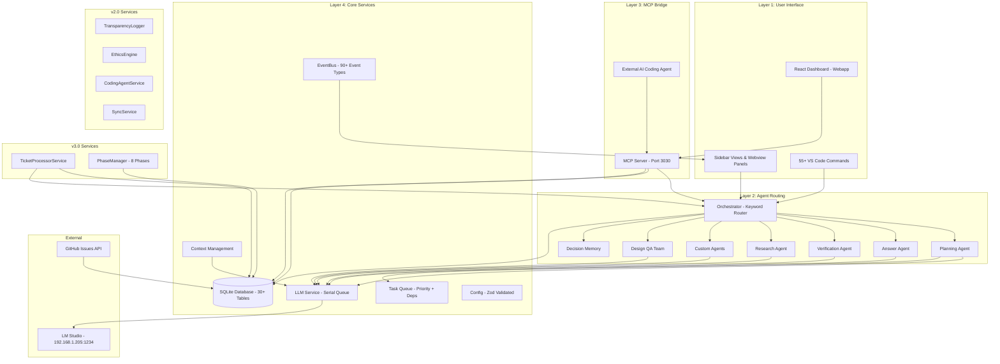

# 02 — System Architecture & Design

**Version**: 4.0  
**Last Updated**: February 2026  
**Status**: ✅ Current  
**Depends On**: [01-Vision-and-Goals](01-Vision-and-Goals.md), [10-AI-Operating-Principles](10-AI-Operating-Principles.md)  
**Changelog**: v4.0 — Added MCP API reference with full schemas, error code registry, data flow architecture, deployment model, performance model, network architecture, configuration architecture; User/Dev views throughout

---

## How to Read This Document

This is the **technical spine** of the entire True Plan. It describes the four layers of the COE system, how data moves between them, the MCP protocol that bridges COE to external coding agents, and the error handling model that keeps everything running.

> **👤 User View**: You don't need to understand every schema. Focus on the **High-Level Architecture** section and the **Data Architecture** section to understand where your data lives and what COE does with it. The MCP section explains how Copilot talks to COE on your behalf.

> **🔧 Developer View**: This is your primary reference for anything structural. Every service, every protocol message, every error code, and every data flow is documented here. When you're implementing a new feature, check this document first to understand where it fits in the 4-layer model.

---

## High-Level Architecture

COE is built as a VS Code extension with four major layers that work together. Every request — whether from the user clicking a button or an AI coding agent calling an MCP tool — flows through these layers in order.

> **👤 User View**: Think of COE as a building with four floors. You live on the top floor (the UI). The agents live on the second floor (routing). The bridge to Copilot is on the third floor (MCP). And the basement holds all the data and intelligence (core services). You only ever interact with the top floor; everything below works automatically.

> **🔧 Developer View**: Each layer has a strict contract with the layers above and below it. Layer 1 never talks directly to Layer 4 — it goes through Layer 2. Layer 3 (MCP) can bypass Layer 2 for simple read operations (e.g., `getNextTask` reads from DB directly), but all write operations that involve agent intelligence go through Layer 2 first.

```
┌─────────────────────────────────────────────────────────────────┐
│                    LAYER 1: USER INTERFACE                       │
│                        USER (Developer)                         │
│                 Interacts via VS Code Sidebar & Panels          │
│  Sidebar Views · Webview Panels · 55+ Commands · File Watchers  │
└────────────────────────────┬────────────────────────────────────┘
                             │ VS Code Extension API
┌────────────────────────────▼────────────────────────────────────┐
│                    LAYER 2: AGENT ROUTING                       │
│  Orchestrator · Planning · Answer · Verification · Research     │
│  Custom Agents · Clarity Agent · Design QA Team (3 agents)     │
│  Decision Memory · UI Testing · Observation                     │
│  Keyword-based intent classification (NOT LLM)                  │
└───────────┬────────────────┬────────────────┬───────────────────┘
            │ JSON-RPC 2.0   │ TypeScript API  │ HTTP (LM Studio)
┌───────────▼──────┐ ┌──────▼──────┐ ┌───────▼───────────────────┐
│  LAYER 3: MCP    │ │ LAYER 4:    │ │  EXTERNAL: LLM            │
│  SERVER          │ │ CORE        │ │  LM Studio on local net   │
│  HTTP + JSON-RPC │ │ SERVICES    │ │  ministral-3-14b-reasoning│
│  Port 3030       │ │ SQLite,     │ │  http://192.168.1.205:1234│
│  6 tools         │ │ EventBus,   │ │                           │
│  for AI agents   │ │ Config      │ │  Timeouts: 300s/120s/900s │
└──────────────────┘ └─────────────┘ └───────────────────────────┘
```

---

## The Four Layers — Detailed

### Layer 1: VS Code Extension (User Interface)

This is what the developer sees and interacts with. Every visual element in COE lives here.

> **👤 User View**: When you install COE, you'll see new icons in your VS Code sidebar. Clicking them opens panels where you can see your tasks, talk to agents, create plans, and watch your project come together. You don't need to learn any CLI commands — everything is point-and-click.

> **🔧 Developer View**: Layer 1 is implemented via VS Code's Extension API. Tree views use `TreeDataProvider`, webviews use `WebviewPanel` with raw HTML/CSS/JS (no frameworks), and commands are registered via `vscode.commands.registerCommand`. All UI state is derived from Database events via the EventBus — the UI never stores its own state.

**Sidebar Views:**

| View | VS Code ID | What It Shows | Update Trigger |
|------|-----------|---------------|----------------|
| **Agents** | `coe-agents` | Status of every AI agent (idle/working/last activity) | EventBus `agent:*` events |
| **Tickets** | `coe-tickets` | Open/resolved tickets for AI↔human communication | EventBus `ticket:*` events |
| **Tasks** | `coe-tasks` | Current task queue with priorities and progress | EventBus `task:*` events |
| **Conversations** | `coe-conversations` | History of all agent conversations | EventBus `conversation:*` events |

**Webview Panels** (opened when the user clicks into something):

| Panel | File | Purpose | Technology |
|-------|------|---------|------------|
| **Planning Wizard** | `src/views/planning-wizard.ts` | Interactive guided planning (7 pages) | Raw HTML + VS Code CSS vars |
| **Conversation View** | `src/views/conversation-webview.ts` | Chat-like interface for agent interactions | Raw HTML + message streaming |
| **Verification Panel** | `src/views/verification-webview.ts` | Checklist of test results and visual checks | Raw HTML + status badges |
| **Custom Agent Builder** | `src/views/custom-agent-builder.ts` | UI for creating new specialized agents | Raw HTML + form validation |
| **Agent Gallery** | `src/views/agent-gallery.ts` | Browse and manage agents (built-in + custom) | Raw HTML + card layout |
| **Dashboard** | `src/webapp/` | React-based project dashboard | React + Vite |

**Commands** — 55+ registered actions the user can trigger:

| Category | Example Commands | Count |
|----------|-----------------|-------|
| Planning | Create Plan, Open Wizard, Fresh Restart | ~8 |
| Tasks | Create Task, View Queue, Decompose | ~6 |
| Agents | Run Agent, Create Custom, View Gallery | ~10 |
| Coding | Code Command, Generate Component | ~5 |
| Sync | Trigger Sync, Export, Import | ~4 |
| Ethics | View Modules, Override Rule | ~3 |
| Settings | Open Config, Reset Defaults | ~3 |
| Debug | View Logs, Clear Cache, Health Check | ~8 |
| Other | Conversation, Verification, Search | ~8 |

**File Watchers** — Monitors for changes that COE needs to react to:
- **Plan files** (`Docs/Plans/**`) — triggers drift detection and task regeneration
- **Source code** (`src/**`) — triggers plan-code sync checks
- **Config** (`.coe/config.json`) — triggers live config reload
- **Custom agents** (`.coe/agents/custom/**`) — triggers agent registry update

### Layer 2: Agent Routing (The Brain)

The central **Orchestrator** receives all messages and routes them to the right specialist. This is the most important piece of COE — it decides which agent handles which request.

> **👤 User View**: You never need to specify which agent you want. Just ask a question or give a command, and COE automatically figures out the best agent. If you ask "how should I structure my API?", the Planning agent handles it. If you say "verify my login page", the Verification agent takes over. It's like a smart receptionist.

> **🔧 Developer View**: Routing is done via `classifyIntent()` in `src/agents/orchestrator.ts`. This uses keyword scoring with `KEYWORD_MAP` and `INTENT_PRIORITY`, NOT an LLM call. The keyword map is a dictionary of ~50 trigger words mapped to agent types. The priority map assigns numerical priorities (where `0` is a valid value — always use `??` not `||`). This is deliberate: keyword-based classification is deterministic, fast (<1ms), and doesn't consume LLM tokens.

```
                    ┌───────────────────┐
    User Message ──▶│   ORCHESTRATOR    │
    MCP Request ───▶│ classifyIntent()  │──▶ Keyword scoring
                    │                    │    against KEYWORD_MAP
                    └─────┬─────┬───────┘
                          │     │
           ┌──────────────┘     └──────────────┐
           │              │                    │
    ┌──────▼─────┐ ┌──────▼──────┐ ┌──────────▼────────┐
    │  PLANNING  │ │   ANSWER    │ │   VERIFICATION    │
    │  Generate  │ │  Q&A with   │ │   Review code     │
    │  task      │ │  context    │ │   PASS/FAIL       │
    │  plans     │ │  & history  │ │   assessment      │
    └────────────┘ └─────────────┘ └───────────────────┘
           │
    ┌──────▼─────┐ ┌─────────────┐ ┌─────────────┐
    │  RESEARCH  │ │   CUSTOM    │ │  DESIGN QA  │
    │  Deep      │ │  User-built │ │  Architect + │
    │  analysis  │ │  specialists│ │  Gap + Harden│
    └────────────┘ └─────────────┘ └─────────────┘
```

**How routing works (step by step):**

1. A message arrives (from user, webview, or MCP tool call)
2. The Orchestrator scans the message against `KEYWORD_MAP` — a dictionary of ~50 trigger words mapped to `AgentType` enum values
3. Each keyword match increments that agent's score; `INTENT_PRIORITY` provides fallback ordering
4. The highest-scoring agent type is selected (ties broken by `INTENT_PRIORITY`)
5. The message is forwarded to that agent's `process()` method via `BaseAgent`
6. The agent calls `LLMService.chat()` with its specific system prompt and the user message
7. The LLM response is returned as a structured `AgentResponse` object
8. The response is stored in SQLite and displayed in the UI or sent back via MCP

**Important architecture decision**: The Orchestrator never answers directly. It always delegates to a specialist agent. Even simple greetings go through the Answer agent. This ensures consistent logging, token tracking, and audit trails.

### Layer 3: MCP Server (Bridge to Coding Agents)

The **Model Context Protocol (MCP) Server** is an HTTP + JSON-RPC 2.0 server running on port 3030 (auto-increments if busy). It exposes tools that external AI coding agents (like GitHub Copilot) can call. This is how COE communicates with the agent that actually writes code.

> **👤 User View**: You don't interact with the MCP server directly. When Copilot is working on your project, it automatically calls COE's MCP tools to get tasks, report progress, and ask questions. It's like a phone line between your project manager (COE) and your developer (Copilot).

> **🔧 Developer View**: The MCP server is implemented in `src/mcp/server.ts`. It's an HTTP server (not stdio) that accepts JSON-RPC 2.0 requests. Each tool is a method handler that validates parameters, calls the appropriate service, and returns a standardized response. The server registers handlers at startup and auto-increments the port if 3030 is busy (checks ports 3030-3039). All tool calls are logged to the EventBus.

**Six Core MCP Tools:**

| Tool | Method | Purpose | Reads/Writes |
|------|--------|---------|-------------|
| `getNextTask` | GET | Returns the highest-priority ready task with all context | Read-only |
| `reportTaskDone` | POST | Marks a task complete and triggers verification | Write |
| `askQuestion` | POST | Routes questions to the Answer agent for clarification | Read + Write |
| `getErrors` | GET | Reports errors encountered during implementation | Read-only |
| `callCOEAgent` | POST | Calls a specific COE agent directly | Write |
| `scanCodeBase` | POST | Analyzes project files for drift and mismatches | Read + Write |

**MCP Tool Schemas** (see [MCP API Reference](#mcp-api-reference) section below for full schemas):

```
┌─────────────────────────────────────────────────────────────────┐
│                    MCP SERVER (Port 3030)                        │
│                                                                 │
│  ┌──────────────┐  ┌──────────────┐  ┌──────────────┐          │
│  │ getNextTask   │  │reportTaskDone│  │ askQuestion   │          │
│  │ Filter: ready │  │ taskId       │  │ question      │          │
│  │ → Task + ctx  │  │ status       │  │ chatId        │          │
│  │               │  │ codeDiff     │  │ → answer      │          │
│  └──────┬───────┘  └──────┬───────┘  └──────┬───────┘          │
│         │                  │                  │                  │
│  ┌──────▼───────┐  ┌──────▼───────┐  ┌──────▼───────┐          │
│  │ getErrors     │  │ callCOEAgent │  │ scanCodeBase  │          │
│  │ → error list  │  │ agentType    │  │ path          │          │
│  │               │  │ message      │  │ → drift score │          │
│  └──────────────┘  └──────────────┘  └──────────────┘          │
│                                                                 │
│  Transport: HTTP + JSON-RPC 2.0 | Encoding: UTF-8              │
│  Auth: None (localhost only) | Rate: 100 req/min per agent      │
└─────────────────────────────────────────────────────────────────┘
```

### Layer 4: Core Services (Data & Intelligence)

Everything that isn't UI, routing, or MCP lives here. These are deterministic TypeScript services that manage data, LLM communication, event distribution, and configuration.

> **👤 User View**: This is the "engine room" of COE. It stores your tasks, manages the AI connections, and keeps everything in sync. You don't need to know what's in here — just know that it's what makes everything else work reliably.

> **🔧 Developer View**: All services are initialized in a specific order in `src/extension.ts` due to dependency chains. The Database must exist before any service that reads/writes data. The EventBus must exist before any service that emits events. The LLM service can be initialized independently but must be available before agent routing begins. Services communicate via the EventBus (pub/sub), not direct method calls, to maintain loose coupling.

**Foundation Services (v1.0):**

| Service | File | Tables | Key Feature |
|---------|------|--------|-------------|
| **Ticket Database (SQLite)** | `src/core/database.ts` | 30+ | WAL mode, `node:sqlite` (NOT better-sqlite3), full CRUD for tasks/tickets/conversations/audit logs |
| **LLM Service** | `src/core/llm-service.ts` | — | Serial queue (max 5 concurrent), 5-min response cache, 3-tier timeout (startup 300s / stall 120s / total 900s), health checks |
| **Task Queue** | `src/core/task-queue.ts` | — | Priority-based with dependency graph, blocked/ready/in-progress states |
| **Planning Service** | `src/core/planning-service.ts` | — | Backend for the Planning Wizard, plan persistence |
| **Config System** | `src/core/config.ts` | — | Zod-validated `.coe/config.json`, file watcher for live reloading, sensible defaults |
| **EventBus** | `src/core/event-bus.ts` | — | Typed pub/sub, 90+ event types, WebSocket broadcast, event history (last 1000) |

**Context Management Services (v1.1):**

| Service | File | Purpose |
|---------|------|---------|
| **TokenBudgetTracker** | `src/core/token-budget-tracker.ts` | Model-aware token counting, warning at 80%, critical at 95%, per-conversation tracking |
| **ContextFeeder** | `src/core/context-feeder.ts` | Builds context windows from multiple sources (task, plan, code, history), priority-based selection |
| **ContextBreakingChain** | `src/core/context-breaking-chain.ts` | 5-level overflow recovery: summarize → trim old → compress → drop low-priority → fresh start |
| **TaskDecompositionEngine** | `src/core/task-decomposition-engine.ts` | Deterministic splitting with pattern matching, enforces 15-45 min granularity, max 3 nesting levels |

**v2.0 Services:**

| Service | Purpose | Key Mechanism |
|---------|---------|---------------|
| **TransparencyLogger** | Append-only action audit trail | JSON/CSV export, sync-aware, every service operation logged |
| **EthicsEngine (FreedomGuard_AI)** | 6 freedom modules, 4 sensitivity levels | Absolute blocks, rule evaluation, override audit trail |
| **ComponentSchemaService** | 37 default component schemas | 5 categories with React/HTML/CSS code templates |
| **CodingAgentService** | NL command → code generation | 2-stage intent (keyword + LLM), diff management, ethics gate |
| **ConflictResolver** | Field-level merge on sync conflicts | SHA-256 hash detection, 5 strategies, entity priority rules |
| **SyncService** | Multi-device synchronization | Pluggable adapters (Cloud REST, NAS file, P2P direct), vector clocks, advisory locking |

**v3.0 Services:**

| Service | Purpose | Key Mechanism |
|---------|---------|---------------|
| **TicketProcessorService** | Auto-processing engine for AI tickets | Dual-queue (main + boss), tiered retry (3x auto → Boss → user), Ghost Tickets, idle watchdog |
| **DesignArchitectAgent** | Design structure review | Scores quality 0-100 across 6 categories |
| **GapHunterAgent** | Missing feature detection | 15 deterministic checks + LLM analysis for nuanced gaps |
| **DesignHardenerAgent** | Draft component proposals | Human-in-the-loop: dashed outlines, user approves/rejects |
| **DecisionMemoryAgent** | User decision tracking | Deduplicate (keyword + LLM semantic), conflict detection, auto-answer repeats |
| **PhaseManager** | 8-phase lifecycle gates | Planning → Designing → DesignReview → TaskGen → Coding → Verify → Complete (+DesignUpdate loop) |

---

## System Architecture Diagram



---

## MCP API Reference

This section provides complete specifications for all MCP tools. These are the methods that external AI coding agents call to interact with COE.

> **👤 User View**: You don't call these tools yourself — your AI coding agent (Copilot) calls them automatically. But understanding them helps you see exactly what Copilot can and can't do through COE.

> **🔧 Developer View**: All MCP tools are implemented in `src/mcp/server.ts` as method handlers on the HTTP + JSON-RPC 2.0 server. Each tool validates its parameters, calls the appropriate core service, and returns a standardized response. Tool implementations should be thin wrappers — business logic lives in core services.

### Transport Protocol

| Property | Value |
|----------|-------|
| Protocol | JSON-RPC 2.0 |
| Transport | HTTP (port 3030, auto-increment to 3039 if busy) |
| Encoding | UTF-8 |
| Auth | None (localhost only) |
| Rate Limit | 100 requests/min per agent, 500/min global |

**Example JSON-RPC Request:**
```json
{
  "jsonrpc": "2.0",
  "method": "getNextTask",
  "params": { "filter": "ready" },
  "id": 1
}
```

**Example JSON-RPC Response:**
```json
{
  "jsonrpc": "2.0",
  "result": { "success": true, "task": { "taskId": "TASK-001", "title": "..." } },
  "id": 1
}
```

### Tool 1: `getNextTask`

Returns the highest-priority ready task from the queue with all context needed for implementation.

**Parameters:**
```typescript
interface GetNextTaskParams {
  filter?: 'ready' | 'blocked' | 'all';   // Default: 'ready'
  includeContext?: boolean;                 // Default: true
}
```

**Response:**
```typescript
interface GetNextTaskResponse {
  success: boolean;
  task: {
    taskId: string;
    ticketId: string;
    title: string;
    description: string;
    priority: 'critical' | 'high' | 'medium' | 'low';
    status: string;
    dependencies: string[];
    acceptanceCriteria: string[];
    estimatedMinutes: number;
    files: { readFrom: string[]; writeTo: string[] };
  } | null;
  queueStatus?: { isEmpty: boolean; message?: string };
  error?: { code: string; message: string };
}
```

**Example (task available):**
```json
{
  "jsonrpc": "2.0",
  "result": {
    "success": true,
    "task": {
      "taskId": "TASK-001",
      "ticketId": "TK-0042",
      "title": "Implement user authentication endpoint",
      "description": "Create POST /auth/login with JWT token response...",
      "priority": "high",
      "status": "ready",
      "dependencies": [],
      "acceptanceCriteria": [
        "Returns JWT on valid credentials",
        "Returns 401 on invalid credentials",
        "Rate-limits to 5 attempts per minute"
      ],
      "estimatedMinutes": 30,
      "files": {
        "readFrom": ["src/types/auth.ts", "src/core/database.ts"],
        "writeTo": ["src/routes/auth.ts", "tests/auth.test.ts"]
      }
    }
  },
  "id": 1
}
```

**Example (empty queue):**
```json
{
  "jsonrpc": "2.0",
  "result": {
    "success": true,
    "task": null,
    "queueStatus": { "isEmpty": true, "message": "No ready tasks" }
  },
  "id": 1
}
```

**Error Codes:** `INVALID_FILTER`, `ORCHESTRATOR_NOT_INITIALIZED`, `INTERNAL_ERROR`

### Tool 2: `reportTaskDone`

Reports task completion with optional code diff for automatic verification.

**Parameters:**
```typescript
interface ReportTaskDoneParams {
  taskId: string;                                              // Required
  status: 'done' | 'failed' | 'blocked' | 'partial';          // Required
  taskDescription?: string;                                    // What was done
  codeDiff?: string;                                           // Triggers verification
  notes?: string;                                              // Additional details
}
```

**Response:**
```typescript
interface ReportTaskDoneResponse {
  success: boolean;
  taskId: string;
  status: string;
  message: string;
  verification?: { passed: boolean; explanation: string };    // If codeDiff provided
  error?: { code: string; message: string };
}
```

**Behavior:**
- Validates `taskId` exists in the database
- Updates ticket status to match the reported status
- If `codeDiff` is provided, automatically triggers the Verification Agent
- If verification fails, marks task as `blocked` (not `done`)
- Appends `notes` to the ticket description

**Error Codes:** `TASK_NOT_FOUND`, `INVALID_STATUS`, `INTERNAL_ERROR`

### Tool 3: `askQuestion`

Routes a question through the Answer agent for context-aware clarification.

**Parameters:**
```typescript
interface AskQuestionParams {
  question: string;         // Required — the question text
  chatId?: string;          // Optional — conversation thread ID
}
```

**Response:**
```typescript
interface AskQuestionResponse {
  success: boolean;
  answer?: string;          // The agent's answer
  ticketId?: string;        // Ticket created if timeout
  error?: { code: string; message: string };
}
```

**Timeout Behavior:** If the Answer agent doesn't respond within 30 minets, COE creates a ticket for the user and returns `ANSWER_TIMEOUT` with the ticket ID. The agent can continue working on other tasks while waiting.

**Error Codes:** `ANSWER_TIMEOUT`, `INTERNAL_ERROR`

### Tool 4: `getErrors`

Returns current build/lint errors from the workspace.

### Tool 5: `callCOEAgent`

Invokes a specific COE agent by name, bypassing the Orchestrator's intent classification.

**Parameters:**
```typescript
interface CallCOEAgentParams {
  agentType: string;        // Agent name (e.g., 'planning', 'verification')
  message: string;          // Message to send to the agent
}
```

### Tool 6: `scanCodeBase`

Analyzes project source files for drift between plans and implementation.

---

## Error Code Registry

COE uses a standardized error handling system across all layers. Every error response follows the same schema, every error code has defined severity and retry behavior, and patterns of errors are automatically detected and acted upon.

> **👤 User View**: When something goes wrong, COE doesn't just crash — it classifies the error, decides whether to retry, and if it can't fix it automatically, asks you for help with a clear explanation of what went wrong and what your options are.

> **🔧 Developer View**: Error codes are defined as an enum in `src/types/index.ts`. All error responses from MCP tools and internal services use the `StandardErrorResponse` interface. The error handling chain is: detect → classify → log → retry (if retryable) → escalate (if retry fails). Severity determines escalation speed; priority impact determines which workflows pause.

### Standard Error Response Schema

```typescript
interface StandardErrorResponse {
  success: false;
  error: {
    code: string;                    // From ErrorCode enum
    message: string;                 // Human-readable explanation
    details?: Record<string, any>;   // Structured data (validation errors, etc.)
    severity: 'LOW' | 'MEDIUM' | 'HIGH' | 'CRITICAL';
    retryable: boolean;
    retry_after_seconds?: number;
    fallback_suggested: boolean;
    priority_impact: 'NONE' | 'P3_IGNORABLE' | 'P2_DELAYED' | 'P1_BLOCKED';
  };
  context: {
    task_id?: string;
    agent_name?: string;
    timestamp: string;              // ISO 8601
  };
}
```

### Complete Error Code Catalog

| Code | Severity | Retryable | Retry Delay | Priority Impact | When It Happens |
|------|----------|-----------|-------------|-----------------|-----------------|
| `INVALID_PARAM` | MEDIUM | ❌ | — | P1_BLOCKED | Bad parameter in MCP tool call |
| `TOKEN_LIMIT_EXCEEDED` | HIGH | ✅ | 5-30s | P1_BLOCKED | Context window overflow |
| `TIMEOUT` | HIGH | ✅ | 10-60s | P2_DELAYED | LLM or service didn't respond in time |
| `INTERNAL_ERROR` | CRITICAL | ❌ | — | P1_BLOCKED | Unexpected crash or unhandled exception |
| `RATE_LIMIT` | MEDIUM | ✅ | 60s | P2_DELAYED | Too many requests per minute |
| `INVALID_STATE` | MEDIUM | ❌ | — | P1_BLOCKED | Operation attempted in wrong lifecycle phase |
| `RESOURCE_NOT_FOUND` | LOW | ❌ | — | P3_IGNORABLE | Task/ticket/plan doesn't exist |
| `AUTH_ERROR` | CRITICAL | ❌ | — | P1_BLOCKED | Authentication token invalid/expired |
| `SCHEMA_VALIDATION_FAILED` | MEDIUM | ❌ | — | P2_DELAYED | Input doesn't match expected schema |
| `RECOVERY_TRIGGERED` | HIGH | ✅ | 10s | P1_BLOCKED | Context overflow recovery started |
| `BREAKER_FAILED` | HIGH | ❌ | — | P1_BLOCKED | All context-breaking strategies exhausted |
| `TOOL_NOT_FOUND` | MEDIUM | ❌ | — | P2_DELAYED | MCP tool name not in registry |
| `DELEGATION_FAILED` | MEDIUM | ✅ | 15s | P2_DELAYED | Couldn't delegate to external agent |
| `LOOP_DETECTED` | HIGH | ❌ | — | P1_BLOCKED | Infinite loop in workflow |
| `DRIFT_THRESHOLD_EXCEEDED` | MEDIUM | ❌ | — | P1_BLOCKED | Code diverged too far from plan |
| `COHERENCE_DROP` | MEDIUM | ✅ | 20s | P2_DELAYED | Context breaking degraded quality |
| `TICKET_UPDATE_CONFLICT` | HIGH | ✅ | 1s | P2_DELAYED | Optimistic concurrency conflict on ticket |

### Severity → Escalation Matrix

| Severity | What Happens | User Notification | Auto-Recovery? |
|----------|-------------|-------------------|----------------|
| **LOW** | Log only, continue working | None | No |
| **MEDIUM** | Log + retry if allowed | Sidebar warning badge | Yes (limited) |
| **HIGH** | Log + retry + escalate to Boss agent | Persistent sidebar banner | Yes (full chain) |
| **CRITICAL** | Immediate pause, all P1 work stops | Modal dialog + optional sound | No — manual only |

### Priority Impact → Workflow Effect

| Impact | Behavior |
|--------|----------|
| `P1_BLOCKED` | Pause entire P1 workflow until resolved |
| `P2_DELAYED` | Continue P1 tasks, delay P2+ tasks |
| `P3_IGNORABLE` | Continue all workflows, log for analysis |
| `NONE` | Informational only, no workflow impact |

### Error Propagation Between Layers

```
Layer 1 (UI)     ◄── Displays error (badge/modal/banner) based on severity
     ▲
     │ EventBus notification
     │
Layer 2 (Agent)  ◄── Catches error, classifies, decides retry/escalate
     ▲
     │ Throws or returns error response
     │
Layer 3 (MCP)    ◄── Validates params, catches service errors, wraps in JSON-RPC error
     ▲
     │ HTTP response or internal call
     │
Layer 4 (Core)   ◄── Where errors originate (DB locked, LLM timeout, token overflow)
```

### Retry Policy Configuration

```yaml
retry_policies:
  default:
    max_attempts: 3
    backoff_base_seconds: 5
    max_delay_seconds: 60
  per_tool:
    askQuestion:
      max_attempts: 4
      backoff_base_seconds: 10
    getNextTask:
      max_attempts: 2
      backoff_base_seconds: 3
  priority_overrides:
    P1_tasks:                    # P1 tasks get more aggressive retry
      multiplier: 1.5            # 1.5x more attempts
    on_critical_error: "pause_system"
```

---

## Data Architecture

This section describes where COE stores data, how data flows between components, and how persistence works.

> **👤 User View**: All your data lives in a single folder (`.coe/`) inside your project. If you ever need to start fresh, you can delete that folder. Your plans are saved as regular JSON files you can open and read. Nothing is hidden in some cloud database — it's all local.

> **🔧 Developer View**: COE uses a hybrid persistence model: SQLite for structured data (tickets, tasks, conversations, audit logs) and the file system for large documents (plans, custom agents, exported data). The database is created lazily on first access. All tables use `IF NOT EXISTS` to support safe restarts.

### Directory Layout

```
Project Root/
├── .coe/                              # COE working directory (auto-created)
│   ├── config.json                    # Extension settings (Zod-validated)
│   ├── tickets.db                     # SQLite database (WAL mode)
│   ├── tickets.db-wal                 # SQLite WAL file (auto-managed)
│   ├── tickets.db-shm                 # SQLite shared memory (auto-managed)
│   ├── offline-cache/                 # Cached data for offline use
│   │   ├── llm-responses/             # 5-min TTL response cache
│   │   └── github-issues/             # Cached issue data
│   ├── processed/                     # LLM-processed GitHub issues
│   ├── exports/                       # JSON/CSV audit trail exports
│   └── agents/
│       └── custom/                    # User-created agent definitions
│           └── {agent-name}/
│               └── config.json        # Agent definition (validated)
│
├── .vscode/
│   └── github-issues/                 # Synced GitHub issues in Markdown
│
└── Docs/Plans/{plan-id}/              # Plan working directory
    ├── plan.json                      # Core plan configuration
    ├── metadata.json                  # Version history & tracking
    ├── design-system.json             # Visual specifications
    ├── plan.md                        # Human-readable summary
    └── tasks.json                     # Generated task breakdown
```

### SQLite Database Schema (Key Tables)

The database uses `node:sqlite` (Node.js built-in, NOT `better-sqlite3`) with WAL mode for concurrent read/write support.

| Table | Purpose | Key Columns |
|-------|---------|-------------|
| `tickets` | AI↔human communication records | id, type, status, title, description, task_id, priority |
| `tasks` | Task queue items | id, ticket_id, title, status, priority, dependencies, estimated_minutes |
| `conversations` | Agent conversation history | id, agent_type, messages (JSON), created_at |
| `audit_log` | Every action, every service, every agent | id, action, service, details (JSON), timestamp |
| `design_components` | UI component schemas | id, name, category, schema (JSON), code_template |
| `ethics_rules` | FreedomGuard_AI rules | id, module, level, rule, absolute_block |
| `sync_state` | Multi-device sync tracking | id, entity_type, entity_id, vector_clock, hash |
| `user_decisions` | Tracked user choices | id, question, decision, rationale, timestamp |
| `ghost_tickets` | Auto-created follow-up tickets | id, parent_ticket_id, reason, status |
| `plan_versions` | Plan version history | id, plan_id, version, changes (JSON), timestamp |

### Data Flow

```
  Sources                    Processing                  Consumers
  ───────                    ──────────                  ─────────

  GitHub Issues ──►┐                                  ┌──► Extension UI
                   │                                  │    (via EventBus)
  User Input ─────►├──► Orchestrator ──► Agent ──►───┤
                   │    (classify)      (LLM call)    ├──► Agent Teams
  MCP Requests ───►┤                                  │    (via structured
                   │         │                        │     AgentResponse)
  Plan Files ─────►┘         ▼                        │
                    ┌─────────────────┐               └──► MCP Server
                    │   Core Services │                    (for Copilot)
                    │  - Database     │
                    │  - Task Queue   │
                    │  - EventBus     │
                    └────────┬────────┘
                             │
                             ▼
                    ┌─────────────────┐
                    │ Persistent Store│
                    │ SQLite + Files  │
                    │ (.coe/ folder)  │
                    └─────────────────┘
```

### State Synchronization

**GitHub Issues ↔ Local Files** (via SyncService):
- Polls every 5 minutes for changes
- Compares remote SHA vs local file hash
- Applies merge strategy on conflict (last-write-wins with field-level merge)
- Updates EventBus with sync status

**Plan Files ↔ Task Queue** (via File Watcher):
- Monitors `Docs/Plans/**` with 500ms debounce
- On plan change: calculates diff, identifies affected tasks, regenerates task breakdown
- Version-bumps `metadata.json`, emits `plan:changed` event

**Ticket ↔ Task Cascade**:
- When a ticket is resolved (Clarity Agent score ≥85), the linked task transitions from `blocked` → `ready`
- The `reportTaskDone` MCP tool cascades: resolved tickets count + unblocked tasks count returned in response
- Orchestrator picks up the newly-ready task on next `getNextTask` call

---

## Network Architecture

COE runs entirely on the local network with one external connection (LM Studio).

> **👤 User View**: Everything runs on your machine or your local network. No data is sent to the cloud. The AI model runs on a separate computer on your home/office network (LM Studio), and COE talks to it over a simple HTTP connection.

> **🔧 Developer View**: The only network communication is the LLM Service connecting to LM Studio via OpenAI-compatible HTTP API. The MCP server listens on localhost only (127.0.0.1:3030). GitHub sync is optional and uses the GitHub REST API with a personal access token.

```
┌──────────────────────────────────────────────────────────────┐
│                        YOUR MACHINE                          │
│                                                              │
│  ┌────────────┐         ┌──────────────────┐                │
│  │  VS Code   │ ◄──────►│  COE Extension   │                │
│  │  (Editor)  │  ExtAPI  │  src/extension.ts│                │
│  └────────────┘         └────────┬─────────┘                │
│                                  │                           │
│  ┌────────────┐         ┌────────▼─────────┐                │
│  │  Copilot   │ ◄──────►│  MCP Server      │                │
│  │  (Agent)   │ JSON-RPC │  127.0.0.1:3030  │                │
│  └────────────┘  HTTP    └────────┬─────────┘                │
│                                  │                           │
└──────────────────────────────────┼───────────────────────────┘
                                   │ HTTP (OpenAI API format)
                                   │ /v1/chat/completions
┌──────────────────────────────────▼───────────────────────────┐
│                     LOCAL NETWORK SERVER                      │
│                                                              │
│  ┌─────────────────────────────────────┐                    │
│  │  LM Studio                          │                    │
│  │  http://192.168.1.205:1234          │                    │
│  │  Model: ministral-3-14b-reasoning   │                    │
│  │  Memory: 10-25 GB                   │                    │
│  └─────────────────────────────────────┘                    │
│                                                              │
└──────────────────────────────────────────────────────────────┘
```

**Timeout Cascade:**

| Timeout | Duration | What It Protects Against |
|---------|----------|------------------------|
| Startup timeout | 300s (5 min) | LM Studio loading model into memory |
| Stall timeout | 120s (2 min) | Model stuck generating (no tokens flowing) |
| Total timeout | 900s (15 min) | Runaway generation that never terminates |
| MCP tool timeout | 45s | Agent questions that go unanswered |

**Port Management:**
- MCP server tries port 3030 first
- If busy, increments: 3031, 3032, ... up to 3039
- If all ports busy, logs error and disables MCP (extension still works without it)

---

## Configuration Architecture

All configuration is managed through a single file with schema validation, sensible defaults, and live reloading.

> **👤 User View**: COE works out of the box with zero configuration. If you want to customize it, edit `.coe/config.json` — changes take effect immediately without restarting VS Code.

> **🔧 Developer View**: Configuration is validated at load time using Zod schemas. Every field has a `.default()` value, making the zero-config promise real. The config file watcher debounces at 500ms and validates the new content before applying — if validation fails, the old config is kept and a warning is shown.

**Key Configuration:**

```json
{
  "llm": {
    "endpoint": "http://192.168.1.205:1234/v1",
    "model": "mistralai/ministral-3-14b-reasoning",
    "timeoutSeconds": 60,
    "maxTokens": 2048,
    "temperature": 0.7,
    "maxConcurrent": 5,
    "cacheTtlSeconds": 300
  },
  "mcp": {
    "port": 3030,
    "maxPortRetries": 10,
    "rateLimitPerMinute": 100
  },
  "tasks": {
    "minMinutes": 15,
    "maxMinutes": 45,
    "maxNestingLevels": 3,
    "autoDecomposeThreshold": 45
  },
  "context": {
    "warningThresholdPercent": 80,
    "criticalThresholdPercent": 95,
    "maxHistoryItems": 50
  },
  "sync": {
    "pollIntervalMinutes": 5,
    "conflictStrategy": "last-write-wins",
    "adapter": "cloud"
  }
}
```

**Live Reload Behavior:**
1. File watcher detects `.coe/config.json` change (debounced 500ms)
2. Read new file content
3. Validate against Zod schema
4. If valid: replace in-memory config, emit `config:changed` event
5. If invalid: keep old config, show warning notification with validation errors

---

## Deployment & Packaging

> **👤 User View**: COE is installed like any VS Code extension — either from the Marketplace or by opening a `.vsix` file. No additional setup needed beyond having LM Studio running.

> **🔧 Developer View**: The extension is bundled using esbuild into a single `dist/extension.js` file. Two modules are marked as external: `vscode` (provided by VS Code runtime) and `node:sqlite` (provided by Node.js built into VS Code's Electron). The build produces a flat bundle with no node_modules needed at runtime.

**Build Pipeline:**

```
Source (TypeScript)     Build (esbuild)        Package (vsce)
─────────────────     ───────────────────     ──────────────────
src/**/*.ts          ──► dist/extension.js   ──► copilot-orch.vsix
src/webapp/**        ──► dist/webapp/        
package.json              (single bundle)         (VS Code package)
```

**esbuild Configuration** (`esbuild.config.js`):

| Setting | Value | Why |
|---------|-------|-----|
| Entry point | `src/extension.ts` | VS Code extension entry |
| Bundle | `true` | Single output file |
| Format | `cjs` | VS Code requires CommonJS |
| Platform | `node` | VS Code runs on Node.js |
| External | `['vscode', 'node:sqlite']` | Provided by runtime |
| Minify | `true` (production) | Smaller extension size |
| Sourcemap | `true` | Debugging support |

**Activation Events** (from `package.json`):
- `onStartupFinished` — COE activates after VS Code is ready
- `onView:coe-*` — COE activates when any COE sidebar view is opened
- `onCommand:coe.*` — COE activates when any COE command is executed

---

## Performance & Concurrency Model

> **👤 User View**: COE is designed to be snappy. Commands respond in under 200ms, and the AI agent work happens in the background. Your editor never freezes waiting for an AI response.

> **🔧 Developer View**: The main performance constraint is the LLM Service, which is intentionally serialized to avoid overloading small local models. All LLM calls go through a serial queue with max 5 concurrent requests. Responses are cached for 5 minutes to avoid duplicate inference. Database operations are fast (<100ms) thanks to SQLite WAL mode allowing concurrent reads while a single writer holds the lock.

**Performance Targets:**

| Operation | Target | Notes |
|-----------|--------|-------|
| Extension activation | < 2s | All services initialized |
| Command response | < 200ms | UI feedback before async work starts |
| MCP tool call | < 500ms | Excluding LLM inference time |
| Database query | < 100ms | With 1000+ tickets |
| Keyword classification | < 1ms | Always synchronous, no LLM |
| LLM inference | 5-30s | Depends on model and prompt length |
| EventBus dispatch | < 1ms | Synchronous pub/sub |

**Concurrency Rules:**

| Resource | Concurrency Model | Limit |
|----------|-------------------|-------|
| LLM Service | Serial queue | Max 5 concurrent |
| Database writes | Single writer (SQLite) | WAL mode for concurrent reads |
| MCP requests | Per-agent rate limit | 100/min per agent |
| EventBus | Synchronous dispatch | No limit (blocking) |
| File watchers | Debounced | 500ms debounce window |
| Sync polling | Single interval | Every 5 minutes |

**Response Cache:**
- LLM responses are cached for 5 minutes (configurable via `cacheTtlSeconds`)
- Cache key = hash of (system prompt + user message + model name)
- Cache invalidation: TTL expiry only (no manual invalidation)
- Cache does NOT apply to streaming responses (only full completions)

---

## Design Principles

These principles guide every architectural decision in COE.

> **👤 User View**: These are the promises COE makes to you. If any feature violates these principles, it's a bug.

> **🔧 Developer View**: When you're unsure about an implementation decision, check it against these principles. They're ordered by priority — earlier principles override later ones when they conflict.

| # | Principle | What It Means | Implementation |
|---|-----------|---------------|----------------|
| 1 | **Offline-First** | Works without internet; caches everything locally; syncs when online | SQLite local DB, file-based plan storage, optional GitHub sync |
| 2 | **Zero-Config Startup** | Every setting has sensible defaults; works out of the box | Zod `.default()` on all config fields, lazy DB creation |
| 3 | **Plan-Code Synchronization** | Plans and code are always compared to detect drift | File watchers, drift score calculation, auto-remediation tasks |
| 4 | **Token Safety** | All AI interactions stay within context limits | TokenBudgetTracker, ContextBreakingChain (5 levels), hard limits |
| 5 | **Audit Trail** | Every decision, every change, every agent action is logged | TransparencyLogger, audit_log table, append-only |
| 6 | **Graceful Degradation** | If the LLM is offline, COE still functions | Fallback messages, cached responses, non-LLM keyword routing |
| 7 | **Human-in-the-Loop** | No irreversible action without user approval | Draft proposals (dashed outlines), ticket escalation, ethics gate |
| 8 | **Deterministic First** | Prefer deterministic logic over LLM inference | Keyword routing, pattern matching, hash-based conflict detection |

---

## Visual Design System

### Color Palette

| Purpose | Light Mode | Dark Mode | CSS Variable |
|---------|-----------|-----------|-------------|
| Primary | Blue (#3B82F6) | Blue (#3B82F6) | `--coe-primary` |
| Secondary | Purple (#8B5CF6) | Purple (#8B5CF6) | `--coe-secondary` |
| Success | Green (#10B981) | Green (#10B981) | `--coe-success` |
| Warning | Amber (#F59E0B) | Amber (#F59E0B) | `--coe-warning` |
| Error | Red (#EF4444) | Red (#EF4444) | `--coe-error` |
| Background | White (#FFFFFF) | Dark (#1E1E1E) | VS Code theme var |
| Text | Near-black (#111827) | Near-white (#E5E7EB) | VS Code theme var |

> **🔧 Developer View**: Webview panels use VS Code's built-in CSS variables (`--vscode-editor-background`, etc.) for automatic light/dark theme support. The COE-specific colors above are used for status indicators and badges only. Never hardcode colors — always use variables.

### Typography

| Context | Font Family | Size Range |
|---------|------------|------------|
| UI Text | Segoe UI, system-ui, sans-serif | 12px - 18px |
| Code / Data | Cascadia Code, Fira Code, monospace | 12px - 14px |
| Headings | Segoe UI, system-ui, sans-serif | 18px - 30px |
| Status badges | Segoe UI, system-ui, sans-serif | 10px - 12px |

### Icon System

| Category | Icons |
|----------|-------|
| Task States | ☑️ Done, ⏳ In Progress, ⛔ Blocked, 📝 Pending |
| Content Types | 📦 Features, 🐛 Bugs, ❓ Questions, 📋 Plans |
| Agents | 🤖 AI Agent, 🧠 Orchestrator, 🔍 Research, ✅ Verification |
| Status | ✅ Verified, ⚠️ Warning, 🔴 Error, 🟢 Healthy |
| Actions | 🔄 Sync, 💾 Save, 🗑️ Delete, ➕ Create |

---

## Cross-References

| Related Document | What It Adds |
|-----------------|-------------|
| [03-Agent-Teams-and-Roles](03-Agent-Teams-and-Roles.md) | Detailed agent responsibilities, RACI matrix |
| [04-Workflows-and-How-It-Works](04-Workflows-and-How-It-Works.md) | Step-by-step workflow sequences |
| [07-Program-Lifecycle-and-Evolution](07-Program-Lifecycle-and-Evolution.md) | 8-phase lifecycle detail |
| [08-Context-Management-and-Safety](08-Context-Management-and-Safety.md) | Token safety, error recovery detail |
| [09-Features-and-Capabilities](09-Features-and-Capabilities.md) | Feature inventory with status markers |
| [10-AI-Operating-Principles](10-AI-Operating-Principles.md) | Why the architecture is shaped this way |
