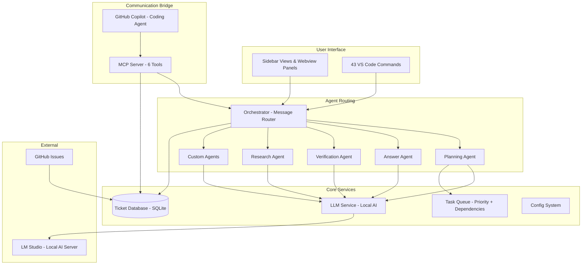

# System Architecture & Design

**Version**: 1.0  
**Date**: February 9, 2026

---

## High-Level Architecture

COE is built as a VS Code extension with four major layers that work together:

```
┌─────────────────────────────────────────────────────────────────┐
│                        USER (Developer)                         │
│                 Interacts via VS Code Sidebar & Panels          │
└────────────────────────────┬────────────────────────────────────┘
                             │
┌────────────────────────────▼────────────────────────────────────┐
│                    VS CODE EXTENSION LAYER                      │
│  Sidebar Views · Webview Panels · Commands · File Watchers      │
└────────────────────────────┬────────────────────────────────────┘
                             │
┌────────────────────────────▼────────────────────────────────────┐
│                    AGENT ROUTING LAYER                          │
│  Orchestrator · Planning · Answer · Verification · Research     │
│  Custom Agents · Clarity Agent                                  │
└───────────┬────────────────┬────────────────┬───────────────────┘
            │                │                │
┌───────────▼──────┐ ┌──────▼──────┐ ┌───────▼───────────────────┐
│  MCP SERVER      │ │ CORE        │ │  LOCAL LLM                │
│  (Copilot Link)  │ │ SERVICES    │ │  (LM Studio)              │
│  Tools for AI    │ │ Tickets,    │ │  AI inference engine      │
│  coding agents   │ │ Tasks,      │ │  Runs specialized agents  │
│  to call         │ │ Plans       │ │                           │
└──────────────────┘ └─────────────┘ └───────────────────────────┘
```

---

## The Four Layers Explained

### Layer 1: VS Code Extension (User Interface)

This is what the developer sees and interacts with. It includes:

- **Sidebar Views**
  - **Agents Tab** — Shows the status of every AI agent (idle, working, last activity)
  - **Tickets Tab** — Lists all open/resolved tickets for AI↔human communication
  - **Tasks Tab** — Current task queue with priorities and progress
  - **Conversations Tab** — History of all agent conversations

- **Webview Panels** (opened when the user clicks into something)
  - **Planning Wizard** — Interactive guided planning experience
  - **Conversation View** — Chat-like interface for talking with agents
  - **Verification Panel** — Checklist of test results and visual checks
  - **Custom Agent Builder** — UI for creating new specialized agents
  - **Agent Gallery** — Browse and manage available agents

- **Commands** — 43 registered actions the user can trigger (e.g., "Create Plan", "Fresh Restart", "Refresh PRD")

- **File Watchers** — Monitors plan files, source code, and GitHub issues for changes

### Layer 2: Agent Routing (The Brain)

The central **Orchestrator** receives all messages and routes them to the right specialist:

```
                    ┌───────────────────┐
    User Message ──▶│   ORCHESTRATOR    │
    MCP Request ───▶│ (Conversation     │
                    │  Router)          │
                    └─────┬─────┬───────┘
                          │     │
           ┌──────────────┘     └──────────────┐
           │              │                    │
    ┌──────▼─────┐ ┌──────▼──────┐ ┌──────────▼────────┐
    │  PLANNING  │ │   ANSWER    │ │   VERIFICATION    │
    │  Generate  │ │  Q&A with   │ │   Review code     │
    │  task      │ │  context    │ │   PASS/FAIL       │
    │  plans     │ │  & history  │ │   assessment      │
    └────────────┘ └─────────────┘ └───────────────────┘
           │
    ┌──────▼─────┐ ┌─────────────┐
    │  RESEARCH  │ │   CUSTOM    │
    │  Deep      │ │  User-built │
    │  analysis  │ │  specialists│
    └────────────┘ └─────────────┘
```

**How routing works:**
1. A message arrives (from user, webview, or MCP tool call)
2. The Orchestrator sends the message to the LLM to classify intent
3. LLM returns: `planning`, `verification`, or `answer`
4. Message is forwarded to the appropriate agent handler
5. Agent processes + returns response
6. Response is displayed in the UI or sent back via MCP

### Layer 3: MCP Server (Bridge to Coding Agents)

The **Model Context Protocol (MCP) Server** exposes tools that external AI coding agents (like GitHub Copilot) can call. This is how COE communicates with the agent that actually writes code.

**Six Core MCP Tools:**

| Tool | Purpose |
|------|---------|
| `getNextTask` | Returns the highest-priority ready task with all context |
| `reportTaskDone` | Marks a task complete and triggers verification |
| `askQuestion` | Routes questions to the Answer agent for clarification |
| `getErrors` | Reports errors encountered during implementation |
| `callCOEAgent` | Calls a specific COE agent directly |
| `scanCodeBase` | Analyzes project files for drift and mismatches |

### Layer 4: Core Services (Data & Intelligence)

- **Ticket Database (SQLite)** — Stores all tasks, tickets, conversations, and audit logs
- **LLM Service** — Connects to a local LLM server (LM Studio) for AI inference
- **Task Queue** — Priority-based queue with dependency graph tracking
- **Planning Service** — Backend for the Planning Wizard
- **Config System** — Validated settings with live reloading

---

## System Architecture Diagram



---

## Data Architecture

### Where Data Lives

```
Project Root/
├── .coe/                          # COE working directory
│   ├── config.json                # Extension settings
│   ├── tickets.db                 # SQLite database (tasks, tickets, logs)
│   ├── offline-cache/             # Cached data for offline use
│   ├── processed/                 # LLM-processed GitHub issues
│   └── agents/
│       └── custom/                # User-created agent definitions (YAML)
│
├── .vscode/
│   └── github-issues/             # Synced GitHub issues in Markdown
│
└── Docs/Plans/{plan-id}/          # Plan working directory
    ├── plan.json                  # Core plan configuration
    ├── metadata.json              # Version history & tracking
    ├── design-system.json         # Visual specifications
    ├── plan.md                    # Human-readable summary
    └── tasks.json                 # Generated task breakdown
```

### Data Flow

```
  Sources                    Processing                  Consumers
  ───────                    ──────────                  ─────────

  GitHub Issues ──►┐                                  ┌──► Extension UI
                   ├──► Workflow Memory ──► Task ──►─┤
  User Input ─────►┤    (In-Memory State)   Queue    ├──► Agent Teams
                   │                                  │
  Plan Files ─────►┘                                  └──► MCP Server
                                                           (for Copilot)
                           │
                           ▼
                    Persistent Storage
                    (SQLite + Files)
```

---

## Design Principles

1. **Offline-First** — Works without internet; caches everything locally; syncs when online
2. **Zero-Config Startup** — Every setting has sensible defaults; works out of the box
3. **Plan-Code Synchronization** — Plans and code are always compared to detect drift
4. **Token Safety** — All AI interactions stay within context limits to prevent confusion
5. **Audit Trail** — Every decision, every change, every agent action is logged
6. **Graceful Degradation** — If the LLM is offline, COE still functions with fallback messages

---

## Visual Design System

### Color Palette

| Purpose | Light Mode | Dark Mode |
|---------|-----------|-----------|
| Primary | Blue (#3B82F6) | Blue (#3B82F6) |
| Secondary | Purple (#8B5CF6) | Purple (#8B5CF6) |
| Success | Green (#10B981) | Green (#10B981) |
| Warning | Amber (#F59E0B) | Amber (#F59E0B) |
| Error | Red (#EF4444) | Red (#EF4444) |
| Background | White (#FFFFFF) | Dark (#1E1E1E) |
| Text | Near-black (#111827) | Near-white (#E5E7EB) |

### Typography

- **UI Text**: Segoe UI, system-ui, sans-serif
- **Code / Data**: Cascadia Code, Fira Code, monospace
- **Sizes**: 12px (small labels) through 30px (headings)

### Icon System

Tasks (☑️), Features (📦), Bugs (🐛), Questions (❓), Agents (🤖), Plans (📋), Verified (✅), Alerts (⚠️), and 15 more contextual icons.
