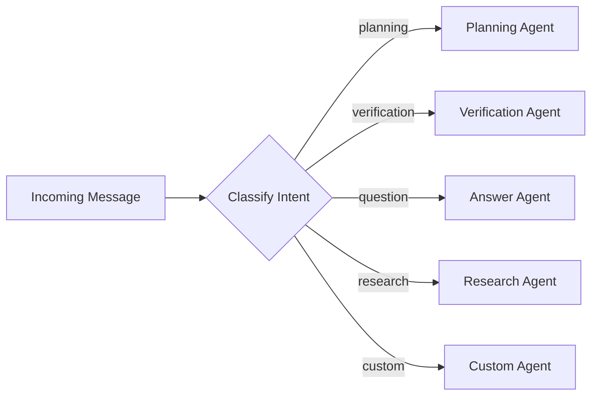
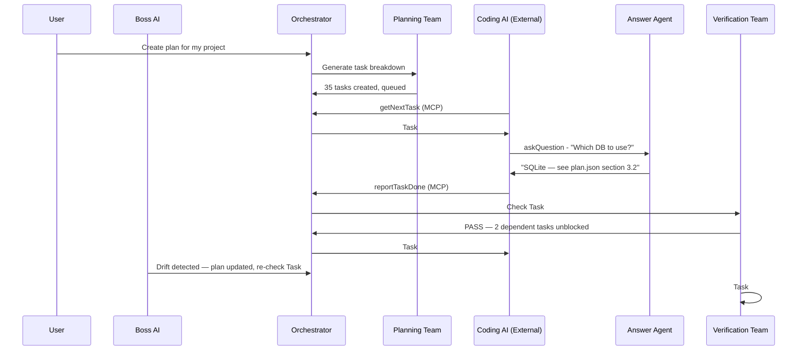

# AI Agent Teams & Roles

**Version**: 1.0  
**Date**: February 9, 2026

---

## Overview

COE uses a **multi-agent AI system** where specialized agents each handle one aspect of the development workflow. A central Orchestrator routes work to the right agent, and a Boss AI supervises the whole system.

---

## Agent Roster

```
                          ┌─────────────────┐
                          │    BOSS AI       │
                          │  (Supervisor)    │
                          └────────┬────────┘
                                   │ oversees
                    ┌──────────────┼──────────────┐
                    │              │              │
          ┌─────────▼────┐ ┌──────▼──────┐ ┌─────▼──────────┐
          │ ORCHESTRATOR │ │  PLANNING   │ │  VERIFICATION  │
          │ (Router)     │ │  TEAM       │ │  TEAM          │
          └──────┬───────┘ └─────────────┘ └────────────────┘
                 │
      ┌──────────┼──────────┬──────────────┐
      │          │          │              │
┌─────▼───┐ ┌───▼────┐ ┌───▼─────┐ ┌──────▼──────┐
│ ANSWER  │ │RESEARCH│ │CLARITY  │ │   CUSTOM    │
│ AGENT   │ │ AGENT  │ │ AGENT   │ │   AGENTS    │
└─────────┘ └────────┘ └─────────┘ └─────────────┘
```

---

## Team 0: Boss AI (Supervisor)

**Role**: Top-level AI supervisor — the "CEO" of all agent teams.

**Responsibilities**:
- Monitor global system health and team performance
- Resolve inter-team conflicts (e.g., Plan says SQL but task implies NoSQL)
- Enforce plan alignment — detect when things drift off course
- Limit overwork — cap pending tasks at 20 to prevent overload
- Suggest improvements post-cycle (e.g., "Testing coverage is low — prioritize Verification")
- Escalate decisions to the user when needed

**Decision-Making**:
- Receives system metrics, plan data, and agent status as inputs
- Uses reinforcement learning to improve decisions over time
- Only activates on significant thresholds (e.g., >20% drift) to save resources

**Example Actions**:
| Situation | Boss Response |
|-----------|--------------|
| Plan says "SQL" but code uses NoSQL | Flags conflict, proposes fix, updates plan if user approves |
| Code diverges from plan | Compares file tree to plan, evaluates impact, presents to user |
| Planning creates 15 tasks at once | Approves only 10, queues the rest |
| User selects "Frontend only" | Tells Planning to auto-fill backend defaults, flags for review |

---

## Team 1: Orchestrator (Central Router)

**Role**: The traffic controller. Classifies every incoming message and routes it to the correct specialist agent.

**What It Does**:
- Receives all user messages, MCP tool calls, and webview interactions
- Classifies intent (planning? verification? question? research?)
- Routes to the appropriate agent
- Manages the task queue and auto-planning
- Detects stuck tasks (timeout monitoring)

**Routing Flow**:



**Routing Rules**:
- If the task is estimated >1 hour → send to Task Decomposition
- If the task is marked "done" → send to Verification
- If someone is asking a question → send to Answer Agent
- Otherwise → default to Planning Team

---

## Team 2: Planning Team

**Role**: Generates plans, decomposes features, and prepares task queues. Works independently — once it hands off tasks, it's done.

**What It Does**:
- Analyzes user requirements and generates structured plans
- Creates dependency-aware task lists (checks for circular dependencies)
- Estimates effort and timelines for each task
- Prepares detailed context bundles for the coding agent
- Adapts plans only when the user requests changes (not during coding)

**Outputs**:
- `plan.json` — Tasks with priorities and dependencies
- `metadata.json` — Version history
- `design-system.json` — Visual specifications (for UI tasks)
- Context bundles — Detailed prompts for the coding agent

**Sub-Agent: Reviewer**
The Planning Team automatically spawns a Reviewer sub-agent when a new plan is created:
- Scans the plan for ambiguities and unclear requirements
- Generates clarifying questions for the user
- Dies after the plan is approved

**Key Constraint**: Planning ends at task queue generation. No involvement in the coding or verification phases.

---

## Team 3: Answer Agent

**Role**: On-call helper that provides context-aware answers to questions from coding agents or users.

**How It Works**:
1. Coding AI encounters ambiguity → calls `askQuestion` via MCP
2. Answer Agent receives the question with task context
3. Searches the plan, codebase, and previous Q&A history
4. Returns an evidence-based answer with confidence score
5. If confidence is below 70% → escalates to the user via a ticket

**Key Characteristics**:
- **Reactive**: Only activates when asked — never polls or runs in the background
- **Fast**: Targets <5 second response time to keep coding agents unblocked
- **Evidence-Based**: Always cites sources (plan sections, code files, previous answers)
- **Escalation**: Creates tickets for human decisions when uncertain

**Response Format**:
- Answer text with explanation
- Confidence score (0–100%)
- Source citations (which plan section, which file)
- Whether human escalation is needed

---

## Team 4: Verification Team

**Role**: Independent post-execution checker. Verifies that completed work matches the plan's acceptance criteria.

**How It Works**:
1. Coding AI finishes a task → reports done via MCP
2. Verification Team waits **60 seconds** for file stability (prevents checking mid-write)
3. Reads the completed files and compares against plan acceptance criteria
4. Runs automated tests
5. For UI changes: launches visual verification with design system references
6. Reports: what's **done** (matches) and what's **remaining** (gaps)
7. Auto-creates follow-up tasks for any gaps found

**Verification States**:

```
Not Started → In Progress → Pending Verification → Verified ✓
                                                  → Needs Re-Check
                                                  → Failed
```

**Triggers for Re-Check**:
- Plan or acceptance criteria updated after verification
- A dependency task fails
- Test suite updated
- Design system reference changed
- User manually flags for re-check

---

## Team 5: Research Agent

**Role**: Deep investigator that gathers information and produces analysis reports.

**When It Activates**:
- A coding task has been stuck for >30 minutes
- A question requires investigation beyond the plan and codebase
- The Orchestrator detects a pattern that needs deeper analysis

**What It Produces**: Structured research reports with findings, recommendations, and source citations.

---

## Team 6: Clarity Agent

**Role**: Quality enforcer for all ticket-based communication. Reviews every reply in the ticket system for completeness and clarity.

**How It Works**:
1. Someone replies to a ticket (user or AI)
2. Clarity Agent scores the reply 0–100 on clarity, completeness, and accuracy
3. If score ≥ 85 → marks as "Clear", ticket can proceed to resolution
4. If score < 85 → auto-replies with follow-up questions: "Not clear — please elaborate on {specific point}"
5. Maximum 5 refinement rounds before escalating to Boss/user

---

## Team 7: Custom Agents (User-Created)

**Role**: Specialized agents that users create for domain-specific tasks **without writing code**.

**Designed For**:
- Research & analysis
- Documentation writing
- Code review (read-only)
- Bug analysis & pattern investigation
- Domain-specific Q&A

**Critical Constraint**: Custom agents **cannot write or edit code**. They can only read files, search code, create tickets, and call the LLM. This keeps them safe, predictable, and scoped.

**Configuration**: Users define agents through a YAML template with:
- System prompt (what the agent is and does)
- Goals (1–20 prioritized objectives)
- Checklist (1–50 items the agent follows)
- Custom lists (up to 7 reference lists)
- Routing rules (keywords/patterns that trigger this agent)
- Permissions (always read-only for files)

**Built-In Safety Loop**: Every custom agent runs through a guarded execution cycle:
1. Load config → hardlock check (write/execute = always denied)
2. Process each goal one at a time, in priority order
3. After each goal: check token usage, time budget, and loop detection
4. If any check fails → agent halts, saves partial results, notifies user
5. Maximum 50 LLM calls, 20 goals, and 30 minutes total per run
6. Full audit trail logged for every action

See [Context Management & Safety](08-Context-Management-and-Safety.md) for the complete safety diagram.

---

## The Coding AI (External — Not Part of COE)

**Important**: The actual coding agent (GitHub Copilot) is **not a COE agent** — it's an external tool that COE coordinates.

**How COE Treats the Coding AI**:
- Sends it one task at a time with detailed context
- Monitors for blocks (>30 seconds of inactivity)
- Answers its questions via the MCP `askQuestion` tool
- Receives its completion reports via `reportTaskDone`
- Never lets it guess — if anything is unclear, it must ask

**Coding AI Rules**:
- Follow instructions exactly — no creative interpretation
- Ask early, ask often — better 10 questions than 1 wrong implementation
- Cannot communicate directly with the user — all communication goes through COE's agents
- Must achieve 95%+ confidence before proceeding without asking

---

## Agent Coordination Summary


