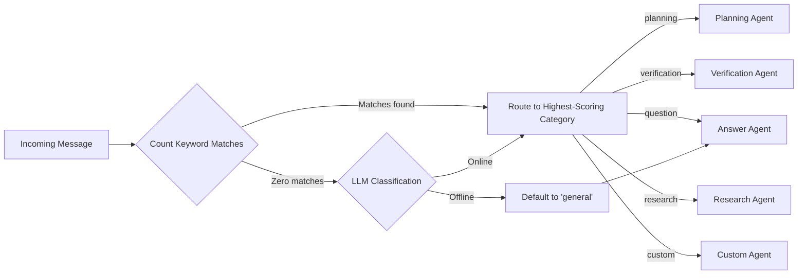
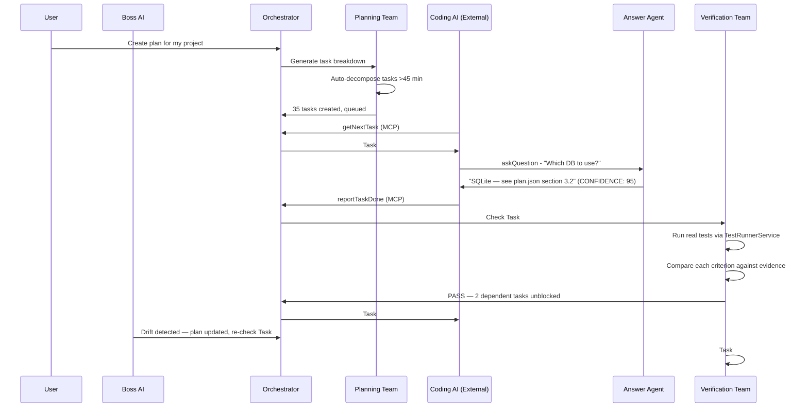

# AI Agent Teams & Roles

**Version**: 1.1
**Date**: February 11, 2026
**Updated**: Agent descriptions rewritten with ultra-granular prompt specifications

---

## Overview

COE uses a **multi-agent AI system** where specialized agents each handle one aspect of the development workflow. A central Orchestrator routes work to the right agent, and a Boss AI supervises the whole system.

Every agent's system prompt is designed to be **exhaustively explicit** — detailed enough that even a small, non-reasoning language model can follow the instructions and produce correctly formatted output every time.

---

## Agent Roster

```
                          ┌─────────────────┐
                          │    BOSS AI       │
                          │  (Supervisor)    │
                          └────────┬────────┘
                                   │ oversees
                    ┌──────────────┼──────────────┐
                    │              │              │
          ┌─────────▼────┐ ┌──────▼──────┐ ┌─────▼──────────┐
          │ ORCHESTRATOR │ │  PLANNING   │ │  VERIFICATION  │
          │ (Router)     │ │  TEAM       │ │  TEAM          │
          └──────┬───────┘ └─────────────┘ └────────────────┘
                 │
      ┌──────────┼──────────┬──────────────┐
      │          │          │              │
┌─────▼───┐ ┌───▼────┐ ┌───▼─────┐ ┌──────▼──────┐
│ ANSWER  │ │RESEARCH│ │CLARITY  │ │   CUSTOM    │
│ AGENT   │ │ AGENT  │ │ AGENT   │ │   AGENTS    │
└─────────┘ └────────┘ └─────────┘ └─────────────┘
```

---

## Team 0: Boss AI (Supervisor)

**Role**: Top-level AI supervisor — the "CEO" of all agent teams.

**File**: `src/agents/boss-agent.ts`

**Responsibilities**:
- Monitor global system health and team performance
- Resolve inter-team conflicts (e.g., Plan says SQL but task implies NoSQL)
- Enforce plan alignment — detect when things drift off course
- Limit overwork — cap pending tasks at 20 to prevent overload
- Suggest improvements post-cycle
- Escalate decisions to the user when needed

**How It Decides**: The Boss Agent receives system metrics (task counts, agent statuses, ticket counts, recent audit entries) and evaluates them against explicit thresholds:

| Threshold | Severity | Action |
|-----------|----------|--------|
| More than 20 pending tasks | Critical | Create ticket, halt new task generation |
| More than 3 failed tasks in last 24 hours | Warning | Create investigation ticket |
| Any agent in error state | Critical | Restart agent, create incident ticket |
| More than 5 escalated tickets | Warning | Alert user, suggest batch resolution |
| Plan drift above 20% | Critical | Halt execution, notify user with drift report |

**Output Format** — The Boss Agent always responds with exactly these four fields:

```
ASSESSMENT: [One paragraph summary of system health — what is going well and what is not]
ISSUES: [Numbered list. Each issue has a severity tag: (critical), (warning), or (info)]
ACTIONS: [Numbered list. Each action references a specific agent, task, or config to change]
ESCALATE: [true or false. True ONLY if any issue is severity=critical]
```

**Example Output**:
```
ASSESSMENT: System is under moderate stress. 23 pending tasks exceed the 20-task cap.
The Verification Agent has been in error state for 12 minutes.
ISSUES:
1. (critical) Task overload: 23 pending tasks (limit: 20)
2. (critical) Verification Agent in error state since 14:32
3. (warning) 2 escalated tickets awaiting user response
ACTIONS:
1. Pause task generation until pending count drops below 15
2. Restart Verification Agent and re-run last failed verification
3. Notify user about escalated tickets TK-041 and TK-042
ESCALATE: true
```

**Key Constraint**: Only activates on significant thresholds — does not poll or run continuously.

---

## Team 1: Orchestrator (Central Router)

**Role**: The traffic controller. Classifies every incoming message and routes it to the correct specialist agent.

**File**: `src/agents/orchestrator.ts`

**What It Does**:
- Receives all user messages, MCP tool calls, and webview interactions
- Classifies intent using a two-stage system: keyword scoring first, LLM fallback second
- Routes to the appropriate agent
- Manages the task queue and auto-planning
- Detects stuck tasks (timeout monitoring)

**Intent Classification — Two-Stage System**:

Stage 1 (Fast, No LLM): Count keyword matches per category. The category with the most matches wins.

| Category | Keywords (10+ per category) |
|----------|---------------------------|
| `planning` | plan, create, break down, decompose, task, feature, requirement, roadmap, schedule, build, implement, design, architect, structure, organize, timeline |
| `verification` | verify, check, test, validate, review, pass, fail, coverage, acceptance, confirm, ensure, assertion, correct, accuracy, regression, quality |
| `question` | how, what, why, should, which, where, when, clarify, explain, confused, can, does, tell me, meaning, define |
| `research` | investigate, analyze, research, deep dive, explore, study, compare, benchmark, tradeoff, alternative, option, evaluate, pros and cons |
| `custom` | custom agent, my agent, specialized, domain |
| `general` | (fallback when no keywords match) |

**Tie-Breaking Rule**: When two categories have the same keyword count, use this priority order: verification > planning > question > research > custom > general.

Stage 2 (LLM Fallback): If zero keywords match, ask the LLM to classify. If the LLM is offline, default to `general`.

**Routing Flow**:



**LLM Offline Mode**: When the LLM endpoint is unreachable:
- Set `llmOffline` flag to true
- Route using keywords only (no LLM calls)
- Show VS Code warning: "LLM offline. Using keyword-based routing only."
- Create a ticket for any request that couldn't be properly routed
- Reset flag on next successful LLM call

**Key Constraint**: The Orchestrator never writes code and never processes tasks directly — it only routes.

---

## Team 2: Planning Team

**Role**: Generates plans, decomposes features, and prepares task queues. Works independently — once it hands off tasks, it's done.

**File**: `src/agents/planning-agent.ts`

**What It Does**:
- Analyzes user requirements and generates structured plans
- Creates dependency-aware task lists (checks for circular dependencies)
- Estimates effort and timelines for each task
- Prepares detailed context bundles for the coding agent
- Automatically decomposes any task estimated >45 minutes into sub-tasks (recursive, max 3 levels deep)

**Output Format** — The Planning Agent always responds with this exact JSON structure:

```json
{
  "plan_name": "string — descriptive name for this plan",
  "tasks": [
    {
      "title": "string — clear one-line description of what to build",
      "description": "string — detailed explanation of the task",
      "priority": "P1 or P2 or P3",
      "estimated_minutes": "number between 15 and 45",
      "acceptance_criteria": "string — one binary pass/fail criterion",
      "dependencies": ["exact title of another task this depends on"],
      "files_to_create": ["path/to/new/file.ts"],
      "files_to_modify": ["path/to/existing/file.ts"],
      "step_by_step_implementation": [
        "Step 1: Open file src/models/user.ts",
        "Step 2: Add import for crypto at line 1",
        "Step 3: Create interface User with fields: id (string), email (string)",
        "Step 4: Export the interface"
      ],
      "testing_instructions": "string — exact steps to verify this task works"
    }
  ],
  "summary": "string — one-paragraph overview of the entire plan"
}
```

**Atomicity Rules** — Every task must pass ALL criteria:
- Can be completed in 15–45 minutes
- Can start and finish independently
- Changes only ONE logical area
- Has ONE clear, measurable acceptance criterion (binary: pass or fail)
- All dependencies are already completed or noted
- All required context fits in one AI session
- Produces exactly ONE deliverable
- Can be rolled back independently

**Auto-Decomposition**: When a task has `estimated_minutes > 45`:
1. The Planning Agent automatically calls `decompose(taskId)` on it
2. The decompose method splits it into sub-tasks (15-45 min each)
3. If a sub-task is STILL >45 min, decompose again (max depth: 3 levels)
4. The parent task's status becomes `decomposed` — it is not executed directly
5. Sub-tasks inherit the parent's dependencies and depend on each other in order

**Constraints**:
- Maximum 100 tasks per plan
- Every task must have at least one acceptance criterion
- `step_by_step_implementation` must contain at least 3 steps per task
- Each step must be ONE unambiguous action (not "implement the feature")
- Planning ends at task queue generation — no involvement in coding or verification

---

## Team 3: Answer Agent

**Role**: On-call helper that provides context-aware answers to questions from coding agents or users.

**File**: `src/agents/answer-agent.ts`

**How It Works**:
1. Coding AI encounters ambiguity → calls `askQuestion` via MCP
2. Answer Agent receives the question with task context
3. Searches the plan, codebase context, and previous Q&A history
4. Returns an evidence-based answer with confidence score
5. If confidence is below 50% → automatically escalates to the user via a ticket

**Output Format** — The Answer Agent always responds with exactly these four fields:

```
ANSWER: [Your answer here. Maximum 500 words. Be concise and specific.]
CONFIDENCE: [0-100. Must be a number. If unsure, set to 50.]
SOURCES: [Comma-separated list of specific references: task IDs, file paths, plan names, or "N/A"]
ESCALATE: [true or false. True if CONFIDENCE < 50.]
```

**Rules**:
- CONFIDENCE must be a number 0-100
- SOURCES must reference specific items — not vague descriptions
- If the question is about a technology choice (e.g., "bcrypt or argon2?"), answer based ONLY on what the plan specifies. If the plan doesn't specify, set ESCALATE to true.
- Never say "I think" or "probably" — either cite a source or escalate
- Maximum answer length: 500 words
- If confidence < 50: auto-create a P1 ticket for human input

**Example Output**:
```
ANSWER: Yes, the sidebar should collapse to a hamburger menu on mobile viewports below 768px. The navigation items move into a slide-out drawer.
CONFIDENCE: 95
SOURCES: plan.json section 3.2 (responsive breakpoints), task #12 acceptance criteria
ESCALATE: false
```

**Key Characteristics**:
- **Reactive**: Only activates when asked — never polls
- **Fast**: Targets <5 second response time
- **Evidence-Based**: Always cites sources
- **Auto-Escalation**: Creates tickets for human decisions when uncertain

---

## Team 4: Verification Team

**Role**: Independent post-execution checker. Verifies that completed work matches the plan's acceptance criteria using both real test output and LLM analysis.

**File**: `src/agents/verification-agent.ts`

**How It Works**:
1. Coding AI finishes a task → reports done via MCP `reportTaskDone`
2. Orchestrator marks task as `pending_verification`
3. Wait 60 seconds for file stability (prevents checking mid-write)
4. **TestRunnerService** executes `npm test` on modified files and captures real output
5. Verification Agent receives: task details + acceptance criteria + real test output
6. Compares each criterion against evidence
7. Reports: PASS, FAIL, or NEEDS_RECHECK
8. Auto-creates follow-up tasks for any gaps found

**Output Format** — The Verification Agent always responds with this exact JSON:

```json
{
  "status": "passed or failed or needs_recheck",
  "criteria_checks": [
    {
      "criterion_text": "The login endpoint returns 200 on valid credentials",
      "status": "met or not_met or unclear",
      "evidence": "File src/routes/auth.ts line 45 returns 200. Test auth.test.ts line 12 passes."
    }
  ],
  "test_results": {
    "passed": 8,
    "failed": 0,
    "coverage": 87
  },
  "follow_up_tasks": [
    {
      "title": "Fix: Login endpoint - missing rate limiting",
      "description": "The acceptance criterion for rate limiting was not met",
      "priority": "P1"
    }
  ],
  "summary": "One sentence summary of the verification result"
}
```

**Critical Rules**:
- `test_results` must ONLY be populated from real TestRunnerService output. If no test runner is available, set `test_results` to `null` and add note: "No test runner output available"
- Never mark as `passed` if ANY criterion has status `not_met`
- Mark as `needs_recheck` ONLY if criteria are `unclear` (not enough info to judge)
- Follow-up task title format: `"Fix: [original task title] - [unmet criterion]"`
- For each `not_met` criterion, create exactly ONE follow-up task

**Verification States**:

```
Not Started → In Progress → Pending Verification → Verified ✓
                                                  → Needs Re-Check
                                                  → Failed
                                                  → Decomposed (parent only)
```

**Triggers for Re-Check**:
- Plan or acceptance criteria updated after verification
- A dependency task fails
- Test suite updated
- Design system reference changed
- User manually flags for re-check
- File watcher detects changes to files in a pending_verification task

**Retry on Failure**: If verification throws an error, retry once after 30 seconds. If it fails twice, create an investigation ticket.

---

## Team 5: Research Agent

**Role**: Deep investigator that gathers information and produces structured analysis reports.

**File**: `src/agents/research-agent.ts`

**When It Activates**:
- A coding task has been stuck for >30 minutes
- A question requires investigation beyond the plan and codebase
- The Orchestrator detects a pattern that needs deeper analysis

**Output Format** — The Research Agent always responds with exactly these five fields:

```
FINDINGS: [Numbered list of discrete facts discovered during research]
ANALYSIS: [Detailed comparison of at least 2 approaches when relevant]
RECOMMENDATION: [Exactly one sentence — the recommended approach]
SOURCES: [URLs, file paths, or "general knowledge" for each finding]
CONFIDENCE: [0-100. Below 60 means "stop researching, escalate to user"]
```

**Rules**:
- FINDINGS must be a numbered list — not prose paragraphs
- ANALYSIS must compare at least 2 approaches when the question involves a choice
- RECOMMENDATION must be exactly one sentence
- SOURCES must be specific — URLs, file paths, or "general knowledge"
- CONFIDENCE below 60 triggers automatic escalation
- Maximum total length: 1000 words

**Example Output**:
```
FINDINGS:
1. bcrypt uses Blowfish cipher, 10 rounds by default, ~100ms per hash
2. argon2 is the Password Hashing Competition winner, memory-hard, ~200ms per hash
3. The project's plan.json section 2.1 specifies "industry-standard password hashing"

ANALYSIS: bcrypt is simpler to implement (1 dependency: bcryptjs) and widely supported. argon2 is more secure against GPU attacks but requires native compilation (argon2 npm package). Since this project uses node:sqlite to avoid native modules, argon2 would introduce the same native compilation issues.

RECOMMENDATION: Use bcryptjs because it avoids native module issues and satisfies "industry-standard" requirement.

SOURCES: plan.json section 2.1, npm package comparison, OWASP password storage guidelines
CONFIDENCE: 90
```

---

## Team 6: Clarity Agent

**Role**: Quality enforcer for all ticket-based communication. Reviews every reply in the ticket system for completeness and clarity.

**File**: `src/agents/clarity-agent.ts`

**How It Works**:
1. Someone replies to a ticket (user or AI)
2. Clarity Agent scores the reply 0–100 on clarity, completeness, and accuracy
3. If score >= 85 → marks as "Clear", ticket proceeds to resolution
4. If score 70-84 → marks as "Mostly clear", requests one clarification
5. If score < 70 → marks as "Unclear", requests specific elaboration
6. Maximum 5 refinement rounds before escalating to Boss/user

**Output Format** — The Clarity Agent always responds with exactly these three fields:

```
SCORE: [0-100]
ASSESSMENT: [clear or needs_clarification]
FEEDBACK: [If needs_clarification: numbered list of max 3 specific points that need elaboration]
```

**Scoring Guide**:
| Score Range | Meaning | Action |
|-------------|---------|--------|
| 85-100 | Clear and complete | Mark as resolved |
| 70-84 | Mostly clear, needs one point | Request one clarification |
| Below 70 | Significantly unclear | Request up to 3 clarifications |

**Rules**:
- Do not ask more than 3 clarification questions per round
- If the reply directly answers the ticket's original question, score at least 80 regardless of writing quality
- After 5 rounds of clarification with no resolution, escalate to Boss AI
- Always explain WHY something is unclear — "Please clarify" alone is not acceptable

---

## Team 7: Custom Agents (User-Created)

**Role**: Specialized agents that users create for domain-specific tasks **without writing code**.

**File**: `src/agents/custom-agent.ts`

**Designed For**:
- Research & analysis
- Documentation writing
- Code review (read-only)
- Bug analysis & pattern investigation
- Domain-specific Q&A

**Critical Constraint**: Custom agents **cannot write or edit code**. They can only read files, search code, create tickets, and call the LLM. This keeps them safe, predictable, and scoped.

**Configuration**: Users define agents through a YAML template with:
- System prompt (what the agent is and does)
- Goals (1–20 prioritized objectives)
- Checklist (1–50 items the agent follows)
- Routing keywords (patterns that trigger this agent)
- Permissions (always read-only for files — write/execute are hardlocked off)

**Execution Loop** — For each goal, in priority order:

```
1. Load YAML config
2. HARDLOCK CHECK: write=false, execute=false (ALWAYS, cannot be overridden)
3. For each goal (priority order):
   a. Load relevant context
   b. Call LLM with system prompt + goal + checklist
   c. Validate response format
   d. Check against checklist items
   e. Store results in ticket
   f. SAFETY CHECK after each goal:
      - Token usage within limit? (max 50 LLM calls/run)
      - Response coherent? (loop detection: 3 similar = halt)
      - Time budget OK? (<5 min/goal, <30 min total)
      - No write attempts detected?
   g. If any safety check fails → halt, save partial results, notify user
4. All goals complete → return results via ticket system
```

**Safety Limits**:

| Guard | Default | Maximum | What Happens on Breach |
|-------|---------|---------|----------------------|
| Goals per run | 20 | 20 | Agent stops, reports partial results |
| LLM calls per run | 50 | 50 | Agent halts, creates "budget exceeded" ticket |
| Time per goal | 5 min | 5 min | Goal times out, skips to next goal |
| Total runtime | 30 min | 30 min | Agent force-stops, saves progress |
| Loop detection | 3 similar | 3 | Agent pauses, asks user to intervene |

**Hardlock Protections** (CANNOT be overridden by user, YAML config, or AI):

| Locked Permission | Why |
|-------------------|-----|
| Cannot write or edit any file | Prevents accidental code damage |
| Cannot execute any command | Prevents system-level side effects |
| Cannot modify other agents | Prevents cascade failures |
| Cannot modify their own config | Prevents self-escalation of permissions |

---

## The Coding AI (External — Not Part of COE)

**Important**: The actual coding agent (GitHub Copilot) is **not a COE agent** — it's an external tool that COE coordinates.

**How COE Treats the Coding AI**:
- Sends it one task at a time with detailed context via MCP `getNextTask`
- Each task includes `step_by_step_implementation` — explicit, unambiguous actions
- Monitors for blocks (>30 seconds of inactivity)
- Answers its questions via the MCP `askQuestion` tool
- Receives its completion reports via `reportTaskDone`
- Never lets it guess — if anything is unclear, it must ask

**Coding AI Rules**:
- Follow the `step_by_step_implementation` instructions exactly — no creative interpretation
- Ask early, ask often — better 10 questions than 1 wrong implementation
- Cannot communicate directly with the user — all communication goes through COE's agents
- Must report all files modified in `reportTaskDone`
- Must achieve 95%+ confidence before proceeding without asking

---

## Agent Coordination Summary


