# 03 — AI Agent Teams & Roles

**Version**: 9.0
**Last Updated**: February 2026
**Status**: ✅ Current
**Depends On**: [01-Vision-and-Goals](01-Vision-and-Goals.md), [02-System-Architecture-and-Design](02-System-Architecture-and-Design.md), [10-AI-Operating-Principles](10-AI-Operating-Principles.md)
**Changelog**: v9.0 — 18 agents (added UserCommunicationAgent #18), 10-level corporate agent hierarchy (~230 niche agent definitions across L4-L9), lazy spawning (L0-L4 skeleton on plan start, L5-L9 on demand), question escalation chain (L9→L0→UserCommAgent→User), per-agent model selection (reasoning/vision/fast/tool_use/code/general), agent permission system (8 permission types + tool access + LLM call limits), 16 intent routing categories (added `user_communication`). v8.0 — 17 agents (added Backend Architect #17), renamed Design Architect display to Frontend Architect, 15 intent routing categories (added `backend_architect`), Back-End Designer system (9 element types, 3 operating modes, 8 QA scoring categories), Link Tree/Matrix system (4 link types, auto-detect, AI suggestions), Tag system (5 built-in + custom), unified Review Queue (drafts + suggestions), Filing system with source_type locking, Gap Hunter extended with 5 BE checks (#16-#20), Design Hardener extended for BE draft creation. v7.0 — 16 agents (added Coding Director), 4 team queues (Orchestrator, Planning, Verification, CodingDirector), lead vs support agent distinction, escalation mechanisms, support agent calls (sync/async), dynamic slot allocation, documentation system, file cleanup service. v4.0 — Added RACI matrix, User/Dev views, failure modes per agent, enforcement mechanisms, cross-agent communication patterns, decision trees, universal response format

---

## How to Read This Document

This document describes every AI agent in the COE system — what it does, how it decides, what it outputs, and when it fails. Agents are grouped by team and listed in the order they were introduced.

> **👤 User View**: You don't interact with individual agents directly — the Orchestrator handles routing automatically. But understanding the agents helps you know WHO is working on your project and WHY things happen the way they do. When COE creates a ticket asking you a question, this document tells you which agent asked and why.

> **🔧 Developer View**: Every agent extends `BaseAgent` in `src/agents/base-agent.ts`, which provides LLM access, token management, and audit logging. Agent output must always be a structured `AgentResponse` object — agents never write files, execute code, or produce side effects directly. The Orchestrator in `src/agents/orchestrator.ts` routes to agents via keyword-based intent classification using `KEYWORD_MAP` and `INTENT_PRIORITY`. v9.0 adds a 10-level hierarchy below the 18 top-level agents, with lazy spawning, per-agent model selection, and a permission system. All system-to-user messages now route through `UserCommunicationAgent` (Agent #18).

---

## Overview

COE uses a **multi-agent AI system** where specialized agents each handle one aspect of the development workflow. A central Orchestrator routes work to the right agent, and a Boss AI supervises the whole system. In v9.0, the 18 top-level orchestration agents are backed by a 10-level corporate hierarchy of ~230 niche agents that handle fine-grained task decomposition and execution.

Every agent's system prompt is designed to be **exhaustively explicit** — detailed enough that even a small, non-reasoning language model can follow the instructions and produce correctly formatted output every time.

---

## Agent Roster

```
                          ┌─────────────────┐
                          │    BOSS AI       │
                          │  (Supervisor)    │
                          └────────┬────────┘
                                   │ oversees 4 TEAM QUEUES
          ┌────────────────────────┼──────────────────────────────┐
          │                        │                              │
┌─────────▼────────┐      ┌───────▼───────┐      ┌──────────────▼────┐
│ ORCHESTRATOR     │      │   PLANNING    │      │  VERIFICATION     │
│ QUEUE (Lead)     │      │   QUEUE (Lead)│      │  QUEUE (Lead)     │
│ Catch-all router │      │   Plans/Design│      │  Testing/QA       │
└──────┬───────────┘      └───────────────┘      └───────────────────┘
       │                                                │
       │            ┌────────────────────┐              │
       │            │  CODING DIRECTOR   │              │
       │            │  QUEUE (Lead)      │              │
       │            │  External agent    │              │
       │            │  interface         │              │
       │            └────────────────────┘              │
       │                                                │
       ├──────┬──────────┬──────────────┬───────────────┤
       │      │          │              │               │
┌──────▼┐ ┌───▼───┐ ┌───▼─────┐ ┌──────▼──────┐ ┌──────▼─────────┐
│ANSWER │ │RESEARCH│ │CLARITY  │ │   CUSTOM    │ │ TICKET         │
│(Supp) │ │(Supp)  │ │(Supp)   │ │   AGENTS    │ │ PROCESSOR      │
└───────┘ └────────┘ └─────────┘ └─────────────┘ └────────────────┘
                                                         │
                    ┌─────────────────┬──────────────────┤
                    │                 │                   │
           ┌────────▼──────┐ ┌───────▼────────┐  ┌──────▼───┐
           │ FE QA TEAM    │ │ BE QA          │  │DECISION  │
           │ FE Architect  │ │ BE Architect   │  │MEMORY    │
           │ Gap Hunter    │ │ (Agent #17)    │  │(Supp)    │
           │ Hardener      │ └────────────────┘  └──────────┘
           └───────────────┘
                    │                    ┌──────────────────┐
                    │                    │ UI TESTING &     │
                    │                    │ OBSERVATION      │
                    │                    │ (Supp)           │
                    │                    └──────────────────┘
                    │                              │
                    │                       ┌──────▼──────┐
                    │                       │  REVIEW     │
                    │                       │  AGENT      │
                    │                       └─────────────┘
                    │
           ┌────────▼──────────┐        ┌──────────────────────┐
           │  REVIEW QUEUE     │        │  USER COMMUNICATION  │
           │  (Unified)        │        │  AGENT (#18, v9.0)   │
           │  FE + BE drafts,  │        │  All system→user     │
           │  link suggestions │        │  messages routed     │
           └───────────────────┘        │  through here        │
                                        └──────────────────────┘
                                                   │
                                        ┌──────────▼──────────┐
                                        │  10-LEVEL AGENT     │
                                        │  HIERARCHY (v9.0)   │
                                        │  L0 Boss → L9 Check │
                                        │  ~230 niche agents  │
                                        │  Lazy spawning      │
                                        └─────────────────────┘
```

**18 total agents** (14 built-in specialist + 1 supervisor + 1 router + 1 processor + custom agents). Below the 18 top-level orchestration agents, a 10-level corporate hierarchy provides ~230 niche agent definitions (v9.0).

### Lead Agents vs Support Agents (v7.0)

In v7.0, agents are classified as either **Lead Agents** or **Support Agents**:

- **Lead Agents** own their team queue and process tickets directly. They can escalate back to Boss AI and call support agents during processing.
- **Support Agents** are called by lead agents for quick lookups (sync) or deeper investigation (async sub-tickets).

| Role | Agents | Queue |
|------|--------|-------|
| **Lead** | Orchestrator, Planning Agent, Verification Agent, Coding Director | Own queue, process tickets |
| **Support** | Answer, Research, Clarity, Decision Memory, Observation | Called by leads on demand |
| **Supervisor** | Boss AI | Manages all 4 queues |
| **FE QA Specialists** | Frontend Architect (renamed from Design Architect in v8.0), Gap Hunter, Hardener | Called during FE design pipeline |
| **BE QA Specialist** | Backend Architect (v8.0, Agent #17) | Called during BE design pipeline |
| **Quality Gate** | Review Agent | Called by Ticket Processor |
| **Communication Gate** | UserCommunicationAgent (v9.0, Agent #18) | Intercepts all system-to-user messages |

### 4 Team Queues (v7.0)

Boss AI manages 4 independent team queues with dynamic slot allocation:

| Queue | Lead Agent | Ticket Types | Routing Rule |
|-------|-----------|-------------|--------------|
| **Orchestrator** | Orchestrator | Catch-all, unclassified work | Default when no other queue matches |
| **Planning** | Planning Agent | Plans, designs, research coordination, gap analysis, design scoring | `operation_type` = plan_generation, design_change, gap_analysis, design_score |
| **Verification** | Verification Agent | Testing, review, QA, acceptance checking | `operation_type` = verification |
| **Coding Director** | Coding Director Agent | Interface to external coding agent | `operation_type` = code_generation |

**Round-Robin Slot Balancing**: Boss AI dynamically allocates processing slots across teams. Least-recently-served team with pending work gets the next slot. Empty queues are skipped.

---

## Team 0: Boss AI (Supervisor)

**Role**: Top-level AI supervisor — the "CEO" of all agent teams.

**File**: `src/agents/boss-agent.ts`

> **👤 User View**: The Boss AI is the quality-control authority. You won't talk to it directly, but when it detects a problem — too many pending tasks, a failing agent, or plan drift — it creates tickets that appear in your Ticket Panel. If you see a ticket marked `ESCALATE: true`, the Boss is asking for your input on something it can't resolve alone. Note this should be routed to the user chat.

> **🔧 Developer View**: `BossAgent` extends `BaseAgent`. Its `processMessage()` receives system metrics from `DatabaseService` (task counts, agent states, ticket counts, recent audits). It runs on-demand — not on a timer — triggered by the Orchestrator when threshold checks are needed. Output is parsed by string splitting on `ASSESSMENT:`, `ISSUES:`, `ACTIONS:`, `ESCALATE:` markers. Add new thresholds by updating the system prompt in `boss-agent.ts`.

**Responsibilities**:
- Monitor global system health and team performance
- Resolve inter-team conflicts (e.g., Plan says SQL but task implies NoSQL)
- Enforce plan alignment — detect when things drift off course
- Limit overwork — cap pending tasks at 20 to prevent overload
- Suggest improvements post-cycle
- Escalate decisions to the user when needed

**How It Decides**: The Boss Agent receives system metrics (task counts, agent statuses, ticket counts, recent audit entries) and evaluates them against explicit thresholds:

| Threshold | Severity | Action |
|-----------|----------|--------|
| More than 20 pending tasks | Critical | Create ticket, halt new task generation |
| More than 3 failed tasks in last 24 hours | Warning | Create investigation ticket |
| Any agent in error state | Critical | Restart agent, create incident ticket |
| More than 5 escalated tickets | Warning | Alert user, suggest batch resolution |
| Plan drift above 20% | Critical | Halt execution, notify user with drift report |

**Output Format** — The Boss Agent always responds with exactly these four fields:

```
ASSESSMENT: [One paragraph summary of system health — what is going well and what is not]
ISSUES: [Numbered list. Each issue has a severity tag: (critical), (warning), or (info)]
ACTIONS: [Numbered list. Each action references a specific agent, task, or config to change]
ESCALATE: [true or false. True ONLY if any issue is severity=critical]
```

**Example Output**:
```
ASSESSMENT: System is under moderate stress. 23 pending tasks exceed the 20-task cap.
The Verification Agent has been in error state for 12 minutes.
ISSUES:
1. (critical) Task overload: 23 pending tasks (limit: 20)
2. (critical) Verification Agent in error state since 14:32
3. (warning) 2 escalated tickets awaiting user response
ACTIONS:
1. Pause task generation until pending count drops below 15
2. Restart Verification Agent and re-run last failed verification
3. Notify user about escalated tickets TK-041 and TK-042
ESCALATE: true
```

**v7.0 Enhancements — 4-Queue Management**:

Boss AI now manages 4 team queues with full control over slot allocation, ticket movement, and cancellation:

**Queue Management Actions**:
| Action | Description |
|--------|-------------|
| `assign_task` | Structured task with success criteria and target queue |
| `move_to_queue` | Move ticket between team queues |
| `cancel_ticket` | Cancel ticket with reason (periodically re-checks cancelled tickets) |
| `reorder_queue` | Move ticket to front/back within a team queue |
| `reprioritize` | Change ticket priority |
| `dispatch_agent` | Quick agent call (no queue overhead) |
| `update_slot_allocation` | Dynamically reallocate slots across teams |
| `escalate` | Ask user for input |
| `update_notepad` | Persist Boss AI thinking to notepad sections |

**Slot Allocation**: Boss AI dynamically controls how many processing slots each team gets (total limited to `maxParallelTickets`). Example: if planning work is heavy, Boss can allocate `{ orchestrator: 1, planning: 2, verification: 1, coding_director: 0 }`.

**Cancelled Ticket Review**: Every 30 minutes (configurable), Boss AI reviews cancelled tickets. If conditions have changed (blocker resolved, info now available), Boss can re-engage cancelled tickets back into the appropriate queue.

**Notepad Sections**: Boss AI persists its strategic thinking to `boss_notepad` table with sections: `queue_strategy`, `blockers`, `patterns`, `next_actions`.

**Key Constraint**: Only activates on significant thresholds — does not poll or run continuously.

---

## Team 1: Orchestrator (Central Router)

**Role**: The traffic controller. Classifies every incoming message and routes it to the correct specialist agent.

**File**: `src/agents/orchestrator.ts`

> **👤 User View**: The Orchestrator is invisible to you — it works behind the scenes to figure out what you're asking for and who should handle it. When you type "plan my project" or "verify task #3", the Orchestrator reads your keywords and routes to the right agent. If it can't figure out your intent, it defaults to the Answer Agent (so you always get a response).

> **🔧 Developer View**: The Orchestrator is the ONLY agent that doesn't call the LLM for its primary function. `classifyIntent()` uses a `KEYWORD_MAP` (object mapping category strings to keyword arrays) and `INTENT_PRIORITY` (object mapping category strings to numeric priorities — note: `0` is a valid priority, so always use `??` not `||`). Tie-breaking is deterministic via the priority map. LLM fallback only triggers when zero keywords match. Adding a new agent requires: (1) new entry in `AgentType` enum, (2) new keyword array in `KEYWORD_MAP`, (3) new priority in `INTENT_PRIORITY`, (4) new case in `routeToAgent()` switch.

**What It Does**:
- Receives all user messages, MCP tool calls, and webview interactions
- Classifies intent using a two-stage system: keyword scoring first, LLM fallback second
- Routes to the appropriate agent
- Manages the task queue and auto-planning
- Detects stuck tasks (timeout monitoring)

**Intent Classification — Two-Stage System**:

Stage 1 (Fast, No LLM): Count keyword matches per category. The category with the most matches wins.

| Category | Keywords (10+ per category) |
|----------|---------------------------|
| `verification` | verify, check, test, validate, review, pass, fail, coverage, acceptance, confirm, ensure, assertion, correct, accuracy, regression, quality |
| `ui_testing` | ui test, visual test, component test, screenshot, pixel, render, layout test, design test |
| `observation` | observe, monitor, watch, track, detect, pattern, anomaly, behavior, trend, metric, signal |
| `review` | review code, review change, peer review, code review |
| `design_architect` | design review, architecture review, page hierarchy, design assessment, design score, structure review, frontend architect, fe architect |
| `backend_architect` | backend review, backend architecture, api review, db review, service review, backend score, backend design, be architect, backend QA |
| `gap_hunter` | gap analysis, find gaps, missing components, missing pages, coverage analysis, design gaps, completeness check |
| `design_hardener` | harden design, fix gaps, complete design, fill gaps, add missing, draft components |
| `decision_memory` | previous decision, past answer, user preference, decision history, conflict check, what did user say |
| `coding_director` | code generation, generate code, write code, coding task, external agent, coding queue, prepare code, code context, coding director |
| `planning` | plan, create, break down, decompose, task, feature, requirement, roadmap, schedule, build, implement, design, architect, structure, organize, timeline |
| `question` | how, what, why, should, which, where, when, clarify, explain, confused, can, does, tell me, meaning, define |
| `research` | investigate, analyze, research, deep dive, explore, study, compare, benchmark, tradeoff, alternative, option, evaluate, pros and cons |
| `user_communication` | notify user, message user, user alert, user notification, communicate, inform user, user message, present to user |
| `custom` | custom agent, my agent, specialized, domain |
| `general` | (fallback when no keywords match) |

**16 routing categories** (v9.0: added `user_communication`; v8.0: added `backend_architect`).

**Tie-Breaking Rule**: When two categories have the same keyword count, use this priority order: verification > ui_testing > observation > review > design_architect > backend_architect > gap_hunter > design_hardener > decision_memory > user_communication > coding_director > planning > question > research > custom > general.

Stage 2 (LLM Fallback): If zero keywords match, ask the LLM to classify. If the LLM is offline, default to `general`.

**Routing Flow**:


**LLM Offline Mode**: When the LLM endpoint is unreachable:
- Set `llmOffline` flag to true
- Route using keywords only (no LLM calls)
- Show VS Code warning: "LLM offline. Using keyword-based routing only."
- Create a ticket for any request that couldn't be properly routed
- Reset flag on next successful LLM call

**Context Service Injection (v1.1+)**:

All agents receive token management services via the Orchestrator:
- `injectContextServices(budgetTracker, contextFeeder)` — Sets `TokenBudgetTracker` and `ContextFeeder` on all `BaseAgent` instances
- `injectDecompositionEngine(engine)` — Sets `TaskDecompositionEngine` on the PlanningAgent
- The `processMessage()` flow now checks remaining token budget before LLM calls via `budgetTracker.getRemainingBudget()`
- If budget is critical (>90% used), the `ContextBreakingChain` triggers summarization or context trimming strategies

**Key Constraint**: The Orchestrator never writes code and never processes tasks directly — it only routes.

---

## Team 2: Planning Team

**Role**: Generates plans, decomposes features, and prepares task queues. Works independently — once it hands off tasks, it's done.

**File**: `src/agents/planning-agent.ts`

> **👤 User View**: When you say "plan my project" or "break this down into tasks", the Planning Agent activates. It reads your requirements (or your `plan.json` file), creates a structured task list, and queues everything for the coding agent. Each task is small enough to finish in 15–45 minutes. You'll see the plan appear in the sidebar and can review it before coding begins.

> **🔧 Developer View**: `PlanningAgent` extends `BaseAgent`. It receives a `TaskDecompositionEngine` via `injectDecompositionEngine()` from the Orchestrator. Decomposition is two-stage: deterministic first (`TaskDecompositionEngine.decompose()` — pure functions, no LLM cost), then LLM fallback. Output is a JSON plan parsed by `JSON.parse()` — if the LLM returns malformed JSON, the agent retries once with a stricter prompt. Max nesting depth for sub-tasks is 3 levels, enforced by a `depth` counter.

**What It Does**:
- Analyzes user requirements and generates structured plans
- Creates dependency-aware task lists (checks for circular dependencies)
- Estimates effort and timelines for each task
- Prepares detailed context bundles for the coding agent
- Automatically decomposes any task estimated >45 minutes into sub-tasks (recursive, max 3 levels deep)

**Output Format** — The Planning Agent always responds with this exact JSON structure:

```json
{
  "plan_name": "string — descriptive name for this plan",
  "tasks": [
    {
      "title": "string — clear one-line description of what to build",
      "description": "string — detailed explanation of the task",
      "priority": "P1 or P2 or P3",
      "estimated_minutes": "number between 15 and 45",
      "acceptance_criteria": "string — one binary pass/fail criterion",
      "dependencies": ["exact title of another task this depends on"],
      "files_to_create": ["path/to/new/file.ts"],
      "files_to_modify": ["path/to/existing/file.ts"],
      "step_by_step_implementation": [
        "Step 1: Open file src/models/user.ts",
        "Step 2: Add import for crypto at line 1",
        "Step 3: Create interface User with fields: id (string), email (string)",
        "Step 4: Export the interface"
      ],
      "testing_instructions": "string — exact steps to verify this task works"
    }
  ],
  "summary": "string — one-paragraph overview of the entire plan"
}
```

**Atomicity Rules** — Every task must pass ALL criteria:
- Can be completed in 15–45 minutes
- Can start and finish independently
- Changes only ONE logical area
- Has ONE clear, measurable acceptance criterion (binary: pass or fail)
- All dependencies are already completed or noted
- All required context fits in one AI session
- Produces exactly ONE deliverable
- Can be rolled back independently

**Auto-Decomposition** (v1.1+ — Deterministic First, LLM Fallback):

When a task has `estimated_minutes > 45`, decomposition uses a two-stage approach:

**Stage 1: Deterministic (TaskDecompositionEngine)**
1. The PlanningAgent first tries `TaskDecompositionEngine.decompose()` — a pure deterministic engine
2. The engine applies pattern matching and heuristics (no LLM) to split by scope, layer, or component
3. If the engine produces valid sub-tasks (each 15-45 min), those are used directly

**Stage 2: LLM Fallback**
4. If the deterministic engine returns no results (task doesn't match known patterns), the PlanningAgent falls back to LLM-based decomposition
5. The decompose method splits it into sub-tasks (15-45 min each)
6. If a sub-task is STILL >45 min, decompose again (max depth: 3 levels)
7. The parent task's status becomes `decomposed` — it is not executed directly
8. Sub-tasks inherit the parent's dependencies and depend on each other in order

**Constraints**:
- Maximum 100 tasks per plan
- Every task must have at least one acceptance criterion
- `step_by_step_implementation` must contain at least 3 steps per task
- Each step must be ONE unambiguous action (not "implement the feature")
- Planning ends at task queue generation — no involvement in coding or verification

**Escalation & Support Agent Calls (v7.0)**:
- If information is missing or prerequisites aren't met, use `escalate_to_boss` with reason and recommended target queue
- Use `call_support_agent` with mode `sync` for quick lookups (Answer Agent, Decision Memory — <60s timeout)
- Use `call_support_agent` with mode `async` for research tasks (Research Agent gathering docs — creates sub-ticket)

---

## Team 3: Answer Agent

**Role**: On-call helper that provides context-aware answers to questions from coding agents or users.

**File**: `src/agents/answer-agent.ts`

> **👤 User View**: You'll rarely interact with the Answer Agent directly. It primarily serves the external coding AI — when Copilot has a question about your project ("which database should I use?"), the Answer Agent checks the plan, past decisions, and codebase to give an evidence-based answer. If it's not confident enough (below 50%), it creates a ticket asking YOU instead. This way, you only get interrupted for genuinely ambiguous decisions.

> **🔧 Developer View**: `AnswerAgent` extends `BaseAgent`. Its system prompt includes the full plan context and recent Q&A history. Output is parsed by splitting on `ANSWER:`, `CONFIDENCE:`, `SOURCES:`, `ESCALATE:` markers. The 50% threshold for auto-escalation is hardcoded in the prompt. When the coding AI calls `askQuestion` via MCP, the MCP server routes to the Orchestrator which classifies as `question` intent and delegates to AnswerAgent. Response time target is <5s — if the LLM is slow, the MCP `askQuestion` tool has a 45s timeout.

**How It Works**:
1. Coding AI encounters ambiguity → calls `askQuestion` via MCP
2. Answer Agent receives the question with task context
3. Searches the plan, codebase context, and previous Q&A history
4. Returns an evidence-based answer with confidence score
5. If confidence is below 50% → automatically escalates to the user via a ticket

**Output Format** — The Answer Agent always responds with exactly these four fields:

```
ANSWER: [Your answer here. Maximum 500 words. Be concise and specific.]
CONFIDENCE: [0-100. Must be a number. If unsure, set to 50.]
SOURCES: [Comma-separated list of specific references: task IDs, file paths, plan names, or "N/A"]
ESCALATE: [true or false. True if CONFIDENCE < 50.]
```

**Rules**:
- CONFIDENCE must be a number 0-100
- SOURCES must reference specific items — not vague descriptions
- If the question is about a technology choice (e.g., "bcrypt or argon2?"), answer based ONLY on what the plan specifies. If the plan doesn't specify, set ESCALATE to true.
- Never say "I think" or "probably" — either cite a source or escalate
- Maximum answer length: 500 words
- If confidence < 50: auto-create a P1 ticket for human input

**Example Output**:
```
ANSWER: Yes, the sidebar should collapse to a hamburger menu on mobile viewports below 768px. The navigation items move into a slide-out drawer.
CONFIDENCE: 95
SOURCES: plan.json section 3.2 (responsive breakpoints), task #12 acceptance criteria
ESCALATE: false
```

**Key Characteristics**:
- **Reactive**: Only activates when asked — never polls
- **Fast**: Targets <5 second response time
- **Evidence-Based**: Always cites sources
- **Auto-Escalation**: Creates tickets for human decisions when uncertain

**v7.0 Enhancement — Support Document Search**:
Before calling the LLM, the Answer Agent searches the `support_documents` table via `DocumentManagerService` for relevant documentation. If matching documents are found, they are injected into the agent's context, potentially enabling high-confidence answers from verified sources without needing an LLM call.

---

## Team 4: Verification Team

**Role**: Independent post-execution checker. Verifies that completed work matches the plan's acceptance criteria using both real test output and LLM analysis.

**File**: `src/agents/verification-agent.ts`

> **👤 User View**: After each task is marked "done" by the coding AI, the Verification Team checks the work — automatically. It waits 60 seconds (to make sure all files are saved), runs real tests, and compares results against the acceptance criteria from the plan. If something doesn't pass, it creates a follow-up task to fix it. You'll see verification results in the task panel: green checkmark = passed, red X = failed, yellow = needs re-check.

> **🔧 Developer View**: `VerificationAgent` extends `BaseAgent`. It depends on `TestRunnerService` (in `src/core/test-runner.ts`) which executes `npm test` and captures stdout/stderr. The 60-second stability delay is enforced by the Orchestrator before handing off to verification. Output is a JSON object parsed via `JSON.parse()`. CRITICAL: `test_results` must come from real `TestRunnerService` output — never hallucinate test results. If `TestRunnerService` is unavailable, set `test_results` to `null`. Follow-up tasks are created via `DatabaseService.createTask()` with the parent task ID set as a dependency.

**How It Works**:
1. Coding AI finishes a task → reports done via MCP `reportTaskDone`
2. Orchestrator marks task as `pending_verification`
3. Wait 60 seconds for file stability (prevents checking mid-write)
4. **TestRunnerService** executes `npm test` on modified files and captures real output
5. Verification Agent receives: task details + acceptance criteria + real test output
6. Compares each criterion against evidence
7. Reports: PASS, FAIL, or NEEDS_RECHECK
8. Auto-creates follow-up tasks for any gaps found

**Output Format** — The Verification Agent always responds with this exact JSON:

```json
{
  "status": "passed or failed or needs_recheck",
  "criteria_checks": [
    {
      "criterion_text": "The login endpoint returns 200 on valid credentials",
      "status": "met or not_met or unclear",
      "evidence": "File src/routes/auth.ts line 45 returns 200. Test auth.test.ts line 12 passes."
    }
  ],
  "test_results": {
    "passed": 8,
    "failed": 0,
    "coverage": 87
  },
  "follow_up_tasks": [
    {
      "title": "Fix: Login endpoint - missing rate limiting",
      "description": "The acceptance criterion for rate limiting was not met",
      "priority": "P1"
    }
  ],
  "summary": "One sentence summary of the verification result"
}
```

**Critical Rules**:
- `test_results` must ONLY be populated from real TestRunnerService output. If no test runner is available, set `test_results` to `null` and add note: "No test runner output available"
- Never mark as `passed` if ANY criterion has status `not_met`
- Mark as `needs_recheck` ONLY if criteria are `unclear` (not enough info to judge)
- Follow-up task title format: `"Fix: [original task title] - [unmet criterion]"`
- For each `not_met` criterion, create exactly ONE follow-up task

**Verification States**:

```
Not Started → In Progress → Pending Verification → Verified ✓
                                                  → Needs Re-Check
                                                  → Failed
                                                  → Decomposed (parent only)
```

**Triggers for Re-Check**:
- Plan or acceptance criteria updated after verification
- A dependency task fails
- Test suite updated
- Design system reference changed
- User manually flags for re-check
- File watcher detects changes to files in a pending_verification task

**Retry on Failure**: If verification throws an error, retry once after 30 seconds. If it fails twice, create an investigation ticket.

**Escalation & Support Agent Calls (v7.0)**:
- If information is missing for verification, use `escalate_to_boss` with reason and recommended target queue
- Use `call_support_agent` with mode `sync` for quick lookups (Answer Agent for project context, Decision Memory for past decisions)
- Use `call_support_agent` with mode `async` for deeper investigation (Research Agent)

---

## Team 5: Research Agent

**Role**: Deep investigator that gathers information and produces structured analysis reports.

**File**: `src/agents/research-agent.ts`

> **👤 User View**: When a task is stuck or a question needs deeper investigation, the Research Agent activates. It analyzes the problem, compares approaches, and produces a structured report with findings, analysis, and a clear recommendation. If it's not confident (below 60%), it escalates to you. You'll see research reports in the ticket panel when they're relevant to your project.

> **🔧 Developer View**: `ResearchAgent` extends `BaseAgent`. It's triggered by the Orchestrator when `research` keywords match (investigate, analyze, compare, benchmark, etc.) or when a task has been in `in_progress` status for >30 minutes (detected by the Orchestrator's stuck-task monitoring). Output is parsed by splitting on `FINDINGS:`, `ANALYSIS:`, `RECOMMENDATION:`, `SOURCES:`, `CONFIDENCE:` markers. Max output is 1000 words, enforced by the system prompt.

**When It Activates**:
- A coding task has been stuck for >30 minutes
- A question requires investigation beyond the plan and codebase
- The Orchestrator detects a pattern that needs deeper analysis

**Output Format** — The Research Agent always responds with exactly these five fields:

```
FINDINGS: [Numbered list of discrete facts discovered during research]
ANALYSIS: [Detailed comparison of at least 2 approaches when relevant]
RECOMMENDATION: [Exactly one sentence — the recommended approach]
SOURCES: [URLs, file paths, or "general knowledge" for each finding]
CONFIDENCE: [0-100. Below 60 means "stop researching, escalate to user"]
```

**Rules**:
- FINDINGS must be a numbered list — not prose paragraphs
- ANALYSIS must compare at least 2 approaches when the question involves a choice
- RECOMMENDATION must be exactly one sentence
- SOURCES must be specific — URLs, file paths, or "general knowledge"
- CONFIDENCE below 60 triggers automatic escalation
- Maximum total length: 1000 words

**Example Output**:
```
FINDINGS:
1. bcrypt uses Blowfish cipher, 10 rounds by default, ~100ms per hash
2. argon2 is the Password Hashing Competition winner, memory-hard, ~200ms per hash
3. The project's plan.json section 2.1 specifies "industry-standard password hashing"

ANALYSIS: bcrypt is simpler to implement (1 dependency: bcryptjs) and widely supported. argon2 is more secure against GPU attacks but requires native compilation (argon2 npm package). Since this project uses node:sqlite to avoid native modules, argon2 would introduce the same native compilation issues.

RECOMMENDATION: Use bcryptjs because it avoids native module issues and satisfies "industry-standard" requirement.

SOURCES: plan.json section 2.1, npm package comparison, OWASP password storage guidelines
CONFIDENCE: 90
```

**v7.0 Enhancement — Support Document Saving**:
When the Research Agent produces findings with confidence >= 60%, it automatically emits a `save_document` action to save those findings to the `support_documents` table via `DocumentManagerService`. The folder name is inferred from the research topic (e.g., "LM Studio", "Database", "Architecture"), and the document is tagged with the source ticket ID and agent name. This creates a growing knowledge base that the Answer Agent can search before making LLM calls.

---

## Team 6: Clarity Agent

**Role**: Quality enforcer for all ticket-based communication. Reviews every reply in the ticket system for completeness and clarity.

**File**: `src/agents/clarity-agent.ts`

> **👤 User View**: The Clarity Agent reviews ticket replies to make sure they're clear and complete. If the coding AI gives a vague update ("I did some work on the login page"), the Clarity Agent will ask for specifics before letting the ticket close. If YOUR reply to a ticket is unclear, it may ask for clarification too — not to be annoying, but to make sure the system has what it needs to proceed.

> **🔧 Developer View**: `ClarityAgent` extends `BaseAgent`. Output is parsed by splitting on `SCORE:`, `ASSESSMENT:`, `FEEDBACK:` markers. The scoring thresholds (85+, 70-84, <70) are in the system prompt. The 5-round escalation limit prevents infinite clarification loops. NOTE: The Clarity Agent and Answer Agent have zero overlap — Clarity evaluates QUALITY of replies ("is this clear enough?"), while Answer provides CONTENT ("what's the answer to this question?"). Clarity never generates answers; Answer never scores clarity.

**How It Works**:
1. Someone replies to a ticket (user or AI)
2. Clarity Agent scores the reply 0–100 on clarity, completeness, and accuracy
3. If score >= 85 → marks as "Clear", ticket proceeds to resolution
4. If score 70-84 → marks as "Mostly clear", requests one clarification
5. If score < 70 → marks as "Unclear", requests specific elaboration
6. Maximum 5 refinement rounds before escalating to Boss/user

**Output Format** — The Clarity Agent always responds with exactly these three fields:

```
SCORE: [0-100]
ASSESSMENT: [clear or needs_clarification]
FEEDBACK: [If needs_clarification: numbered list of max 3 specific points that need elaboration]
```

**Scoring Guide**:
| Score Range | Meaning | Action |
|-------------|---------|--------|
| 85-100 | Clear and complete | Mark as resolved |
| 70-84 | Mostly clear, needs one point | Request one clarification |
| Below 70 | Significantly unclear | Request up to 3 clarifications |

**Rules**:
- Do not ask more than 3 clarification questions per round
- If the reply directly answers the ticket's original question, score at least 80 regardless of writing quality
- After 5 rounds of clarification with no resolution, escalate to Boss AI
- Always explain WHY something is unclear — "Please clarify" alone is not acceptable

---

## Team 7: Custom Agents (User-Created)

**Role**: Specialized agents that users create for domain-specific tasks **without writing code**.

**File**: `src/agents/custom-agent.ts`

> **👤 User View**: You can create your own agents for specialized tasks — no coding required. Use the Custom Agent wizard to define what the agent does, give it goals, and set routing keywords. Your custom agents can read files, search code, create tickets, and use the LLM. They CANNOT write or edit code (that's a safety hardlock). Great for documentation review, technology analysis, compliance checks, or domain-specific Q&A.

> **🔧 Developer View**: `CustomAgent` extends `BaseAgent` and loads its configuration from the `custom_agents` table in SQLite. The YAML template is parsed into a `CustomAgentConfig` object. Safety limits are enforced in the execution loop: 50 LLM calls/run, 5 min/goal, 30 min total, 3-similar loop detection. File write/execute permissions are hardlocked to `false` in the agent constructor — the YAML `permissions` field is read but write/execute are always overridden to `false`. Custom agent keywords are added to the Orchestrator's `KEYWORD_MAP` at runtime via `registerCustomAgent()`.

**Designed For**:
- Research & analysis
- Documentation writing
- Code review (read-only)
- Bug analysis & pattern investigation
- Domain-specific Q&A

**Critical Constraint**: Custom agents **cannot write or edit code**. They can only read files, search code, create tickets, and call the LLM. This keeps them safe, predictable, and scoped.

**Configuration**: Users define agents through a YAML template with:
- System prompt (what the agent is and does)
- Goals (1–20 prioritized objectives)
- Checklist (1–50 items the agent follows)
- Routing keywords (patterns that trigger this agent)
- Permissions (always read-only for files — write/execute are hardlocked off)

**Execution Loop** — For each goal, in priority order:

```
1. Load YAML config
2. HARDLOCK CHECK: write=false, execute=false (ALWAYS, cannot be overridden)
3. For each goal (priority order):
   a. Load relevant context
   b. Call LLM with system prompt + goal + checklist
   c. Validate response format
   d. Check against checklist items
   e. Store results in ticket
   f. SAFETY CHECK after each goal:
      - Token usage within limit? (max 50 LLM calls/run)
      - Response coherent? (loop detection: 3 similar = halt)
      - Time budget OK? (<5 min/goal, <30 min total)
      - No write attempts detected?
   g. If any safety check fails → halt, save partial results, notify user
4. All goals complete → return results via ticket system
```

**Safety Limits**:

| Guard | Default | Maximum | What Happens on Breach |
|-------|---------|---------|----------------------|
| Goals per run | 20 | 20 | Agent stops, reports partial results |
| LLM calls per run | 50 | 50 | Agent halts, creates "budget exceeded" ticket |
| Time per goal | 5 min | 5 min | Goal times out, skips to next goal |
| Total runtime | 30 min | 30 min | Agent force-stops, saves progress |
| Loop detection | 3 similar | 3 | Agent pauses, asks user to intervene |

**Hardlock Protections** (CANNOT be overridden by user, YAML config, or AI):

| Locked Permission | Why |
|-------------------|-----|
| Cannot write or edit any file | Prevents accidental code damage |
| Cannot execute any command | Prevents system-level side effects |
| Cannot modify other agents | Prevents cascade failures |
| Cannot modify their own config | Prevents self-escalation of permissions |

---

## Team 8: Design QA Teams (v3.0, enhanced v8.0)

Specialized agents that work together to ensure design quality — both front-end and back-end — before coding begins.

> **👤 User View**: Before any code is written, the Design QA Teams review your project's design. The **Frontend Architect** scores your FE design quality (out of 100), the **Backend Architect** (v8.0) scores your BE architecture across 8 categories, the **Gap Hunter** finds anything missing (including BE gaps like unprotected API routes), and the **Hardener** creates draft fixes for both FE and BE. You'll see draft items appear with dashed outlines — approve or reject them via the unified Review Queue.

> **🔧 Developer View**: All QA agents extend `BaseAgent`. The Frontend Architect uses a 6-category scoring prompt (hierarchy, components, layout, tokens, data binding, user flow). The Backend Architect (v8.0) uses an 8-category scoring prompt (API RESTfulness, DB normalization, service separation, auth/security, error handling, caching, scalability, documentation). The Gap Hunter runs 20 deterministic checks (15 FE + 5 BE) as pure functions BEFORE any LLM call. The Hardener produces `is_draft = 1` components/elements that appear in the unified Review Queue. Score threshold is configurable via `DesignScoreThreshold` setting (default 80, min 50).

### Frontend Architect Agent (renamed from Design Architect in v8.0)

**Role**: Reviews overall front-end design structure and scores quality across 6 categories.

**File**: `src/agents/design-architect-agent.ts` (class: `FrontendArchitectAgent`)

> **Note**: The class was renamed from `DesignArchitectAgent` to `FrontendArchitectAgent` in v8.0. The `AgentType.DesignArchitect` enum value is unchanged for backward compatibility. A deprecated `getDesignArchitectAgent()` alias exists in the Orchestrator.

**What It Does**:
- Evaluates page hierarchy and navigation flow (0-20 points)
- Checks component completeness per page (0-20 points)
- Reviews layout and positioning quality (0-20 points)
- Verifies design token consistency (0-15 points)
- Assesses data binding coverage (0-15 points)
- Evaluates user flow completeness (0-10 points)

**Output**: JSON with `design_score` (0-100), `category_scores`, `findings[]`, `structure_assessment`, `recommendations[]`.

**Score Threshold**: Configurable via Settings (default 80, minimum 50). Design must meet this score before advancing past the DesignReview phase.

### Backend Architect Agent (v8.0 — Agent #17)

**Role**: Reviews back-end architecture quality and scores across 8 categories. Can auto-generate, scaffold, or suggest BE architecture.

**File**: `src/agents/backend-architect-agent.ts` (class: `BackendArchitectAgent`)

> **👤 User View**: The Backend Architect is your BE quality reviewer. It scores your API routes, database tables, services, middleware, and other BE elements across 8 quality categories. It can also auto-generate a full BE architecture from your plan, create a basic scaffold for you to fill in, or suggest improvements as you design. Draft BE elements appear in the Review Queue for your approval.

> **🔧 Developer View**: `BackendArchitectAgent` extends `BaseAgent`. Registered as `AgentType.BackendArchitect`. Routed via `backend_architect` intent category (keywords: backend review, backend architecture, api review, db review, service review, etc.). Output is a JSON `BackendQAScore` with 8 category scores (0-100 total), findings array, and recommendations. The agent has 3 operating modes controlled by the `mode` parameter: `auto_generate`, `scaffold`, and `suggest`.

**9 Backend Element Types**:
- `api_route` — API endpoints with path, method, auth, request/response schemas
- `db_table` — Database tables with columns, indexes, foreign keys
- `service` — Business logic services with methods and dependencies
- `controller` — Request handlers connecting routes to services
- `middleware` — Request/response interceptors (auth, logging, validation)
- `auth_layer` — Authentication/authorization configuration
- `background_job` — Scheduled/async tasks with cron schedules and retry policies
- `cache_strategy` — Caching configuration with TTL, eviction, and backend selection
- `queue_definition` — Message queue configuration with concurrency and dead letter handling

**8 QA Scoring Categories** (100 total):

| Category | Points | What It Evaluates |
|----------|--------|-------------------|
| API RESTfulness | 0-15 | Proper HTTP methods, resource naming, status codes, versioning |
| DB Normalization | 0-15 | Table normalization, index coverage, foreign key integrity |
| Service Separation | 0-15 | Single responsibility, dependency injection, circular dependency avoidance |
| Auth & Security | 0-15 | Auth coverage on non-public routes, token handling, input validation |
| Error Handling | 0-10 | Consistent error responses, edge case coverage, graceful degradation |
| Caching Strategy | 0-10 | Appropriate TTLs, cache invalidation, cache-aside pattern usage |
| Scalability | 0-10 | Statelessness, horizontal scaling readiness, bottleneck avoidance |
| Documentation | 0-10 | API documentation, schema documentation, inline comments |

**3 Operating Modes**:

| Mode | Behavior | Use Case |
|------|----------|----------|
| `auto_generate` | Reads plan + FE design + data models → generates full BE architecture | Starting from scratch |
| `scaffold` | Generates basic structure (routes, tables, services) → user fills details | User wants control over specifics |
| `suggest` | Watches design changes → suggests improvements as review queue items | Ongoing design refinement |

**Output Format**:
```json
{
  "backend_score": 0-100,
  "category_scores": {
    "api_restfulness": 0-15,
    "db_normalization": 0-15,
    "service_separation": 0-15,
    "auth_security": 0-15,
    "error_handling": 0-10,
    "caching_strategy": 0-10,
    "scalability": 0-10,
    "documentation": 0-10
  },
  "findings": [
    { "category": "auth_security", "severity": "critical", "message": "API route /api/users has no auth middleware", "element_id": "..." }
  ],
  "assessment": "One paragraph summary of BE architecture quality",
  "recommendations": ["Specific actionable recommendations"],
  "generated_elements": []
}
```

### Gap Hunter Agent

**Role**: Finds missing pages, components, flows, and UX gaps using a hybrid deterministic+LLM approach. **v8.0: Extended with 5 BE-specific checks.**

**File**: `src/agents/gap-hunter-agent.ts`

**20 Deterministic Checks** (run as pure functions, no LLM cost):

**Front-End Checks (#1-#15)**:
| # | Check | Severity |
|---|-------|----------|
| 1 | Page has 0 components | critical |
| 2 | Page missing header | major |
| 3 | Missing nav/sidebar (multi-page app) | major |
| 4 | Missing footer | minor |
| 5 | Form without submit button | major |
| 6 | No login/signup page (when plan mentions auth) | critical |
| 7 | No 404/error page | minor |
| 8 | No loading state component | major |
| 9 | No empty state component | minor |
| 10 | Page unreachable (no nav link or flow) | critical |
| 11 | Button/link with empty content | major |
| 12 | No responsive breakpoint overrides | minor |
| 13 | Data model with no bound component | minor |
| 14 | One-way navigation (no way back) | major |
| 15 | Input without nearby label | major |

**Back-End Checks (#16-#20, v8.0)**:
| # | Check | Severity |
|---|-------|----------|
| 16 | API route with no middleware | major |
| 17 | DB table with 3+ columns but no indexes | major |
| 18 | Orphaned service (no route consumers) | minor |
| 19 | Non-public API route with no auth | critical |
| 20 | Data model exists but no matching DB table | major |

**New Methods (v8.0)**:
- `analyzeBackendGaps(planId)` — runs only BE checks (#16-#20)
- `analyzeAllGaps(planId)` — runs all 20 checks (FE + BE combined)

**LLM Analysis**: Only triggered when no critical deterministic gaps exist. Covers user flow gaps, missing interaction patterns, and edge-case pages.

**Score Calculation**: `100 - (15 × critical) - (5 × major) - (2 × minor)`

### Design Hardener Agent

**Role**: Creates draft component/element proposals from gap analysis for user review. Does NOT auto-apply changes. **v8.0: Extended to create BE draft elements.**

**File**: `src/agents/design-hardener-agent.ts`

**Human-in-the-Loop Flow**:
1. Takes `DesignGapAnalysis` as input (which now includes both FE and BE gaps)
2. Simple fixes (complete info) → creates draft components/elements directly (no LLM)
3. Complex fixes (new pages/services, insufficient detail) → LLM generates detailed proposals
4. **FE drafts**: Created as design components with `is_draft = 1` (dashed outline on FE canvas)
5. **BE drafts** (v8.0): Created as backend elements with `is_draft = 1` (dashed outline on BE canvas)
6. **All drafts appear in the unified Review Queue** (v8.0) — approve/reject from queue OR from the canvas
7. User can drag/resize, then approve or reject each draft
8. **Drafts block phase advancement** — all must be handled before Design Review → Task Generation gate passes

**v8.0 Enhancement — BE Draft Creation**:
New method `hardenBackendDesign(planId, gapAnalysis)`:
- Creates draft BE elements (`is_draft=1`) for each BE gap
- Creates review queue entries (`item_type='be_draft'`) for each draft
- Follows the same simple/complex split pattern as FE hardening

---

## Team 9: Decision Memory Agent (v3.0)

**Role**: Tracks user decisions, detects duplicates, finds conflicts, and auto-answers questions when possible.

**File**: `src/agents/decision-memory-agent.ts`

> **👤 User View**: Every design decision you make ("use blue for primary buttons", "PostgreSQL for the database") is remembered. If you're asked the same question again, the Decision Memory Agent answers automatically — you won't be asked twice. If you change your mind and contradict a previous decision, it flags the conflict and lets you choose which decision to keep.

> **🔧 Developer View**: `DecisionMemoryAgent` extends `BaseAgent`. Decisions are stored in the `user_decisions` table (columns: `id`, `topic`, `category`, `decision_text`, `context`, `created_at`, `superseded_by`). Fast path: keyword matching against `topic` field (no LLM). Slow path: LLM semantic comparison, triggered only when keyword candidates are found with 3+ word overlap. The 13 fixed categories are hardcoded in the system prompt. A `superseded_by` field links to the newer decision when conflicts are resolved.

**Responsibilities**:
1. **Before any question reaches the user**: Checks `user_decisions` table for matching topic/category
   - **Exact match** → auto-answer, don't add to queue
   - **Similar match** → add to queue with past decision context shown to user
   - **Conflict** → flag for conflict resolution UI
2. **Conflict detection** when user submits a new answer that contradicts an existing decision
3. **Stale question filtering** when design/plan is regenerated

**Classification**: 13 fixed categories (authentication, database, styling, ui_ux, api_design, testing, deployment, architecture, data_model, behavior, accessibility, performance, security) + custom categories for edge cases.

**Fast Path**: Keyword matching first (no LLM cost), LLM only for semantic comparison when keyword candidates are found with 3+ word overlap.

---

## Team 9b: Review Agent (v4.0) — IMPLEMENTED

> **👤 User View**: The Review Agent acts as a quality gate for completed tickets. When an agent finishes processing a ticket, the Review Agent automatically evaluates the deliverable quality and decides whether to auto-approve it or flag it for your review. Simple tasks (page creation, scaffolding) are auto-approved if quality is high enough; complex tasks (code generation, architecture) always go to you.

> **🔧 Developer View**: `ReviewAgent` extends `BaseAgent`. Deterministic complexity classification based on `deliverable_type`, `operation_type`, and title pattern matching (no LLM). LLM-based scoring on three dimensions (clarity, completeness, correctness, 0-100 each). Auto-approval matrix: simple >= 70, moderate >= 85, complex = never. Non-approved tickets get an `escalate` action and `processing_status: 'holding'` for user review.

**File**: `src/agents/review-agent.ts`

**Responsibilities**:
1. **Complexity classification** (deterministic, no LLM):
   - `simple`: communication, page_creation, scaffold, fix typo, rename
   - `moderate`: default for unmatched tickets
   - `complex`: code_generation, implement, build, architect, security, migration
2. **Deliverable scoring** (LLM-based): clarity, completeness, correctness (0-100 each)
3. **Auto-approval decision**: simple >= 70 auto-approve, moderate >= 85 auto-approve, complex = always flag for user
4. **Escalation**: Non-approved tickets produce `escalate` action with scores, issues, and suggestions

**Integration**: Called by `TicketProcessorService` after agent processing, before verification. Non-communication tickets only.

---

## Team 10: UI Testing & Observation Agents (v3.0)

> **👤 User View**: These agents work behind the scenes — the UI Testing Agent creates test plans for your UI components (what to check, what edge cases to test), and the Observation Agent watches for patterns in how tasks are progressing (is the same file failing repeatedly? Are tasks taking longer than expected?). You'll see their insights in the analysis panel.

> **🔧 Developer View**: Both agents extend `BaseAgent`. The UI Testing Agent generates structured test scenarios from design pages — it does NOT execute tests (that's `TestRunnerService`). The Observation Agent is event-driven via `EventBus` — it subscribes to task completion and failure events and maintains pattern counters in memory (not persisted to DB). Both are relatively lightweight agents with simple prompts.

### UI Testing Agent
**File**: `src/agents/ui-testing-agent.ts`
**Role**: Generates test plans for UI components. Analyzes design pages and creates structured test scenarios for each component.

### Observation Agent
**File**: `src/agents/observation-agent.ts`
**Role**: Monitors system behavior, detects patterns, and provides observational insights about the development process.

---

## Ticket Processor Service (v3.0 — Auto-Processing Engine)

**Role**: Auto-processing engine that routes tickets to the correct agent, verifies deliverables, and handles retries.

**File**: `src/core/ticket-processor.ts`

> **👤 User View**: The Ticket Processor is the engine behind the ticket system. When a ticket is created (by you, by an agent, or by the system), the Ticket Processor figures out which agent should handle it, sends it there, checks the response quality, and retries if needed. If something fails 3 times, it creates a "ghost ticket" — a noob-friendly explanation of what went wrong and what you need to do.

> **🔧 Developer View**: `TicketProcessorService` is in `src/core/ticket-processor.ts` (NOT in `src/agents/`). It runs two independent serial queues — main and boss — so Boss directives never get blocked behind normal tickets. Routing uses `operation_type` and title pattern matching (not the Orchestrator's keyword system). The idle watchdog fires after 5 minutes of no queue activity and triggers a Boss health check. Max 10 active tickets enforced by `ActiveTicketGate`.

**Two Independent Queues**:
- **Main queue**: Normal ticket processing (serial, priority-ordered)
- **Boss queue**: Boss AI directive tickets (separate serial queue, never blocked by main)

**Agent Routing**: Maps operation_type + title patterns to the correct agent:
| Pattern | Agent | Stage |
|---------|-------|-------|
| `Phase: Task Generation` | Planning | 1 |
| `Phase: Design *` | Planning | 1 |
| `Coding: *` / `Rework: *` | Coding (MCP) | 2 |
| `Verify: *` | Verification | 3 |
| Ghost tickets | Clarity | 1 |
| Boss directives | Boss | — |

**Verification**: Dual-mode — clarity score for communication, deliverable check + clarity for work tickets.

**Tiered Retry**: Auto-retry 3x → Boss classifies severity (minor: keep retrying, major: escalate) → Ghost Ticket to user with noob-friendly explanation + collapsible technical details.

**Ticket Limits**: Max 10 active tickets. P1 tickets can bump P3 tickets when at limit.

**Idle Watchdog**: Configurable timeout (default 5 min). Triggers Boss AI health check when no activity detected.

---

## Team 11: Integrated Coding Agent (v2.0 — Internal Service)

**Role**: NL-driven code generation, modification, and explanation engine integrated directly into COE.

**File**: `src/core/coding-agent.ts`

> **👤 User View**: This is COE's built-in code generator. Unlike the external coding AI (Copilot), this agent is part of COE itself and handles simpler code tasks — creating components from templates, making targeted edits, explaining code, and answering queries about the codebase. It uses the same LLM as other agents. You interact with it through the command palette or chat.

> **🔧 Developer View**: Despite the name, `CodingAgentService` is in `src/core/` (not `src/agents/`) because it produces side effects (file writes). It uses `ComponentSchemaService` for template-based code generation. Ethics gate is enforced via `EthicsEngine.check()` before every action. The two-stage intent classification mirrors the Orchestrator's pattern but uses different keyword sets. Diff generation is deterministic (no LLM) — using string comparison to produce unified diffs for user approval.

**What It Does**:
- Two-stage intent classification: keyword scoring (deterministic, instant) → LLM fallback (ambiguous commands)
- 6 intent handlers: `build`, `modify`, `explain`, `fix`, `automate`, `query`
- Code generation from ComponentSchemaService templates (React TSX, HTML, CSS)
- Deterministic diff generation (no LLM) with approval flow
- Ethics gate on every action via EthicsEngine
- Natural language → logic tree conversion via LLM

**Intent Keywords**:
| Intent | Keywords |
|--------|----------|
| build | create, add, build, new, make, generate, insert, place |
| modify | change, update, edit, move, resize, rename, replace, swap |
| explain | explain, what, why, how, describe, tell me, show me |
| fix | fix, bug, error, broken, wrong, issue, debug, repair |
| automate | automate, if, when, trigger, rule, schedule, repeat, workflow |
| query | find, search, list, show, get, count, filter, where |

**Safety**: Every action passes through the EthicsEngine before execution. Absolute blocks (backdoors, spyware, data exfiltration) cannot be overridden.

---

## Team 12: Coding Director Agent (v7.0) — IMPLEMENTED

**Role**: Manages the interface between the internal COE orchestration system and the external coding agent (accessed via MCP on port 3030).

**File**: `src/agents/coding-director-agent.ts`

> **👤 User View**: The Coding Director prepares coding tasks for the external AI. It verifies that all prerequisites are met (clear acceptance criteria, resolved dependencies, available context) before handing work to the coding AI. If something is missing, it calls support agents to gather the info or escalates to Boss AI. The Coding tab shows "NOT READY" when no coding tasks are queued, and "Active: [task name]" when work is being processed.

> **🔧 Developer View**: `CodingDirectorAgent` extends `BaseAgent`. It owns the CodingDirector team queue. The `prepareForExternalAgent(ticket)` method performs pre-flight checks (acceptance criteria >= 10 chars, task body >= 20 chars, no unresolved blockers) and packages full context. `processExternalResult(taskId, result)` handles completion reports and routes to verification queue on success or escalates to Boss on failure. The agent exposes `getQueueStatus()` for the webapp's `/api/coding/status` endpoint.

**Responsibilities**:
1. **Pre-flight Check**: Before a coding task goes to the external agent:
   - Verify all dependencies are resolved
   - Verify acceptance criteria are clear and actionable
   - Verify required context documents are available
   - If anything is missing, call support agents to gather info first
2. **Context Packaging**: Build a comprehensive context bundle:
   - Task title, description, acceptance criteria
   - Relevant plan files and design documents
   - Related support documentation
   - Previous attempt history (if retry)
   - File paths that will be modified
3. **Result Processing**: When the external agent completes:
   - Parse the completion report
   - Validate claimed files_modified exist
   - Route to verification queue

**Output Format** — The Coding Director responds with this JSON structure:
```json
{
  "status": "ready | blocked | needs_info",
  "task_summary": "Brief description of what needs to be coded",
  "context_quality": 0-100,
  "prerequisites_met": true | false,
  "missing_items": ["list of missing prerequisites"],
  "prepared_context": "Full context string for the external agent",
  "actions": []
}
```

**Support Agents Available**:
- **answer** (sync): Quick lookups about project setup, existing code
- **research** (async): Gather documentation needed for coding tasks
- **clarity** (sync): Rewrite unclear specs into actionable requirements
- **decision_memory** (sync): Check past decisions about implementation choices

**Escalation**:
- Acceptance criteria too vague → call clarity agent
- Design decisions not made → call decision_memory or escalate to Boss
- Required files/APIs don't exist yet → escalate to Boss with blocker info
- Multiple conflicting requirements → escalate to Boss for resolution

---

## Team 13: UserCommunicationAgent (v9.0 — Agent #18)

**Role**: Intercepts ALL system-to-user messages and routes them through a user-profile-aware 5-step pipeline. The single gateway between COE's internal agent system and the human user.

**File**: `src/agents/user-communication-agent.ts` (class: `UserCommunicationAgent`)

> **User View**: Every message the system sends you passes through the UserCommunicationAgent first. It checks whether you've already seen similar information, classifies the message urgency and type, adapts the tone and detail level to your profile preferences, and decides whether you need to see it now, later, or at all. If you've told COE you prefer brief updates, the agent trims verbose agent output. If you've set "AI auto-mode" for certain categories, the agent may suppress informational messages entirely and only surface decisions that require your input.

> **Developer View**: `UserCommunicationAgent` extends `BaseAgent`. Registered as `AgentType.UserCommunication`. Routed via `user_communication` intent category. All other agents that previously emitted user-facing messages (tickets, escalations, notifications) now route through this agent. The 5-step pipeline runs synchronously for each message. The agent maintains a short-term message cache (LRU, 100 entries) for deduplication. User profile preferences are loaded from the `user_profile` config section.

**5-Step Pipeline**:

```
STEP 1: Cache Check
    → LRU cache (100 entries) keyed by message hash
    → If duplicate within TTL (default 5 min) → suppress, log as "deduplicated"

STEP 2: Classify
    → Message type: notification | question | escalation | status_update | error | decision_request
    → Urgency: critical | high | normal | low | informational
    → Source agent + hierarchy level

STEP 3: Profile Routing
    → Load user communication preferences from config
    → Apply verbosity filter (brief | normal | detailed)
    → Apply channel preference (inline | ticket | toast | silent_log)
    → Apply category filters (user can mute specific message types)

STEP 4: AI Mode Gate
    → Check if user has enabled "auto-mode" for this message category
    → If auto-mode ON and message is informational → suppress, log only
    → If auto-mode ON and message requires decision → present with auto-recommendation
    → If auto-mode OFF → always present to user

STEP 5: Present to User
    → Format message per profile preferences
    → Route to appropriate UI channel (ticket panel, toast, chat, notification badge)
    → Log in audit_log with full pipeline metadata
```

**Output Format**:
```json
{
  "action": "present | suppress | defer",
  "channel": "ticket | toast | chat | notification | silent_log",
  "formatted_message": "The user-facing message text",
  "urgency": "critical | high | normal | low | informational",
  "source_agent": "AgentType that originated this message",
  "pipeline_metadata": {
    "cache_hit": false,
    "classification": "question",
    "profile_applied": true,
    "ai_mode_active": false
  }
}
```

**Key Constraints**:
- This agent NEVER generates content — it only filters, formats, and routes messages from other agents
- All `decision_request` messages MUST be presented to the user (cannot be suppressed by AI mode)
- All `critical` urgency messages bypass cache check and profile filters
- The agent does not intercept user-to-system messages (only system-to-user)

---

## The Coding AI (External — Not Part of COE)

**Important**: The actual coding agent (GitHub Copilot) is **not a COE agent** — it's an external tool that COE coordinates.

> **👤 User View**: This is the AI that actually writes your code — it's the external coding agent (like GitHub Copilot) that COE manages. COE gives it one task at a time with very detailed instructions, answers its questions, monitors for blocks, and verifies its work. You don't need to interact with it directly — COE handles the coordination. You just review the results.

> **🔧 Developer View**: The external coding AI connects via MCP (HTTP + JSON-RPC on port 3030). It uses 3 tools: `getNextTask` (pull the next queued task), `askQuestion` (get answers to ambiguities), and `reportTaskDone` (submit completion report). The MCP server is in `src/mcp/server.ts`. The 30-second inactivity detection is handled by the Orchestrator's stuck-task monitor. All communication is logged in the `audit_log` table.

**How COE Treats the Coding AI**:
- Sends it one task at a time with detailed context via MCP `getNextTask`
- Each task includes `step_by_step_implementation` — explicit, unambiguous actions
- Monitors for blocks (>30 seconds of inactivity)
- Answers its questions via the MCP `askQuestion` tool
- Receives its completion reports via `reportTaskDone`
- Never lets it guess — if anything is unclear, it must ask

**Coding AI Rules**:
- Follow the `step_by_step_implementation` instructions exactly — no creative interpretation
- Ask early, ask often — better 10 questions than 1 wrong implementation
- Cannot communicate directly with the user — all communication goes through COE's agents
- Must report all files modified in `reportTaskDone`
- Must achieve 95%+ confidence before proceeding without asking

---

## Agent Coordination Summary

```mermaid
sequenceDiagram
    participant User
    participant Boss as Boss AI
    participant Orch as Orchestrator
    participant Plan as Planning Team
    participant Copilot as Coding AI (External)
    participant Answer as Answer Agent
    participant Verify as Verification Team

    User->>Orch: Create plan for my project
    Orch->>Plan: Generate task breakdown
    Plan->>Plan: Auto-decompose tasks >45 min
    Plan->>Orch: 35 tasks created, queued

    Copilot->>Orch: getNextTask (MCP)
    Orch->>Copilot: Task #1 with context bundle + step_by_step_implementation

    Copilot->>Answer: askQuestion - "Which DB to use?"
    Answer->>Copilot: "SQLite — see plan.json section 3.2" (CONFIDENCE: 95)

    Copilot->>Orch: reportTaskDone (MCP)
    Orch->>Verify: Check Task #1 results (after 60s wait)
    Verify->>Verify: Run real tests via TestRunnerService
    Verify->>Verify: Compare each criterion against evidence

    Verify->>Orch: PASS — 2 dependent tasks unblocked
    Orch->>Copilot: Task #2 ready

    Boss->>Orch: Drift detected — plan updated, re-check Task #5
    Verify->>Verify: Task #5 marked "Needs Re-Check"
```



---

## Universal Agent Response Format

Every agent in COE extends `BaseAgent` and returns an `AgentResponse` object. No agent is allowed to return raw strings, write files, or produce side effects directly.

```typescript
interface AgentResponse {
  agentType: AgentType;          // Which agent produced this response
  content: string;               // The agent's output (parsed from LLM response)
  confidence: number;            // 0-100. Agent's self-assessed confidence
  metadata: {
    tokensUsed: number;          // Input + output tokens consumed
    processingTimeMs: number;    // Wall-clock time for this agent call
    modelUsed: string;           // LLM model identifier
    cached: boolean;             // Whether this came from LLMService response cache
  };
  followUpActions?: FollowUpAction[];  // Optional actions for Orchestrator to execute
  escalate?: boolean;            // If true, Orchestrator creates a user-facing ticket
}
```

> **👤 User View**: You never see `AgentResponse` objects directly — COE translates them into human-readable messages, tickets, and UI updates. The `confidence` score is what determines whether the system asks you for help or handles things on its own.

> **🔧 Developer View**: All agents must return this interface. The `BaseAgent.processMessage()` method wraps the LLM response into this format. The `followUpActions` array lets agents trigger downstream work without coupling to other agents — the Orchestrator reads these actions and routes them. Never add side effects inside an agent's `processMessage()` — that violates the architecture.

---

## RACI Matrix — Agent Handoff Responsibilities

This matrix defines WHO is Responsible, Accountable, Consulted, and Informed for every major handoff in the system.

| Handoff | Responsible (does it) | Accountable (owns it) | Consulted (asked before) | Informed (told after) |
|---------|----------------------|----------------------|--------------------------|----------------------|
| Plan generation | Planning Agent | Orchestrator | User (if requirements unclear) | Boss AI |
| Task decomposition | Planning Agent / DecompositionEngine | Planning Agent | — | Orchestrator |
| Task assignment to coding AI | Orchestrator (via MCP) | Orchestrator | Planning Agent (dependencies) | Boss AI |
| Code execution | External Coding AI | Orchestrator | Answer Agent (questions) | Verification Team |
| Question answering (coding AI → system) | Answer Agent | Orchestrator | Decision Memory (past answers) | — |
| Question answering (system → user) | Ticket System | Orchestrator | Clarity Agent (quality check) | Boss AI |
| Task verification | Verification Agent | Orchestrator | TestRunnerService (real tests) | Boss AI, User |
| Verification follow-up creation | Verification Agent | Verification Agent | — | Orchestrator, Planning Agent |
| FE design quality review | FE QA Team (FE Architect, Gap Hunter, Hardener) | Frontend Architect | Gap Hunter, Hardener | Planning Agent |
| BE architecture quality review (v8.0) | Backend Architect Agent | Backend Architect | Gap Hunter (BE checks) | Planning Agent |
| Draft component/element approval | User | User | Hardener (proposals), Review Queue | Frontend/Backend Architect |
| Review Queue management (v8.0) | ReviewQueueManager | User | Hardener, Backend Architect | Orchestrator |
| Link detection and approval (v8.0) | LinkManager | User | Backend Architect (suggestions) | Orchestrator |
| Tag assignment (v8.0) | TagManager | User/System | — | Orchestrator |
| Ticket clarity scoring | Clarity Agent | Ticket Processor | — | Orchestrator |
| Decision conflict resolution | Decision Memory Agent | Decision Memory Agent | User (if conflict detected) | Orchestrator |
| System health monitoring | Boss AI | Boss AI | — | User (if escalated) |
| Inter-agent conflict resolution | Boss AI | Boss AI | Affected agents | User (if critical) |
| Custom agent creation | User (YAML config) | Orchestrator | — | Boss AI |
| Stuck task detection | Orchestrator | Orchestrator | Research Agent (investigation) | Boss AI |
| System-to-user message delivery (v9.0) | UserCommunicationAgent | UserCommunicationAgent | User profile config | User |
| Question escalation through hierarchy (v9.0) | Each level agent (L9-L0) | BossAgent (L0) | Decision Memory, sibling agents | UserCommunicationAgent |
| Hierarchy agent spawning (v9.0) | Parent agent (L0-L7) | Parent agent | — | GlobalOrchestrator (L1) |
| Hierarchy agent pruning (v9.0) | GlobalOrchestrator | BossAgent | — | — |
| Per-agent model assignment (v9.0) | L0-L2 (configure permission) | BossAgent | — | Affected agent |

> **👤 User View**: You are the final authority. When you see "User" in the Accountable column, that means YOU make the call. When you see "User" in the Consulted column, COE will ask you before proceeding. Everything else happens automatically.

> **🔧 Developer View**: The RACI matrix maps directly to method calls. "Responsible" = the class whose method is called. "Accountable" = the class that catches errors and decides what to do. "Consulted" = a dependency injected into the responsible class. "Informed" = an `EventBus.emit()` call after the action completes. When adding new handoffs, update this matrix AND add the corresponding event to `EventBus`.

---

## Role Clarification: Clarity Agent vs Answer Agent

These two agents are frequently confused. They have **zero functional overlap**:

| Dimension | Clarity Agent | Answer Agent |
|-----------|--------------|--------------|
| **Purpose** | Evaluates QUALITY of communication | Provides CONTENT in response to questions |
| **Trigger** | Any ticket reply (user or AI) | `askQuestion` MCP call or `question` intent |
| **Phase** | Post-response (after someone answers) | Pre-response (before an answer exists) |
| **Input** | A reply to evaluate | A question to answer |
| **Output** | Score (0-100) + assessment + feedback | Answer + confidence + sources + escalate flag |
| **Decision** | "Is this reply clear enough?" | "What's the answer to this question?" |
| **Escalation** | To Boss AI after 5 rounds | To User via ticket when confidence < 50% |
| **Scope** | Communication quality | Knowledge retrieval |

**When they interact**: The Answer Agent produces a response → the Clarity Agent scores that response's quality. If the Clarity Agent scores it below 70, the Answer Agent may be asked to elaborate. They never call each other directly — the Ticket Processor mediates.

**Common mistake**: Routing a quality concern to the Answer Agent, or routing a knowledge question to the Clarity Agent. The Orchestrator's keyword separation prevents this: `question` keywords → Answer Agent, clarity-related keywords → Clarity Agent.

---

## Failure Modes & Recovery

Every agent can fail. This table documents what happens when each agent fails and how the system recovers.

| Agent | Failure Mode | Detection | Immediate Action | Recovery |
|-------|-------------|-----------|-------------------|----------|
| **Boss AI** | LLM timeout or error | Orchestrator monitors response | Skip health check cycle | Retry next scheduled check. If 3 consecutive failures → disable Boss monitoring, alert user |
| **Orchestrator** | Classification produces wrong agent | User reports wrong behavior | Message re-routed to `general` | User can manually specify agent via `/route <agent>` prefix |
| **Orchestrator** | All agents offline | `routeToAgent()` throws | Return error response with retry suggestion | Queue message, retry when agents come online |
| **Planning Agent** | Malformed JSON output | `JSON.parse()` throws | Retry once with stricter prompt | If retry fails → create error ticket, ask user to refine requirements |
| **Planning Agent** | Task > 45 min after decomposition | Post-decomposition validation | Re-decompose with forced split | Max 3 depth levels. If still > 45 min → flag for manual review |
| **Answer Agent** | Confidence always < 50% | Pattern detection (3+ consecutive) | Escalate all questions to user | Check if plan context is loaded correctly. May indicate stale plan. |
| **Answer Agent** | LLM offline | `LLMService.chat()` fails | Return `ESCALATE: true` immediately | All questions go to user until LLM recovers |
| **Verification Agent** | TestRunnerService unavailable | `npm test` process fails | Set `test_results: null`, use LLM-only analysis | Add note: "No test runner output available". Create ticket for test setup. |
| **Verification Agent** | Always returns `needs_recheck` | Pattern detection (5+ consecutive) | Boss AI investigates | Likely indicates criteria are too vague. Re-planning may be needed. |
| **Research Agent** | Research takes > 5 minutes | Timeout in `processMessage()` | Return partial findings | Partial results are usable. Flag for deeper investigation later. |
| **Clarity Agent** | 5 rounds without resolution | Round counter | Escalate to Boss AI | Boss determines if question is unanswerable, removes from queue |
| **Custom Agent** | Loop detected (3 similar responses) | Output similarity check | Halt agent, save partial results | User notified via ticket. Agent paused until user adjusts config. |
| **Custom Agent** | Budget exceeded (50 LLM calls) | Call counter | Agent halts, saves progress | User notified, can resume with fresh budget or adjust goals |
| **Frontend Architect** | Score below minimum (50) | Score validation | Block phase advancement | Design must be revised. Create ticket for user with specific deficiencies. |
| **Backend Architect** | BE score below threshold | Score validation | Block BE phase advancement | BE architecture must be revised. Findings show specific category deficiencies. |
| **Backend Architect** | Auto-generate produces invalid elements | Config schema validation | Reject invalid elements, log errors | User can manually create elements via BE Designer canvas |
| **Gap Hunter** | False positives (finds gaps that don't exist) | User rejects gap findings | User can dismiss individual gaps | Dismissed gaps stored in `dismissed_gaps` to prevent re-flagging |
| **Gap Hunter** | BE check false positive (e.g., flags intentionally unprotected route) | User rejects BE gap | User can dismiss individual BE gaps | Dismissed gaps stored, won't re-flag |
| **Decision Memory** | Conflict not detected | Manual user discovery | User reports conflict | Mark old decision as `superseded_by`, update affected tasks |
| **Ticket Processor** | Queue stuck (no progress for 5 min) | Idle watchdog timer | Trigger Boss AI health check | Boss classifies cause. If agent error → restart agent. If external → alert user. |
| **External Coding AI** | MCP connection lost | HTTP connection error | Mark current task as `blocked` | Retry connection 3x at 10s intervals. If still down → queue tasks, alert user. |
| **External Coding AI** | Inactivity > 30 seconds | Orchestrator stuck-task monitor | Send ping via MCP | If no response after 2 pings → mark task as `stalled`, re-queue |
| **Coding Director** | Prerequisites never met | Pre-flight check loop | Escalate to Boss with blocker list | Boss resolves blockers or cancels ticket |
| **Coding Director** | External agent reports failure | `processExternalResult()` | Create escalation to Boss | Boss decides: retry, re-plan, or escalate to user |
| **Document Manager** | Search returns no relevant docs | Empty result set | Fall back to LLM-only processing | Non-fatal — pipeline continues without doc context |
| **Document Manager** | User tries to edit system-locked doc | Locking check in updateDocument() | Block edit, return error | User informed that system docs are read-only. Create user copy if needed. |
| **File Cleanup** | Agent file detection false positive | User rejects cleanup | Skip file, log rejection | Pattern list can be refined |
| **Review Queue** | Approve/reject on non-existent item | Item lookup returns null | Return error, skip operation | Non-fatal — UI refreshes to show current state |
| **Review Queue** | Badge count out of sync | Polling detects mismatch | Force-refresh count from DB | Badge auto-corrects on next poll cycle (10s) |
| **Link Manager** | Auto-detect finds spurious links | Low confidence score | Add to review queue as suggestion (not auto-approved) | User reviews and rejects false links |
| **Link Manager** | Matrix/tree data too large | Element count > 500 | Paginate or summarize results | Warn user about large dataset, suggest filtering by plan |
| **Tag Manager** | Attempt to delete builtin tag | `is_builtin` check in deleteTag() | Block deletion, return error | User informed that built-in tags cannot be removed |
| **UserCommunicationAgent** | Pipeline suppresses critical message | `critical` urgency bypass check | Critical messages always bypass pipeline filters | If bypass fails, log error and deliver raw message directly |
| **UserCommunicationAgent** | Cache dedup incorrectly suppresses unique message | Hash collision in LRU cache | Reduce TTL, increase cache key specificity | Non-fatal -- message lost. User can check audit_log for suppressed messages. |
| **Hierarchy Agent (L4-L9)** | Spawn fails (memory/resource limit) | Spawn returns error | Parent agent handles task directly (no delegation) | Log resource warning, alert L1 GlobalOrchestrator |
| **Hierarchy Agent (L4-L9)** | Agent exceeds LLM call limit | Call counter in permission system | Task incomplete, escalate to parent with partial results | Parent can grant temporary limit increase or reassign |
| **Hierarchy Agent (L4-L9)** | Question escalation loop (circular) | Depth counter exceeds 10 levels | Break loop, route directly to BossAgent (L0) | Log loop pattern for investigation |
| **Hierarchy Agent (L4-L9)** | Permission denied for required action | Permission check in action handler | Block action, escalate to parent | Parent grants elevation or performs action itself |

> **👤 User View**: When an agent fails, COE tries to fix it automatically. You only get notified when the system can't self-recover — usually via a ticket in the Ticket Panel. The ticket explains what went wrong in plain language and tells you what (if anything) you need to do.

> **🔧 Developer View**: Failure detection lives in three places: (1) try/catch blocks in each agent's `processMessage()`, (2) the Orchestrator's monitoring loop for stuck tasks and pattern detection, and (3) the Ticket Processor's idle watchdog. Recovery actions are dispatched via `EventBus` events — subscribe to `agent:error`, `agent:timeout`, and `agent:recovery` to add custom handling. All failures are logged to `audit_log` with `severity: 'error'`.

---

## Decision Trees

These decision trees show the exact logic used at critical routing and handoff points in the system. Each one maps to code in the Orchestrator or the relevant agent.

### Decision Tree 1: Planning → Decomposition

```
INPUT: New task with estimated_minutes

IF estimated_minutes <= 45:
    → Task is READY — add to queue as-is
    → Set status = 'not_started'

IF estimated_minutes > 45:
    → TRY deterministic decomposition (TaskDecompositionEngine)
    
    IF deterministic produces sub-tasks:
        → Validate each sub-task: 15 ≤ minutes ≤ 45?
        IF all valid:
            → Set parent status = 'decomposed'
            → Add sub-tasks to queue
            → Sub-tasks inherit parent dependencies
            → Sub-tasks depend on each other in order
        IF any sub-task still > 45:
            → Check depth < 3
            IF depth < 3: Recursively decompose that sub-task
            IF depth >= 3: Flag for manual review, create ticket

    IF deterministic produces nothing:
        → FALLBACK to LLM-based decomposition
        → Same validation and recursion rules apply
```

### Decision Tree 2: Orchestrator → Agent Routing

```
INPUT: Incoming message (user, MCP, or webview)

STEP 1: Count keyword matches per category
    → For each category in KEYWORD_MAP:
        count = number of keywords found in message (case-insensitive)
    
STEP 2: Find winner
    IF max(counts) > 0:
        → Winner = category with highest count
        IF TIE between categories:
            → Winner = category with lowest INTENT_PRIORITY value
            (verification=0 > ui_testing=1 > ... > general=11)
            CRITICAL: Use ?? not || — priority 0 is valid!
    
    IF max(counts) == 0:
        → No keywords matched
        IF LLM is online:
            → Send message to LLM for classification
            → LLM returns one of the category names
        IF LLM is offline:
            → Default to 'general' (routes to Answer Agent)

STEP 3: Route to agent
    → Map category to AgentType enum
    → Call agent.processMessage(message, context)
    → Return AgentResponse to caller
```

### Decision Tree 3: Coding AI → Answer Team

```
INPUT: askQuestion MCP call from external coding AI

STEP 1: Decision Memory check
    → Search user_decisions table for matching topic
    IF exact match found:
        → Return stored decision directly (no LLM cost)
        → Log as "auto-answered from decision memory"
        → DONE

STEP 2: Answer Agent processing
    IF no decision memory match:
        → Route to Answer Agent
        → Answer Agent searches: plan context + codebase + Q&A history
        → Answer Agent returns: ANSWER, CONFIDENCE, SOURCES, ESCALATE

STEP 3: Confidence evaluation
    IF CONFIDENCE >= 50:
        → Return answer to coding AI via MCP
        → Store in decision memory for future use
    IF CONFIDENCE < 50:
        → Set ESCALATE = true
        → Create P1 ticket for human input
        → Return to coding AI: "Question escalated to user. Proceed with next task or wait."
        → Coding AI can call getNextTask for a different task while waiting
```

### Decision Tree 4: Verification → Follow-Up

```
INPUT: Completed task + test results + acceptance criteria

STEP 1: Wait for stability
    → 60-second delay after reportTaskDone
    → Purpose: Ensure all files are written and saved

STEP 2: Run real tests
    → TestRunnerService.run(modifiedFiles)
    IF TestRunnerService unavailable:
        → Set test_results = null
        → Add note: "No test runner output available"
        → Proceed with LLM-only analysis

STEP 3: Evaluate each criterion
    → For each acceptance_criterion in task:
        Compare against: test output + file changes + evidence
        → Mark as: 'met', 'not_met', or 'unclear'

STEP 4: Determine verdict
    IF all criteria = 'met':
        → Status = 'passed'
        → Unblock dependent tasks
        → Emit 'task:verified' event
    
    IF any criteria = 'not_met':
        → Status = 'failed'
        → For EACH not_met criterion:
            → Create exactly ONE follow-up task
            → Title: "Fix: [original title] - [unmet criterion]"
            → Priority: P1
        → Emit 'task:failed' event
    
    IF all remaining criteria = 'unclear' (none not_met):
        → Status = 'needs_recheck'
        → Create investigation ticket
        → Do NOT create follow-up tasks yet

STEP 5: Error handling
    IF verification throws an error:
        → Retry once after 30 seconds
        IF second attempt fails:
            → Create investigation ticket
            → Mark task as 'needs_recheck'
```

### Decision Tree 5: Clarity Agent → Task Unblocking

```
INPUT: Ticket reply to score

STEP 1: Score the reply
    → Clarity Agent evaluates: completeness, specificity, actionability
    → Returns SCORE (0-100), ASSESSMENT, FEEDBACK

STEP 2: Route based on score
    IF SCORE >= 85:
        → Assessment = 'clear'
        → Ticket marked as resolved
        → Unblock any tasks waiting on this ticket's answer
        → DONE
    
    IF SCORE 70-84:
        → Assessment = 'needs_clarification'
        → Request ONE specific clarification point
        → Increment round counter
    
    IF SCORE < 70:
        → Assessment = 'needs_clarification'
        → Request up to 3 specific clarification points
        → Increment round counter

STEP 3: Escalation check
    IF round_counter >= 5:
        → Escalate to Boss AI
        → Boss determines: is this question answerable?
        IF Boss says no:
            → Remove ticket from queue
            → Mark task as 'blocked' with reason
        IF Boss says yes:
            → Rewrite question, try one more round
```

### Decision Tree 6: Optional Feature Triage

```
INPUT: Feature request or plan item tagged 'optional'

STEP 1: Classify priority
    → P1 (critical path): Must implement before release
    → P2 (important): Should implement, but system works without it
    → P3 (nice-to-have): Implement if time allows

STEP 2: Evaluate based on priority
    IF P1:
        → Add to task queue immediately
        → No special handling
    
    IF P2:
        → Add to task queue with lower priority
        → Can be bumped by P1 tasks
        → May be deferred to next sprint
    
    IF P3:
        → Add to backlog (not active queue)
        → Only promoted to queue when all P1 and P2 tasks complete
        → User can manually promote via ticket panel

STEP 3: Token budget consideration
    IF remaining token budget < 20%:
        → Defer ALL P3 tasks
        → Surface warning: "Low token budget — deferring optional features"
```

### Decision Tree 7: Backend Fallback Logic

```
INPUT: LLM call from any agent

STEP 1: Primary attempt
    → Call LLMService.chat(messages, { stream: false })
    → Endpoint: http://192.168.1.205:1234/v1
    → Timeout cascade: 300s startup, 120s stall, 900s total

STEP 2: Response validation
    IF response received:
        → Check response is not empty
        → Check response format matches expected pattern
        IF valid: Return response
        IF invalid: Log warning, retry once with stricter prompt

STEP 3: Failure handling
    IF timeout (total > 900s):
        → Log error with full request details
        → Emit 'llm:timeout' event
        → Return null (agent handles null as "LLM unavailable")
    
    IF connection refused:
        → Set llmOffline flag = true
        → Emit 'llm:offline' event
        → Show VS Code warning: "LLM offline. Using keyword-based routing only."
        → Keyword-only mode for all agents
    
    IF AbortError:
        CRITICAL: Node's fetch throws DOMException, not Error
        → Detect via: error.name === 'AbortError'
        → NEVER use: instanceof AbortError
        → Treat as timeout

STEP 4: Recovery
    → On next successful LLM call:
        → Reset llmOffline flag = false
        → Emit 'llm:online' event
        → Resume normal routing
```

---

## Enforcement Mechanisms

These are the GATES that prevent bad work from flowing through the system. Each gate is enforced in code — not just by prompts.

### Gate 1: Task Size Gate

**What it enforces**: Every task must be 15–45 minutes. No exceptions.

**Where it's enforced**: `TaskDecompositionEngine.validate()` and `PlanningAgent.processMessage()`

**How it works**:
1. Planning Agent generates tasks with `estimated_minutes`
2. Validation checks: `15 <= estimated_minutes <= 45`
3. If task > 45 minutes → auto-decompose (see Decision Tree 1)
4. If task < 15 minutes → merge with the next related task or flag for review
5. Decomposition is recursive, max depth 3 levels
6. If a task can't be decomposed below 45 min at depth 3 → create ticket for manual review

**Bypass**: None. This gate cannot be overridden by user config, agent output, or system state.

### Gate 2: Confidence Threshold Gate

**What it enforces**: Agents must be confident in their outputs. Low-confidence outputs trigger escalation.

**Where it's enforced**: Each agent's output parsing logic

**Thresholds by agent**:
| Agent | Threshold | Action Below Threshold |
|-------|-----------|----------------------|
| Answer Agent | 50% | Auto-escalate question to user via ticket |
| Research Agent | 60% | Stop research, escalate to user |
| Clarity Agent | 70% | Request clarification (up to 5 rounds) |
| Frontend Architect | 80% (configurable, min 50) | Block FE phase advancement, require design revision |
| Backend Architect (v8.0) | 80% (configurable, min 50) | Block BE phase advancement, require architecture revision |
| UserCommunicationAgent (v9.0) | N/A (pipeline-based, not confidence-scored) | N/A — uses 5-step pipeline with profile routing |
| Verification Agent | N/A (uses met/not_met/unclear, not confidence) | N/A |

### Gate 3: Clarity Gate

**What it enforces**: All ticket communication must be clear enough to act on.

**Where it's enforced**: `ClarityAgent.processMessage()` via `TicketProcessorService`

**How it works**:
1. Any ticket reply → Clarity Agent scores it (0-100)
2. Score ≥ 85: Clear. Proceed.
3. Score 70-84: Mostly clear. Request 1 clarification.
4. Score < 70: Unclear. Request up to 3 clarifications.
5. Max 5 rounds before Boss AI escalation

**Bypass**: None for AI-generated replies. User replies scoring < 70 get clarification requests, but the user can force-close the ticket.

### Gate 4: Stability Delay Gate

**What it enforces**: A 60-second waiting period between task completion and verification.

**Where it's enforced**: `Orchestrator.handleTaskDone()` (or equivalent task completion handler)

**Why it exists**: External coding AI may report "done" before all file writes are flushed. Without this delay, the Verification Agent might check partially-written files.

**How it works**:
1. External coding AI calls `reportTaskDone` via MCP
2. Task status changes to `pending_verification`
3. Timer: `setTimeout(startVerification, 60_000)` (60 seconds)
4. After 60s → Verification Agent receives the task
5. If another `reportTaskDone` comes for the same task during the wait → reset the timer

**Bypass**: None. The 60-second delay is hardcoded. Even for tasks with no file changes, the delay applies (protects against edge cases).

### Gate 5: Project-Type Routing Gate

**What it enforces**: Task routing and decomposition strategies vary by project type.

**Where it's enforced**: `PlanningAgent` (configurable via project plan)

**Project Types and Behavior**:
| Project Type | Decomposition Strategy | Default Priority | Special Handling |
|-------------|----------------------|------------------|-----------------|
| `web-app` | By page/component | P2 | Design QA required before coding |
| `api` | By endpoint/route | P2 | Schema validation tasks auto-generated |
| `cli` | By command/subcommand | P2 | Help text generation tasks auto-added |
| `library` | By module/function | P2 | API docs tasks auto-added |
| `monorepo` | By package first, then by component | P1 | Cross-package dependency checking |
| `mobile` | By screen/view | P2 | Platform-specific tasks split |

---

## Cross-Agent Communication Patterns

Agents don't call each other directly — all communication goes through the Orchestrator or EventBus. These patterns document the two primary inter-agent communication flows.

### Pattern 1: Question Escalation Chain

```
External Coding AI
    │
    ▼ askQuestion (MCP)
MCP Server
    │
    ▼ route to Orchestrator
Orchestrator
    │
    ▼ check Decision Memory first
Decision Memory Agent
    │
    ├── MATCH FOUND → return stored answer → Orchestrator → MCP → Coding AI
    │
    └── NO MATCH → continue chain
                    │
                    ▼
            Answer Agent
                    │
                    ├── CONFIDENCE ≥ 50% → return answer → Orchestrator → MCP → Coding AI
                    │                       (also store in Decision Memory for next time)
                    │
                    └── CONFIDENCE < 50% → escalate
                                            │
                                            ▼
                                    Ticket Processor
                                            │
                                            ▼ create P1 ticket
                                    Clarity Agent (scores the question)
                                            │
                                            ▼ ticket appears in UI
                                        User
                                            │
                                            ▼ user replies
                                    Clarity Agent (scores the reply)
                                            │
                                            ├── CLEAR → store in Decision Memory → return to Coding AI
                                            │
                                            └── UNCLEAR → request clarification (max 5 rounds)
```

**Key properties of this pattern**:
- Decision Memory is checked FIRST (zero LLM cost for repeat questions)
- Answer Agent only runs if Decision Memory has no match
- Escalation to user only happens when confidence is genuinely low (< 50%)
- User's answer is stored in Decision Memory, so the same question never reaches the user again
- Maximum 5 clarification rounds before Boss AI intervention

### Pattern 2: Task Execution Chain

```
Planning Agent
    │
    ▼ tasks created and queued
Task Queue (in SQLite)
    │
    ▼ getNextTask (MCP call from external Coding AI)
Orchestrator
    │
    ▼ find next task where: status='not_started' AND all dependencies met
    ▼ set status='in_progress'
    ▼ bundle: task + plan context + relevant code + step_by_step_implementation
    │
    ▼ return via MCP
External Coding AI
    │
    ├── Questions? → askQuestion (see Pattern 1)
    │
    └── Done → reportTaskDone (MCP)
                │
                ▼
        Orchestrator
                │
                ▼ set status='pending_verification'
                ▼ start 60-second stability timer
                │
                ▼ (after 60s)
        Verification Agent
                │
                ├── PASSED → set status='verified'
                │             → unblock dependent tasks
                │             → emit 'task:verified' event
                │             → Coding AI can call getNextTask for next task
                │
                ├── FAILED → set status='failed'
                │             → create follow-up tasks (one per unmet criterion)
                │             → emit 'task:failed' event
                │
                └── NEEDS RECHECK → set status='needs_recheck'
                                     → create investigation ticket
                                     → do NOT unblock dependent tasks
```

**Key properties of this pattern**:
- Tasks flow in ONE direction: Plan → Queue → Code → Verify
- Each step has exactly one owner (see RACI matrix above)
- The 60-second stability delay is mandatory and non-bypassable
- Failed tasks generate follow-up tasks, NOT retry attempts of the same task
- The external Coding AI can pull the next task while waiting for question answers
- All state transitions are logged to `audit_log` and emitted via `EventBus`

### Pattern 3: FE Design Review Chain (v3.0)

```
Planning Agent
    │
    ▼ plan generated with page/component definitions
Frontend Architect Agent (renamed from Design Architect in v8.0)
    │
    ▼ score FE design quality (0-100, 6 categories)
    │
    ├── SCORE ≥ threshold (default 80)
    │       → FE design approved, proceed to Gap Hunter
    │
    └── SCORE < threshold
            → Block phase advancement
            → Create ticket: "Design needs revision"
            → User must revise and re-submit
            │
            ▼ (after revision)
            → Re-score. Loop until ≥ threshold.

Gap Hunter Agent
    │
    ▼ 15 FE deterministic checks first (no LLM cost)
    ▼ LLM analysis only if no critical gaps found
    │
    ├── NO GAPS → Proceed to task generation
    │
    └── GAPS FOUND → Pass gaps to Hardener
                        │
                        ▼
                Design Hardener Agent
                        │
                        ▼ create draft components (is_draft = 1)
                        ▼ dashed outline on FE canvas
                        ▼ create review_queue entries (item_type='fe_draft') [v8.0]
                        │
                        ▼ User reviews drafts (via canvas OR Review Queue)
                        │
                        ├── APPROVED → is_draft = 0, proceed
                        │
                        └── REJECTED → remove draft, log reason
                        │
                        ▼ ALL drafts handled?
                        │
                        ├── YES → Proceed to task generation
                        │
                        └── NO → Block phase advancement
```

### Pattern 3b: BE Architecture Review Chain (v8.0)

```
Planning Agent
    │
    ▼ plan generated (or user creates BE elements on canvas)
Backend Architect Agent (Agent #17)
    │
    ▼ score BE architecture (0-100, 8 categories)
    │
    ├── SCORE ≥ threshold
    │       → BE architecture approved, proceed to BE Gap Hunter
    │
    └── SCORE < threshold
            → Create ticket: "BE architecture needs revision"
            → Findings show specific category deficiencies

Gap Hunter Agent (BE mode)
    │
    ▼ 5 BE deterministic checks (#16-#20, no LLM cost)
    │
    ├── NO BE GAPS → Proceed
    │
    └── BE GAPS FOUND → Pass to Hardener (BE mode)
                            │
                            ▼
                    Design Hardener Agent (BE mode)
                            │
                            ▼ create draft BE elements (is_draft = 1)
                            ▼ dashed outline on BE canvas
                            ▼ create review_queue entries (item_type='be_draft')
                            │
                            ▼ User reviews via Review Queue panel
                            │
                            ├── APPROVED → is_draft = 0, element finalized
                            │
                            └── REJECTED → remove draft element, log reason

Backend Architect Agent (suggest mode)
    │
    ▼ analyze FE→BE and BE→BE relationships
    ▼ generate link suggestions (auto-detect + AI)
    │
    ▼ create review_queue entries (item_type='link_suggestion')
    │
    ▼ User approves/rejects in Review Queue
```

### Pattern 4: Hierarchy Question Escalation (v9.0)

```
L9 Checker (e.g., JWT Checker)
    │
    ▼ "Is RS256 or HS256 required for JWT signing?"
    │
    ▼ Check own task context (acceptance criteria, test output)
    │   → No mention of algorithm preference
    │
    ▼ Check Decision Memory (scoped: auth, security, jwt)
    │   → No matching decision
    │
    ▼ Escalate to L8 Worker (JWT Worker)
    │   → Check task description + file context
    │   → No algorithm specified
    │
    ▼ Escalate to L7 WorkerGroup (Token+Session)
    │   → Check sibling worker context (Session Worker)
    │   → Session Worker uses HS256 → POTENTIAL MATCH
    │   → Confidence: 60% (sibling, not authoritative)
    │   → Not confident enough, continue escalating
    │
    ▼ Escalate to L6 TeamLead (Sprint 1 Auth Lead)
    │   → Check sprint plan, cross-group context
    │   → Sprint plan says "industry standard JWT"
    │   → Still ambiguous
    │
    ▼ Escalate to L5 SubManager (Auth Feature Lead)
    │   → Check feature requirements doc
    │   → Feature spec says: "JWT with RS256 for production APIs"
    │   → RESOLVED at L5
    │
    ▼ Answer propagates back down: L5 → L6 → L7 → L8 → L9
    │
    ▼ Stored in Decision Memory: { topic: "JWT signing algorithm", decision: "RS256", category: "security" }
```

**Key Properties of Pattern 4**:
- Each level tries its own context FIRST (zero LLM cost if the answer is in local scope)
- Decision Memory is checked at the originating level, not repeated at every level
- When resolved at an intermediate level, the answer propagates back DOWN through all levels that escalated
- The resolved answer is stored in Decision Memory so the same question never escalates again
- If the question reaches L0 unresolved, it routes through UserCommunicationAgent to the user

### Pattern 5: System-to-User Message Flow (v9.0)

```
Any Agent (e.g., Verification Agent, Boss AI, Ticket Processor)
    │
    ▼ Produces user-facing message (escalation, notification, question)
    │
    ▼ Route to UserCommunicationAgent (Agent #18)
    │
    ▼ STEP 1: Cache Check
    │   → Hash message content
    │   → Check LRU cache (100 entries, 5 min TTL)
    │   ├── CACHE HIT → Suppress (duplicate within window), log "deduplicated"
    │   └── CACHE MISS → Continue
    │
    ▼ STEP 2: Classify
    │   → Type: notification | question | escalation | status_update | error | decision_request
    │   → Urgency: critical | high | normal | low | informational
    │
    ▼ STEP 3: Profile Routing
    │   → Load user preferences (verbosity, channel, muted categories)
    │   → Apply filters
    │   ├── User prefers "brief" → Trim verbose output
    │   ├── User muted "status_update" → Check if this is muted
    │   └── User prefers "toast" channel → Route to toast notification
    │
    ▼ STEP 4: AI Mode Gate
    │   ├── Auto-mode ON + informational → Suppress (log only)
    │   ├── Auto-mode ON + decision_request → Present WITH auto-recommendation
    │   └── Auto-mode OFF → Always present
    │
    ▼ STEP 5: Present to User
        → Format per profile
        → Route to UI channel (ticket panel / toast / chat / notification badge)
        → Log full pipeline metadata in audit_log
```

---

## v9.0: Agent Hierarchy and Communication

### 10-Level Corporate Agent Hierarchy

The 18 top-level orchestration agents (described in the sections above) serve as the entry point for all work. Below them, v9.0 introduces a full 10-level corporate hierarchy that provides fine-grained task decomposition and execution. Each level has a clear span of control, escalation path, and responsibility boundary.

```
L0: BossAgent (1)                  ← Ultimate decider, system-wide authority
 └─ L1: GlobalOrchestrator (1)     ← Project-wide coordination, cross-domain routing
     └─ L2: DomainOrchestrators (4)
     │   ├── Code Domain
     │   ├── Design Domain
     │   ├── Data Domain
     │   └── Docs Domain
     │
     └─ L3: AreaOrchestrators (12-16)
         ├── Frontend        ├── UIDesign       ├── Schema
         ├── Backend         ├── UXDesign       ├── Migration
         ├── Testing         ├── Visual         ├── UserDocs
         ├── Infra           ├── Interaction    ├── APIDocs
         │                   │                  ├── InternalDocs
         │                   │                  └── ...
         └─ L4-L9: Execution Hierarchy (~230 niche agents)
             L4: Managers           ← Domain-area strategy, work distribution
             L5: SubManagers        ← Feature-level coordination
             L6: TeamLeads          ← Sprint/batch-level planning
             L7: WorkerGroups       ← Parallel task clusters
             L8: Workers            ← Individual task execution
             L9: Checkers           ← Verification, validation, review
```

**Level Details**:

| Level | Role | Count | Scope | Model Default |
|-------|------|-------|-------|---------------|
| L0 | BossAgent | 1 | System-wide | `reasoning` |
| L1 | GlobalOrchestrator | 1 | All projects, all domains | `reasoning` |
| L2 | DomainOrchestrators | 4 | Code, Design, Data, Docs | `reasoning` |
| L3 | AreaOrchestrators | 12-16 | Frontend, Backend, Testing, Infra, UIDesign, UXDesign, Schema, Migration, etc. | `general` |
| L4 | Managers | ~20-30 | Sub-area strategy (e.g., React Manager, API Manager) | `general` |
| L5 | SubManagers | ~30-40 | Feature coordination (e.g., Auth Feature Lead, Cart Feature Lead) | `general` |
| L6 | TeamLeads | ~40-50 | Sprint/batch-level (e.g., Sprint 3 Auth Lead) | `fast` |
| L7 | WorkerGroups | ~30-40 | Parallel clusters (e.g., "Login+Register" cluster) | `fast` |
| L8 | Workers | ~40-50 | Individual atomic tasks | `fast` |
| L9 | Checkers | ~20-30 | Per-task verification and validation | `reasoning` |

**Total**: ~230 niche agent definitions across L4-L9. Exact count depends on project scope and domain coverage.

### Lazy Spawning

The full hierarchy is NOT instantiated at startup. Lazy spawning minimizes resource usage:

1. **Plan Start**: L0-L4 skeleton (~50 nodes) is created. These define the structural framework: BossAgent, GlobalOrchestrator, 4 DomainOrchestrators, 12-16 AreaOrchestrators, and the initial Manager nodes.

2. **On Demand (L5-L9)**: When work reaches a domain/area that requires deeper decomposition, the relevant L5-L9 branches are spawned:
   - A Manager (L4) receives a task that requires feature-level coordination -> spawns SubManagers (L5)
   - A SubManager receives sprint-level work -> spawns TeamLeads (L6)
   - A TeamLead identifies parallel work -> spawns WorkerGroups (L7) and Workers (L8)
   - A Worker completes a task -> spawns a Checker (L9) for verification

3. **Pruning**: After a branch completes all its work:
   - L8-L9 nodes are pruned immediately (ephemeral)
   - L6-L7 nodes are pruned after 30 minutes of inactivity
   - L4-L5 nodes persist for the session (may be needed again)
   - L0-L3 nodes persist for the lifetime of the plan

```
Plan created
    │
    ▼ Spawn L0-L4 skeleton (~50 nodes)
    │
    ▼ Task enters Code Domain → Backend Area
    │
    ▼ Backend Manager (L4) receives "Implement Auth"
    │
    ▼ Spawns Auth SubManager (L5)
    │   └── Spawns Sprint 1 Auth Lead (L6)
    │       ├── Spawns Login+Register WorkerGroup (L7)
    │       │   ├── Login Worker (L8) → Login Checker (L9)
    │       │   └── Register Worker (L8) → Register Checker (L9)
    │       └── Spawns Token+Session WorkerGroup (L7)
    │           ├── JWT Worker (L8) → JWT Checker (L9)
    │           └── Session Worker (L8) → Session Checker (L9)
    │
    ▼ All auth tasks complete
    │
    ▼ Prune L8-L9 immediately
    ▼ Prune L6-L7 after 30 min idle
    ▼ L5 Auth SubManager persists (may have more sprints)
```

### UserCommunicationAgent (Agent #18)

See **Team 13** section above for full details. The UserCommunicationAgent is the sole gateway for all system-to-user communication. In the v9.0 hierarchy, it sits outside the L0-L9 tree and intercepts messages that bubble up from any level before they reach the user.

**Integration with Hierarchy**: When a question escalates from L9 all the way to L0 without resolution, the BossAgent routes it through the UserCommunicationAgent for final presentation. The UserCommunicationAgent applies its 5-step pipeline (cache check, classify, profile routing, AI mode gate, present) to ensure the user receives a clean, deduplicated, appropriately-formatted message.

### Question Escalation Chain (v9.0)

In v9.0, questions bubble UP through the hierarchy. At each level, the agent attempts to resolve the question using its own context before escalating further. Most questions are resolved well before reaching the user.

```
L9: Checker has a question
    │
    ▼ Check own task context → RESOLVED? → Answer directly, done
    │                           NO ↓
    ▼ Check Decision Memory (scoped to this task) → RESOLVED? → Answer, done
    │                                                 NO ↓
L8: Worker (parent)
    │
    ▼ Check own task context + sibling worker conversations → RESOLVED?
    │                                                          NO ↓
L7: WorkerGroup
    │
    ▼ Check group-scoped context + parallel task results → RESOLVED?
    │                                                       NO ↓
L6: TeamLead
    │
    ▼ Check sprint/batch context + cross-group patterns → RESOLVED?
    │                                                      NO ↓
L5: SubManager
    │
    ▼ Check feature-level context + related feature decisions → RESOLVED?
    │                                                            NO ↓
L4: Manager
    │
    ▼ Check domain-area strategy + historical decisions → RESOLVED?
    │                                                      NO ↓
L3: AreaOrchestrator
    │
    ▼ Check area-wide context + cross-manager patterns → RESOLVED?
    │                                                     NO ↓
L2: DomainOrchestrator
    │
    ▼ Check domain-wide context + cross-area decisions → RESOLVED?
    │                                                     NO ↓
L1: GlobalOrchestrator
    │
    ▼ Check project-wide context + cross-domain decisions → RESOLVED?
    │                                                        NO ↓
L0: BossAgent
    │
    ▼ Final system-level check + Decision Memory (global) → RESOLVED?
    │                                                        NO ↓
    ▼ Route to UserCommunicationAgent
    │
    ▼ UserCommAgent 5-step pipeline
    │
    ▼ Present to User
    │
    ▼ User answers → stored in Decision Memory → propagated back down chain
```

**Resolution Sources at Each Level**:

| Level | Context Available | Typical Resolution Rate |
|-------|-------------------|------------------------|
| L9 | Task acceptance criteria, test output | ~10% |
| L8 | Task description, file context, sibling results | ~15% |
| L7 | Group-level patterns, parallel task data | ~10% |
| L6 | Sprint plan, cross-group context | ~10% |
| L5 | Feature requirements, related feature decisions | ~15% |
| L4 | Domain strategy, historical patterns | ~10% |
| L3 | Area-wide design docs, cross-manager context | ~10% |
| L2 | Domain architecture, cross-area decisions | ~5% |
| L1 | Project plan, global architecture decisions | ~5% |
| L0 | Decision Memory (full), system-level context | ~5% |
| User | Human judgment | ~5% (only truly novel questions) |

**Key Property**: With a cumulative ~95% resolution rate before reaching the user, the hierarchy dramatically reduces user interruptions. Only genuinely novel, ambiguous, or high-stakes decisions reach the human.

### Per-Agent Model Selection (v9.0)

Each agent in the hierarchy can be assigned a specific LLM model based on the capabilities required for its role. This enables cost-effective execution where simple workers use fast models and critical decision-makers use reasoning models.

**Model Capability Categories**:

| Category | Use Case | Example Assignment |
|----------|----------|-------------------|
| `reasoning` | Complex decisions, scoring, architecture review | L0 BossAgent, L9 Checkers, Backend Architect |
| `vision` | UI testing, screenshot analysis, visual QA | UI Testing Agent, Visual AreaOrchestrator |
| `fast` | Simple task execution, code generation, formatting | L8 Workers, L6 TeamLeads, L7 WorkerGroups |
| `tool_use` | Tool-heavy operations, MCP calls, file operations | Coding Director, L8 Workers with tool access |
| `code` | Code generation, refactoring, analysis | Coding Agent, Code Domain workers |
| `general` | Balanced capability, routing, classification | Orchestrator, L3-L5 management layers |

**Default Model Assignments**:

```
L0 BossAgent           → reasoning
L1 GlobalOrchestrator  → reasoning
L2 DomainOrchestrators → reasoning
L3 AreaOrchestrators   → general
L4 Managers            → general
L5 SubManagers         → general
L6 TeamLeads           → fast
L7 WorkerGroups        → fast
L8 Workers             → fast (overridable: code, tool_use)
L9 Checkers            → reasoning
```

**Override Mechanism**: Model assignments can be overridden per-agent via configuration. For example, a Worker in the Code Domain may be assigned `code` instead of `fast` when the task requires complex refactoring. The override is specified in the agent's spawn configuration:

```json
{
  "agent_id": "worker-auth-login-001",
  "level": 8,
  "model_preference": "code",
  "model_fallback": "fast"
}
```

If the preferred model is unavailable, the agent falls back to its `model_fallback` (or the level default if no fallback is specified).

### Agent Permission System (v9.0)

Every agent in the hierarchy operates under a permission system that controls what actions it can take, what tools it can access, and how many LLM calls it can make.

**8 Permission Types**:

| Permission | Description | Default by Level |
|------------|-------------|-----------------|
| `read` | Read files, database records, plan context | All levels |
| `write` | Create/modify files, database records | L0-L5 only |
| `execute` | Run commands, tests, scripts | L0, L4 (Managers), L8 (Workers with tool_use) |
| `escalate` | Escalate to parent level or UserCommAgent | All levels |
| `spawn` | Create child agents at the next level | L0-L7 only |
| `configure` | Modify agent configuration, model assignment | L0-L2 only |
| `approve` | Approve/reject drafts, review queue items | L0-L4, L9 (Checkers) |
| `delete` | Remove tasks, agents, or records | L0-L1 only |

**Tool Access Control**:

Each agent has a whitelist of tools it can invoke. Tools are grouped by category:

| Tool Group | Tools | Access |
|------------|-------|--------|
| `file_tools` | readFile, searchCode, listFiles | All levels |
| `write_tools` | createFile, modifyFile, deleteFile | L0-L5 + authorized L8 Workers |
| `db_tools` | queryDB, insertRecord, updateRecord | L0-L6 |
| `mcp_tools` | getNextTask, reportTaskDone, askQuestion | L0-L4, Coding Director |
| `spawn_tools` | spawnAgent, pruneAgent, reassignAgent | L0-L7 |
| `system_tools` | modifyConfig, restartService, healthCheck | L0-L1 only |

**LLM Call Limits**:

Each agent level has a maximum number of LLM calls per task to prevent runaway costs:

| Level | Max LLM Calls/Task | Max Total Tokens/Task | Timeout |
|-------|--------------------|-----------------------|---------|
| L0 | 20 | 50,000 | 10 min |
| L1 | 15 | 40,000 | 8 min |
| L2 | 10 | 30,000 | 6 min |
| L3 | 10 | 25,000 | 5 min |
| L4 | 8 | 20,000 | 5 min |
| L5 | 6 | 15,000 | 4 min |
| L6 | 5 | 10,000 | 3 min |
| L7 | 4 | 8,000 | 3 min |
| L8 | 3 | 5,000 | 2 min |
| L9 | 5 | 10,000 | 3 min |

**Permission Inheritance**: Child agents inherit a SUBSET of their parent's permissions. A parent cannot grant permissions it does not itself hold. The `configure` and `delete` permissions are never inherited -- they must be explicitly granted by L0 or L1.

**Permission Violation Handling**:
1. Agent attempts an action it lacks permission for
2. Action is blocked, logged to `audit_log` with `severity: 'warning'`
3. If the action is critical to the task, agent escalates to parent with `permission_denied` reason
4. Parent can either: (a) grant temporary permission elevation, (b) perform the action itself, or (c) escalate further

---

## Agent Implementation Checklist

When adding a new agent to COE, follow this checklist. Missing any step will cause routing failures, type errors, or silent drops. (Current count: **18 top-level agents** as of v9.0, plus ~230 hierarchy agents at L4-L9)

### Required Steps

1. **Define the agent type**: Add new entry to `AgentType` enum in `src/types/index.ts`
2. **Create the agent class**: New file in `src/agents/` extending `BaseAgent`
3. **Implement `processMessage()`**: Must return `AgentResponse` — no side effects
4. **Add keywords**: New entry in `KEYWORD_MAP` in `src/agents/orchestrator.ts`
5. **Add priority**: New entry in `INTENT_PRIORITY` in `src/agents/orchestrator.ts`
6. **Add routing case**: New case in `routeToAgent()` switch in `src/agents/orchestrator.ts`
7. **Instantiate in extension**: Create instance in `src/extension.ts` `activate()` function (or via Orchestrator `initialize()` for auto-registered agents)
8. **Register with Orchestrator**: Pass instance to Orchestrator constructor or setter, update `getAllAgents()` count in tests
9. **Write tests**: New test file in `tests/` covering: routing, output format, failure modes. Update `agents-coverage.test.ts` count.
10. **Update True Plan**: Add to this document (Doc 03) with full team section. Update Doc 09 feature list.

### Optional Steps

11. **Add MCP tool** (if external agents need access): New tool in `src/mcp/server.ts`
12. **Add EventBus events**: Define new events in `EventBus` for lifecycle hooks
13. **Add directive**: Create `directives/<agent-name>.md` with SOP
14. **Add webview UI** (if user-facing): New panel in `src/webapp/`

---

## Cross-References

| Topic | Document |
|-------|----------|
| System architecture & 4-layer model | [02-System-Architecture-and-Design](02-System-Architecture-and-Design.md) |
| Agent routing keywords & MCP API | [02-System-Architecture-and-Design](02-System-Architecture-and-Design.md) §MCP API Reference |
| Task workflows & lifecycle | [04-Workflows-and-How-It-Works](04-Workflows-and-How-It-Works.md) |
| User experience & UI panels | [05-User-Experience-and-Interface](05-User-Experience-and-Interface.md) |
| User & developer stories per agent | [06-User-and-Developer-Stories](06-User-and-Developer-Stories.md) |
| Context management & token budgets | [08-Context-Management-and-Safety](08-Context-Management-and-Safety.md) |
| Feature list & version mapping | [09-Features-and-Capabilities](09-Features-and-Capabilities.md) |
| AI operating principles & constraints | [10-AI-Operating-Principles](10-AI-Operating-Principles.md) |
| Agent behavior specification | [14-AI-Agent-Behavior-Spec](14-AI-Agent-Behavior-Spec.md) |
