# Workflows & How It All Works

**Version**: 1.0  
**Date**: February 9, 2026

---

## Overview

This document walks through every major workflow in COE — from a GitHub issue arriving, to a plan being created, to code being written and verified. Each workflow is presented as a visual diagram followed by a plain-English explanation.

---

## Workflow 1: Complete Issue Resolution (End-to-End)

This is the full lifecycle — from a GitHub issue being created to it being resolved with working, verified code.

```mermaid
flowchart TB
    START([GitHub Issue Created]) --> SYNC[Issue Synced to Local Files]
    SYNC --> DETECT[File Watcher Detects New Issue]
    DETECT --> ROUTE[Orchestrator Routes to Planning]

    ROUTE --> PLAN[Planning Team Analyzes Issue]
    PLAN --> TYPE{What Kind of Issue?}

    TYPE -->|Bug| BUG[Create 1-3 Fix Tasks]
    TYPE -->|Feature| FEAT[Create 5-15 Feature Tasks]
    TYPE -->|Question| NOTIFY[Notify User — No Tasks Needed]

    BUG --> QUEUE[Tasks Added to Priority Queue]
    FEAT --> QUEUE

    QUEUE --> NEXT[Coding AI Requests Next Task]
    NEXT --> WORK[Coding AI Implements Solution]

    WORK --> STUCK{Need Help?}
    STUCK -->|Yes| ASK[Ask Question via MCP]
    ASK --> ANSWER[Answer Agent Responds]
    ANSWER --> WORK

    STUCK -->|No| DONE[Coding AI Reports Done]
    DONE --> VERIFY[Verification Team Checks Work]

    VERIFY --> PASS{Verification Passed?}
    PASS -->|Yes| MORE{More Tasks?}
    PASS -->|No| FIX[Create Investigation Task]
    FIX --> QUEUE

    MORE -->|Yes| NEXT
    MORE -->|No| COMPLETE([All Tasks Complete — Issue Resolved ✓])
```



**Duration**: 30 minutes to 4 hours, depending on complexity.

**Step-by-step**:
1. A GitHub issue is created (bug, feature request, etc.)
2. The issue syncs to local Markdown files every 5 minutes
3. COE's file watcher detects the new issue
4. The Orchestrator sends it to the Planning Team
5. Planning breaks it down into atomic tasks (15–45 min each)
6. Tasks enter the priority queue
7. The external coding AI (Copilot) calls `getNextTask` to get work
8. It implements the solution, asking questions if confused
9. When done, it reports completion via `reportTaskDone`
10. The Verification Team checks the work against acceptance criteria
11. If it passes → next task. If it fails → investigation task created.
12. Once all tasks pass → issue is resolved

---

## Workflow 2: Planning — From Idea to Tasks

This is how a blank idea becomes a structured, ready-to-execute task list.


**Duration**: 15–60 minutes (user input) + 5–10 seconds (AI task generation).

---

## Workflow 3: Question & Answer

What happens when the coding AI gets confused and needs clarification.


**Duration**: 1–5 seconds.

---

## Workflow 4: Task Decomposition

What happens when a task is too big or complex to be done in one shot.

```mermaid
flowchart TB
    BIG[Complex Task Detected<br/>Estimated: 3 Hours] --> ANALYZE[Analyze Logical Boundaries]
    ANALYZE --> BREAK[Break Into Atomic Subtasks]

    BREAK --> S1[Subtask 1: Setup<br/>15 min · No dependencies]
    BREAK --> S2[Subtask 2: Core Logic<br/>20 min · Depends on #1]
    BREAK --> S3[Subtask 3: Error Handling<br/>10 min · Depends on #2]
    BREAK --> S4[Subtask 4: Tests<br/>20 min · Depends on #2, #3]
    BREAK --> S5[Subtask 5: Documentation<br/>15 min · Depends on #4]

    S1 --> VALIDATE[Validate Each Subtask]
    S2 --> VALIDATE
    S3 --> VALIDATE
    S4 --> VALIDATE
    S5 --> VALIDATE

    VALIDATE --> CHECK{All Pass Atomicity Checklist?}
    CHECK -->|Yes| QUEUE[Add to Task Queue]
    CHECK -->|No| REBREAK[Re-decompose Further]
    REBREAK --> BREAK
```



**Atomicity Checklist** — Every task must pass ALL criteria:
- ✅ Can be completed in 15–45 minutes
- ✅ Can start and finish independently
- ✅ Changes only ONE logical area
- ✅ Has ONE clear, measurable acceptance criterion
- ✅ All dependencies are already completed or noted
- ✅ All required context fits in one AI session
- ✅ Produces exactly ONE deliverable
- ✅ Can be rolled back independently

---

## Workflow 5: Ticket-Based Communication

All structured communication between AI agents and the human goes through tickets.

```mermaid
flowchart TB
    TRIGGER{Who Needs Help?} -->|AI Needs Human Input| AI_CREATE[AI Creates Ticket<br/>Auto-title, auto-priority]
    TRIGGER -->|Human Wants Change| HUMAN_CREATE[Human Creates Ticket<br/>Via sidebar form]

    AI_CREATE --> NOTIFY[Notify User via Sidebar Alert]
    HUMAN_CREATE --> ASSIGN[Assign to Relevant Agent]

    NOTIFY --> REPLY[User or AI Replies]
    ASSIGN --> REPLY

    REPLY --> CLARITY[Clarity Agent Reviews Reply<br/>Scores 0-100]
    CLARITY --> CLEAR{Score ≥ 85?}

    CLEAR -->|Yes| RESOLVE[Mark Resolved<br/>AI Acts on Answer]
    CLEAR -->|No| FOLLOWUP[Auto-Reply: "Please Clarify..."]
    FOLLOWUP --> REPLY

    RESOLVE --> LOG[Log to History for Patterns]
```

**Key Rules**:
- All task-critical AI↔human communication must go through tickets
- The Clarity Agent ensures every answer is clear and complete before closing
- Maximum 5 clarification rounds before escalating to the Boss AI
- P1 tickets notify the user immediately; lower priority tickets are batched

---

## Workflow 6: Verification

How COE ensures completed work actually meets requirements.


---

## Workflow 7: Fresh Restart

When things get out of sync or a new developer joins the project.

```mermaid
flowchart TB
    TRIGGER[User Clicks "Fresh Restart"] --> CLEAR[Clear In-Memory State<br/>Task queue, verification cache]
    CLEAR --> RELOAD[Re-Read Everything from Disk]

    RELOAD --> PRD[Parse PRD.md<br/>Extract features & tasks]
    RELOAD --> ISSUES[Re-Import GitHub Issues<br/>Add open issues as tasks]
    RELOAD --> PLAN[Load plan.json<br/>Restore plan structure]

    PRD --> VERIFY_STATE[Verify Consistency]
    ISSUES --> VERIFY_STATE
    PLAN --> VERIFY_STATE

    VERIFY_STATE --> CHECK1[Check: Dependencies Available?]
    VERIFY_STATE --> CHECK2[Check: No Orphaned Tasks?]
    VERIFY_STATE --> CHECK3[Check: Verification Status Valid?]

    CHECK1 --> READY[Display Dashboard<br/>"Fresh restart complete — N tasks ready"]
    CHECK2 --> READY
    CHECK3 --> READY

    READY --> PROMPT[Show Highest Priority P1 Tasks<br/>Prompt: "Ready for next task?"]
```

---

## Workflow 8: Self-Improvement (Evolution)

How COE learns from its own execution and gets better over time.


**What Gets Improved**:
- Agent templates and prompts
- Context size limits
- Breaking strategies when context is too large
- Task decomposition rules
- Error handling patterns
- Custom agent goals and checklists
- Task time estimates (based on historical data)
- Agent routing accuracy

---

## Workflow 9: Custom Agent Execution Loop

How user-created custom agents safely run their tasks.

```mermaid
flowchart TB
    TRIGGER[Custom Agent Triggered<br/>Via keyword, ticket, or manual] --> LOAD[Load Agent YAML Config<br/>Prompt, goals, checklist, permissions]
    LOAD --> HARDLOCK{Hardlock Check}

    HARDLOCK -->|Write/Execute Detected| BLOCK[🔒 BLOCKED<br/>Operation Denied<br/>Log to Audit]
    HARDLOCK -->|All Permissions Valid| START[Begin Goal Processing]

    START --> GOAL[Process Next Goal<br/>In Priority Order]
    GOAL --> LLM[Call LLM with Goal Context]
    LLM --> VALIDATE{Response Valid?}

    VALIDATE -->|Yes| CHECK_LIST[Run Through Checklist Items]
    VALIDATE -->|No / Loop Detected| RETRY{Retry Count < 3?}
    RETRY -->|Yes| LLM
    RETRY -->|No| HALT[⚠️ Halt Goal<br/>Report Issue to User]

    CHECK_LIST --> SAFETY{Safety Checks OK?<br/>Time · Tokens · No Loops}
    SAFETY -->|Yes| MORE_GOALS{More Goals?}
    SAFETY -->|No| HALT

    MORE_GOALS -->|Yes| GOAL
    MORE_GOALS -->|No| RESULTS[Return All Results<br/>Via Ticket System]
    RESULTS --> IDLE[Agent Goes Idle]

    HALT --> TICKET[Create Investigation Ticket<br/>With Partial Results]
    TICKET --> IDLE
```



**Key Safety Features**:
- Custom agents can **never** write files or execute commands (hardlocked)
- Every goal has a 5-minute timeout
- Loop detection catches the agent repeating itself (3 similar responses = halt)
- Total runtime capped at 30 minutes
- Full audit trail of every action taken
- If any safety guard triggers, the agent halts gracefully and reports partial results
