# 04 — Workflows & How It All Works

**Version**: 7.0
**Last Updated**: February 2026
**Status**: ✅ Current
**Depends On**: [02-System-Architecture-and-Design](02-System-Architecture-and-Design.md), [03-Agent-Teams-and-Roles](03-Agent-Teams-and-Roles.md)
**Changelog**: v7.0 — Added 4-team queue workflow, round-robin slot allocation, support agent call patterns (sync/async), lead agent escalation-to-boss flow, cancelled ticket re-engagement, documentation system workflow, file cleanup workflow, Coding Director handoff workflow. v4.0 — Added User/Dev views, error recovery workflow, plan change sync, coordination patterns, queue state management, drift detection, handoff/handback formats, complete pipeline reference, timing estimates per workflow

---

## How to Read This Document

This document describes every major workflow in COE — from a GitHub issue arriving, to a plan being created, to code being written and verified. Each workflow is presented as a visual diagram followed by a plain-English explanation with timing estimates.

Workflows are ordered by frequency of use: the ones you'll see most often are first.

> **👤 User View**: These workflows happen automatically. You don't need to trigger most of them — COE handles the routing, decomposition, verification, and recovery. Your main interaction points are: creating plans, answering questions, approving designs, and reviewing results. When something goes wrong, COE creates a ticket explaining what happened and what you need to do.

> **🔧 Developer View**: Every workflow maps to method calls across the codebase. The Orchestrator (`src/agents/orchestrator.ts`) is the central coordinator for most workflows. State transitions are tracked in SQLite and emitted via `EventBus`. All timing values mentioned are configurable via `.coe/config.json` unless noted as hardcoded. When adding a new workflow, follow the pattern: trigger → route → process → validate → emit events → update state.

---

## Workflow 1: Complete Issue Resolution (End-to-End)

This is the full lifecycle — from a GitHub issue being created to it being resolved with working, verified code.


**Duration**: 30 minutes to 4 hours, depending on complexity.

**Step-by-step**:
1. A GitHub issue is created (bug, feature request, etc.)
2. The issue syncs to local Markdown files every 5 minutes
3. COE's file watcher detects the new issue
4. The Orchestrator sends it to the Planning Team
5. Planning breaks it down into atomic tasks (15–45 min each)
6. Tasks enter the priority queue
7. The external coding AI (Copilot) calls `getNextTask` to get work
8. It implements the solution, asking questions if confused
9. When done, it reports completion via `reportTaskDone`
10. The Verification Team checks the work against acceptance criteria
11. If it passes → next task. If it fails → investigation task created.
12. Once all tasks pass → issue is resolved

---

## Workflow 2: Planning — From Idea to Tasks

This is how a blank idea becomes a structured, ready-to-execute task list.


**Duration**: 15–60 minutes (user input) + 5–10 seconds (AI task generation).

---

## Workflow 3: Question & Answer

What happens when the coding AI gets confused and needs clarification.


**Duration**: 1–5 seconds.

---

## Workflow 4: Task Decomposition

What happens when a task is too big or complex to be done in one shot.

```mermaid
flowchart TB
    BIG[Complex Task Detected<br/>Estimated: 3 Hours] --> ANALYZE[Analyze Logical Boundaries]
    ANALYZE --> BREAK[Break Into Atomic Subtasks]

    BREAK --> S1[Subtask 1: Setup<br/>15 min · No dependencies]
    BREAK --> S2[Subtask 2: Core Logic<br/>20 min · Depends on #1]
    BREAK --> S3[Subtask 3: Error Handling<br/>10 min · Depends on #2]
    BREAK --> S4[Subtask 4: Tests<br/>20 min · Depends on #2, #3]
    BREAK --> S5[Subtask 5: Documentation<br/>15 min · Depends on #4]

    S1 --> VALIDATE[Validate Each Subtask]
    S2 --> VALIDATE
    S3 --> VALIDATE
    S4 --> VALIDATE
    S5 --> VALIDATE

    VALIDATE --> CHECK{All Pass Atomicity Checklist?}
    CHECK -->|Yes| QUEUE[Add to Task Queue]
    CHECK -->|No| REBREAK[Re-decompose Further]
    REBREAK --> BREAK
```



**Atomicity Checklist** — Every task must pass ALL criteria:
- ✅ Can be completed in 15–45 minutes
- ✅ Can start and finish independently
- ✅ Changes only ONE logical area
- ✅ Has ONE clear, measurable acceptance criterion
- ✅ All dependencies are already completed or noted
- ✅ All required context fits in one AI session
- ✅ Produces exactly ONE deliverable
- ✅ Can be rolled back independently

---

## Workflow 5: Ticket Auto-Processing — IMPLEMENTED (v2.0)

The `TicketProcessorService` auto-processes tickets through dual queues with full verification.


**Key Rules**:
- **Dual queues**: Boss AI queue runs independently — never blocked by main queue
- **AI level gating**: `manual` = never auto-process, `suggestions` = process but leave in review, `smart`/`hybrid` = full pipeline
- **Max 10 active tickets** at any time (P1 can bump P3 to pending)
- **Tiered retry**: Auto-retry 3x → Boss classifies severity → minor: keep retrying → major: escalate to user
- **Ghost Tickets**: When a task is blocked by unanswered question → auto-creates P1 Ghost Ticket for user → 3-strike dismiss rule
- **Phase gates**: After ticket resolution, automatically check if current phase can advance
- **Peek-then-remove**: Queue entries are peeked (not popped) before processing — only removed after successful completion. Prevents ticket orphaning on agent errors.
- **Review gate**: Non-communication tickets pass through the Review Agent after agent processing. Auto-approved tickets proceed to verification; flagged tickets are held (`processing_status: 'holding'`) for user review.
- **Error recovery**: Agent errors increment `errorRetryCount` (max 3). After 3 failures, ticket is escalated with a Ghost Ticket. Status resets to `Open` for re-queue.
- **Startup recovery**: On extension activation, `recoverOrphanedTickets()` scans for tickets stuck in `in_review` (not `holding`) and re-queues them.
- **Idle watchdog recovery**: After 5-min idle timeout, the watchdog also recovers tickets stuck with `processing_status: 'processing'`.

## Workflow 5b: User Communication Queue — IMPLEMENTED (v2.0)

All AI-to-user questions funnel into a focused 1-question-at-a-time popup queue.


**Key Features**:
- Questions sorted by `queue_priority` (P1 first), then `created_at`
- P1 questions pulse red badge — go to front of queue but don't interrupt mid-answer
- Navigate button links to relevant page/designer/ticket
- Collapsible technical details (noob-friendly top section + expandable code refs)
- Decision Memory deduplication prevents asking the same question twice

---

## Workflow 6: Verification

How COE ensures completed work actually meets requirements.


---

## Workflow 7: Fresh Restart

When things get out of sync or a new developer joins the project.

```mermaid
flowchart TB
    TRIGGER[User Clicks "Fresh Restart"] --> CLEAR[Clear In-Memory State<br/>Task queue, verification cache]
    CLEAR --> RELOAD[Re-Read Everything from Disk]

    RELOAD --> PRD[Parse PRD.md<br/>Extract features & tasks]
    RELOAD --> ISSUES[Re-Import GitHub Issues<br/>Add open issues as tasks]
    RELOAD --> PLAN[Load plan.json<br/>Restore plan structure]

    PRD --> VERIFY_STATE[Verify Consistency]
    ISSUES --> VERIFY_STATE
    PLAN --> VERIFY_STATE

    VERIFY_STATE --> CHECK1[Check: Dependencies Available?]
    VERIFY_STATE --> CHECK2[Check: No Orphaned Tasks?]
    VERIFY_STATE --> CHECK3[Check: Verification Status Valid?]

    CHECK1 --> READY[Display Dashboard<br/>"Fresh restart complete — N tasks ready"]
    CHECK2 --> READY
    CHECK3 --> READY

    READY --> PROMPT[Show Highest Priority P1 Tasks<br/>Prompt: "Ready for next task?"]
```

---

## Workflow 8: Self-Improvement (Evolution)

How COE learns from its own execution and gets better over time.


**What Gets Improved**:
- Agent templates and prompts
- Context size limits
- Breaking strategies when context is too large
- Task decomposition rules
- Error handling patterns
- Custom agent goals and checklists
- Task time estimates (based on historical data)
- Agent routing accuracy

---

## Workflow 9: Custom Agent Execution Loop

How user-created custom agents safely run their tasks.


**Key Safety Features**:
- Custom agents can **never** write files or execute commands (hardlocked)
- Every goal has a 5-minute timeout
- Loop detection catches the agent repeating itself (3 similar responses = halt)
- Total runtime capped at 30 minutes
- Full audit trail of every action taken
- If any safety guard triggers, the agent halts gracefully and reports partial results

---

## Workflow 10: Coding Agent Prompt Generation

How COE generates detailed, copy-pasteable prompts for the IDE's built-in coding agent (Copilot, Cursor, Cline, etc.).


**The Task Template** (generated per task):

```
**Task ID**: <auto-generated>
**Task Summary**: <from plan>
**Observed State**:
- <file> — <current state>
**Concrete Developer Steps**:
1. <Atomic step — exact file, exact change>
2. <Atomic step>
3. <Atomic step>
**Dependencies**: <completed task IDs>
**Estimated Complexity**: <Trivial|Small|Medium|Large>
**Deliverables**:
- What to produce: <code changes, tests, docs>
- Files to inspect: <file names>
**Success Criteria**:
- Functional: <what must work>
- Integration: <runtime conditions>
- Documentation: <docs to update>
**Testing Requirements**:
- User Tests: <manual steps>
- Developer Tests: <test names + descriptions>
- Edge Cases: <3 or more>
**Developer Stories**:
- As a developer I want <action> so that <benefit>.
**Plan for Task Stage**:
- Objective: <one sentence>
- Milestones with verification checks
- Rollback criteria
- Timebox suggestion
**References**:
- <file or doc> — <why relevant>
**Tracking Update**:
<TASK-ID> <description> — <date> — <commit-hash>
**Next Three Actions**:
1. <action>
2. <action>
3. <action>
```

**Key Principle**: Every prompt is self-contained. The coding agent receives everything it needs — plan context, file references, exact steps, test instructions, and success criteria — in ONE copy block. No back-and-forth required.

**Background Enhancement**: COE runs tools in the background to improve prompts:
- Monitors coding agent responses via MCP for patterns (stuck tasks, repeated questions)
- Uses the Evolution System to refine prompt templates over time
- Feeds IDE feedback (test results, errors) back into the context for future tasks

---

## Workflow 11: Design QA Pipeline — IMPLEMENTED (v2.0)

A 3-step quality pipeline that runs automatically after design generation.

```mermaid
flowchart TB
    DESIGN[Design Generated] --> MODE{AI Level?}
    MODE -->|smart/hybrid| AUTO[Auto-trigger Pipeline]
    MODE -->|suggestions| NOTIFY[Notify: "Run Design QA?"]
    MODE -->|manual| WAIT[Button Available in QA Panel]

    AUTO --> STEP1[Step 1: Design Architect<br/>Review structure, score 0-100]
    NOTIFY --> STEP1
    WAIT --> STEP1

    STEP1 --> SSE1[SSE: "Score: 82/100"]
    SSE1 --> STEP2[Step 2: Gap Hunter<br/>15 deterministic checks + LLM analysis]
    STEP2 --> SSE2[SSE: "Found 5 gaps"]
    SSE2 --> STEP3[Step 3: Design Hardener<br/>Create draft proposals on canvas]
    STEP3 --> SSE3[SSE: "5 draft proposals ready"]

    SSE3 --> USER_REVIEW[User Reviews Drafts on Canvas<br/>Dashed outlines, approve/reject each]
    USER_REVIEW -->|Approve| REAL[Draft becomes real component]
    USER_REVIEW -->|Reject| DELETE[Draft deleted]
    USER_REVIEW -->|Approve All| BATCH_APPROVE[All drafts become real]
```

**Key Features**:
- **Design Architect**: 6-category scoring (hierarchy, components, layout, tokens, data binding, user flows)
- **Gap Hunter**: 15 deterministic checks (zero-component pages, missing nav, missing auth pages, etc.) + LLM nuanced analysis
- **Design Hardener**: Creates `is_draft = 1` components on canvas — user approves/rejects visually
- **Drafts block phase advancement**: ALL drafts must be handled before DesignReview → TaskGeneration gate passes
- **Configurable score threshold**: Default 80, minimum 50, via Settings page

---

## Workflow 12: Phase-Driven Lifecycle — IMPLEMENTED (v2.0)

The continuous loop that drives a project from plan to completion.

```
STAGE 1: Plan & Design
Planning ──→ Designing ──→ DesignReview ──→ TaskGeneration
                                              │
STAGE 2: Code Implementation                  ▼
DesignUpdate ◄───── (features merged) ── Coding
     │                                      │
     └──→ Impact Analysis ──→ Coding ───────┤
                                            │
STAGE 3: Verification                       ▼
Complete ◄─── Verification ◄────── (per task loop)
```

**Phase Gates** — Each phase has explicit completion criteria, no manual override:

| Phase | Gate Criteria |
|-------|-------------|
| Planning | Tasks have titles, descriptions, priorities, acceptance criteria. All 15-45 min. |
| Designing | All pages >= 1 component. Design QA score >= threshold. No critical gaps. All drafts handled. |
| DesignReview | All user questions answered. User clicked "Approve Design". |
| TaskGeneration | All coding tasks created (scaffold + feature layers). Each has acceptance criteria + source page/component IDs. |
| Coding | All tasks Verified or Decomposed. No Failed or Blocked tasks. |
| Verification | Boss AI health check passes. All P1 tickets resolved. |
| DesignUpdate | Impact analysis done. Rework tickets created. New tasks have acceptance criteria. |

**Task Generation Layers**:
- **Layer 1: Scaffold** — Project setup, shared components, routing, shared utilities, DB schema
- **Layer 2: Feature** — Per-page feature implementation, cross-page features, each depends on relevant scaffold tasks

**Version-Aware Coding**: When features branch merges to live, impact analysis matches changed components to tasks by ID and text, creates rework tickets for coded tasks, blocks in-progress tasks, and silently updates not-started tasks.

---

## Workflow 13: Agent Failure & Recovery

What happens when an agent fails, times out, or produces invalid output.

> **👤 User View**: When something breaks, COE tries to fix it automatically — up to 3 retries with increasing wait times. You only get notified if it can't self-recover. The notification comes as a ticket with a plain-language explanation and suggested actions.

> **🔧 Developer View**: Failure recovery is distributed: try/catch in each agent's `processMessage()`, the Orchestrator's health monitoring loop, and the Ticket Processor's idle watchdog. All failures log to `audit_log` with `severity: 'error'`. Recovery uses the `EventBus` events: `agent:error`, `agent:timeout`, `agent:recovery`.

```
┌─────────────────┐
│ Agent Receives   │
│ Task/Message     │
└────────┬────────┘
         │
         ▼
┌─────────────────┐
│ Agent Executes   │
└────────┬────────┘
         │
    ┌────▼────┐
    │ Success?│
    └────┬────┘
         │
    Yes──┤──── No
         │       │
         ▼       ▼
┌────────────┐  ┌───────────────┐
│ Report     │  │ Detect Failure │
│ Complete   │  │ Type           │
└────────────┘  └───────┬───────┘
                        │
         ┌──────────────┼──────────────┐
         │              │              │
    ┌────▼────┐   ┌─────▼─────┐  ┌────▼─────────┐
    │ Timeout │   │   Error   │  │ Unresponsive │
    └────┬────┘   └─────┬─────┘  └────┬─────────┘
         │              │              │
         ▼              ▼              ▼
┌─────────────────────────────────────────────┐
│ Retry with Exponential Backoff              │
│ Attempt 1: 5s delay                         │
│ Attempt 2: 10s delay                        │
│ Attempt 3: 20s delay                        │
└────────────────────┬────────────────────────┘
                     │
                ┌────▼────┐
                │ Retry   │
                │ Success?│
                └────┬────┘
                     │
                Yes──┤──── No (after 3 attempts)
                     │       │
                     ▼       ▼
              ┌──────────┐  ┌──────────────────────┐
              │ Complete │  │ Escalation Ladder     │
              └──────────┘  │                      │
                            │ Level 2: Alt Agent   │
                            │ Level 3: Specialist  │
                            │ Level 4: User Ticket │
                            └──────────────────────┘
```

**Escalation Ladder**:

| Level | Action | When It Triggers |
|-------|--------|-----------------|
| 1 | Retry (3 attempts, exponential backoff) | Any agent failure |
| 2 | Route to alternative agent (if available) | Level 1 exhausted |
| 3 | Route to specialized agent (Research for analysis, Boss for triage) | Level 2 failed |
| 4 | Create user-facing ticket with noob-friendly explanation | All automatic options exhausted |

**Immediate Level 4 Escalation** (skip retries): Security issues, data loss risk, unknown error types.

**Recovery Time**: 5–60 seconds (Levels 1-3), user-dependent (Level 4).

---

## Workflow 14: Plan Change → Code Synchronization

What happens when you modify a plan after coding has already started.

> **👤 User View**: If you change your plan mid-project (like switching from a light theme to dark theme), COE shows you exactly what will be affected — which files, how many tasks, estimated time. You approve or reject the change. If you approve, COE creates targeted tasks to update the code.

> **🔧 Developer View**: The `FileWatcher` service detects plan file changes (500ms debounce). The diff calculator compares current vs. previous version from metadata. The impact analyzer maps changed fields to affected files, tasks, and components. Version bumps follow semver: PATCH (fix), MINOR (feature change), MAJOR (architecture change).

```mermaid
sequenceDiagram
    participant User
    participant FS as File Watcher
    participant Diff as Diff Calculator
    participant Impact as Impact Analyzer
    participant PT as Planning Team
    participant Queue as Task Queue

    User->>FS: Edit plan.json (change color theme)
    FS->>FS: Debounce 500ms
    FS->>Diff: Plan file modified, calculate diff

    Diff->>Diff: Load previous from metadata
    Diff->>Diff: Compare current vs previous
    Diff-->>Impact: Changed: colorTheme "light" → "dark"

    Impact->>Impact: Analyze impact
    Impact->>Impact: Affected: 25 component files, 2 style files
    Impact->>Impact: Version bump: MINOR (1.0.0 → 1.1.0)

    Impact->>User: "This will create 5 tasks. Estimated: 3.5 hours"

    alt User approves
        User->>PT: Approve change
        PT->>PT: Create update tasks (high priority)
        PT->>Queue: Add tasks to queue
        PT->>FS: Update metadata.json with new version
    else User cancels
        User->>FS: Cancel
        FS->>FS: Revert plan.json to previous version
    end
```



**Duration**: 5–10 seconds (impact analysis) + user decision time.

**Impact Categories**:
| Change Type | Version Bump | Typical Tasks Created |
|------------|-------------|----------------------|
| Text/label change | PATCH | 1-2 tasks (update strings) |
| Color/style change | MINOR | 3-5 tasks (update CSS, components, tests) |
| New page/feature | MINOR | 5-15 tasks (scaffold + feature layers) |
| Database schema change | MAJOR | 10-20 tasks (migration, model, routes, tests) |
| Architecture change | MAJOR | High — may require re-planning |

---

## Workflow 15: Drift Detection & Correction

How COE detects when code and plan have diverged, and how it corrects the drift.

> **👤 User View**: Drift means "the code doesn't match what the plan says." COE checks for drift automatically after each task. If drift is small (wrong color value), it auto-fixes. If drift is large (whole feature missing), it asks you whether to fix the code or update the plan.

> **🔧 Developer View**: Drift detection runs as part of the Boss AI's periodic checks. It compares plan items against code artifacts using keyword matching and file analysis. Drift severity is calculated as percentage deviation — below 10% is minor (auto-correctable), above 10% is major (requires decision). The `DriftReport` is stored in the `audit_log` table.

**Drift Types**:

| Drift Type | Description | Detection Method | Auto-Correctable? |
|------------|-------------|------------------|--------------------|
| Feature Drift | Built something different than spec | Compare code behavior vs acceptance criteria | Sometimes |
| Scope Creep | Added features not in plan | Find code not traceable to any plan item | No — user decides: keep or remove |
| Missing Requirement | Plan item not implemented | Match plan items to code | No — create high-priority task |
| API Drift | Endpoints don't match spec | Compare route definitions | Yes (minor), No (major) |
| Schema Drift | Database doesn't match plan | Compare migration files | No — manual migration review |
| Test Drift | Tests don't cover acceptance criteria | Map criteria to test assertions | Yes — generate missing tests |
| Dependency Drift | Using unplanned libraries | Diff package.json against plan | Yes — auto-remove unused |

**Correction Flow**:

```
┌─────────────────┐
│ Drift Detected   │
└────────┬────────┘
         │
    ┌────▼─────┐
    │ Severity │
    └────┬─────┘
         │
    Minor│      Major
    (<10%)      (≥10%)
         │       │
         ▼       ▼
┌──────────────┐ ┌────────────────────┐
│ Auto-Correct │ │ Present to User    │
│ (with confirm│ │ Options:           │
│  in UI)      │ │ 1. Fix code        │
└──────────────┘ │ 2. Update plan     │
                 │ 3. Split (some each)│
                 └────────────────────┘
```

**Correction Rules**:
1. Never delete user code without confirmation
2. Always create git backup before correction
3. Run tests after correction — rollback on failure
4. Notify user of all automatic corrections

---

## Workflow 16: Coding Agent Handoff & Handback

The complete package format for sending work to the external coding AI and receiving results.

> **👤 User View**: When COE sends a task to the coding AI, it bundles everything the AI needs — the task description, relevant code snippets, design decisions, step-by-step instructions, test requirements, and constraints. When the AI finishes, it sends back a structured report of what it changed, test results, and any issues found. You don't see these packages directly — they flow through MCP.

> **🔧 Developer View**: Handoff packages are assembled by the Orchestrator when `getNextTask` is called via MCP. The `TaskContextPackage` is built by the `ContextFeeder` service, which applies relevance scoring (>70% threshold) and size limits (<50KB to fit in context window). Handback packages arrive via `reportTaskDone` and are validated before the 60-second stability delay.

**Handoff Package** (COE → Coding AI):

```typescript
interface CodingHandoffPackage {
  taskId: string;
  task: {
    title: string;
    description: string;
    type: 'create' | 'modify' | 'fix' | 'refactor';
    priority: 'P1' | 'P2' | 'P3';
    estimated_minutes: number;
  };
  files: {
    path: string;
    action: 'create' | 'modify';
    currentContent?: string;     // For modify actions
    targetBehavior: string;      // What this file should do after changes
  }[];
  acceptanceCriteria: {
    description: string;
    verification: 'test' | 'lint' | 'manual' | 'compile';
  }[];
  step_by_step_implementation: string[];  // Atomic, unambiguous steps
  codePatterns: {
    patternName: string;
    exampleFile: string;
    description: string;
  }[];
  constraints: {
    mustNotModify: string[];       // Protected files
    mustUseLibraries: string[];    // Required dependencies
    mustNotUseLibraries: string[]; // Forbidden (e.g., better-sqlite3)
  };
  context: {                       // From ContextFeeder
    codeSnippets: { file: string; content: string; relevance: string }[];
    dependencies: { file: string; exports: string[] }[];
    errorHistory: { error: string; fix: string }[];
  };
}
```

**Handoff Quality Checklist**:
- ✅ Task description is unambiguous (one interpretation only)
- ✅ All affected files listed
- ✅ At least 1 acceptance criterion
- ✅ At least 1 code pattern referenced
- ✅ Constraints clearly stated (especially `mustNotUse`)
- ✅ `step_by_step_implementation` has at least 3 steps
- ✅ Context package fits within 50KB

**Handback Package** (Coding AI → COE):

```typescript
interface CodingHandbackPackage {
  taskId: string;
  status: 'success' | 'partial' | 'failed' | 'blocked';
  changes: {
    file: string;
    action: 'created' | 'modified' | 'deleted';
    linesAdded: number;
    linesRemoved: number;
  }[];
  testResults: {
    testFile: string;
    testName: string;
    status: 'pass' | 'fail' | 'skip';
    output?: string;
  }[];
  issues: {
    severity: 'blocker' | 'high' | 'medium' | 'low';
    type: 'question' | 'blocker' | 'discovery';
    description: string;
  }[];
  metrics: {
    timeSpentMinutes: number;
    filesChanged: number;
  };
  confidence: {
    level: 'high' | 'medium' | 'low';
    reason: string;
  };
}
```

**Handback Validation** (before entering verification):
1. All tests pass (from `testResults`)
2. No lint errors in changed files
3. Code compiles (`tsc --noEmit`)
4. Changes within task scope (no unexpected files modified)
5. No blocker-severity issues

---

## Workflow 17: Per-Team Queue Processing (v7.0) — IMPLEMENTED

The single queue is replaced by 4 team queues with round-robin slot balancing managed by Boss AI.

```
┌──────────────────────────────────────────────────────┐
│                   TICKET ARRIVES                      │
└──────────────────┬───────────────────────────────────┘
                   │
                   ▼
         ┌─────────────────┐
         │ routeToTeamQueue │
         │ (deterministic)  │
         └────────┬────────┘
                  │
    ┌─────────────┼─────────────┬──────────────┐
    │             │             │              │
    ▼             ▼             ▼              ▼
┌────────┐  ┌─────────┐  ┌──────────┐  ┌───────────┐
│ORCH    │  │PLANNING │  │VERIFY    │  │CODING DIR │
│Queue   │  │Queue    │  │Queue     │  │Queue      │
│(catch- │  │(plans,  │  │(testing, │  │(code_gen  │
│ all)   │  │ design) │  │ QA)      │  │ tasks)    │
└────┬───┘  └────┬────┘  └────┬─────┘  └────┬──────┘
     │           │            │              │
     └───────────┼────────────┼──────────────┘
                 │
                 ▼
    ┌──────────────────────────┐
    │  fillSlots() Round-Robin │
    │  Walk TEAM_ORDER:        │
    │  Planning → Verification │
    │  → CodingDir → Orch      │
    │  Pick first team with:   │
    │  • pending tickets AND   │
    │  • allocatedSlots > active│
    └──────────┬───────────────┘
               │
               ▼
    ┌──────────────────────────┐
    │  processSlot() for team  │
    │  Route to lead agent     │
    │  Agent can:              │
    │  • call_support_agent    │
    │  • escalate_to_boss      │
    │  • block_ticket          │
    └──────────────────────────┘
```

**Routing Rules**:
| `operation_type` | Target Queue |
|-----------------|-------------|
| `code_generation` | CodingDirector |
| `verification` | Verification |
| `plan_generation`, `design_change`, `gap_analysis`, `design_score` | Planning |
| `boss_directive` | Based on payload `target_queue`, or Orchestrator |
| Everything else | Orchestrator (catch-all) |
| `ticket.assigned_queue` set | Override — Boss can force-route |

**Slot Allocation**: Boss AI dynamically adjusts via `update_slot_allocation` action. Total across all teams limited to `maxParallelTickets`.

---

## Workflow 18: Lead Agent Escalation (v7.0) — IMPLEMENTED

When a lead agent cannot proceed, it escalates back to Boss AI with structured reason.

```
Lead Agent Processing Ticket
        │
        ▼
   Can proceed?
        │
   Yes──┤──── No
        │       │
        ▼       ▼
   Complete  ┌──────────────────┐
   normally  │ escalate_to_boss │
             │ payload:         │
             │ • ticket_id      │
             │ • reason         │
             │ • recommended    │
             │   target queue   │
             │ • blocking info  │
             └────────┬─────────┘
                      │
                      ▼
             ┌────────────────┐
             │ Ticket marked  │
             │ Blocked        │
             │ Boss directive │
             │ ticket created │
             └────────┬───────┘
                      │
                      ▼
             ┌────────────────┐
             │ Boss AI routes │
             │ to correct     │
             │ team or user   │
             └────────────────┘
```

---

## Workflow 19: Support Agent Calls (v7.0) — IMPLEMENTED

Lead agents can call support agents during ticket processing in two modes:

**Sync Mode** (for quick lookups, <60s timeout):
```
Lead Agent ──► call_support_agent(mode: 'sync')
                │
                ▼
           orchestrator.callAgent(agent_name, query, context)
                │
                ▼ (blocks until response or timeout)
           Response returned to lead agent
           Lead agent continues processing
```

**Async Mode** (for research tasks, creates sub-ticket):
```
Lead Agent ──► call_support_agent(mode: 'async')
                │
                ▼
           Create sub-ticket with
           blocking_ticket_id = parent ticket
                │
                ▼
           Sub-ticket enqueued in
           appropriate team queue
                │
                ▼
           Parent ticket marked Blocked
           (unblocks when sub-ticket resolves)
```

**Support Agent Recommendations**:
| Support Agent | Recommended Mode | Use Case |
|--------------|-----------------|----------|
| Answer | sync | Quick lookups about project setup, existing code |
| Research | async | Gather documentation, deep investigation |
| Clarity | sync | Rewrite unclear specs, score content quality |
| Decision Memory | sync | Check past decisions, detect conflicts |
| Observation | sync | System health patterns, metrics |

---

## Workflow 20: Documentation & Reference System (v7.0) — IMPLEMENTED

How support documents flow through the system:

```
Research Agent finds info
        │
        ▼ save_document action (confidence >= 60)
DocumentManagerService
        │
        ▼ Save to support_documents table
        │ folder_name inferred from topic
        │ tagged with source_ticket_id
        │
        ▼ docs:document_saved event
┌───────────────────────────────────┐
│ Support Documents Available For:  │
│ • Answer Agent pre-LLM search    │
│ • Pipeline context injection      │
│ • Boss AI strategic context       │
│ • Coding Director task prep       │
└───────────────────────────────────┘
```

**Pipeline Context Injection**: During ticket processing, `DocumentManagerService.gatherContextDocs(ticket)` extracts keywords from the ticket and searches for matching support documents. Top 5 by relevance are injected as `=== SUPPORT DOCUMENTATION ===` sections in the agent's message.

---

## Workflow 21: Agent File Cleanup (v7.0) — IMPLEMENTED

Detects, reads, processes, and organizes stray files created by the external coding agent.

```
External coding agent creates file
(e.g., "Phase 3 Implementation.md" in root)
        │
        ▼ FileSystemWatcher detects (5s debounce)
AgentFileCleanupService.processAgentFile()
        │
        ├── Read file content
        ├── Classify type (plan, readme, report, output)
        ├── Check if looks agent-generated
        │
        ▼ Save to support_documents
DocumentManagerService.saveDocument()
        │ folder = "Agent Output" or inferred
        │
        ▼ Create Boss directive ticket
"Review agent output: {filename}"
        │
        ▼ Boss AI reviews
        │
        ├── Approve → optionally delete original file
        └── Reject → keep original, log reason
```

**Detected File Patterns**:
- `Phase N*.{md,txt}` — Implementation phase plans
- `implementation[_ -]plan.{md,txt}` — Implementation plans
- `agent[_ -]output*.{md,txt,json}` — Direct agent outputs
- `task[_ -]summary*.{md,txt}` — Task summaries
- `coding[_ -]plan*.{md,txt}` — Coding plans
- `design[_ -]spec*.{md,txt}` — Design specifications
- `progress[_ -]report*.{md,txt}` — Progress reports

---

## Workflow 22: Coding Director Handoff (v7.0) — IMPLEMENTED

How the Coding Director prepares tasks for the external coding agent:

```
code_generation ticket enters CodingDirector queue
        │
        ▼
CodingDirectorAgent.prepareForExternalAgent(ticket)
        │
        ├── Pre-flight check:
        │   • Acceptance criteria >= 10 chars?
        │   • Task body >= 20 chars?
        │   • Blocking tickets resolved?
        │
        ├── Context packaging:
        │   • Plan context (if available)
        │   • Support documents (via DocumentManager)
        │   • File paths to modify
        │
        ├── Prerequisites met?
        │   │
        │   No ──► call_support_agent or escalate_to_boss
        │   │
        │   Yes
        │   │
        ▼   ▼
MCP getNextTask returns PreparedCodingTask
        │
        ▼
External coding agent works on task
        │
        ▼ reportTaskDone
CodingDirectorAgent.processExternalResult()
        │
        ├── Success → audit log + route to verification
        └── Failure → audit log + escalate to Boss
```

**Webapp Coding Tab Status**:
- "NOT READY" — No coding tasks in queue
- "Pending (N in queue)" — Tasks waiting for preparation
- "Active: [task title]" — Currently being processed by external agent

---

## Workflow 23: Cancelled Ticket Re-engagement (v7.0) — IMPLEMENTED

Boss AI periodically reviews cancelled tickets to re-engage those whose conditions have changed:

```
Every 30 minutes (configurable):
        │
        ▼
Boss AI reviewCancelledTickets()
        │
        ▼ Load cancelled tickets from DB
        │
        ▼ For each cancelled ticket:
        │   • Blocker resolved?
        │   • Missing info now available?
        │   • Conditions changed?
        │
        ├── Re-engage → reengageTicket()
        │   • Mark status back to Open
        │   • Route to appropriate team queue
        │   • Emit boss:ticket_reengaged event
        │
        └── Stay cancelled → no action
```

---

## Coordination Patterns

These are the five communication patterns agents use. All inter-agent communication goes through the Orchestrator or EventBus — agents never call each other directly.

> **🔧 Developer View**: These patterns correspond to code in `src/agents/orchestrator.ts` (sequential, request-response), `src/core/event-bus.ts` (broadcast, async queue), and `src/core/ticket-processor.ts` (parallel via dual queues). When adding new inter-agent flows, pick the appropriate pattern and document which one you're using.

### Pattern 1: Sequential Handoff
One agent completes, next agent starts. No parallelization.

**Example**: Planning Team → Task Decomposition → Coding Agent → Verification Team

**When**: Tasks have clear dependencies. Each step needs the previous step's output.

### Pattern 2: Parallel Execution
Multiple agents work simultaneously on independent work.

**Example**: Coding AI works on Task #1 while Answer Agent handles a question from Task #5 (no dependency between them).

**When**: Tasks/requests are independent with no shared state.

**Concurrency limits**: Max 1 active task per external coding AI, but multiple internal agents can process simultaneously (Answer Agent, Clarity Agent, Decision Memory operate in parallel).

### Pattern 3: Broadcast Notify
One event triggers multiple agents via EventBus.

**Example**: Plan updated → EventBus emits `plan:updated` → Planning Agent, Answer Agent, and Verification Agent all react (re-index plan context, invalidate cached answers, re-check affected verifications).

**When**: Multiple agents need to react to the same event. No response expected.

### Pattern 4: Request-Response (Synchronous)
Blocking call — caller waits for response before continuing.

**Example**: `askQuestion` MCP call → Answer Agent → response returned to coding AI (target: <5 seconds).

**When**: The caller cannot proceed without the answer. Has a timeout (45s for MCP calls).

### Pattern 5: Async Queue
Agent adds work to a queue, another agent processes it later.

**Example**: Verification Agent creates follow-up task → task enters priority queue → Coding AI picks it up on next `getNextTask` call.

**When**: Non-blocking. The producer doesn't need to wait for the consumer. Eventually consistent.

---

## Queue State Management

Tasks flow through a well-defined state machine. Every transition is logged to `audit_log` and emitted via `EventBus`.

```
                    ┌──────────────────┐
                    │   not_started    │◄──────── Task Created
                    └────────┬─────────┘
                             │
                    Dependencies met?
                             │
                Yes──────────┤────────── No
                             │              │
                    ┌────────▼─────┐  ┌─────▼──────┐
                    │  in_progress │  │   blocked   │
                    └────────┬─────┘  └─────┬──────┘
                             │              │
                             │     Dependency resolved
                             │              │
                             │     ┌────────▼─────┐
                             │     │  not_started  │ (re-enters queue)
                             │     └───────────────┘
                             │
                    ┌────────▼──────────────┐
                    │  pending_verification │
                    └────────┬──────────────┘
                             │
                    ┌────────▼──────┐
                    │  60s stability │
                    │  delay         │
                    └────────┬──────┘
                             │
              ┌──────────────┼──────────────┐
              │              │              │
     ┌────────▼───┐  ┌──────▼──────┐  ┌────▼──────────┐
     │  verified  │  │   failed    │  │ needs_recheck │
     │     ✓      │  └──────┬──────┘  └────┬──────────┘
     └────────────┘         │              │
                            │         Investigation
                            │         ticket created
                    Follow-up tasks
                    created (1 per
                    unmet criterion)
```

**Priority Rules**:
1. **P1 (Critical)**: Blockers, security issues, broken builds — always first
2. **P2 (High)**: Investigation tasks, plan sync, user-reported bugs
3. **P3 (Medium)**: Feature tasks from plan, refactoring
4. **P4 (Low)**: Documentation, cleanup, nice-to-have features

**Special States**:
- `decomposed`: Parent task that has been split into sub-tasks. Not executable — acts as a container.
- `blocked`: Waiting for one or more dependencies. Automatically transitions to `not_started` when all dependencies are met.
- `stalled`: In-progress task with no activity for >30 minutes. Triggers Research Agent investigation.

---

## Error Detection & Auto-Fix System

COE detects multiple categories of errors after each task completion and attempts automatic fixes when possible.

> **👤 User View**: After the coding AI finishes a task, COE automatically checks for errors — compile failures, test failures, lint issues. Simple problems (missing imports, formatting) are fixed automatically. Complex problems (logic errors, wrong behavior) create investigation tasks. You only hear about errors that COE can't fix on its own.

> **🔧 Developer View**: Error detection runs in `TestRunnerService` (for tests) and as part of the verification pipeline. Auto-fix applies only to high-confidence fixes (≥90%). The fix is applied, tests are re-run, and if tests fail the fix is immediately rolled back. Max 3 auto-fixes per file per run to prevent infinite loops.

**Error Categories**:

| Category | Examples | Severity | Auto-Fixable? |
|----------|----------|----------|---------------|
| Compile | Missing import, syntax error, type mismatch | Critical | Sometimes (missing import: 95% confidence) |
| Test | Assertion failed, timeout | High | No |
| Lint | ESLint violations, formatting | Medium | Yes (100% confidence via prettier/eslint --fix) |
| Runtime | Null reference, unhandled promise | Critical | No |
| Logic | Wrong calculation, edge case | High | No |
| Performance | Slow operation, memory leak | Medium | No |

**Auto-Fix Rules**:
1. Never auto-fix if confidence < 90%
2. Always run tests after applying fix
3. Rollback immediately if tests fail
4. Limit 3 fixes per file per run
5. Log all fixes to `audit_log` for traceability

**Auto-Fix Confidence Table**:

| Error Type | Fix Strategy | Confidence |
|------------|-------------|------------|
| Missing import | Add import statement | 95% |
| Unused import | Remove import line | 99% |
| Missing semicolon | Add semicolon | 99% |
| Formatting | Run prettier | 100% |
| Unused variable | Prefix with `_` | 90% |
| Simple type cast | Add type assertion | 85% — ask user |
| Deprecated API | Replace with new API | 70% — ask user |

---

## Dead Code Detection & Cleanup

COE periodically scans for unused code and offers cleanup options.

> **👤 User View**: COE can find and highlight code that's no longer used — unused functions, unreachable code, duplicate implementations. It shows you what it found and lets you approve removals. Nothing is deleted without your consent (unless you enable "safe auto" mode for high-confidence items).

**Detection Categories**:

| Category | Detection Method | Confidence |
|----------|------------------|------------|
| Unused functions | No call sites in codebase | High |
| Unused variables | Declared but never read | High |
| Unused imports | Imported but not used | High |
| Unreachable code | Code after return/throw | High |
| Commented code | Large comment blocks (>5 lines) | Medium |
| Deprecated code | `@deprecated` tag with no callers | High |
| Duplicate code | Identical logic in 2+ locations | Medium |

**Exclusion Rules** (do NOT flag as dead code): Exported APIs (may be used externally), test utilities, type/interface declarations, `.d.ts` files, `__mocks__/`, config files.

**Cleanup Modes**:
| Mode | Description | When to Use |
|------|-------------|-------------|
| Interactive | Confirm each removal individually | First-time cleanup, unfamiliar codebase |
| Safe Auto | Remove only confidence >95% items | Regular maintenance |
| Aggressive | Remove all detected | Major refactor (with git branch) |

**Safety**: Always creates a git branch before removals. Always runs tests after. Rollback on any test failure. Removed code kept for 30 days in cleanup log.

---

## Complete Execution Pipeline

This is the end-to-end pipeline that every task flows through, from planning to completion. Each phase has explicit entry/exit criteria.

```
┌──────────────────────────────────────────────────────────┐
│                    PLANNING PHASE                        │
│  User creates plan → Plan validated → Tasks generated   │
│  Exit: All tasks have titles, criteria, 15-45 min       │
└────────────────────────┬─────────────────────────────────┘
                         │
                         ▼
┌──────────────────────────────────────────────────────────┐
│                    HANDOFF PHASE                         │
│  Create handoff package → Gather context → Route to AI  │
│  Exit: Package passes quality checklist                  │
└────────────────────────┬─────────────────────────────────┘
                         │
                         ▼
┌──────────────────────────────────────────────────────────┐
│                    EXECUTION PHASE                       │
│  Coding AI implements changes → Reports handback        │
│  Exit: All changes committed, handback received          │
└────────────────────────┬─────────────────────────────────┘
                         │
                         ▼
┌──────────────────────────────────────────────────────────┐
│                    VALIDATION PHASE                      │
│  Error detection → Auto-fix if possible → Escalate if   │
│  not → Drift check                                       │
│  Exit: No errors, or errors escalated                    │
└────────────────────────┬─────────────────────────────────┘
                         │
                         ▼
┌──────────────────────────────────────────────────────────┐
│                    VERIFICATION PHASE                    │
│  60s stability delay → Run real tests → Compare against │
│  acceptance criteria → PASS/FAIL/RECHECK                 │
│  Exit: All criteria evaluated                            │
└────────────────────────┬─────────────────────────────────┘
                         │
                         ▼
┌──────────────────────────────────────────────────────────┐
│                    CLEANUP PHASE (if applicable)         │
│  Dead code scan → Lint cleanup → Documentation update   │
│  Exit: Tests pass, no dead code warnings                 │
└────────────────────────┬─────────────────────────────────┘
                         │
                         ▼
┌──────────────────────────────────────────────────────────┐
│                    COMPLETION                            │
│  Mark task verified → Unblock dependents → Update        │
│  metrics → Move to next task                             │
└──────────────────────────────────────────────────────────┘
```

**Pipeline Test Scenarios**:

| Scenario | What Happens | Expected Outcome |
|----------|-------------|------------------|
| Happy path | No errors, no drift | Task verified in single pass |
| Auto-fixable error | Missing import detected | Fix applied, tests re-run, pass |
| Unfixable error | Logic error | Escalated to Level 2 (agent fix attempt) |
| Minor drift (<10%) | Wrong color value | Auto-corrected, user notified |
| Major drift (≥10%) | Entire feature missing | User presented with options |
| Dead code found | Unused function | Flagged for safe removal |
| Network failure (MCP) | Handoff times out | Retry with same package (3 attempts) |
| Test failure after fix | Fix introduced regression | Rollback immediately, escalate |
| Circular dependency | Task A needs B needs A | Detected in planning, rejected |
| LLM offline | No model available | Keyword-only routing, deferred LLM tasks |

---

## Workflow Timing Summary

Quick reference for how long each workflow takes.

| Workflow | Typical Duration | Bottleneck |
|----------|-----------------|------------|
| Complete Issue Resolution | 30 min – 4 hours | Task count × coding time |
| Planning (idea → tasks) | 15–60 min (user) + 5–10s (AI) | User input |
| Question & Answer | 1–5 seconds | LLM response time |
| Task Decomposition | 5–10 seconds | Deterministic engine (fast) |
| Ticket Auto-Processing | 10–30 seconds per ticket | LLM response time |
| Verification | 60s (stability) + 20-30s (auto) | Stability delay is mandatory |
| Fresh Restart | 10–30 seconds | Disk I/O for re-reading all files |
| Self-Improvement | 5 min (analysis) + 48 hours (monitoring) | Monitoring period |
| Custom Agent Execution | 1–30 minutes | Goal count × LLM calls |
| Prompt Generation | 3–5 seconds | Context gathering |
| Design QA Pipeline | 30–90 seconds | 3 sequential agent calls |
| Plan Change Sync | 5–10 seconds | Impact analysis |
| Agent Failure Recovery | 5–60 seconds (auto), user-dependent (Level 4) | Retry backoff delays |
| Drift Detection | 10–30 seconds | Plan-to-code comparison |

---

## Cross-References

| Topic | Document |
|-------|----------|
| System architecture & MCP API | [02-System-Architecture-and-Design](02-System-Architecture-and-Design.md) |
| Agent descriptions & routing | [03-Agent-Teams-and-Roles](03-Agent-Teams-and-Roles.md) |
| RACI matrix & decision trees | [03-Agent-Teams-and-Roles](03-Agent-Teams-and-Roles.md) §RACI Matrix |
| User experience & UI panels | [05-User-Experience-and-Interface](05-User-Experience-and-Interface.md) |
| User & developer stories per workflow | [06-User-and-Developer-Stories](06-User-and-Developer-Stories.md) |
| Program lifecycle & phases | [07-Program-Lifecycle-and-Evolution](07-Program-Lifecycle-and-Evolution.md) |
| Context management & token budgets | [08-Context-Management-and-Safety](08-Context-Management-and-Safety.md) |
| Feature list & version mapping | [09-Features-and-Capabilities](09-Features-and-Capabilities.md) |
| Error code registry | [02-System-Architecture-and-Design](02-System-Architecture-and-Design.md) §Error Code Registry |
