# 05 — User Experience & Interface Design

**Version**: 9.0
**Last Updated**: February 2026
**Status**: ✅ Current
**Depends On**: [02-System-Architecture-and-Design](02-System-Architecture-and-Design.md), [09-Features-and-Capabilities](09-Features-and-Capabilities.md)
**Changelog**: v9.0 — Added Workflow Designer Panel (step palette, live Mermaid diagram, execution view), Agent Tree Viewer (10-level collapsible tree, detail panel, conversation history), Agent Customization Panel (permission matrix, model assignments, per-agent LLM limits), User Profile Page (programming level, communication style, strengths/weaknesses, area preferences, repeat answers), Niche Agent Browser (~230 agents, search/filter, edit definitions, spawn history) | v8.0 — Added Back-End Designer tab (layer/domain views, element cards, BE canvas), Link Tree & Link Matrix views, Unified Review Queue panel, Tag system UI (color-coded pills, filter-by-tag), expanded designer canvas with side-by-side FE/BE layout | v7.0 — Tickets tab team queue grouping/filtering, Coding tab "NOT READY" status display, Boss AI nav indicator per-queue breakdown, queue status display in Progress Dashboard | v4.0 — Added User/Dev views, expanded Planning Wizard (adaptive paths, backend/AI paths, hybrid plan builder), notification system, accessibility, keyboard shortcuts, cross-references

---

## How to Read This Document

This document describes what COE looks and feels like — every screen, every interaction, every visual element. ASCII mockups show the layout; behavioral notes explain what happens when you click things.

> **👤 User View**: This is YOUR document. Everything described here is something you'll see, click, or interact with. The ASCII mockups are approximations of the actual UI — the real thing looks better but follows the same layout.

> **🔧 Developer View**: UI components are built with HTML/CSS/JS webviews served from `src/webapp/`. The sidebar uses VS Code's TreeView API (`src/views/`). All state comes from SQLite via HTTP API (port 3030). Real-time updates use Server-Sent Events (SSE). When adding new UI, follow the pattern: `src/webapp/<page>.html` + `src/webapp/<page>.js` + API endpoint in `src/mcp/server.ts`.

---

## Overview

This document describes what COE looks and feels like to the user — every screen, every interaction, and every visual element they encounter.

---

## Sidebar Layout

COE lives in the VS Code sidebar as a dedicated view container. When the user clicks the COE icon, they see:

```
╔══════════════════════════════════════╗
║  ✨ Copilot Orchestration            ║
╠══════════════════════════════════════╣
║                                      ║
║  🤖 AGENTS                           ║
║  ├── Planning Team (Idle)            ║
║  ├── Orchestrator (Working: TK-042)  ║
║  ├── Answer Agent (Idle)             ║
║  ├── Verification (Last: 2m ago)     ║
║  └── Clarity Agent (3 tickets)       ║
║                                      ║
║  🎫 TICKETS                          ║
║  ├── 📋 Open (7)                     ║
║  │   ├── TK-001 [P1] Clarify DB     ║
║  │   ├── TK-002 [P2] Upload path?   ║
║  │   └── TK-003 [P3] Color choice   ║
║  ├── ✅ Resolved (12)                ║
║  ├── 🚨 Escalated (1)                ║
║  └── 🔄 In Review (3)                ║
║                                      ║
║  📋 TASKS                            ║
║  ├── [P1] Implement auth endpoint    ║
║  ├── [P1] Create user model          ║
║  └── [P2] Add pagination             ║
║                                      ║
║  💬 CONVERSATIONS                    ║
║  └── (Chat history with Coding agents)      ║
║                                      ║
╚══════════════════════════════════════╝
```

### Agents Tab
Shows each agent's current status in real-time:
- **Idle** — Waiting for work
- **Working on [task]** — Currently processing
- **Last activity: X minutes ago** — Time since last action

### Tickets Tab
Organized by status with priority badges:
- **Open** — Awaiting response
- **Resolved** — Completed and closed
- **Escalated** — Needs human or Boss AI attention
- **In Review** — Clarity Agent checking response

#### Team Queue Grouping (v7.0)

Tickets can be filtered and grouped by their assigned team queue. A dropdown at the top of the Tickets tab allows selecting:

```
┌──────────────────────────────────────┐
│ Filter by Team: [All Teams ▼]       │
│   ○ All Teams                        │
│   ○ Orchestrator (catch-all)         │
│   ○ Planning                         │
│   ○ Verification                     │
│   ○ Coding Director                  │
└──────────────────────────────────────┘
```

Each ticket displays a **team queue badge** showing which team it's assigned to:

| Badge Color | Team Queue | Label |
|-------------|-----------|-------|
| Gray | Orchestrator | `ORCH` |
| Blue | Planning | `PLAN` |
| Green | Verification | `VERIFY` |
| Orange | Coding Director | `CODE` |

The badge appears next to the priority badge (e.g., `[P1] [PLAN] Decompose auth module`).

> **👤 User View**: Tickets are now organized by team. Use the dropdown to see only tickets from a specific team, or view all at once. Each ticket shows a colored team badge so you can quickly identify which part of the system is handling it.

> **🔧 Developer View**: Team queue assignment is stored in the `assigned_queue` column on the `tickets` table. The badge is rendered based on `ticket.assigned_queue` value matching the `LeadAgentQueue` enum. Filtering calls `GET /api/tickets?queue=planning` (query parameter). The `GET /api/queues` endpoint returns per-team queue depths for the overview.

### Tasks Tab
Current task queue sorted by priority, showing:
- Priority level (P1/P2/P3)
- Task title
- Status (not started / in progress / blocked / testing / complete)

---

## Planning Wizard

The Planning Wizard is the primary way users create new project plans. It's an adaptive, guided experience that adjusts based on user answers.

### Flow

```
Step 1: Project Scale
──────────────────────
"How big is this project?"
○ MVP (quick prototype)
○ Small (single feature)
○ Medium (multi-page app)
○ Large (multiple modules)
○ Enterprise (scalability + compliance)


Step 2: Primary Focus
──────────────────────
"What's your main focus?"
○ Frontend / Visual Design
○ Backend / Data / APIs
○ Full Stack
○ Custom


Step 3: Quick Priority Triage (Medium+ only)
──────────────────────
"Which parts matter most right now?" (select all that apply)
☐ Core business logic
☐ User authentication
☐ Visual design & UX
☐ Scalability & performance
☐ Third-party integrations
```

### Adaptive Paths

Based on the first two answers, the wizard adapts its entire question set, skip logic, and time estimate:

| Selection | What Happens | Questions Shown | Time to Complete |
|-----------|-------------|-----------------|-----------------|
| MVP + Backend | Skip all UI questions, condense to ~6 backend-focused questions | Q0, Q1, Q5–Q7 (condensed), Q9 | 15–20 min |
| MVP + Frontend | Skip deep backend, focus on layout + colors | Q0, Q1, Q2–Q4, Q7 | 12–18 min |
| Small + Any | Moderate question set, auto-suggest priorities | Q0–Q7 (skip Q8–Q9) | 18–22 min |
| Medium + Frontend | Skip deep backend questions, emphasize layout & colors | Q0–Q4, Q7, Q10 | 18–22 min |
| Medium + Backend | Skip UI polish, expand data/API questions | Q0–Q1, Q5–Q10 | 20–25 min |
| Large + Full Stack | Full 10-question flow with extra validation steps | All Q0–Q10 + validation | 40–55 min |
| Enterprise + Any | Full flow + compliance, security, and scaling add-ons | All Q0–Q10 + extras | 50–70 min |
| Any + AI/LLM Integration | Backend path + AI-specific questions (model, context, orchestration) | Q0–Q1, Q5–Q10 + Q7a–Q7c, Q9a | 25–35 min |
| Any + Custom | Show all questions with drag-drop reordering | All (user-controlled order) | User-controlled |

> **👤 User View**: You never see the path logic — the wizard just feels natural. If you pick "MVP + Backend", you only see 6 questions instead of 10. If you change your mind mid-wizard and switch from Backend to Full Stack, the questions instantly re-adapt (< 300ms transition).

> **🔧 Developer View**: Path selection is computed in `wizardState.pathMode` after questions 0 and 1 are answered. The `skipQuestions()` function adds question IDs to a `Set<number>` that the renderer checks before showing each question. Watch for the `watch()` on `wizardState.answers` in the Planning page component.

### Adaptive Path Decision Tree

```mermaid
graph TD
    A[Start Wizard] --> B[Question 0: Project Scale<br>MVP / Small / Medium / Large / Enterprise]
    B --> C[Question 1: Primary Focus<br>Frontend/UI • Backend/Data • AI/LLM • Full Stack • Custom]
    C --> D{User selected role/focus?}
    D -->|Frontend/UI| E[Visual Designer Path<br>15–20 min • Skip Q6–9]
    D -->|Backend/Data| F[Backend-Focused Path<br>18–25 min • Skip Q1–4, condense Q5–10]
    D -->|AI/LLM Integration| FA[AI/LLM Path<br>25–35 min • Skip Q1–4, add Q7a–Q7c, Q9a]
    D -->|Full Stack| G[Technical Architect Path<br>40–55 min • Full 10 questions]
    D -->|Custom| H[Show all 10 questions<br>with reordering option]
    E --> I[Dynamic Priority Suggestion<br>UI components → P1 by default]
    F --> J[Dynamic Priority Suggestion<br>Data & API → P1 by default]
    FA --> JA[Dynamic Priority Suggestion<br>LLM tooling + Data → P1 by default]
    G --> K[Manual Priority Assignment<br>Full control]
    H --> L[User reorders via drag-drop]
```



### Dynamic Path Examples

**Example 1: "MVP – Backend-Focused" User** (e.g., To Do List API first)
- Q0: Project Scale → MVP
- Q1: Primary Focus → Backend/Data
- Path chosen: Backend-Focused (18–22 min)
- **Skipped**: Q1 (Page Layout), Q2 (Color Theme), Q3 (Task Display Format), Q4 (Dependency Viz style)
- **Condensed**: Q5–Q10 into 4 combined questions
- **Auto-suggested priorities**:
  - P1: Data Storage, AI Assistance Level
  - P2: Timeline Representation
  - P3: Collaboration Model, Visual Designer extras
- **Preview Panel**: Shows simplified backend architecture diagram instead of full UI mock

**Example 2: "Medium – Frontend-Heavy" User** (e.g., Calendar UI polish)
- Q0: Medium
- Q1: Frontend/UI
- Path: Visual Designer + partial full-stack
- **Skipped**: Deep backend questions (Q8 Collaboration Model, Q9 Data Storage details)
- **Kept + emphasized**: Layout, Colors, Task Display, Dependency Viz
- **Auto-priority**:
  - P1: Page Layout, Color Theme, Task Display
  - P2: Dependency Visualization, User Input Style
  - P3: AI Assistance, Data Storage

**Example 3: "Large – AI/LLM Integration" User** (e.g., Multi-agent orchestration system)
- Q0: Large
- Q1: AI/LLM Integration
- Path: AI-focused (25–35 min)
- **Skipped**: Q1–Q4 (UI polish)
- **Added AI-specific questions**:
  - Q7a: Preferred LLM Deployment — Local 14B / Cloud API / Hybrid
  - Q7b: Max Context Window — 3,500 (safe) / 8,000 / 32,000 / Custom
  - Q7c: Agent Orchestration Style — Sequential / Hierarchical (Boss) / Swarm / Custom
  - Q9a: Primary Data Store — SQLite / PostgreSQL / MongoDB / Vector DB (for RAG)
- **Auto-priority**:
  - P1: Agent Routing, LLM Tool Calls, Data Layer
  - P2: API Endpoints, Auth Strategy
  - P3: UI Polish, Collaboration Model

### Planning Style Selection (Backend/AI Focus Only)

When users select Backend or AI/LLM as their primary focus, an additional triage question appears:

```
Question 2.5: Planning Style
──────────────────────
"How do you want to build the plan?"
○ AI-Driven (maximum automation, minimal human input)
○ Human-Guided (AI suggests, human approves every major decision)
● Balanced Hybrid (Recommended — human sets guardrails, AI fills details)
○ Pure Manual (human defines everything, AI only validates)
```

**Balanced Hybrid flow** (adapted for backend/AI projects):

1. **Stage 1: Human Guardrails** (3–5 min) — User enters 3–8 main domain objects, declares non-negotiable constraints, and locks P1 priorities via drag-drop
2. **Stage 2: AI-Augmented Architecture** (5–12 min) — AI asks targeted backend/AI questions: Data Layer → API Layer → LLM Integration → Orchestration Style
3. **Stage 3: Human Review & Lock-In** (3–6 min) — Editable summary, highlighted P1 items, "Lock P1 Decisions" button, "Override AI Suggestion" fields
4. **Stage 4: Generate Backend-First Plan** — Tasks ordered with all P1 backend/AI tasks first, dependency-enforced, human review gate after P1 completion

### The 10 Core Design Questions

1. **Page Layout** — Sidebar, tabs, wizard, or custom
2. **Color Theme** — Light, dark, high contrast, or custom
3. **Task Display Format** — Tree, kanban, grid, or custom
4. **Dependency Visualization** — Network graph, hierarchy, timeline, or list
5. **Timeline Representation** — Gantt chart, linear, kanban, or calendar
6. **User Input Style** — Inline, modal, sidebar, or full page
7. **AI Assistance Level** — Manual, suggestions, smart defaults, or hybrid
8. **Collaboration Model** — Solo, async team, real-time, or custom
9. **Data Storage** — Local, cloud, hybrid, or custom backend
10. **Project Type Specifics** — Based on web app / extension / CLI / library selection

### Real-Time Impact Simulator

As the user answers questions, a live preview panel shows the downstream impact:

```
┌───────────────────────────────────────────────────┐
│               Plan Impact Simulator               │
├─────────────┬─────────────────────┬───────────────┤
│ Metric      │ Current Estimate    │ Notes         │
├─────────────┼─────────────────────┼───────────────┤
│ Total Tasks │ 28                  │ +4 from last  │
│ P1 Tasks    │ 12                  │ Focused       │
│ Timeline    │ ~18–24 hours        │ 9-task        │
│             │                     │ critical path │
│ Risks       │ Medium              │ Local storage │
│             │                     │ sync concern  │
│ Tech Stack  │ Vue + SQLite + Node │ Pinia for     │
│             │                     │ state mgmt    │
└─────────────┴─────────────────────┴───────────────┘
```

Updates in <400ms as the user changes answers. Shows:
- Total and P1 task count estimates
- Rough timeline and critical path
- Risk and trade-off flags
- Suggested technology stack

---

## Ticket View (Webview Panel)

When a user clicks on a ticket, a detailed panel opens:

```
┌─────────────────────────────────────────────────────┐
│  Ticket TK-001: Clarify DB Schema                   │
│  Status: Open │ Priority: P1 │ Creator: Planning    │
├─────────────────────────────────────────────────────┤
│                                                     │
│  Should the tasks table include a 'metadata'        │
│  column for custom fields?                          │
│                                                     │
│  ──── Thread ────                                   │
│                                                     │
│  [Planning Team] Original question (Clarity: 95%)   │
│  "We need to know if tasks should support           │
│   arbitrary metadata for extensibility."             │
│                                                     │
│  [User] Yes, add it (Clarity: 88%)                  │
│  "Include a JSON metadata column for custom          │
│   fields. Keep it optional."                        │
│                                                     │
│  [Clarity Agent] ✅ Clear — resolved                │
│                                                     │
│  ┌──────────────────────────────────────────────┐   │
│  │  Type your reply...                          │   │
│  │                                              │   │
│  │                     [Send]  [Close & Resolve] │   │
│  └──────────────────────────────────────────────┘   │
└─────────────────────────────────────────────────────┘
```

> **👤 User View**: Tickets are your direct communication channel with the AI system. When the AI needs a decision from you, a ticket appears here. You reply in natural language — the Clarity Agent scores your reply for clarity and either marks it resolved or asks a follow-up. P1 tickets pulse a red badge to grab your attention. You can close tickets manually even if the Clarity Agent hasn't auto-resolved them.

> **🔧 Developer View**: Tickets are stored in the `tickets` table in SQLite. The webview panel loads via `src/webapp/tickets.html` and communicates with `src/mcp/server.ts` endpoints: `GET /api/tickets/:id` for detail, `POST /api/tickets/:id/reply` for responses. Real-time updates arrive via SSE (`/api/events`). The Clarity Agent's scoring threshold (default: 75 for auto-resolve) is configurable in the settings page.

### Ticket View States

| State | What the User Sees | Developer Trigger |
|-------|-------------------|-------------------|
| **Loading** | Spinner with "Loading ticket..." text | API call to `/api/tickets/:id` pending |
| **Empty thread** | "No replies yet. The AI is working on this." | Thread array is empty |
| **Active conversation** | Full thread with clarity scores per message | Thread populated from DB |
| **Resolved** | Green ✅ banner, reply box hidden, "Reopen" button visible | `status = 'resolved'` in DB |
| **Escalated** | Orange ⚠ banner: "This ticket needs human review" | `status = 'escalated'`, Boss AI flagged |
| **Error** | Red banner: "Could not load ticket. [Retry]" | API returned error/timeout |

---

## Verification Panel

Shows verification results with design system references:

```
┌─────────────────────────────────────────────────┐
│  Verification: Task #42 — Navigation Component  │
├─────────────────────────────────────────────────┤
│                                                 │
│  Automated Tests                                │
│  ✅ Unit tests: 8 passed, 0 failed              │
│  ✅ Coverage: 87%                                │
│                                                 │
│  Visual Checklist                               │
│  ✅ Button styling matches design system         │
│  ✅ Form validation works correctly              │
│  ☐  Mobile responsive (not yet checked)         │
│                                                 │
│  Plan Reference                                 │
│  "Sidebar collapses to hamburger menu           │
│   on mobile (< 768px breakpoint)"               │
│                                                 │
│  Design System Reference                        │
│  Primary: #3B82F6 │ Font: Segoe UI              │
│                                                 │
│  [Re-Run Tests]  [Approve]  [Reject + Create Task] │
└─────────────────────────────────────────────────┘
```
> **👤 User View**: After the coding agent completes a task, this panel shows you the verification results. Green checkmarks mean everything passed; unfilled checkboxes mean something still needs checking. You can re-run tests, approve the task (moves it to "complete"), or reject it (creates a new follow-up task automatically). The design system reference at the bottom reminds you what the plan originally specified.

> **🔧 Developer View**: Verification is driven by `VerificationAgent` which calls `TestRunnerService.runTests()`. Results are stored in the `verifications` table. The panel loads from `src/webapp/verification.html`. "Reject + Create Task" calls `POST /api/tasks` with `parent_id` set to the rejected task, creating a child task. Coverage percentage comes from Jest's `--coverage` output.

### Verification Panel States

| State | What the User Sees | Developer Trigger |
|-------|-------------------|-------------------|
| **No verification yet** | "Task not yet verified. [Run Verification]" button | No `verifications` row for this task |
| **Running** | Spinner: "Running tests..." with live output stream | `TestRunnerService` executing |
| **All passed** | Green banner: "All checks passed!" with Approve prominent | All test results passing |
| **Partial pass** | Yellow banner: "3 of 5 checks passed" with details | Mixed pass/fail results |
| **All failed** | Red banner: "Verification failed" with Reject prominent | All tests failing |
| **Error** | "Could not run tests. [Retry]" with error details | TestRunnerService threw exception |
---

## Custom Agent Builder

A visual interface for creating specialized agents without writing code:

```
┌────────────────────────────────────────────────────┐
│  Create Custom Agent                               │
├────────────────────────────────────────────────────┤
│                                                    │
│  Name: ________________________________________    │
│  Description: _________________________________    │
│                                                    │
│  System Prompt:                                    │
│  ┌──────────────────────────────────────────────┐  │
│  │ You are a specialized agent for...           │  │
│  │ Your role is to...                           │  │
│  │                                              │  │
│  └──────────────────────────────────────────────┘  │
│                                                    │
│  Goals (drag to reorder):                          │
│  1. [Primary goal description        ] [Priority ▼]│
│  2. [Secondary goal                  ] [Priority ▼]│
│  [+ Add Goal]                                      │
│                                                    │
│  Checklist:                                        │
│  ☑ Verify input parameters                         │
│  ☑ Check for edge cases                            │
│  ☐ Document findings in ticket                     │
│  [+ Add Item]                                      │
│                                                    │
│  Routing Keywords: analyze, investigate, explain   │
│                                                    │
│  Permissions:                                      │
│  ✅ Read files       ✅ Search code                 │
│  ✅ Create tickets   ✅ Call LLM                    │
│  🔒 Write files (locked — always off)              │
│  🔒 Execute code (locked — always off)             │
│                                                    │
│  [Preview]  [Save Agent]  [Cancel]                 │
└────────────────────────────────────────────────────┘
```

> **👤 User View**: This is where you create your own specialized AI agents without writing any code. Give it a name, describe what it should do, set its goals and checklist, and assign routing keywords — words that, when you type them in chat, will automatically activate your custom agent. The locked permissions (Write files, Execute code) are safety features that can never be enabled for custom agents.

> **🔧 Developer View**: Custom agents are stored as YAML configs in the `custom_agents` table. The builder UI is in `src/webapp/custom-agents.html`. On "Save Agent", the config is validated by `CustomAgentBuilder.validateConfig()` which enforces: max 5 goals, max 10 checklist items, no reserved keywords (plan, verify, answer, etc.), no profanity in prompts. The resulting `CustomAgentConfig` is passed to `CustomAgentService` for registration. Hardlock protections prevent custom agents from ever gaining file-write or code-execution permissions — this is enforced at the `BaseAgent` level, not just the UI.

### Custom Agent Builder Validation Rules

| Field | Constraint | Error Message |
|-------|-----------|---------------|
| Name | 3–50 chars, alphanumeric + spaces | "Agent name must be 3–50 characters" |
| Description | 10–500 chars | "Description must be 10–500 characters" |
| System Prompt | 20–2000 chars | "System prompt too short/long" |
| Goals | 1–5 goals, each 10–200 chars | "Add at least one goal" |
| Checklist | 0–10 items | "Maximum 10 checklist items" |
| Keywords | 1–10 keywords, each 2–30 chars, no reserved words | "Keyword 'plan' is reserved" |
| Permissions | Write/Execute always locked off | Cannot be unlocked |

---

## Next Actions Panel (Copilot Integration)

A quick-copy panel for sending pre-filled prompts to Copilot:

```
┌─────────────────────────────────┐
│ Next Actions for Copilot        │
├─────────────────────────────────┤
│                                 │
│ Update Linting Skill            │
│ @lint-agent Update instructions │
│ with new ESLint rules. Align    │
│ to P1 modules.                  │
│ [📋 Copy]  [Edit]  [Preview]   │
│                                 │
│ Run Test Suite                  │
│ @test-agent Run all test        │
│ suites, report failures.        │
│ [📋 Copy]  [Edit]  [Preview]   │
│                                 │
└─────────────────────────────────┘
```

Prompts are dynamically generated based on current priorities, active tasks, and recent patterns.

> **👤 User View**: These are pre-built prompts ready to copy-paste into your AI coding agent (Copilot, Cursor, etc.). COE generates them based on what needs to happen next — you don't have to think about what to tell the AI. Click "Copy" to put the prompt on your clipboard, "Edit" to customize it first, or "Preview" to see what the AI will receive.

> **🔧 Developer View**: Prompts are generated by `CodingAgentService.generatePrompt()` which reads the current task queue, priorities, and recent patterns from SQLite. The Next Actions panel in the sidebar uses `TreeDataProvider` with items that have inline action buttons. Copy uses `vscode.env.clipboard.writeText()`. The prompt template is in `directives/mcp-protocol.md` §Coding Agent Prompt.

---

## Evolution Dashboard

A collapsible sidebar section showing how the system is learning:

```
┌───────────────────────────────────────┐
│ 🌱 System Evolution                   │
├───────────────────────────────────────┤
│                                       │
│ Active Patterns (Top 3):              │
│ ⚠️ TOKEN_LIMIT on askQuestion (12×)   │
│    Impact: P1 Blocked ×3             │
│    [View Proposal] [Approve] [Ignore]│
│                                       │
│ Recent Improvements:                  │
│ ✅ Verification template v1.5         │
│    Added eslint check                │
│    Result: Linting misses ↓78%       │
│ ✅ Context limit ↑ 800→1200 tokens    │
│    Result: Token errors ↓83%         │
│                                       │
│ [Manual Evolution] [View All]         │
└───────────────────────────────────────┘
```

---

## v2.0 Webapp UI (Browser-Based) — IMPLEMENTED

The primary COE interface is now a full webapp served on localhost (port 3030) and opened in the user's browser. The VS Code sidebar shows a minimal tree view with status information.

### Phase Progress Indicator

Displayed at the top of the Planning page, grouped by 3 stages:

```
┌──────────────────────────────────────────────────────────────────────────┐
│ Stage 1: Plan & Design              Stage 2: Code    Stage 3: Verify    │
│ ● Plan  ● Design  ◉ Review  ○ Tasks │ ○ Coding       │ ○ Verify  ○ Done│
│                     ▲ current        │                │                  │
│ v1.0  |  2 min in phase  |  Blockers: 1 question  |  3 drafts pending │
└──────────────────────────────────────────────────────────────────────────┘
```

- Filled circles (●) = completed phases
- Current phase (◉) = highlighted with accent color + subtle pulse
- Empty circles (○) = upcoming phases
- Phases are NOT clickable (no manual override)

### Design QA Panel

Below the Visual Designer canvas:

```
┌─────────────────────────────────────────────────────────┐
│ Design Quality                           [Run QA ▸]     │
├─────────────────────────────────────────────────────────┤
│ Score: ●●●●●●●●○○ 82/100         Gaps: 3 ⚠ 1 🔴 2 🟡   │
│                                                          │
│ ✓ Architect Review: 82/100 (completed 2 min ago)        │
│ ✓ Gap Analysis: 5 gaps found (3 major, 1 critical, 1m) │
│ ◉ Hardening: 5 draft proposals ready                    │
│                                                          │
│ Pending Drafts: 5  [Approve All] [Reject All]           │
└─────────────────────────────────────────────────────────┘
```

- Score badge: green (>=80), yellow (60-79), red (<60)
- Gap indicator badges on page tabs for critical/major gaps
- Draft components render on canvas with dashed outline, "DRAFT" badge, and approve/reject controls
- **Click-to-select pattern**: Draft components use persistent click-based selection (not hover). Click a draft to show Approve/Reject buttons below it; click again or click elsewhere to deselect. Buttons persist until explicitly dismissed.

### Progress Dashboard — IMPLEMENTED (v4.0, updated v7.0)

Live ticket processing dashboard on the Planning page:

```
┌─────────────────────────────────────────────────────────────┐
│ [Processing Progress]  [spinner]             2m 34s elapsed │
│ [====================--------] 62% (23/37 tickets)          │
│ Current: TK-014 Develop admin panel   Queue: 8   Phase: 3  │
│ [Planning Team badge]                                       │
├─────────────────────────────────────────────────────────────┤
│ Team Queues:  ORCH: 2  │  PLAN: 3  │  VERIFY: 1  │ CODE: 2│
│ Slots: 1/1 active      │  2/2      │  1/1        │ 0/0    │
└─────────────────────────────────────────────────────────────┘
```

- Shows progress bar, current ticket, queue depth, phase, elapsed timer, agent badge
- **v7.0**: Per-team queue depth and slot utilization shown in bottom row
- Auto-appears when ticket processing starts (via SSE `ticket:processing_started` event)
- Auto-hides when processing completes with 5s delay
- Polls `/api/processing/status` for updates; queue data from `GET /api/queues`
- Persists across page navigation via localStorage (`generationInProgress`, `generationStartTime`)

### Project Status Click-to-Select — IMPLEMENTED (v4.0)

Page cards in the Project Status view use a persistent click-to-select pattern (same as draft components). Clicking a card highlights it with a blue border and loads its detail panel. Clicking again deselects.

### Plan Generation State Recovery — IMPLEMENTED (v4.0)

Plan generation progress is persisted to localStorage. If the user navigates away during generation and returns to the Planning page, the progress dashboard resumes showing elapsed time and SSE events will clear the generation flag when complete.

### Designer Auto-Open — IMPLEMENTED (v4.0)

On page load, the designer only auto-opens if the active plan has design data (checked via `GET /api/design/pages?plan_id=X`). This prevents opening a blank designer on fresh projects with no design components yet.

### User Communication Popup

Replaces free-form AI chat with focused 1-question-at-a-time popup:

```
┌─────────────────────────────────────┐
│ Questions  (3 pending)       _ ✕    │
├─────────────────────────────────────┤
│ ▸ Go to: Planning & Design          │
├─────────────────────────────────────┤
│ From: Planning Team                  │
│                                      │
│ What authentication method should    │
│ this project use?                    │
│                                      │
│ AI recommends: OAuth 2.0             │
│                                      │
│ ▸ Show Technical Details             │
│                                      │
│ ○ OAuth 2.0 (Recommended)           │
│ ○ JWT + Session                      │
│ ○ Basic Auth                         │
│ ○ Other: [_______________]           │
│                                      │
│ [Submit Answer]                      │
├─────────────────────────────────────┤
│ Question 1 of 3  ■■■□□□ Progress    │
└─────────────────────────────────────┘
```

- Navigate button links to relevant page/designer/ticket
- Collapsible technical details section
- Previous decision context shown when Decision Memory finds similar past answer
- Conflict detection panel when contradictory answers found
- P1 questions pulse red badge in nav bar

### Boss AI Nav Indicator (updated v7.0)

```
┌─────────────────────────────────────┐
│ Boss AI Supervisor          [Run ▸] │
├─────────────────────────────────────┤
│ Status: Idle (last check: 2 min)   │
│ Phase: Stage 1 — Designing         │
│ Total Queue: 8 tickets | 0 errors  │
│ ┌─────────────────────────────────┐ │
│ │ ORCH: 2  PLAN: 3  VER: 1  CD: 2│ │
│ │ Slots: 1+2+1+0 / 4 total       │ │
│ └─────────────────────────────────┘ │
├─────────────────────────────────────┤
│ Last Assessment:                    │
│ "Planning queue overloaded. Moving  │
│  2 slots from orchestrator to       │
│  planning team."                    │
└─────────────────────────────────────┘
```

- Gray (idle), blue+spinner (checking), red+badge (issues found)
- Event-driven activation (not polling)
- **v7.0**: Shows per-team queue depths and slot allocation breakdown
- Boss assessment messages now reference specific team queues and slot rebalancing decisions

### Settings Page

```
┌─────────────────────────────────────────────────────────┐
│ Settings                                                 │
├─────────────────────────────────────────────────────────┤
│ ▼ Design Quality                                        │
│   QA Score Threshold    [====●=====] 80  (min 50)       │
│ ▼ Ticket Processing                                     │
│   Max active tickets / Max retries / Max clarifications  │
│ ▼ Boss AI                                               │
│   Idle timeout / Stuck phase / Thresholds               │
│ ▼ Clarity Agent                                         │
│   Auto-resolve score / Clarification score              │
│ ▼ AI Level Default                                      │
│   ○ Manual  ○ Suggestions  ● Smart  ○ Hybrid            │
│ ▼ LLM Connection                                        │
│   Endpoint / Model / [Test Connection]                  │
│ [Save Settings]                                          │
└─────────────────────────────────────────────────────────┘
```

### Coding Tab — NOT READY Status (v7.0)

The Coding tab in the webapp shows the status of the Coding Director and external coding agent:

```
┌─────────────────────────────────────────────────────────┐
│ Coding Agent                                             │
├─────────────────────────────────────────────────────────┤
│                                                          │
│ When NO task is pending:                                 │
│ ┌──────────────────────────────────────────────────────┐ │
│ │  🔴 Pending Task... NOT READY                        │ │
│ │  No coding tasks in queue.                           │ │
│ │  Tasks will appear here when the Planning team       │ │
│ │  creates code_generation tickets.                    │ │
│ └──────────────────────────────────────────────────────┘ │
│                                                          │
│ When a task IS active:                                   │
│ ┌──────────────────────────────────────────────────────┐ │
│ │  🟢 Active: Implement user authentication module     │ │
│ │  Prepared context: 12 files, 3 plan sections         │ │
│ │  Prerequisites: ✅ All met                           │ │
│ └──────────────────────────────────────────────────────┘ │
│                                                          │
│ When tasks are pending in queue:                         │
│ ┌──────────────────────────────────────────────────────┐ │
│ │  🟡 Pending (3 in queue)                             │ │
│ │  Next: TK-089 Add pagination to API endpoints        │ │
│ │  Prerequisites: ⚠ 1 missing (blocked by TK-087)     │ │
│ └──────────────────────────────────────────────────────┘ │
│                                                          │
└─────────────────────────────────────────────────────────┘
```

- Polls `GET /api/coding/status` every 5 seconds for current state
- Shows `hasPendingTask`, `currentTask`, and `queueDepth` from CodingDirectorAgent
- Red indicator when no tasks available (NOT READY)
- Green indicator when actively processing a coding task
- Yellow indicator when tasks are queued but prerequisites may be blocking

> **👤 User View**: The Coding tab shows you what the external coding agent is working on (or waiting for). "NOT READY" means there's nothing in the coding queue yet — the Planning team needs to create coding tasks first. Once tasks flow in, you'll see the active task and queue depth.

> **🔧 Developer View**: Status comes from `CodingDirectorAgent.getQueueStatus()` exposed via `GET /api/coding/status`. The endpoint returns `{ hasPendingTask, currentTask, queueDepth }`. The UI polls this every 5s. SSE events (`ticket:enqueued` with `queue=coding_director`) can trigger immediate refresh.

### Guided Tour (First Run)

When no plans exist, shows a welcome tour explaining the 3-stage model with a "Create Your First Plan" button.

### State Persistence

Planning page fully restores state after reboot — phase indicator, tasks, design, QA scores, question count — all from SQLite via API. SSE events drive real-time updates without page reload.

---

## v8.0 Back-End Designer (Browser-Based) — IMPLEMENTED

A full visual designer for back-end architecture, parallel to the front-end Visual Designer. Displays architecture elements as cards on a canvas with two viewing modes.

### BE Designer Canvas

```
┌──────────────────────────────────────────────────────────────────┐
│ Backend Designer          [Layer View ▼]  [+ Add Element]        │
├──────────────────────────────────────────────────────────────────┤
│                                                                   │
│ ┌─── ROUTES LAYER ───────────────────────────────────────────┐   │
│ │                                                             │   │
│ │  ┌──────────────────┐  ┌──────────────────┐                │   │
│ │  │ 🔵 GET /api/users│  │ 🔵 POST /api/auth│                │   │
│ │  │ Auth: JWT         │  │ Auth: none       │                │   │
│ │  │ [DRAFT]           │  │ Rate: 10/min     │                │   │
│ │  │ [setting] [env]   │  │                  │                │   │
│ │  └──────────────────┘  └──────────────────┘                │   │
│ │                                                             │   │
│ └─────────────────────────────────────────────────────────────┘   │
│                                                                   │
│ ┌─── MODELS LAYER ───────────────────────────────────────────┐   │
│ │                                                             │   │
│ │  ┌──────────────────┐  ┌──────────────────┐                │   │
│ │  │ 📊 users          │  │ 📊 sessions      │                │   │
│ │  │ 5 columns         │  │ 3 columns        │                │   │
│ │  │ 2 indexes         │  │ FK → users       │                │   │
│ │  └──────────────────┘  └──────────────────┘                │   │
│ │                                                             │   │
│ └─────────────────────────────────────────────────────────────┘   │
│                                                                   │
│ ┌─── SERVICES LAYER ────────────────────────────────────────┐    │
│ │  ┌──────────────────┐  ┌──────────────────┐               │    │
│ │  │ ⚙️ UserService    │  │ ⚙️ AuthService    │               │    │
│ │  │ 4 methods         │  │ 3 methods        │               │    │
│ │  │ Deps: AuthService │  │ Singleton        │               │    │
│ │  └──────────────────┘  └──────────────────┘               │    │
│ └────────────────────────────────────────────────────────────┘    │
│                                                                   │
└──────────────────────────────────────────────────────────────────┘
```

### Two View Modes

| Mode | Organization | Best For |
|------|-------------|----------|
| **Layer View** (default) | Groups by layer: Routes → Models → Services → Middleware → Auth → Jobs → Caching → Queues | Understanding architecture tiers |
| **Domain View** | Groups by domain: Auth, Users, Products, etc. | Understanding feature boundaries |

Toggle via dropdown in the BE Designer header.

### Element Card Types

| Element Type | Icon | Card Shows | Expandable Details |
|-------------|------|-----------|-------------------|
| `api_route` | 🔵 | Method + path, auth type, rate limit | Request/response schema, params, middleware |
| `db_table` | 📊 | Table name, column count, FK count | Full column definitions, indexes, constraints |
| `service` | ⚙️ | Name, method count, dependencies | Method signatures, return types, async flag |
| `controller` | 🎛️ | Name, route bindings | Method-to-route mappings |
| `middleware` | 🔗 | Name, scope (global/route/group) | Config params, execution order |
| `auth_layer` | 🔐 | Auth type, provider, scope count | Protected routes, token config |
| `background_job` | ⏰ | Schedule, max retries, timeout | Dependencies, description |
| `cache_strategy` | 💾 | Backend, TTL, eviction policy | Cached routes, max size |
| `queue_definition` | 📤 | Backend, concurrency, job types | Retry policy, dead letter config |

### Draft Elements

Draft elements (created by Design Hardener or Backend Architect) display with:
- Dashed border outline
- "DRAFT" badge in top-right corner
- Reduced opacity (70%)
- Clicking opens in Review Queue panel for approve/reject

> **👤 User View**: The Backend Designer gives you a visual canvas for your server-side architecture. Cards represent API routes, database tables, services, and other backend components. You can switch between layer view (horizontal tiers) and domain view (feature groupings). Draft elements from the AI appear with dashed borders — approve or reject them in the Review Queue.

> **🔧 Developer View**: BE designer renders in `src/webapp/app.ts` as a new tab. Elements come from `GET /api/backend-elements?plan_id=X`. Canvas supports click-to-select (same pattern as FE components). Element CRUD: `GET/POST/PUT/DELETE /api/backend-elements`. Layer/domain grouping is computed client-side from the `layer` and `domain` fields. Draft elements (is_draft=1) have CSS class `.be-element-draft` for visual differentiation.

---

## v8.0 Link Tree & Link Matrix — IMPLEMENTED

Two complementary views for visualizing cross-element connections.

### Link Tree View

```
┌──────────────────────────────────────────────────────────┐
│ Element Links                        [Tree ▼] [+ Link]   │
├──────────────────────────────────────────────────────────┤
│                                                           │
│ 📄 Login Page (FE)                                       │
│ ├── → 🔵 POST /api/auth/login (BE)                      │
│ │   └── label: "Login form submission"                   │
│ ├── → 🔵 POST /api/auth/register (BE)                   │
│ └── → 📄 Dashboard Page (FE)                             │
│     └── label: "Redirect after login"                    │
│                                                           │
│ 📄 Dashboard Page (FE)                                   │
│ ├── → 🔵 GET /api/users/me (BE)                         │
│ └── → 🔵 GET /api/stats/overview (BE)                   │
│                                                           │
│ ⚙️ UserService (BE)                                      │
│ ├── → 📊 users (BE table)                               │
│ ├── → ⚙️ AuthService (BE)                                │
│ └── → 🔗 AuthMiddleware (BE)                             │
│                                                           │
│ 🟡 Unapproved suggestions: 2 [Review]                   │
└──────────────────────────────────────────────────────────┘
```

### Link Matrix View

```
┌────────────────────────────────────────────────────────┐
│ Link Matrix                                             │
├──────┬────────┬────────┬──────────┬──────────┬─────────┤
│      │ Login  │ Dash   │ /auth/*  │ /users/* │ UserSvc │
├──────┼────────┼────────┼──────────┼──────────┼─────────┤
│Login │        │ FE→FE  │ FE→BE    │          │         │
│Dash  │        │        │          │ FE→BE    │         │
│/auth │ BE→FE  │        │          │          │ BE→BE   │
│/user │        │ BE→FE  │          │          │ BE→BE   │
│USvc  │        │        │ BE→BE    │ BE→BE    │         │
└──────┴────────┴────────┴──────────┴──────────┴─────────┘

Legend: FE→FE (purple) | BE→BE (blue) | FE→BE (green) | BE→FE (orange)
```

> **👤 User View**: The Link Tree shows connections as an expandable hierarchy — pick any element and see everything it connects to. The Link Matrix shows the same information in a grid. Use whichever view makes more sense for your task. Unapproved suggestions (from auto-detect or AI) appear at the bottom with a link to the Review Queue.

> **🔧 Developer View**: Tree data from `GET /api/links/tree/:planId`, matrix from `GET /api/links/matrix/:planId`. Both computed by `LinkManagerService`. Tree renders using recursive DOM generation. Matrix uses a `<table>` with color-coded cells. Unapproved count from links where `is_approved=0`.

---

## v8.0 Unified Review Queue Panel — IMPLEMENTED

A centralized panel for reviewing all pending drafts and suggestions.

```
┌──────────────────────────────────────────────────────────┐
│ Review Queue  (5 pending)        [Approve All] [Reject All]│
├──────────────────────────────────────────────────────────┤
│                                                           │
│ 🟦 FE DRAFT  [P2]                                        │
│ ErrorBoundary component for Dashboard                     │
│ Source: Design Hardener                                   │
│ [Approve] [Reject] [View in Designer]                    │
│                                                           │
│ 🟩 BE DRAFT  [P2]                                        │
│ GET /api/users/:id — missing from auth domain            │
│ Source: Backend Architect                                  │
│ [Approve] [Reject] [View in BE Designer]                 │
│                                                           │
│ 🟨 LINK SUGGESTION  [P3]                                 │
│ Login Page → POST /api/auth/login                        │
│ Source: Auto-detect (confidence: 92%)                     │
│ [Approve] [Reject]                                       │
│                                                           │
│ 🟨 LINK SUGGESTION  [P3]                                 │
│ UserService → users table                                │
│ Source: AI-suggested (confidence: 85%)                    │
│ [Approve] [Reject]                                       │
│                                                           │
└──────────────────────────────────────────────────────────┘
```

| Item Type | Badge Color | Approval Action | Rejection Action |
|-----------|------------|-----------------|-----------------|
| `fe_draft` | Blue (🟦) | Component `is_draft` → 0 | Component deleted |
| `be_draft` | Green (🟩) | BackendElement `is_draft` → 0 | BackendElement deleted |
| `link_suggestion` | Yellow (🟨) | Link `is_approved` → 1 | Link deleted |

> **👤 User View**: Everything that needs your approval is in one place. Each item shows what it is, who suggested it, and a confidence score for auto-detected items. Approve individually or batch-process with "Approve All" / "Reject All".

> **🔧 Developer View**: Panel renders from `GET /api/review-queue?plan_id=X`. Approval: `POST /api/review-queue/:id/approve`. Rejection: `POST /api/review-queue/:id/reject`. Batch: `POST /api/review-queue/approve-all?plan_id=X`. `ReviewQueueManagerService` dispatches to correct table based on `item_type`. Nav badge: `GET /api/review-queue/count`.

---

## v8.0 Tag Display — IMPLEMENTED

Tags appear as color-coded pills on element cards across all designers.

```
Element Card with Tags:
┌──────────────────────────────────────┐
│ ⚙️ UserService                        │
│ 4 methods | Deps: AuthService         │
│                                       │
│ [🔵 setting] [🟡 env-variable]       │
│ [🟠 feature-flag]                     │
└──────────────────────────────────────┘

Tag Filter Bar (above canvas):
┌──────────────────────────────────────┐
│ Filter: [🔵 setting ✕] [🔴 hardcoded ✕] │
│ Showing 4 of 12 elements              │
└──────────────────────────────────────┘
```

Built-in tags and their colors:

| Tag | Color | Hex | Purpose |
|-----|-------|-----|---------|
| `setting` | Blue | `#3B82F6` | Configuration values |
| `automatic` | Purple | `#8B5CF6` | Auto-managed values |
| `hardcoded` | Red | `#EF4444` | Hardcoded magic values |
| `env-variable` | Yellow | `#F59E0B` | Environment-dependent |
| `feature-flag` | Orange | `#F97316` | Feature-toggle controlled |

> **👤 User View**: Tags are colored pills that classify your elements. Use built-in tags like "setting" or "env-variable" to mark important properties. Create custom tags for project-specific classification. Click a tag to filter the canvas to only elements with that tag.

> **🔧 Developer View**: Tags from `GET /api/elements/:type/:id/tags`. Tag assignment: `POST /api/tags/:id/assign`. Built-in tags seeded via `TagManagerService.seedBuiltinTags()` on activation. Tags render as `<span class="tag-pill">` with inline `background-color` from the tag definition. Filter-by-tag is client-side filtering.

---

## v9.0: New UI Panels

Five new panels introduced in v9.0 to support workflow orchestration, hierarchical agent management, agent customization, user profiling, and niche agent browsing.

---

### Workflow Designer Panel

A new top-level "Workflows" tab in the webapp for visually building, editing, and monitoring multi-step agent workflows.

#### Layout

```
┌──────────────────────────────────────────────────────────────────────────────┐
│ Workflows           [New] [Save] [Run ▸] [Validate] [Export] [Clone] [Templates]│
├────────────┬────────────────────────────────────────┬────────────────────────┤
│            │                                        │                        │
│  STEP      │   ┌─────────┐    ┌─────────────┐      │  Step Properties       │
│  PALETTE   │   │ agent   │───→│ condition   │      │  ────────────────────  │
│            │   │ call    │    │ score > 80? │      │  Type: agent_call      │
│  ┌──────┐  │   └─────────┘    └──────┬──────┘      │  Agent: Verification   │
│  │agent │  │                    ┌────┴────┐        │  Prompt: "Verify..."   │
│  │call  │  │              ┌─────┴──┐  ┌───┴────┐   │  Accept: score >= 80   │
│  └──────┘  │              │approve │  │escalate│   │  Tools: [test_runner]  │
│  ┌──────┐  │              │        │  │        │   │  Retry: 2 attempts     │
│  │condi-│  │              └────────┘  └────────┘   │  Escalation: Boss AI   │
│  │tion  │  │                                        │                        │
│  └──────┘  │        Live Mermaid Diagram             │  ────────────────────  │
│  ┌──────┐  │     (click nodes to select)             │  Execution History     │
│  │paral-│  │                                        │  ────────────────────  │
│  │lel   │  │                                        │  Run #3: ✅ 12s ago    │
│  └──────┘  │                                        │  Run #2: ❌ 1h ago     │
│  ┌──────┐  │                                        │  Run #1: ✅ 3h ago     │
│  │appro-│  │                                        │                        │
│  │val   │  │                                        │                        │
│  └──────┘  │                                        │                        │
│  ┌──────┐  │                                        │                        │
│  │escal-│  │                                        │                        │
│  │ation │  │                                        │                        │
│  └──────┘  │                                        │                        │
│  ┌──────┐  │                                        │                        │
│  │tool  │  │                                        │                        │
│  │unlock│  │                                        │                        │
│  └──────┘  │                                        │                        │
│  ┌──────┐  │                                        │                        │
│  │wait  │  │                                        │                        │
│  └──────┘  │                                        │                        │
│  ┌──────┐  │                                        │                        │
│  │loop  │  │                                        │                        │
│  └──────┘  │                                        │                        │
│            │                                        │                        │
├────────────┴────────────────────────────────────────┴────────────────────────┤
│ Execution View: step_1 ●──── step_2 ●──── step_3 ◉──── step_4 ○──── step_5 ○│
│                 ✅ done    ✅ done    🟡 running   ○ pending   ○ pending      │
└──────────────────────────────────────────────────────────────────────────────┘
```

#### Step Palette (Left Sidebar)

Drag-and-drop step types onto the center canvas:

| Step Type | Icon | Purpose |
|-----------|------|---------|
| `agent_call` | 🤖 | Invoke a specific agent with a prompt and acceptance criteria |
| `condition` | 🔀 | Branch the workflow based on a boolean or score threshold |
| `parallel` | ⏸ | Execute multiple branches concurrently, wait for all/any |
| `approval` | ✋ | Pause workflow and wait for user approval before continuing |
| `escalation` | 🚨 | Route to Boss AI or human when a step fails or exceeds thresholds |
| `tool_unlock` | 🔓 | Grant temporary tool access to an agent for the duration of the step |
| `wait` | ⏳ | Pause for a specified duration or until an external event fires |
| `loop` | 🔄 | Repeat a sub-workflow until a condition is met or max iterations reached |

#### Center Canvas (Mermaid Diagram)

- Renders the workflow as a live Mermaid flowchart (top-to-bottom layout)
- Auto-updates as steps are added, removed, or reordered from the palette
- Click any node to select it -- the right sidebar loads that step's properties
- Double-click a node to rename it inline
- Drag edges between nodes to create connections
- Supports undo/redo (`Ctrl+Z` / `Ctrl+Shift+Z`)

#### Right Sidebar (Step Properties + Execution History)

**Step Properties Editor** (top half):
- **Type**: Read-only display of the step type
- **Agent Type**: Dropdown of all 16+ agents (for `agent_call` steps)
- **Prompt**: Textarea for the agent prompt or instruction
- **Acceptance Criteria**: Textarea defining success conditions (e.g., `score >= 80`)
- **Tools**: Multi-select checklist of tools the agent can use during this step
- **Retry**: Number input for max retry attempts (0-5)
- **Escalation**: Dropdown for escalation target (Boss AI, specific agent, or user)

**Execution History** (bottom half):
- Scrollable list of past workflow runs with status, duration, and timestamp
- Click a run to replay its execution view (steps light up in sequence)

#### Toolbar

| Button | Action |
|--------|--------|
| **New** | Create a blank workflow with a single start node |
| **Save** | Persist workflow definition to SQLite (`workflows` table) |
| **Run** | Execute the workflow immediately, switch to execution view |
| **Validate** | Check for missing connections, unreachable nodes, invalid configs |
| **Export** | Download workflow as JSON or Mermaid markdown |
| **Clone** | Duplicate the current workflow with a new name |
| **Templates** | Open a modal with pre-built workflow templates (QA pipeline, code review, planning, etc.) |

#### Execution View

During workflow execution, the bottom bar lights up step-by-step:
- **Green** (●): Step completed successfully
- **Yellow** (◉): Step currently executing (animated pulse)
- **Red** (●): Step failed (click to see error details)
- **Gray** (○): Step pending (not yet reached)

Real-time updates via SSE events (`workflow:step_started`, `workflow:step_completed`, `workflow:step_failed`).

> **User View**: The Workflows tab is where you design and run multi-step agent pipelines. Drag steps from the left palette onto the canvas, connect them, configure each step's properties on the right, then hit Run. Watch the execution view at the bottom light up as each step completes. Use Templates to start from proven patterns like "QA Pipeline" or "Code Review Flow".

> **Developer View**: Workflow definitions stored in `workflows` table (JSON blob for step graph). Canvas renders via Mermaid.js library embedded in the webapp. Step palette uses HTML5 drag-and-drop API. Execution engine is `WorkflowEngineService` which processes steps sequentially or in parallel based on graph structure. Execution state tracked in `workflow_runs` and `workflow_step_runs` tables. SSE events emitted from `EventBus` on step transitions. Validate checks for: orphan nodes, missing agent configs, circular references, unreachable branches.

---

### Agent Tree Viewer

A sub-tab within the "Agents" tab that displays the full 10-level hierarchical agent tree.

#### Layout

```
┌──────────────────────────────────────────────────────────────────────────┐
│ Agents  [List View]  [Tree View]           Filter: [All ▼] [All ▼] [🔍]│
│                                            Level    Status   Search     │
├──────────────────────────────────────┬───────────────────────────────────┤
│                                      │                                   │
│  ▼ L0 Boss AI (Orchestrator)         │  Agent Detail: L3 Verification   │
│  │  ● Running                        │  ─────────────────────────────── │
│  ├─ ▼ L1 Planning Director           │                                   │
│  │  │  ● Active (TK-042)            │  Scope: Task verification,        │
│  │  ├─ L2 Design Architect           │         test execution            │
│  │  │     ○ Idle                     │                                   │
│  │  ├─ L2 Gap Hunter                 │  Permissions:                     │
│  │  │     ○ Idle                     │  ✅ read  ✅ execute              │
│  │  └─ L2 Design Hardener            │  ❌ write  ❌ spawn              │
│  │        ○ Idle                     │  ✅ escalate  ❌ configure        │
│  │                                    │                                   │
│  ├─ ▼ L1 Coding Director             │  Model: ministral-3-14b          │
│  │  │  ● Active (TK-089)            │  Max LLM Calls: 10               │
│  │  ├─ L2 Code Generator             │                                   │
│  │  │     ● Working                  │  Telemetry (last 24h):           │
│  │  ├─ L2 Code Reviewer              │  Tasks: 14 completed, 2 failed   │
│  │  │     ○ Idle                     │  Avg time: 45s per task           │
│  │  └─ ▼ L2 Test Writer              │  Tokens: 12,450 in / 8,200 out  │
│  │     │  ○ Idle                     │  Retries: 3 total                │
│  │     └─ L3 Unit Test Specialist    │  Escalations: 1 to Boss AI       │
│  │           ○ Idle                  │                                   │
│  │                                    │  [View Conversations]            │
│  ├─ L1 Verification Agent             │                                   │
│  │     ● Running                     │                                   │
│  │                                    │                                   │
│  ├─ L1 Answer Agent                   │                                   │
│  │     ○ Idle                        │                                   │
│  │                                    │                                   │
│  ├─ ▼ L1 Review Agent                 │                                   │
│  │  └─ L2 Backend Architect           │                                   │
│  │        ○ Idle                     │                                   │
│  │                                    │                                   │
│  └─ ... (more agents)                │                                   │
│                                      │                                   │
│  Legend: ● Active  ○ Idle  ⚠ Error   │                                   │
├──────────────────────────────────────┴───────────────────────────────────┤
│ Total: 16 agents | Active: 4 | Idle: 11 | Error: 1 | Spawned: 3 niche  │
└──────────────────────────────────────────────────────────────────────────┘
```

#### Features

- **Collapsible tree**: Each level can be expanded/collapsed. All levels (L0 through L9) supported.
- **Level badges**: Each node displays its level as a colored badge (`L0` = red, `L1` = orange, `L2` = blue, `L3` = green, `L4-L9` = gray gradient).
- **Status colors**: Green dot = active/running, gray circle = idle, yellow triangle = warning, red dot = error.
- **Click-to-detail**: Clicking any node loads the detail panel on the right showing:
  - **Scope**: What the agent is responsible for
  - **Permissions**: Read, write, execute, escalate, spawn, configure, approve, delete
  - **Model**: Which LLM model this agent uses
  - **Telemetry**: Tasks completed/failed, average processing time, token usage (in/out), retry count, escalation count (rolling 24h window)
  - **Retries**: Total retries in the current session
  - **Escalations**: Count and targets of escalations
  - **Tokens**: Input/output token counts for the current session
- **View Conversations**: Button opens a modal with the isolated chat history for the selected agent node -- each message shows role, content, timestamp, and token count.
- **Filter bar**: Filter by level dropdown (L0-L9 or All), status dropdown (Active/Idle/Error/All), and free-text search across agent names.
- **Status bar**: Bottom bar shows aggregate counts: total agents, active, idle, error, and spawned niche agents for the current plan.

> **User View**: The Agent Tree shows you the full hierarchy of AI agents working on your project. Click any agent to see what it's doing, how many tokens it's used, and whether it's had any errors. Use "View Conversations" to see the exact messages an agent sent and received. Filter by level or status to focus on what matters.

> **Developer View**: Tree data from `GET /api/agents/tree` which builds the hierarchy from `AgentTreeManagerService`. Detail panel loads from `GET /api/agents/:id/detail`. Conversation history from `GET /api/agents/:id/conversations`. Telemetry aggregated from `agent_telemetry` table with 24h rolling window. Level badges use CSS classes `.level-badge-L0` through `.level-badge-L9`. Tree rendering uses recursive DOM generation (same pattern as Link Tree). SSE events `agent:status_changed` trigger real-time node updates without full tree reload.

---

### Agent Customization Panel

Located in the "Settings" tab under a new "Agent Permissions" sub-section. Provides fine-grained control over agent permissions and model assignments.

#### Layout

```
┌──────────────────────────────────────────────────────────────────────────┐
│ Settings > Agent Permissions                                             │
├──────────────────────────────────────────────────────────────────────────┤
│                                                                          │
│ ▼ Permission Matrix                                                      │
│ ┌────────────────┬──────┬───────┬─────────┬────────┬───────┬───────┬────┬──────┐
│ │ Agent          │ Read │ Write │ Execute │ Escal. │ Spawn │ Conf. │Appr│Delete│
│ ├────────────────┼──────┼───────┼─────────┼────────┼───────┼───────┼────┼──────┤
│ │ Boss AI        │  ✅  │  ✅   │   ✅    │  ✅    │  ✅   │  ✅   │ ✅ │  ✅  │
│ │ Planning Dir.  │  ✅  │  ✅   │   ❌    │  ✅    │  ✅   │  ❌   │ ❌ │  ❌  │
│ │ Coding Dir.    │  ✅  │  ✅   │   ✅    │  ✅    │  ✅   │  ❌   │ ❌ │  ❌  │
│ │ Verification   │  ✅  │  ❌   │   ✅    │  ✅    │  ❌   │  ❌   │ ✅ │  ❌  │
│ │ Answer Agent   │  ✅  │  ❌   │   ❌    │  ✅    │  ❌   │  ❌   │ ❌ │  ❌  │
│ │ Review Agent   │  ✅  │  ✅   │   ❌    │  ✅    │  ❌   │  ❌   │ ✅ │  ❌  │
│ │ Backend Arch.  │  ✅  │  ✅   │   ❌    │  ✅    │  ❌   │  ❌   │ ❌ │  ❌  │
│ │ Gap Hunter     │  ✅  │  ❌   │   ❌    │  ✅    │  ❌   │  ❌   │ ❌ │  ❌  │
│ │ Des. Hardener  │  ✅  │  ✅   │   ❌    │  ✅    │  ❌   │  ❌   │ ❌ │  ❌  │
│ │ Decision Mem.  │  ✅  │  ✅   │   ❌    │  ❌    │  ❌   │  ❌   │ ❌ │  ❌  │
│ │ ... (more)     │      │       │         │        │       │       │    │      │
│ └────────────────┴──────┴───────┴─────────┴────────┴───────┴───────┴────┴──────┘
│ [Reset to Defaults]                                                      │
│                                                                          │
│ ▼ Model Assignments                                                      │
│ ┌────────────────┬────────────────────────────────────┬──────────────────┐
│ │ Agent          │ Model                              │ Actions          │
│ ├────────────────┼────────────────────────────────────┼──────────────────┤
│ │ Boss AI        │ [ministral-3-14b-reasoning     ▼] │ [Detect] [Clear] │
│ │ Planning Dir.  │ [ministral-3-14b-reasoning     ▼] │ [Detect] [Clear] │
│ │ Coding Dir.    │ [ministral-3-14b-reasoning     ▼] │ [Detect] [Clear] │
│ │ Verification   │ [ministral-3-14b-reasoning     ▼] │ [Detect] [Clear] │
│ │ ... (more)     │                                    │                  │
│ └────────────────┴────────────────────────────────────┴──────────────────┘
│                                                                          │
│ ▼ Per-Agent LLM Limits                                                   │
│ ┌────────────────┬──────────────────┐                                    │
│ │ Agent          │ Max LLM Calls    │                                    │
│ ├────────────────┼──────────────────┤                                    │
│ │ Boss AI        │ [Unlimited    ▼] │                                    │
│ │ Planning Dir.  │ [50           ▼] │                                    │
│ │ Coding Dir.    │ [100          ▼] │                                    │
│ │ Verification   │ [20           ▼] │                                    │
│ │ Answer Agent   │ [10           ▼] │                                    │
│ │ ... (more)     │                  │                                    │
│ └────────────────┴──────────────────┘                                    │
│                                                                          │
│ [Save Agent Permissions]                                                 │
└──────────────────────────────────────────────────────────────────────────┘
```

#### Permission Matrix

An agent-by-permission checkbox grid. Each cell is a toggleable checkbox:

| Permission | Description |
|------------|-------------|
| **Read** | Can read files, database records, and plan data |
| **Write** | Can create or modify database records and plan components |
| **Execute** | Can execute code, run tests, or invoke external tools |
| **Escalate** | Can escalate issues to a higher-level agent or human |
| **Spawn** | Can create child agents or niche agent instances |
| **Configure** | Can modify system configuration or other agents' settings |
| **Approve** | Can approve drafts, reviews, or workflow steps |
| **Delete** | Can delete records, components, or tickets |

- Boss AI (L0) has all permissions enabled by default and cannot be restricted.
- Custom agents always have Write, Execute, and Delete locked off (enforced at `BaseAgent` level).
- Changes require confirmation dialog: "Change permissions for [Agent]? This takes effect immediately."

#### Model Assignments

A table mapping each agent to its assigned LLM model:
- **Dropdown**: Lists all models detected from the LLM endpoint (`GET /v1/models`)
- **Detect**: Re-queries the LLM endpoint and auto-populates the dropdown with available models
- **Clear**: Resets the agent to use the system default model

#### Per-Agent Max LLM Calls

Configurable limit on how many LLM calls each agent can make per task:
- Options: 5, 10, 20, 50, 100, Unlimited
- When an agent exceeds its limit, it escalates to its parent agent with a `max_calls_exceeded` reason
- Boss AI defaults to Unlimited

> **User View**: This is where you control what each AI agent is allowed to do and which LLM model it uses. The permission matrix lets you tighten or loosen agent capabilities. Model assignments let you assign different models to different agents (e.g., a faster model for simple tasks, a smarter model for complex ones). LLM call limits prevent runaway agents from burning through tokens.

> **Developer View**: Permissions stored in `agent_permissions` table (agent_type, permission, enabled). Model assignments in `agent_model_assignments` table. LLM limits in `agent_llm_limits` table. API: `GET/PUT /api/settings/agent-permissions`, `GET/PUT /api/settings/agent-models`, `GET/PUT /api/settings/agent-llm-limits`. Permission checks enforced in `BaseAgent.checkPermission()` before any action. Model detection calls `LLMService.listModels()` which hits `GET /v1/models` on the configured endpoint. "Reset to Defaults" restores the hardcoded permission matrix from `AgentPermissionDefaults` constant.

---

### User Profile Page

Located in the "Settings" tab under a new "User Profile" sub-section. Stores user preferences that inform how agents communicate and make decisions.

#### Layout

```
┌──────────────────────────────────────────────────────────────────────────┐
│ Settings > User Profile                                                  │
├──────────────────────────────────────────────────────────────────────────┤
│                                                                          │
│ ▼ About You                                                              │
│                                                                          │
│   Programming Level:                                                     │
│   [Intermediate                                                     ▼]  │
│     ○ Noob — New to programming, needs detailed explanations             │
│     ○ Beginner — Understands basics, needs guidance on patterns          │
│     ● Intermediate — Comfortable with most concepts, learns fast         │
│     ○ Advanced — Deep knowledge, prefers concise communication           │
│     ○ Expert — Knows the stack inside-out, just give me the code         │
│                                                                          │
│   Communication Style:                                                   │
│   ○ Technical — Use jargon, code snippets, and precise terminology       │
│   ○ Simple — Plain English, analogies, step-by-step explanations         │
│   ● Balanced — Mix of both depending on context                          │
│                                                                          │
│ ▼ Strengths & Weaknesses                                                 │
│                                                                          │
│   Strengths (things you're good at):                                     │
│   ┌──────────────────────────────────────────────────────────────────┐   │
│   │ [React] [TypeScript] [System Design] [Testing] [+ add]          │   │
│   └──────────────────────────────────────────────────────────────────┘   │
│                                                                          │
│   Weaknesses (things you struggle with):                                 │
│   ┌──────────────────────────────────────────────────────────────────┐   │
│   │ [CSS Animation] [DevOps] [Database Optimization] [+ add]        │   │
│   └──────────────────────────────────────────────────────────────────┘   │
│                                                                          │
│   Known (topics you understand well):                                    │
│   ┌──────────────────────────────────────────────────────────────────┐   │
│   │ [REST APIs] [Git] [Node.js] [SQL] [+ add]                       │   │
│   └──────────────────────────────────────────────────────────────────┘   │
│                                                                          │
│   Unknown (topics you want to learn):                                    │
│   ┌──────────────────────────────────────────────────────────────────┐   │
│   │ [Kubernetes] [GraphQL] [WebSockets] [+ add]                      │   │
│   └──────────────────────────────────────────────────────────────────┘   │
│                                                                          │
│ ▼ Area Preferences                                                       │
│ ┌───────────────────────┬──────────────────────────────┐                 │
│ │ Area                  │ Preference                   │                 │
│ ├───────────────────────┼──────────────────────────────┤                 │
│ │ Database Schema       │ [Always Decide            ▼] │                 │
│ │ API Design            │ [Always Recommend         ▼] │                 │
│ │ UI/UX Layout          │ [Ask Me                   ▼] │                 │
│ │ Testing Strategy      │ [Always Recommend         ▼] │                 │
│ │ Security              │ [Always Decide            ▼] │                 │
│ │ Performance           │ [Ask Me                   ▼] │                 │
│ │ Code Style            │ [Never Touch              ▼] │                 │
│ │ Documentation         │ [Always Recommend         ▼] │                 │
│ │ Architecture          │ [Always Decide            ▼] │                 │
│ │ Dependencies          │ [Ask Me                   ▼] │                 │
│ └───────────────────────┴──────────────────────────────┘                 │
│                                                                          │
│ ▼ Repeat Answers (auto-cached)                                           │
│ ┌────────────────────────────────────────────────────────────────────┐   │
│ │ "Use OAuth 2.0 for all auth"                       (used 3 times) │   │
│ │ "Always use TypeScript strict mode"                (used 5 times) │   │
│ │ "Prefer SQLite for local storage"                  (used 2 times) │   │
│ │ "Use Jest for all testing"                         (used 4 times) │   │
│ └────────────────────────────────────────────────────────────────────┘   │
│ (Read-only — populated automatically from Decision Memory)               │
│                                                                          │
│ ▼ Notes                                                                  │
│ ┌────────────────────────────────────────────────────────────────────┐   │
│ │ I prefer functional components over class components.              │   │
│ │ The team uses 2-space indentation.                                 │   │
│ │ We deploy to Vercel.                                               │   │
│ │                                                                    │   │
│ └────────────────────────────────────────────────────────────────────┘   │
│                                                                          │
│ [Save Profile]                                                           │
└──────────────────────────────────────────────────────────────────────────┘
```

#### Field Descriptions

| Field | Type | Description |
|-------|------|-------------|
| **Programming Level** | Dropdown (5 options) | Noob, Beginner, Intermediate, Advanced, Expert. Controls verbosity of agent responses. |
| **Communication Style** | Radio (3 options) | Technical, Simple, Balanced. Affects how agents phrase questions and explanations. |
| **Strengths** | Comma-separated tag input | Topics the user is proficient in. Agents skip detailed explanations for these. |
| **Weaknesses** | Comma-separated tag input | Topics the user struggles with. Agents provide extra context and guidance for these. |
| **Known** | Comma-separated tag input | Technologies/concepts the user understands. Used for context building. |
| **Unknown** | Comma-separated tag input | Technologies the user wants to learn. Agents include learning-oriented explanations. |
| **Area Preferences** | Area x action dropdown table | Controls agent autonomy per domain area. |
| **Repeat Answers** | Read-only list | Auto-populated from Decision Memory when the same answer pattern is detected 2+ times. |
| **Notes** | Free-form textarea | Any additional context the user wants agents to know. Injected into agent system prompts. |

#### Area Preference Actions

| Action | Behavior |
|--------|----------|
| **Always Decide** | User makes all decisions in this area. Agents always create tickets for approval. |
| **Always Recommend** | Agents recommend and auto-apply unless the user explicitly overrides. |
| **Never Touch** | Agents skip this area entirely. No suggestions, no modifications. |
| **Ask Me** | Agents ask the user before each decision (default behavior). |

> **User View**: Your profile helps the AI understand how to work with you. Set your programming level so agents explain things at the right depth. Mark your strengths so agents don't over-explain what you already know. Set area preferences to control how much autonomy agents have -- "Always Decide" means you approve everything, "Never Touch" means agents leave it alone entirely. Repeat answers are auto-detected -- if you keep giving the same answer to similar questions, COE remembers and stops asking.

> **Developer View**: Profile stored in `user_profile` table (single row, JSON fields for arrays). API: `GET/PUT /api/settings/user-profile`. Profile data injected into agent system prompts via `AgentPromptBuilder.injectUserProfile()`. Area preferences checked in `TicketProcessorService` before creating user-facing tickets -- `never_touch` areas skip ticket creation, `always_recommend` areas auto-apply with a notification. Repeat answers populated by `DecisionMemoryAgent` when it detects 2+ identical answer patterns via `decision_memory` table query. Tag inputs use comma-separated entry with pill-style display (same component as the tag system).

---

### Niche Agent Browser

A sub-tab within the "Agents" tab for browsing, searching, editing, and monitoring niche (specialized) agents.

#### Layout

```
┌──────────────────────────────────────────────────────────────────────────┐
│ Agents  [List View]  [Tree View]  [Niche Browser]                        │
├──────────────────────────────────────────────────────────────────────────┤
│                                                                          │
│ Search: [________________________] Filter: [All Levels ▼] [All Types ▼]  │
│ Showing 230 niche agents                                                 │
│                                                                          │
│ ▼ L2 — Code Specialists (42 agents)                                      │
│ ┌────────────────────┬─────────────────────────┬────────┬────────────────┐
│ │ Name               │ Specialty               │ Level  │ Status         │
│ ├────────────────────┼─────────────────────────┼────────┼────────────────┤
│ │ React Component    │ React component gen     │ L2     │ ○ Available    │
│ │ Express Router     │ Express route scaffolding│ L2    │ ● Spawned (×2) │
│ │ SQL Optimizer      │ Query optimization       │ L2    │ ○ Available    │
│ │ GraphQL Resolver   │ GraphQL schema + resolv. │ L2    │ ○ Available    │
│ │ Jest Test Writer   │ Unit test generation     │ L2    │ ● Spawned (×1) │
│ │ CSS Grid Layout    │ CSS Grid/Flexbox layouts │ L2    │ ○ Available    │
│ │ ... (36 more)      │                         │        │                │
│ └────────────────────┴─────────────────────────┴────────┴────────────────┘
│                                                                          │
│ ▼ L3 — Sub-Specialists (68 agents)                                       │
│ ┌────────────────────┬─────────────────────────┬────────┬────────────────┐
│ │ Name               │ Specialty               │ Level  │ Status         │
│ ├────────────────────┼─────────────────────────┼────────┼────────────────┤
│ │ Auth0 Integrator   │ Auth0 SDK integration   │ L3     │ ○ Available    │
│ │ Prisma Migrator    │ Prisma schema + migrate │ L3     │ ○ Available    │
│ │ Redis Cacher       │ Redis caching patterns  │ L3     │ ○ Available    │
│ │ ... (65 more)      │                         │        │                │
│ └────────────────────┴─────────────────────────┴────────┴────────────────┘
│                                                                          │
│ ▼ L4–L9 — Deep Specialists (120 agents)                                  │
│   ... (collapsed by default)                                             │
│                                                                          │
├──────────────────────────────────────────────────────────────────────────┤
│ Selected: Express Router                                                 │
│ ┌────────────────────────────────────────────────────────────────────┐   │
│ │ System Prompt Template:                                            │   │
│ │ ┌──────────────────────────────────────────────────────────────┐   │   │
│ │ │ You are a specialized Express.js routing agent. Your role    │   │   │
│ │ │ is to scaffold RESTful route handlers with proper            │   │   │
│ │ │ middleware, validation, error handling, and OpenAPI           │   │   │
│ │ │ documentation comments.                                      │   │   │
│ │ │                                                              │   │   │
│ │ │ Always use async/await. Always validate request params.      │   │   │
│ │ │ Always return consistent JSON response shapes.               │   │   │
│ │ └──────────────────────────────────────────────────────────────┘   │   │
│ │ [Save Changes]  [Reset to Default]                                 │   │
│ │                                                                    │   │
│ │ Spawned for current plan: 2 instances                              │   │
│ │   Instance #1: TK-089 (completed, 45s, 3,200 tokens)              │   │
│ │   Instance #2: TK-112 (active, running 12s)                        │   │
│ └────────────────────────────────────────────────────────────────────┘   │
│                                                                          │
└──────────────────────────────────────────────────────────────────────────┘
```

#### Features

- **Browse by level**: Niche agents grouped by hierarchy level (L2 through L9), each group collapsible. Shows agent count per group.
- **Search**: Free-text search across agent name, specialty description, and system prompt content. Results filter in real time as you type.
- **Filter by level**: Dropdown to show only agents at a specific level (L2, L3, L4, etc., or All).
- **Filter by capability**: Dropdown to filter by capability category (Code Generation, Testing, Database, API, Security, DevOps, etc.).
- **Status column**: Shows whether the agent is available (never spawned for current plan), spawned (actively running or previously used), with spawn count.
- **Click to edit**: Selecting a niche agent opens its detail panel at the bottom showing:
  - **System Prompt Template**: Editable textarea containing the agent's system prompt. Changes are saved per-user and override the default template.
  - **Save Changes**: Persists the modified prompt to the database.
  - **Reset to Default**: Reverts to the original system prompt template.
- **Spawn history**: For the current plan, shows all instances where this niche agent was spawned -- ticket ID, status, duration, and token usage.

#### Niche Agent Categories

| Category | Count (approx.) | Examples |
|----------|-----------------|----------|
| Code Generation | ~45 | React Component, Vue Composer, Express Router, Django View |
| Testing | ~30 | Jest Unit, Playwright E2E, API Contract, Load Tester |
| Database | ~25 | SQL Optimizer, Prisma Migrator, MongoDB Aggregator, Redis Cacher |
| API Design | ~20 | REST Scaffolder, GraphQL Resolver, gRPC Proto, WebSocket Handler |
| Security | ~18 | Auth0 Integrator, JWT Validator, CORS Configurator, CSP Builder |
| DevOps | ~22 | Docker Composer, GitHub Actions, Nginx Configurator, K8s Deployer |
| Documentation | ~15 | OpenAPI Generator, JSDoc Writer, README Builder, Changelog Keeper |
| Performance | ~15 | Bundle Analyzer, Lighthouse Auditor, Memory Profiler, Query Planner |
| UI/UX | ~20 | CSS Grid Layout, Animation Builder, A11y Checker, Theme Generator |
| Data Processing | ~20 | CSV Parser, JSON Transformer, Stream Processor, Batch Migrator |

> **User View**: The Niche Agent Browser lets you see all ~230 specialized agents available in the system. Browse by level, search by name or capability, and see which ones have been used for your current project. You can customize any agent's system prompt to fine-tune its behavior -- for example, telling the Express Router agent to always use a specific middleware pattern your team prefers.

> **Developer View**: Niche agent definitions stored in `niche_agent_definitions` table (name, level, category, default_prompt, user_prompt_override). Spawn history from `niche_agent_spawns` table (agent_def_id, ticket_id, status, duration_ms, tokens_in, tokens_out). API: `GET /api/agents/niche` (list with search/filter query params), `GET /api/agents/niche/:id` (detail), `PUT /api/agents/niche/:id/prompt` (update prompt), `DELETE /api/agents/niche/:id/prompt` (reset to default), `GET /api/agents/niche/:id/spawns?plan_id=X` (spawn history). Default definitions seeded from `niche-agent-catalog.json` on first activation. Search uses `LIKE` queries across name, specialty, and prompt fields. Category filter uses indexed `category` column.

---

## Accessibility Requirements

COE targets **WCAG 2.1 Level AA** compliance across all UI surfaces. Accessibility is not optional — it's a core design constraint.

### Color Contrast

| Element | Foreground | Background | Ratio | Target |
|---------|-----------|------------|-------|--------|
| Body text | `#D4D4D4` | `#1E1E1E` | 10.5:1 | AA (4.5:1 min) ✅ |
| Primary buttons | `#FFFFFF` | `#3B82F6` | 8.6:1 | AA ✅ |
| Error text | `#F87171` | `#1E1E1E` | 5.3:1 | AA ✅ |
| Warning text | `#FBBF24` | `#1E1E1E` | 11.2:1 | AA ✅ |
| Success text | `#34D399` | `#1E1E1E` | 8.9:1 | AA ✅ |
| Disabled text | `#6B7280` | `#1E1E1E` | 4.6:1 | AA (borderline) |
| Status badges | White on priority color | — | ≥4.5:1 | AA ✅ |

### Keyboard Navigation

All interactive elements must be reachable via keyboard. Tab order follows visual reading order (top-to-bottom, left-to-right).

| Context | Key | Action |
|---------|-----|--------|
| **Global** | `Tab` / `Shift+Tab` | Move focus forward / backward |
| **Global** | `Escape` | Close modal, dismiss popup, cancel action |
| **Global** | `Enter` | Activate focused button/link |
| **Sidebar tree** | `↑` / `↓` | Navigate tree items |
| **Sidebar tree** | `→` / `←` | Expand / collapse tree node |
| **Sidebar tree** | `Space` | Toggle selection |
| **Planning Wizard** | `Enter` | Select option / advance to next question |
| **Planning Wizard** | `←` / `→` | Switch between options in single-select |
| **Planning Wizard** | `Space` | Toggle checkbox in multi-select |
| **Ticket reply** | `Ctrl+Enter` | Send reply |
| **Custom Agent Builder** | `Ctrl+S` | Save agent |
| **Verification Panel** | `R` | Re-run tests (when panel is focused) |
| **Modal dialogs** | `Tab` traps focus inside modal | Focus cannot escape until dismissed |

### Screen Reader Support

| Element | ARIA Label/Role | Screen Reader Announcement |
|---------|----------------|---------------------------|
| Agent status icon | `role="status"` + `aria-label="Planning Team: Idle"` | "Planning Team status: Idle" |
| Priority badge | `aria-label="Priority 1"` | "Priority 1" |
| Ticket count | `aria-live="polite"` | Announces count changes without focus |
| Phase indicator | `role="progressbar"` + `aria-valuenow` | "Phase 3 of 8: Design Review" |
| Error banners | `role="alert"` | Immediately announced on appearance |
| Toast notifications | `role="status"` + `aria-live="polite"` | Announced after current speech completes |
| Buttons | Descriptive `aria-label` when icon-only | "Re-run tests" not just icon |
| Form fields | `aria-describedby` linking to help text | "Agent name, 3 to 50 characters" |

### Focus Management Rules

1. **Modal open** → Focus moves to first interactive element inside modal
2. **Modal close** → Focus returns to the element that opened the modal
3. **Toast notification** → Focus stays where it is (toast is `aria-live`)
4. **Page navigation** → Focus moves to page heading (`<h1>`)
5. **Dynamic content load** → Announce via `aria-live` region, don't steal focus
6. **Error state** → Focus moves to error message, then user can Tab to the retry button

> **👤 User View**: Every part of COE works with keyboard alone — no mouse required. Screen readers announce status changes, errors, and navigation automatically. If you use high-contrast mode in VS Code, COE respects those settings.

> **🔧 Developer View**: Use semantic HTML (`<button>`, `<nav>`, `<main>`, `<section>`) instead of styled `<div>` elements. Always add `aria-label` to icon-only buttons. Test with NVDA/VoiceOver before shipping new UI. The VS Code webview inherits the editor's color theme via CSS variables (`--vscode-editor-background`, etc.) — use those, don't hardcode colors.

---

## Keyboard Shortcuts

### VS Code Command Palette Commands

All COE commands are available via `Ctrl+Shift+P` → type "COE":

| Command | Shortcut | Description |
|---------|----------|-------------|
| `COE: Open Dashboard` | `Ctrl+Shift+D` | Opens the webapp in browser |
| `COE: Create New Plan` | — | Launches the Planning Wizard |
| `COE: Show Next Task` | — | Shows the next task for the coding agent |
| `COE: Answer Ticket` | — | Opens the oldest open ticket |
| `COE: Run Verification` | — | Runs verification on the current task |
| `COE: Fresh Restart` | — | Resets the system to a clean state |
| `COE: Show Agent Status` | — | Opens a quick-pick showing all agent statuses |
| `COE: Create Custom Agent` | — | Opens the Custom Agent Builder |

### Webapp Keyboard Shortcuts

| Page | Shortcut | Action |
|------|----------|--------|
| **Any page** | `?` | Show keyboard shortcut overlay |
| **Any page** | `Ctrl+K` | Open quick search (tickets, tasks, plans) |
| **Planning** | `N` | Start new plan |
| **Tasks** | `J` / `K` | Navigate up/down in task list |
| **Tasks** | `Enter` | Open selected task detail |
| **Tickets** | `R` | Reply to selected ticket |
| **Tickets** | `E` | Escalate selected ticket |
| **Settings** | `Ctrl+S` | Save settings |
| **Workflows** | `Ctrl+Z` / `Ctrl+Shift+Z` | Undo / redo step changes |
| **Workflows** | `Delete` | Delete selected step |
| **Workflows** | `Ctrl+D` | Duplicate selected step |
| **Workflows** | `Ctrl+Enter` | Run workflow |
| **Agent Tree** | `↑` / `↓` | Navigate tree nodes |
| **Agent Tree** | `→` / `←` | Expand / collapse tree node |
| **Agent Tree** | `Enter` | Open detail panel for selected agent |
| **Niche Browser** | `/` | Focus search input |
| **Niche Browser** | `Enter` | Open selected agent's edit panel |

> **👤 User View**: Press `?` on any page to see all available keyboard shortcuts. The most important one is `Ctrl+K` — it opens a quick search bar that finds any ticket, task, or plan instantly.

> **🔧 Developer View**: Shortcuts are registered in each page's JavaScript file via `document.addEventListener('keydown', ...)`. The quick search (`Ctrl+K`) calls `GET /api/search?q=...` which searches across tasks, tickets, and plans tables with `LIKE` queries. Shortcut overlay is a modal in `src/webapp/components/shortcut-overlay.html`.

---

## Interaction Patterns

### Drag-and-Drop

| Context | What Can Be Dragged | Drop Target | Effect |
|---------|---------------------|-------------|--------|
| Planning Wizard (Custom mode) | Question cards | Reorder zone | Changes question order |
| Task list | Task rows | Priority columns | Changes task priority |
| Custom Agent Builder | Goal items | Reorder zone | Changes goal priority |
| Designer canvas (v2.0) | Components from palette | Canvas area | Places component on page |
| Workflow Designer (v9.0) | Step types from palette | Mermaid canvas | Adds step to workflow graph |
| Workflow Designer (v9.0) | Edge endpoints between nodes | Node connection points | Creates step connections |

**Drag behavior**: Ghost image follows cursor at 50% opacity. Drop target highlights with blue border. Invalid drop targets show red border. `Escape` cancels drag. All drag-and-drop has keyboard equivalents (select item + `Alt+↑` / `Alt+↓` to reorder).

### Right-Click Context Menus

| Context | Right-Click Target | Menu Options |
|---------|--------------------|-------------|
| Task list item | Any task row | View Details, Edit, Change Priority, Delete, Copy ID |
| Ticket list item | Any ticket row | View Thread, Reply, Escalate, Close, Copy ID |
| Agent list item | Any agent row | View Status, View Last Output, Restart |
| Designer component (v2.0) | Component on canvas | Properties, Duplicate, Delete, Move to Front/Back |
| Workflow step (v9.0) | Step node on canvas | Edit Properties, Duplicate, Delete, Disconnect, Set as Start |
| Agent tree node (v9.0) | Agent in tree view | View Detail, View Conversations, Restart, Edit Permissions |
| Niche agent row (v9.0) | Agent in niche browser | Edit Prompt, Reset to Default, View Spawn History |

### Tooltips and Hover States

- **All icon-only buttons**: Show text tooltip on hover (200ms delay, 300ms fade-in)
- **Priority badges**: Show full priority name ("P1 — Critical", "P2 — Important", "P3 — Nice to Have")
- **Agent status**: Show last action summary and timestamp
- **Truncated text**: Show full text in tooltip when text is ellipsized

### Confirmation Dialogs

Destructive actions always show a confirmation dialog:

| Action | Dialog Title | Confirm Button | Has "Don't ask again"? |
|--------|-------------|----------------|----------------------|
| Delete task | "Delete task?" | "Delete" (red) | No |
| Fresh restart | "Reset everything?" | "Reset" (red) | No |
| Close ticket without reply | "Close without replying?" | "Close" (yellow) | Yes |
| Delete custom agent | "Delete agent?" | "Delete" (red) | No |
| Reject verification | "Reject and create follow-up?" | "Reject" (yellow) | No |

> **👤 User View**: Right-click anything for more options. Drag items to rearrange. Destructive actions always ask for confirmation — you won't accidentally delete something.

> **🔧 Developer View**: Context menus use the browser's native `contextmenu` event with a custom menu component (`src/webapp/components/context-menu.js`). Confirmation dialogs use `src/webapp/components/confirm-dialog.js` with configurable title, message, confirmText, confirmColor, and showDontAskAgain props. "Don't ask again" preferences are stored in `localStorage`.

---

## Responsive Behavior

### Sidebar Panel

| Width | Behavior |
|-------|----------|
| < 200px | Minimum width enforced by VS Code — panel won't shrink further |
| 200–300px | Compact mode: single-line items, badges only (no text labels) |
| 300–500px | Normal mode: full item text, badges with labels |
| > 500px | Wide mode: item text + secondary info (timestamps, agent names) |

### Webapp (Browser)

| Breakpoint | Layout |
|------------|--------|
| < 640px (mobile) | Single column, stacked sections, hamburger nav, bottom tab bar |
| 640–1024px (tablet) | Two columns for task/ticket lists, collapsible sidebar nav |
| 1024–1440px (desktop) | Full three-column layout (nav + content + detail panel) |
| > 1440px (wide) | Three columns with wider content area, side panels max-width 400px |

### Planning Wizard Responsive

| Breakpoint | Wizard Layout |
|------------|---------------|
| < 640px | Questions stack vertically, impact simulator below questions |
| 640–1024px | Questions left (60%), impact simulator right (40%) |
| > 1024px | Questions left (50%), impact simulator right (50%) with Mermaid graph |

### Designer Canvas Responsive (v2.0)

| Breakpoint | Canvas Layout |
|------------|---------------|
| < 768px | Canvas full-width, component palette as bottom drawer |
| 768–1200px | Canvas left (70%), properties panel right (30%) |
| > 1200px | Palette left (15%), canvas center (55%), properties right (30%) |

> **👤 User View**: COE works on any screen size. On a phone, the layout stacks vertically. On a big monitor, you get side-by-side panels. The Planning Wizard impact simulator is always visible alongside your current question.

> **🔧 Developer View**: Breakpoints are set in `src/webapp/styles/responsive.css` using CSS `@media` queries. The webapp uses CSS Grid for page layout and Flexbox for component-level layout. Test responsive behavior with Chrome DevTools device toolbar. The sidebar compact/normal/wide modes are controlled by a ResizeObserver on the sidebar container element.

---

## Sidebar Tab Refresh System

The sidebar tree views auto-refresh based on system events. No polling is used.

| Tab | Event Source | Trigger | Auto-Refresh? |
|-----|-------------|---------|---------------|
| Task Queue | MCP `reportTaskDone` | Status changed | ✅ Yes |
| Completed History | Task Queue | Task done/verified | ✅ Yes |
| Agents | Agent state service | State changed | ✅ Yes |
| Tickets | Ticket DB/MCP | CRUD/resolve | ✅ Yes |

### Manual Refresh Button

Each tab header has a refresh button (circular arrow icon):
1. **Click**: Spinner animation starts
2. **On success**: Spinner stops, toast "Synced (N updates)", changed items highlight briefly (yellow, 2 sec)
3. **On error**: Spinner stops, toast error "Failed to sync — [Retry]"
4. **Strategy**: Incremental fetch only (`WHERE updated_at > lastRefresh`), not full reload

> **👤 User View**: You'll rarely need the refresh button — tabs update automatically when things change. But if you ever feel out of sync, click the little refresh icon on any tab header.

> **🔧 Developer View**: Each tab's `TreeDataProvider` implements `onDidChangeTreeData` event. The refresh button calls `provider.refresh()` which fires the event. Incremental fetch uses the `updated_at` column with a stored `lastRefresh` timestamp. The highlight animation uses CSS `@keyframes` with a `data-updated` attribute set temporarily on changed tree items.

---

## Notification System

### Toast Notifications

| Type | Color | Icon | Auto-dismiss | Example |
|------|-------|------|-------------|---------|
| Success | Green (#34D399) | ✅ | 3 sec | "Task completed successfully" |
| Info | Blue (#3B82F6) | ℹ️ | 5 sec | "New ticket from Planning Team" |
| Warning | Yellow (#FBBF24) | ⚠️ | 8 sec | "LLM connection slow" |
| Error | Red (#F87171) | ❌ | Manual dismiss | "Database error — click to retry" |

### Badge Notifications

| Location | Badge Color | Meaning |
|----------|------------|---------|
| COE sidebar icon | Red dot | Unread tickets or errors |
| Tab headers | Number badge | Count of items needing attention |
| P1 tickets | Pulsing red | Urgent question waiting for user |
| Boss AI indicator | Orange dot | Issues detected, needs review |

### Notification Priority Rules

1. **Error notifications** always appear on top
2. **P1 ticket notifications** pulse and persist until acknowledged
3. **Success notifications** auto-dismiss (3 sec) and stack (max 3 visible)
4. **Duplicate notifications** are suppressed (same message within 10 sec)
5. **System is offline**: A persistent yellow banner replaces all toasts: "COE is offline — reconnecting..."

> **👤 User View**: Notifications appear as small banners at the top of the webapp or as VS Code notifications in the sidebar. Critical ones (P1 tickets, errors) stay visible until you deal with them. Everything else fades away after a few seconds.

> **🔧 Developer View**: Toast component is `src/webapp/components/toast.js`. Toasts are managed by a `NotificationManager` singleton that handles stacking, deduplication, and auto-dismiss timers. VS Code-side notifications use `vscode.window.showInformationMessage()` / `showWarningMessage()` / `showErrorMessage()`. Badge counts update via SSE events from the server.

---

## Cross-References

- → [02-System-Architecture-and-Design](02-System-Architecture-and-Design.md) §Layer 1 for technical UI architecture
- → [04-Workflows-and-How-It-Works](04-Workflows-and-How-It-Works.md) for workflow-triggered UI states
- → [08-Context-Management-and-Safety](08-Context-Management-and-Safety.md) §Security for auth-related UI flows
- → [09-Features-and-Capabilities](09-Features-and-Capabilities.md) for feature status that drives UI availability
- → [11-Program-Designer-PRD](11-Program-Designer-PRD.md) §6.1 for v2.0 designer canvas specification
- → [14-AI-Agent-Behavior-Spec](14-AI-Agent-Behavior-Spec.md) §Behavioral States for agent status display rules
