# 07 — Program Lifecycle & Evolution

**Version**: 3.0  
**Last Updated**: February 2026  
**Status**: ✅ Current  
**Depends On**: [03-Agent-Teams-and-Roles](03-Agent-Teams-and-Roles.md), [08-Context-Management-and-Safety](08-Context-Management-and-Safety.md)  
**Changelog**: v3.0 — Added standardized header, User/Dev views, detailed evolution mechanics (signal collection, pattern detection algorithm, proposal generation, monitoring), lifecycle state tracking, health metrics spec, deprecation process, cross-references

---

## How to Read This Document

This document describes how a program grows from nothing to a polished, self-improving system. There are two layers: the **macro lifecycle** (4 phases spanning weeks-to-months) and the **micro lifecycle** (8 internal phases per plan iteration).

> **👤 User View**: This is the big picture of how COE works over time. You'll see your project go through Birth (building the basics), Growth (adding features), Evolution (the system gets smarter), and Refinement (everything gets faster and better). You don't need to manage these phases — COE tracks them automatically.

> **🔧 Developer View**: The lifecycle drives task ordering, agent activation, and system optimization. Phase gates are enforced by `checkPhaseGate()` in `TicketProcessorService`. Evolution runs via `EvolutionService` as a Boss AI background job. All lifecycle data is stored in SQLite tables: `task_history`, `context_events`, `drift_logs`, `user_feedback`, `rl_dataset`.

---

## Overview

A program built with COE goes through two lifecycle layers:

1. **Macro Lifecycle** — The four overlapping maturity phases (Birth → Growth → Evolution → Refinement) that span weeks to months
2. **Micro Lifecycle** — The 8 internal execution phases grouped into 3 stages that drive the ticket system for each plan iteration

---

## Three-Stage Execution Model (v3.0) — IMPLEMENTED

The internal execution phases map into 3 stages driven by the `TicketProcessorService`. This is the "micro lifecycle" — the repeating cycle within each plan iteration.

> **👤 User View**: Every plan goes through three stages: first COE plans and designs your app (Stage 1 — you'll review and approve the design), then it writes the code one task at a time (Stage 2 — you see progress in the sidebar), then it verifies everything works (Stage 3 — automated testing and quality checks). If the design changes mid-coding, COE automatically pauses, analyzes what's affected, and creates fix-up tasks.

> **🔧 Developer View**: The three stages map to 8 internal `TicketPhase` enum values. Stage transitions are enforced by `checkPhaseGate()` — no manual override, no skipping. The `TicketProcessorService.processNextPhase()` method checks gate criteria and advances the phase atomically. Phase state is persisted in the `ticket_processor_state` table.

| Stage | Name | Internal Phases | Description |
|-------|------|----------------|-------------|
| **Stage 1** | Plan & Design | Planning, Designing, DesignReview, TaskGeneration | Produces the confirmed design version + coding tasks |
| **Stage 2** | Code Implementation | Coding, DesignUpdate | Tasks fed to coding agent one at a time. Design updates pause and loop. |
| **Stage 3** | Verification | Verification, Complete | Back-and-forth with Stage 2. Failed verification → auto-retry → escalate. |

### Stage Flow

```
STAGE 1: Plan & Design
Planning ──→ Designing ──→ DesignReview ──→ TaskGeneration
                ↑               │                │
                │         QA Pipeline:           │
                │         Architect Review       │
                │         Gap Analysis           ▼
                │         Hardening (drafts)   Coding
                │                                │
STAGE 2: Code Implementation                    │
DesignUpdate ◄───── (features merged) ── Coding ┤
     │                                          │
     └──→ Impact Analysis ──→ Coding ───────────┤
                                                │
STAGE 3: Verification                           ▼
Complete ◄─── Verification ◄────── (per task loop)
```

### Phase Gates — ✅ IMPLEMENTED

Each phase has explicit criteria checked by `checkPhaseGate()`. **No manual override**.

| Phase | Gate Criteria |
|-------|-------------|
| **Planning** | Plan has tasks with titles, descriptions, priorities, acceptance criteria. All 15-45 min. |
| **Designing** | All pages >= 1 component. Design Architect score >= threshold (default 80). No critical gaps. All drafts approved/rejected. |
| **DesignReview** | All user questions answered. User clicked "Approve Design". Approval ticket resolved. |
| **TaskGeneration** | All coding tasks created (scaffold + feature layers). Each has acceptance criteria + source page/component IDs. |
| **Coding** | All tasks Verified or Decomposed. No Failed or Blocked tasks. |
| **Verification** | Boss AI health check passes. All P1 tickets resolved. All verification results recorded. |
| **DesignUpdate** | Impact analysis done. Rework tickets created for coded tasks. New tasks have acceptance criteria. |

### Design QA Pipeline (within Designing phase)

The Design QA pipeline runs automatically in `smart`/`hybrid` mode after design generation:

1. **Design Architect** reviews structure → score 0-100 across 6 categories
2. **Gap Hunter** runs 15 deterministic checks + LLM analysis → gap list
3. **Design Hardener** creates draft proposals → user approves/rejects on canvas

Drafts block phase advancement — all must be handled before DesignReview.

### Version-Aware Coding & Impact Analysis

When a user merges the features branch to live:
1. System compares new design against `coding_version_snapshot_id`
2. Impact analysis uses both ID matching and text matching
3. Already-coded tasks → "Rework" tickets created
4. In-progress tasks → blocked with Ghost Ticket
5. Not-started tasks → acceptance criteria updated silently

### Task Generation — Layered Approach

Tasks are created in two layers:
- **Layer 1: Scaffold** — Project setup, shared components, routing, shared utilities, DB schema
- **Layer 2: Feature** — Per-page feature implementation, cross-page features, each depends on relevant scaffold tasks

---

## The Four Maturity Phases (Macro Lifecycle)


---

## Phase 1: Birth (Weeks 1–4)

**Goal**: Turn the finalized plan into the smallest possible working program that delivers core P1 value.

> **👤 User View**: This is the "getting started" phase. You'll see COE working through your highest-priority tasks one at a time. The sidebar shows a progress bar ("Task 3/12 — 25% of P1 done") and you'll get notifications when tasks complete or need your input. You don't need to manage the queue — COE handles ordering, dependencies, and verification automatically.

> **🔧 Developer View**: Birth is driven by `TicketProcessorService.processNextTask()` which enforces single-task execution. The task queue is initialized from the plan's P1 tasks sorted by `priority` then `dependency_order`. Each task round-trips through MCP (`getNextTask` → coding agent → `reportTaskDone` → `VerificationAgent`). The `.github/copilot-instructions.md` file is auto-generated during Birth to give Copilot project-wide context.

### How It Works

```
1. Plan finalized (version 1.0)
   All tasks atomic, prioritized, dependency-linked
   .github/copilot-instructions.md generated from plan context
         │
         ▼
2. Task Queue initialized
   All P1 tasks enqueued first
   P2/P3 blocked until P1 deps complete
   Boss enforces: only ONE P1 task active at a time
   Context bundle limited to ~3000 tokens per hand-off
         │
         ▼
3. Single-Task Execution Loop (repeats until P1 complete)
   a. Orchestrator selects next ready P1 task
   b. Sends to Coding AI with scoped context:
      - Task description + acceptance criteria
      - Relevant file contents (smart preloading)
      - Design version snapshot reference
   c. Coding AI works on that ONE task
   d. On confusion → askQuestion (immediate answer, context-aware)
   e. On completion → reportTaskDone with file list + summary
   f. Verification Team runs atomic check:
      - Acceptance criteria met?
      - Tests pass? (if TestRunnerService available)
      - No regressions on previously-verified tasks?
      - Pass → commit, unlock dependent tasks, positive RL reward
      - Fail → auto-retry (up to 3 attempts) → escalate to user
   g. Sidebar shows: "Task X complete — Y% of P1 done"
         │
         ▼
4. P1 Completion Gate (enforced by checkPhaseGate)
   ✅ All P1 tasks verified (status = TaskStatus.Verified)
   ✅ Coverage ≥85% on P1 code paths
   ✅ No open P1 issues or blocked tasks
   ✅ No unresolved verification failures
   ✅ Plan drift score < 10% (file tree matches plan)
   User sign-off: "P1 complete — continue to P2?"
```

### Exit Artifacts

| Artifact | Description |
|----------|-------------|
| **Working MVP** | P1 features functional, tests passing, deployable |
| **Versioned Plan 1.1** | Updated plan reflecting actual implementation vs. original design |
| **Copilot Instructions** | `.github/copilot-instructions.md` with project-specific context |
| **Baseline Metrics** | Task completion times, verification pass rates, token usage — used as Growth phase benchmarks |
| **RL Dataset Seed** | Initial reinforcement learning data from P1 task outcomes |

### Birth Phase Risks & Mitigations

| Risk | Mitigation |
|------|-----------|
| Task too large (>45 min) | Auto-decompose via `TaskDecompositionEngine` before execution |
| Coding agent stuck (>30 min no progress) | Research Agent escalation, then user notification |
| Dependency deadlock | Boss AI detects circular deps at plan load, rejects plan |
| Context overflow on complex tasks | Context breaking chain splits intelligently, preserves coherence |

---

## Phase 2: Growth (Weeks 2–12+)

**Goal**: Incrementally add P2 and P3 functionality while keeping the program always working.

> **👤 User View**: Growth feels like Birth but faster. Tasks complete more smoothly because the system learned from P1. You'll see features being added one at a time, with automatic checkpoints every 5-10 tasks and tagged releases when each priority level completes (v0.1-P1, v0.2-P2, etc.). The sidebar shows velocity trends — you can see the system getting faster over time.

> **🔧 Developer View**: Growth reuses the same `processNextTask()` loop but with expanded context strategies. The `ContextFeeder` now has P1 code as reference material. `IntelligentTaskReordering` optimizes the queue based on Birth phase timing data. Checkpoint commits are triggered by `BossAgent.shouldCheckpoint()` which counts completed tasks since last checkpoint.

### Key Rules

| Rule | Why | Enforcement |
|------|-----|-------------|
| P1 must stay green | Every commit re-verifies P1 code | Verification Agent re-runs P1 test suite on each merge |
| No task touches more than one concern | Keeps changes isolated and rollback-safe | Task decomposition enforces single-responsibility |
| No parallel work on interdependent tasks | Prevents merge conflicts and race conditions | Dependency graph blocks downstream tasks until upstream verified |
| Every commit must pass verification | No broken code enters the codebase | `reportTaskDone` triggers verification before task is marked complete |
| Context bundle ≤ 3000 tokens | Prevents model degradation on long contexts | `ContextFeeder` enforces limit, triggers breaking chain if exceeded |

### Daily Execution Flow

```
1. Queue Management (every 5-15 minutes)
   Re-evaluate queue → Next task = highest unblocked priority
   Intelligent reordering considers:
   - Task dependencies (hard constraint)
   - Estimated completion time (prefer shorter for momentum)
   - File locality (prefer tasks touching same files for cache efficiency)
   - Priority level (P2 before P3, always)
         │
         ▼
2. Task Hand-Off
   Fresh context per task (scoped to exactly ONE task)
   Context bundle includes:
   - Task description + acceptance criteria
   - Relevant P1 code (as reference, not for modification)
   - Design snapshot for the target component
   - Previous task verification feedback (if related)
         │
         ▼
3. Continuous Feedback Loop
   Code → Verify → Report → Next
   If stuck >30 min → escalate to Research Agent
   If Research Agent can't resolve → escalate to user
   Sidebar shows live progress + velocity chart
         │
         ▼
4. Checkpoints & Releases
   Every 5-10 completed tasks → auto checkpoint commit
   Every priority level complete → tagged release:
     v0.1-P1 (Birth exit)
     v0.2-P2 (Growth milestone)
     v0.3-P3 (Growth complete)
   Each release includes:
     - Updated plan version
     - Test coverage report
     - Performance baseline update
```

### Growth Phase Health Indicators

| Indicator | Green | Yellow | Red |
|-----------|-------|--------|-----|
| Task velocity | ≥ Birth phase average | 70-99% of Birth average | < 70% of Birth average |
| Verification pass rate | ≥ 80% first-attempt | 60-79% first-attempt | < 60% first-attempt |
| P1 regression rate | 0 regressions | 1-2 regressions (auto-fixed) | 3+ regressions |
| Context breaks per hour | ≤ 2 | 3-4 | ≥ 5 (triggers strategy adjustment) |
| Plan drift score | < 10% | 10-20% | > 20% (triggers drift alert) |

---

## Phase 3: Evolution (Week 3+, Ongoing)

**Goal**: Let the system learn from its own execution and get better over time without human intervention.

> **👤 User View**: Evolution is COE's "self-healing engine." You'll see it in the sidebar's Evolution Dashboard — a list of detected patterns ("TOKEN_LIMIT_EXCEEDED happened 12 times today"), proposed fixes ("Increase context limit from 800→1200 tokens"), and results ("83% reduction in token errors after applying fix"). Minor fixes happen automatically; anything that could affect your core features asks for your approval first. You can also set an "aggressiveness" slider (Low/Medium/High) to control how proactive the system is.

> **🔧 Developer View**: Evolution runs as a Boss AI background job via `EvolutionService`, executing every 15-60 minutes (configurable). It follows a 5-step pipeline: Signal Collection → Pattern Detection → Proposal Generation → UV Task Execution → Post-Monitoring. All evolution data flows through SQLite tables (`mcp_logs`, `task_history`, `context_events`, `drift_logs`, `user_feedback`, `rl_dataset`, `copilot_logs`). The system is designed for 14B-class models — all prompts are token-limited and batched to stay within compute budget (10-20% of system resources).

### Evolution Pipeline Overview

```mermaid
flowchart TB
    COLLECT[📊 Collect Signals<br/>7 sources, always-on<br/>Stored in SQLite] --> DETECT[🔍 Detect Patterns<br/>Group by signature<br/>Score by impact × severity]

    DETECT --> SCORE{Score Above<br/>Threshold?}
    SCORE -->|No| PROACTIVE[🔎 Proactive Scan<br/>Every 4 hours<br/>Dormant patterns]
    PROACTIVE --> COLLECT
    SCORE -->|Yes| PROPOSE[💡 Generate Proposal<br/>LM-assisted, max 3/cycle<br/>Minimal YAML-only fix]

    PROPOSE --> GATE{Critical?<br/>Affects P1?}
    GATE -->|Yes| HUMAN[👤 Human Approves<br/>Modal in sidebar]
    GATE -->|No| AUTO[⚡ Auto-Apply<br/>Silent execution]

    HUMAN --> EXECUTE[🔧 Execute UV Task<br/>5-item safety checklist]
    AUTO --> EXECUTE

    EXECUTE --> MONITOR[📈 Monitor 24-48 Hours<br/>5 tracked metrics]
    MONITOR --> EVAL{Reward > 0.2?}
    EVAL -->|Yes| LEARN[✅ Positive Reward<br/>RL dataset updated<br/>Pattern marked resolved]
    EVAL -->|No| ROLLBACK[↩️ Auto-Rollback<br/>Counter-proposal generated]
    ROLLBACK --> PROPOSE
    LEARN --> COLLECT
```



### Step 1: Signal Collection (Always-On)

Signal collection runs continuously, gathering raw data from all system activities. This is the fuel for pattern detection.

| Source | Data Collected | Frequency | Storage Table |
|--------|---------------|-----------|---------------|
| **MCP Tool Calls** | Params, returns, errors, token_impact | Per call | `mcp_logs` |
| **Task Executions** | Completion time, verification outcome, retry count | Per task | `task_history` |
| **Context Breaking** | Pre/post tokens, strategies used, coherence_delta | Per break | `context_events` |
| **Plan Drifts** | File tree diffs vs plan, drift_score percentage | On file change | `drift_logs` |
| **User Feedback** | Poll responses ("Was this helpful?"), manual overrides | On submit | `user_feedback` |
| **RL Reward Signals** | Per-action rewards, outcome classifications | Per RL cycle | `rl_dataset` |
| **Copilot Delegations** | Workspace outcomes, delegation failures, handoff quality | Per delegation | `copilot_logs` |

**Retention Policy**: 30 days rolling (configurable via settings). Data anonymized for privacy — no raw file contents stored, only metadata and metrics.

**Performance**: Batch inserts to minimize I/O overhead. All tables indexed by `timestamp` and `task_id` for fast window queries.

### Step 2: Pattern Detection (Core Algorithm)

The pattern detection algorithm scans collected signals for recurring issues, anomalies, or improvement opportunities. It runs every 15-60 minutes as part of the Boss AI background loop.

**How it works**:
1. Filter logs to the detection window (default: last 24 hours)
2. Group logs by **signature** — a string combining the log type, tool name, error code, and priority impact
3. Calculate metrics for each group: count, average severity, priority impact count, recurrence interval
4. Score each pattern: `count × avgSeverity × priorityImpactCount / recurrenceInterval`
5. Filter by threshold: patterns must have minimum count AND at least 1 priority impact AND recurrence interval < 4 hours
6. Sort by score descending, cap at 3 proposals per cycle

**Signature Generation**: Each log gets a signature like `mcp_call:askQuestion:TOKEN_LIMIT_EXCEEDED:P1_BLOCKED`. Logs with the same signature are grouped into the same pattern.

**Minimum Count Thresholds** (category-dependent):

| Category | Min Count (severity > 2) | Min Count (severity ≤ 2) |
|----------|--------------------------|--------------------------|
| Token-related | 2 | 3 |
| P1-impacting | 2 | 2 |
| Recovery-related | 2 | 3 |
| General | 4 | 4 |

**Proactive Scans**: In addition to reactive detection (triggered by new logs), a proactive scan runs every 4 hours looking for "dormant patterns" — low-frequency but high-severity issues that wouldn't trigger the normal threshold but represent emerging problems.

**Pattern Detection Algorithm** (adapted pseudocode):

```typescript
// Core detection function — runs every 15-60 min
function detectPatterns(logs: SignalLog[], windowHours = 24): Pattern[] {
  const patterns: Map<string, Pattern> = new Map();
  const windowStart = Date.now() - windowHours * 3600000;

  // Filter to detection window
  logs = logs.filter(log => log.timestamp.getTime() >= windowStart);

  for (const log of logs) {
    const signature = generateSignature(log);
    let pattern = patterns.get(signature) ?? initPattern(signature, log);

    pattern.count++;
    pattern.evidence.push(log);
    pattern.avgSeverity = 
      ((pattern.avgSeverity * (pattern.count - 1)) + log.severity) / pattern.count;
    pattern.priorityImpactCount += (log.priorityImpact !== 'NONE' ? 1 : 0);
    pattern.lastSeen = log.timestamp;

    if (pattern.count > 1) {
      pattern.recurrenceInterval = 
        (Date.now() - pattern.firstSeen.getTime()) / (pattern.count - 1);
    }

    patterns.set(signature, pattern);
  }

  return Array.from(patterns.values())
    .filter(p => shouldTriggerProposal(p))
    .sort((a, b) => b.score - a.score)
    .slice(0, 3); // Max 3 proposals per cycle
}

// Signature = type:tool:error_code:priority_impact
function generateSignature(log: SignalLog): string {
  let base = `${log.type}:${log.data.tool_name ?? log.data.category ?? 'general'}`;
  if (log.data.error?.code) base += `:${log.data.error.code}`;
  if (log.priorityImpact !== 'NONE') base += `:${log.priorityImpact}`;
  return base;
}

// Threshold check — must meet count + impact + recurrence criteria
function shouldTriggerProposal(pattern: Pattern): boolean {
  return pattern.count >= getMinCount(pattern.category, pattern.avgSeverity)
    && pattern.priorityImpactCount >= 1
    && pattern.recurrenceInterval < 3600000 * 4; // < 4 hours between occurrences
}
```

### Step 3: Proposal Generation (LM-Assisted)

Detected patterns are turned into concrete, minimal fixes by the LM. The proposal must be a YAML-only change — no code modifications, only configuration/template/prompt updates. This keeps evolution safe and reversible.

**Constraints**:
- Max 3 proposals per cycle (prevents overload)
- Each proposal limited to < 300 tokens (keeps LM focused)
- P1-impact proposals sorted first
- Multi-agent patterns trigger cross-team consultation

**LM Prompt Template**:

```
Detected pattern: {pattern.signature}
Occurrences: {pattern.count} in last {windowHours} hours
Avg severity: {pattern.avgSeverity}/4
Priority impact: {pattern.priorityImpactCount} P1/P2 tasks affected
Evidence (last 3 logs): {evidence_snippet}
Recurrence: every {recurrenceInterval} hours avg

Suggest a **minimal YAML-only update** to the affected 
{agent_name} template, tool config, or prompt props.
Target: Reduce recurrence by >50%.
Change type: {suggested_type} (add_checklist | edit_prompt_prop | adjust_threshold)
Keep proposal under 300 tokens. Output as UV task JSON.
```

**Proposal Types**:

| Type | Example | Risk Level |
|------|---------|-----------|
| `add_checklist` | Add "check token count before send" to verification checklist | Low |
| `edit_prompt_prop` | Change prompt temperature from 0.7 → 0.5 for coding tasks | Medium |
| `adjust_threshold` | Increase context limit from 800 → 1200 tokens | Medium |
| `modify_template` | Add error handling section to agent prompt template | Medium |
| `update_routing` | Adjust keyword weights in orchestrator routing | High |

### Step 4: UV Task Execution (Safe Application)

Proposals are executed as UV (Ultra-Verification) Tasks with a 5-item safety checklist. Every evolution change goes through this gate — no exceptions.

**UV Checklist for Evolution Tasks**:

| # | Check | Criteria | Failure Action |
|---|-------|----------|---------------|
| 1 | **Verify Pattern Evidence** | Cross-check logs, ≥70% confidence match | Reject proposal |
| 2 | **Simulate Fix Impact** | Dry-run with new config on last 5 failed tasks | If worse, reject |
| 3 | **Check Disruption** | Token delta < 200, no P1 perf drop > 5% | If exceeded, escalate to human |
| 4 | **Boss RL Pre-Score** | Projected reward > 0.3 | If below, defer to next cycle |
| 5 | **Human Gate** | Required if P1 impact OR change affects > 1 config item | Wait for approval |

**Rollback Threshold**: If post-verification reward < 0 → auto-rollback + log "failed evolution" + generate counter-proposal.

**Application**: The Updating Tool applies the change. An immediate post-test cycle re-runs 3-5 relevant tasks to validate the fix in real conditions.

### Step 5: Post-Monitoring & Learning (Closed Feedback Loop)

After applying an evolution, the system monitors outcomes for 24-48 hours to determine whether the change actually helped.

**Monitoring Metrics**:

| Metric | Target Threshold | Bad Outcome Action |
|--------|-----------------|-------------------|
| Pattern recurrence rate | < 20% of pre-change rate | Trigger counter-proposal UV |
| Task success delta | ≥ +15% improvement | Negative RL reward; flag for review |
| User intervention count | < 1/week post-change | Escalate to human modal |
| Performance impact (time/tokens) | < +5% degradation | Auto-rollback if > +10% |
| Coherence score delta | > -0.05 (no major drop) | Adjust context breaking strategy |

**Post-Monitoring Evaluator** (adapted pseudocode):

```typescript
function evaluateEvolutionOutcome(
  updateId: string, 
  prePattern: Pattern, 
  postLogs: SignalLog[]
): EvolutionResult {
  const postPatterns = detectPatterns(postLogs, 48);
  const matchingPost = postPatterns.find(p => p.signature === prePattern.signature);

  const recurrenceDelta = matchingPost 
    ? (matchingPost.count / prePattern.count) 
    : 0; // Pattern disappeared = best outcome

  const reward = calculateReward({
    recurrenceReduction: 1 - recurrenceDelta,  // Weight: 0.4
    taskSuccessDelta: getTaskDelta(postLogs),   // Weight: 0.3
    perfImpact: getPerfDelta(postLogs),          // Weight: 0.2
  });

  if (reward < 0.2) {
    triggerRollback(updateId);
    return { status: 'failed', reward, nextAction: 'counter-proposal' };
  }

  // Log success to RL dataset for long-term learning
  updateRLDataset(updateId, reward, 'positive');
  return { status: 'success', reward, nextAction: 'none' };
}

function calculateReward(metrics: {
  recurrenceReduction: number;
  taskSuccessDelta: number;
  perfImpact: number;
}): number {
  return (
    metrics.recurrenceReduction * 0.4 +  // Most important
    metrics.taskSuccessDelta * 0.3 +       // Second priority
    (1 - Math.abs(metrics.perfImpact)) * 0.2  // Penalize perf regression
  );
}
```

**Long-Term Learning Mechanisms**:
- **RL Batch Update**: Every monitoring window completion, outcomes are batched to the RL dataset
- **Meta-Review**: Every 7 days, the system scans evolution history for "meta-patterns" (patterns about patterns — e.g., "token-related fixes always work, routing fixes often fail")
- **Long-Term Adaptation**: After 50+ evolutions, aggregated data can inform major model fine-tuning decisions

### Evolution User Controls & Visibility

**Sidebar — Evolution Dashboard** (collapsible section in the COE sidebar):

| Panel | What It Shows |
|-------|--------------|
| **Evolution Status** | Progress bar: "85% error reduction since last major update" |
| **Active Proposals** | List of pending UV tasks with Approve / Edit / Reject buttons |
| **Active Patterns** | Top 3 highest-score patterns with impact badges (e.g., "P1 Blocked ×3") |
| **Recent Evolutions** | Last 5 applied changes with outcome (e.g., "Linting misses dropped 78%") |
| **History Timeline** | Scrollable log of all evolutions with before/after metrics |
| **Aggressiveness Slider** | Low / Medium / High — controls how proactively the system proposes changes |

**Opt-In Gates**:
- Settings toggle: "Allow auto-evolutions for P3 tasks" (default: **on**)
- Settings toggle: "Require approval for all evolutions" (default: **off** for minor changes)

**Manual Trigger**: "Suggest Improvement" button in sidebar → user describes an issue → system generates UV task from description

### Evolution Edge Cases & Safeguards

| Scenario | Safeguard |
|----------|-----------|
| **Over-Evolution** (>5 updates in 24h) | Temporary pause + user notification: "Evolution paused — too many changes. Review pending proposals." |
| **Failed Evolutions** (3 consecutive negative rewards) | Escalate to full rebuild gate — user must approve before any further evolutions |
| **P1 Sensitivity** | ALL P1-impacting evolutions require human approval, regardless of aggressiveness setting |
| **Uncategorizable Patterns** | LM classifies via extended analysis; if still unclear, logged as "unknown" and flagged for human review |
| **Version Conflicts** | If evolution targets config that was manually edited since detection, re-analyze with current state |
| **Backup & Recovery** | All evolutions have 7-day rollback window via versioned YAML snapshots |

### Example Evolution (End-to-End)

**Signal**: 12× `TOKEN_LIMIT_EXCEEDED` on `askQuestion` tool in P1 tasks over 24 hours  
**Pattern Score**: count(12) × avgSeverity(3.2) × impactCount(8) / interval(7200000) = high  
**Proposal**: "Increase askQuestion context limit from 800 → 1200 tokens" (type: `adjust_threshold`)  
**UV Checklist**: ✅ Evidence verified (12 logs match) → ✅ Dry-run shows 0 failures on last 5 tasks → ✅ Token delta +400 (< 200? No — escalate) → 👤 User approves  
**Applied**: Config updated, 5 tasks re-run as validation  
**48h Monitoring**: Only 2 occurrences (down from 12) → 83% reduction  
**Reward**: `0.4 × 0.83 + 0.3 × 0.15 + 0.2 × 0.95 = 0.567` → Strong positive  
**Outcome**: System reinforces this type of fix; similar patterns will be auto-proposed faster

---

## Phase 4: Refinement (Week 6+, Ongoing)

**Goal**: Use human feedback and performance data to continuously polish system behavior, task quality, and user experience.

> **👤 User View**: Refinement is when COE starts feeling "smart." Tasks complete faster, suggestions get better, and the system anticipates what you need. You'll notice shorter task times, fewer questions from the coding agent, and better-quality output. The sidebar shows improvement trends — "Task completion 22% faster than last month." You can contribute by answering feedback polls after tasks ("Was this helpful?") which directly influence the system's learning.

> **🔧 Developer View**: Refinement is driven by the RL (Reinforcement Learning) pipeline in `EvolutionService`. Reward signals from task outcomes, user feedback, and verification results are batched and used to adjust: prompt templates (agent behavior), context strategies (what context gets loaded), task ordering heuristics (queue optimization), and custom agent configurations. The `QualityLearningLoop` runs weekly to aggregate outcomes and update system defaults.

### Key Activities

1. **User Feedback Collection**
   - Post-task polls: "Was this helpful?" (thumbs up/down + optional comment)
   - Post-update surveys: quality, speed, clarity ratings (1-5 scale)
   - Quick feedback buttons in sidebar (always visible during active tasks)
   - Feedback stored in `user_feedback` table with task_id linkage for correlation
   - Minimum 10 feedback data points before system adjusts behavior

2. **Reinforcement Learning Pipeline**
   - Adjust reward weights based on outcomes (recurrence × 0.4, task success × 0.3, perf × 0.2, user satisfaction × 0.1)
   - Successful patterns → promoted to system defaults
   - Failed patterns → added to avoidance checklist (consulted before proposal generation)
   - Weekly batch: aggregate outcomes, compute trend line, identify top-performing strategies
   - After 50+ data points: consider major prompt template revisions

3. **Template Evolution**
   - Agent prompts that produce good results → frozen as templates with version tags
   - Patterns that cause rollbacks → documented as anti-patterns with root cause analysis
   - Context strategies → optimized based on coherence scores (target: > 0.85)
   - Template versioning: every change creates a new version, old versions retained for rollback

4. **Performance Optimization**
   - Reduce unnecessary context in AI calls (track which context sections are actually referenced)
   - Batch LLM requests for efficiency (group related queries within 30-second windows)
   - Improve cache hit rates (track cache performance, adjust TTL based on hit/miss ratio)
   - Monitor token usage trends (flag tasks that consistently exceed budget)

5. **Custom Agent Refinement**
   - Custom agents with high success rates → recommended to other users via marketplace
   - Custom agent goals that frequently timeout → flagged for user revision with suggestions
   - Routing rules that misfire → auto-suggest improved keyword patterns based on actual message content
   - Checklist items that never contribute to results → flagged for removal with evidence
   - Custom agent token budgets → adjusted based on actual usage patterns

### Smart Improvement Systems

The Refinement phase relies on several **smart improvement systems** that run continuously in the background. These are detailed in [Context Management & Safety](08-Context-Management-and-Safety.md), but here is a summary of how they connect to the lifecycle:

| Smart System | Lifecycle Role | Key Metric |
|-------------|---------------|------------|
| **Intelligent Retry Logic** | Fewer transient failures → more completed tasks → faster Growth phase | Retry success rate > 60% |
| **Proactive Drift Detection** | Catches plan-vs-code mismatches before they compound → cleaner Evolution | Drift score < 10% |
| **Smart Context Preloading** | Predicts what context is needed next → smoother task transitions | Preload hit rate > 70% |
| **Intelligent Task Reordering** | Keeps the queue optimal → maximizes throughput during Growth | Queue wait time < 2 min |
| **Quality Learning Loop** | Records outcomes so the system auto-tunes time estimates, agent preferences, and context strategies → core of Refinement | Weekly improvement trend positive |
| **Custom Agent Audit Trail** | Provides data for refining custom agent templates and safety thresholds | Audit completeness > 95% |

---

## Success Criteria Per Phase

| Phase | Criteria |
|-------|---------|
| **Birth** | P1 features working and verified; all tasks atomic and traceable; <4 weeks to first working version |
| **Growth** | All P1/P2 features complete; zero P1 regressions; task completion velocity steady or improving |
| **Evolution** | Error recurrence <5%; system generates ≥1 valid improvement per week; self-improves without manual intervention |
| **Refinement** | User satisfaction ≥4.5/5; task time reduced ≥15% quarterly; reinforcement learning trend positive |

---

## Phase Overlap Visualization

```
Week:  1  2  3  4  5  6  7  8  9  10  11  12+
       ├──────────────┤
       │   BIRTH      │
       │   (P1 Core)  │
       └──────────────┘
          ├─────────────────────────────────────
          │   GROWTH (P2 + P3 features)
          └─────────────────────────────────────
             ├──────────────────────────────────
             │   EVOLUTION (Self-improvement)
             └──────────────────────────────────
                      ├────────────────────────
                      │ REFINEMENT (Polish)
                      └────────────────────────
```

The phases overlap — you don't wait for one to end before the next begins. Growth starts during Birth, Evolution starts during Growth, and Refinement starts during Evolution.

---

## Lifecycle State Tracking

The system automatically determines which lifecycle phase a program is in based on task completion data and system metrics. This is not manually set — it's computed by `BossAgent.determineLifecyclePhase()`.

### Phase Detection Logic

```
Phase = Birth when:
  - P1 tasks exist with status != Verified
  - No P2/P3 tasks have been started
  - Total verified tasks < total P1 tasks

Phase = Growth when:
  - All P1 tasks verified (Birth gate passed)
  - P2 or P3 tasks exist with status != Verified
  - Evolution proposals < 3 total (not enough data yet)

Phase = Evolution when:
  - ≥ 50% of all tasks verified
  - Pattern detection has generated ≥ 1 proposal
  - System has been running for ≥ 3 weeks (enough signal data)

Phase = Refinement when:
  - ≥ 80% of all tasks verified
  - Evolution success rate ≥ 70%
  - RL dataset has ≥ 50 entries
  - System has been running for ≥ 6 weeks
```

> **👤 User View**: You can see the current lifecycle phase in the sidebar header — a colored badge shows "Birth," "Growth," "Evolution," or "Refinement" with a brief description of what the system is focused on right now.

> **🔧 Developer View**: The phase is stored in the `system_state` table and recalculated every time `BossAgent.runBackgroundCheck()` executes. Phase transitions emit events via `EventBus` (`lifecycle:phase-changed`) which other services can subscribe to — for example, `EvolutionService` activates its full pipeline only when the phase is Evolution or later.

### Phase Transition Events

| Transition | Event Emitted | Subscriber Actions |
|-----------|--------------|-------------------|
| Birth → Growth | `lifecycle:phase-changed` | Enable P2/P3 queue, update sidebar badge, log milestone |
| Growth → Evolution | `lifecycle:phase-changed` | Activate `EvolutionService` full pipeline, enable pattern detection |
| Evolution → Refinement | `lifecycle:phase-changed` | Activate `QualityLearningLoop`, enable RL batch processing |
| Any → Any (regression) | `lifecycle:phase-regression` | Alert user, log root cause, pause non-critical tasks |

---

## Health Metrics Specification

Boss AI continuously tracks system health across 5 dimensions. These metrics drive both Evolution proposals and user-facing health indicators.

### Health Dashboard

| Dimension | Metric | Green | Yellow | Red | Data Source |
|-----------|--------|-------|--------|-----|-------------|
| **Task Velocity** | Tasks completed per day | ≥ 3/day | 1-2/day | 0/day | `task_history` |
| **Quality** | First-attempt verification pass rate | ≥ 80% | 60-79% | < 60% | `task_history` JOIN `verification_results` |
| **Stability** | P1 regression count (last 7 days) | 0 | 1-2 | 3+ | `verification_results` WHERE priority='P1' |
| **Efficiency** | Avg tokens per task completion | ≤ 2000 | 2001-3500 | > 3500 | `mcp_logs` aggregated |
| **Coherence** | Context coherence score (avg) | ≥ 0.85 | 0.70-0.84 | < 0.70 | `context_events` |

### Health Score Calculation

```
Overall Health = (
  velocity_score × 0.25 +
  quality_score × 0.30 +
  stability_score × 0.25 +
  efficiency_score × 0.10 +
  coherence_score × 0.10
)

Each dimension: Green = 1.0, Yellow = 0.6, Red = 0.2
```

> **👤 User View**: The sidebar shows a health indicator (green/yellow/red circle) next to the project name. Clicking it opens a detailed health breakdown showing each dimension. If health drops to red in any dimension, you'll get a notification explaining what's wrong and what COE is doing about it.

> **🔧 Developer View**: Health is computed by `BossAgent.calculateSystemHealth()` and stored in `system_health` table with timestamp. History is retained for 30 days for trend analysis. Red health in any dimension triggers an automatic Evolution proposal targeting that dimension. Health data is exposed via the webapp dashboard at `/api/health`.

### Automated Health Responses

| Health Level | System Response |
|-------------|----------------|
| All Green | Normal operation, background evolution at standard pace |
| Any Yellow | Increase evolution scan frequency (15 min → 10 min), prioritize proposals for yellow dimension |
| Any Red | Pause non-critical tasks, generate emergency proposal, notify user, increase scan to every 5 min |
| Multiple Red | Full system pause, user intervention required, generate diagnostic report |

---

## Deprecation & Sunset Process

When features, agents, or configurations are no longer needed, COE follows a structured deprecation process to ensure nothing breaks.

### Deprecation Stages

| Stage | Duration | What Happens |
|-------|----------|-------------|
| **1. Flagged** | Immediate | Item marked as `deprecated` in database, warning logged |
| **2. Warning** | 7 days | Users see deprecation notice when interacting with the item |
| **3. Disabled** | 14 days | Item no longer executes but configuration is retained |
| **4. Archived** | 30 days | Configuration moved to archive table, can be restored |
| **5. Removed** | 90 days | Configuration permanently deleted from active database |

### What Can Be Deprecated

- **Custom Agents**: Agents with 0 invocations in 30 days → auto-flagged
- **Evolution Proposals**: Proposals rejected 3+ times → auto-flagged
- **Prompt Templates**: Templates superseded by newer versions → auto-flagged after 14 days
- **Routing Keywords**: Keywords that never match any message → flagged for review

> **🔧 Developer View**: Deprecation state is tracked in a `deprecation_status` column on the relevant tables. The `BossAgent.runDeprecationSweep()` method runs weekly to advance items through the stages. All transitions are logged in the audit trail and can be reversed by changing the status back to `active`.

---

## Evolution Effort Estimate

Building the full evolution system is a significant engineering investment spread across multiple development phases:

| Development Phase | Evolution Deliverables | Estimated Effort |
|-------------------|----------------------|-----------------|
| Phase 2 (MCP Live) | Basic error logging + pattern detection stub | 3-5 days |
| Phase 3 (Tools Live) | Full error code handling + pattern scanner | 5-8 days |
| Phase 4 (Plan Updates) | UV task generation from patterns | 5-7 days |
| Phase 5 (RL Pipeline) | Reward signal collection + first fine-tune batch | 8-12 days |
| Phase 6 (Beta) | Real user-triggered evolutions + feedback | 5-8 days |
| **Total** | **Full evolution system** | **26-40 days** |

---

## Cross-References

| Topic | Document |
|-------|----------|
| Agent teams that execute lifecycle tasks | [03-Agent-Teams-and-Roles](03-Agent-Teams-and-Roles.md) |
| Workflow details for task execution | [04-Workflows-and-How-It-Works](04-Workflows-and-How-It-Works.md) |
| Context management during lifecycle | [08-Context-Management-and-Safety](08-Context-Management-and-Safety.md) |
| Feature list including evolution features | [09-Features-and-Capabilities](09-Features-and-Capabilities.md) |
| Program Designer (Birth phase tool) | [11-Program-Designer-PRD](11-Program-Designer-PRD.md) |
| Agile stories for lifecycle implementation | [12-Agile-Stories-and-Tasks](12-Agile-Stories-and-Tasks.md) |
| Implementation timeline for evolution phases | [13-Implementation-Plan](13-Implementation-Plan.md) |
| AI agent behavior during lifecycle phases | [14-AI-Agent-Behavior-Spec](14-AI-Agent-Behavior-Spec.md) |
