# Program Lifecycle & Evolution

**Version**: 1.0  
**Date**: February 9, 2026

---

## Overview

A program built with COE goes through four overlapping phases. Each phase has clear goals, rules, and exit conditions. The entire lifecycle is designed to be self-healing, priority-respecting, and human-controllable.

---

## The Four Phases

```mermaid
flowchart LR
    BIRTH[🌱 Birth<br/>Weeks 1-4<br/>Build P1 core] --> GROWTH[📈 Growth<br/>Weeks 2-12+<br/>Add P2 & P3]
    GROWTH --> EVOLUTION[🔄 Evolution<br/>Week 3+<br/>Self-improve]
    EVOLUTION --> REFINE[✨ Refinement<br/>Week 6+<br/>Optimize]

    style BIRTH fill:#10B981,color:#fff
    style GROWTH fill:#3B82F6,color:#fff
    style EVOLUTION fill:#8B5CF6,color:#fff
    style REFINE fill:#F59E0B,color:#000
```



---

## Phase 1: Birth (Weeks 1–4)

**Goal**: Turn the finalized plan into the smallest possible working program that delivers core P1 value.

### How It Works

```
1. Plan finalized (version 1.0)
   All tasks atomic, prioritized, dependency-linked
         │
         ▼
2. Task Queue initialized
   All P1 tasks enqueued first
   P2/P3 blocked until P1 deps complete
   Boss enforces: only ONE P1 task active at a time
         │
         ▼
3. Single-Task Execution Loop (repeats until P1 complete)
   a. Orchestrator selects next ready P1 task
   b. Sends to Coding AI with detailed context
   c. Coding AI works on that ONE task
   d. On confusion → askQuestion (immediate answer)
   e. On completion → reportTaskDone
   f. Verification Team runs atomic check
      - Pass → commit, unlock dependent tasks
      - Fail → loop back (same task, fix the issue)
   g. Sidebar shows: "Task X complete — Y% of P1 done"
         │
         ▼
4. P1 Completion Gate
   ✅ All P1 tasks verified
   ✅ Coverage ≥85% on P1 code
   ✅ No open P1 issues
   User sign-off: "P1 complete — continue to P2?"
```

### Exit Artifact
Minimum viable program (P1 features working) + versioned plan 1.1

---

## Phase 2: Growth (Weeks 2–12+)

**Goal**: Incrementally add P2 and P3 functionality while keeping the program always working.

### Key Rules

| Rule | Why |
|------|-----|
| P1 must stay green | Every commit re-verifies P1 code |
| No task touches more than one concern | Keeps changes isolated and rollback-safe |
| No parallel work on interdependent tasks | Prevents merge conflicts and race conditions |
| Every commit must pass verification | No broken code enters the codebase |

### Daily Execution Flow

```
1. Queue Management (every 5-15 minutes)
   Re-evaluate queue → Next task = highest unblocked priority
         │
         ▼
2. Task Hand-Off
   Fresh context per task (scoped to exactly ONE task)
   Context bundle limited to prevent overflow
         │
         ▼
3. Continuous Feedback Loop
   Code → Verify → Report → Next
   If stuck >30 min → escalate to Research Agent
   Sidebar shows live progress
         │
         ▼
4. Checkpoints
   Every 5-10 completed tasks → auto checkpoint commit
   Every priority level complete → tagged release (v0.1-P1, v0.2-P2, etc.)
```

---

## Phase 3: Evolution (Week 3+, Ongoing)

**Goal**: Let the system learn from its own execution and get better over time without human intervention.

### How Self-Improvement Works

```mermaid
flowchart TB
    COLLECT[📊 Collect Signals<br/>Errors, failures, drift,<br/>feedback, token pressure] --> DETECT[🔍 Detect Patterns<br/>Group by signature<br/>Score by impact]

    DETECT --> SCORE{Score Above<br/>Threshold?}
    SCORE -->|No| COLLECT
    SCORE -->|Yes| PROPOSE[💡 Generate Proposal<br/>Minimal fix suggestion]

    PROPOSE --> GATE{Critical?<br/>Affects P1?}
    GATE -->|Yes| HUMAN[👤 Human Approves]
    GATE -->|No| AUTO[⚡ Auto-Apply]

    HUMAN --> APPLY[Apply Change]
    AUTO --> APPLY

    APPLY --> MONITOR[📈 Monitor 48 Hours]
    MONITOR --> EVAL{Improved?}
    EVAL -->|Yes| LEARN[✅ Positive Reward<br/>System Learned]
    EVAL -->|No| ROLLBACK[↩️ Rollback<br/>Try Different Approach]
    ROLLBACK --> COLLECT
    LEARN --> COLLECT
```



### What Gets Monitored

| Signal | Source | What It Triggers |
|--------|--------|-----------------|
| Repeated errors | MCP error logs | ≥3 same error in 24h → proposal |
| High failure rate | Verification results | ≥30% fail rate → investigation |
| Token pressure | Context breaking events | ≥4 breaks/hour → context limit adjustment |
| Plan drift | File tree vs plan comparison | >20% drift → alert + proposal |
| User frustration | Post-task feedback polls | "Not helpful" ≥2/5 → review |

### Example Evolution

**Pattern Detected**: 12× `TOKEN_LIMIT_EXCEEDED` on `askQuestion` in P1 tasks  
**Proposal**: "Increase askQuestion context from 800 → 1200 tokens"  
**Applied**: User approves → change applied  
**Result**: Next 48 hours, only 2 occurrences → 83% reduction  
**Reward**: Strong positive → system reinforces this type of fix

---

## Phase 4: Refinement (Week 6+, Ongoing)

**Goal**: Use human feedback and performance data to continuously polish system behavior, task quality, and user experience.

### Key Activities

1. **User Feedback Collection**
   - Post-task polls: "Was this helpful?"
   - Post-update surveys: quality, speed, clarity ratings
   - Quick feedback buttons in sidebar

2. **Reinforcement Learning**
   - Adjust reward weights based on outcomes
   - Successful patterns → promote to defaults
   - Failed patterns → add to avoidance checklist

3. **Template Evolution**
   - Agent prompts that produce good results → become templates
   - Patterns that cause rollbacks → documented as anti-patterns
   - Context strategies → optimized based on coherence scores

4. **Performance Optimization**
   - Reduce unnecessary context in AI calls
   - Batch LLM requests for efficiency
   - Improve cache hit rates

---

## Success Criteria Per Phase

| Phase | Criteria |
|-------|---------|
| **Birth** | P1 features working and verified; all tasks atomic and traceable; <4 weeks to first working version |
| **Growth** | All P1/P2 features complete; zero P1 regressions; task completion velocity steady or improving |
| **Evolution** | Error recurrence <5%; system generates ≥1 valid improvement per week; self-improves without manual intervention |
| **Refinement** | User satisfaction ≥4.5/5; task time reduced ≥15% quarterly; reinforcement learning trend positive |

---

## Phase Overlap Visualization

```
Week:  1  2  3  4  5  6  7  8  9  10  11  12+
       ├──────────────┤
       │   BIRTH      │
       │   (P1 Core)  │
       └──────────────┘
          ├─────────────────────────────────────
          │   GROWTH (P2 + P3 features)
          └─────────────────────────────────────
             ├──────────────────────────────────
             │   EVOLUTION (Self-improvement)
             └──────────────────────────────────
                      ├────────────────────────
                      │ REFINEMENT (Polish)
                      └────────────────────────
```

The phases overlap — you don't wait for one to end before the next begins. Growth starts during Birth, Evolution starts during Growth, and Refinement starts during Evolution.
