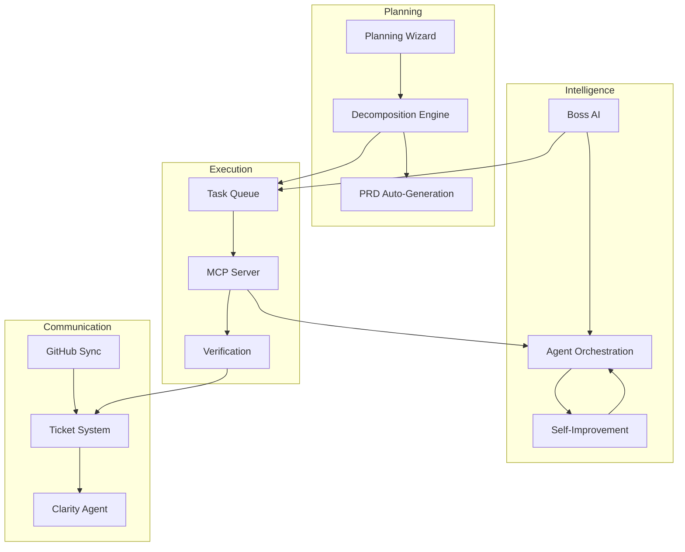

# Features & Capabilities

**Version**: 1.0  
**Date**: February 9, 2026

---

## Overview

COE includes 35 features across 7 categories. This document lists every capability the system provides, organized by what it does for the user.

---

## Category 1: Planning & Design (7 Features)

### Interactive Plan Builder
An adaptive wizard that guides users through project planning with dynamic question paths, live impact simulation, and intelligent task generation.

### Plan Decomposition Engine
Automatically breaks complex requirements into atomic, dependency-aware tasks (15–45 minutes each) with clear acceptance criteria.

### Adaptive Wizard Paths
Tailors the planning experience based on project scale and focus — MVP projects get 6 questions in 15 minutes; enterprise projects get the full flow.

### Real-Time Impact Simulator
Shows live estimates of task count, timeline, risks, and technology implications as the user answers planning questions.

### Plan Updating Process
Handles plan changes through a controlled pipeline: detect trigger → generate proposal → validate → apply → monitor results.

### Plan Drift Detection
Continuously compares the current codebase against the plan to detect when they've diverged, flagging drift before it becomes a problem.

### PRD Auto-Generation
Automatically generates and maintains a Product Requirements Document from plans, GitHub issues, and task definitions.

---

## Category 2: Task Management (8 Features)

### Task Queue with Dependencies
Priority-based task queue that respects dependency ordering — tasks are only released when their prerequisites are complete.

### Atomic Task Enforcement
Ensures every task meets the 5 atomicity criteria: single responsibility, atomic completion, 15–45 minute time box, verification closure, and token safety.

### Task Decomposition Agent
Automatically breaks down tasks estimated over 45 minutes into smaller subtasks while preserving parent-child relationships.

### Context Bundle Builder
Packages each task with all the context the coding AI needs: plan excerpts, related files, architecture docs, and dependency information.

### Verification Tracking
Tracks every task through verification states: not started → in progress → pending verification → verified/needs re-check/failed.

### Progress Dashboard
Real-time view of project progress with completion percentages, blocker counts, and timeline estimates.

### Checkpoint System
Automatic checkpoint commits every 5–10 completed tasks; tagged releases at each priority level completion.

### Fresh Restart
One-click state reset that reloads everything from disk, verifies consistency, and presents a clean starting point.

---

## Category 3: Agent Management (6 Features)

### Multi-Agent Orchestration
Routes work to specialized agents based on intent classification, with fallback strategies and timeout detection.

### Boss AI Supervisor
Top-level oversight agent that monitors system health, resolves inter-team conflicts, enforces plan alignment, and limits task overload.

### Custom Agent Builder
Visual interface for creating specialized read-only agents with goals, checklists, routing rules, and permission controls.

### Agent Gallery
Browse, manage, enable, and disable available agents (built-in and custom).

### Agent Evolution (UV Tasks)
System for agents to propose their own improvements through "Update & Validate" tasks, with human gates for critical changes.

### Agent Configuration Templates
YAML-based profiles for each agent defining prompts, limits, behaviors, and routing rules.

---

## Category 4: Execution & Monitoring (6 Features)

### MCP Server (6 Tools)
Communication bridge between COE and external coding agents, exposing `getNextTask`, `reportTaskDone`, `askQuestion`, `getErrors`, `callCOEAgent`, and `scanCodeBase`.

### Visual Verification Panel
Webview showing test results, coverage metrics, design system references, and manual approval controls.

### Automated Verification
Runs tests and compares results against acceptance criteria after a 60-second stability delay.

### Loop Detection & Recovery
Monitors AI calls for repetitive patterns (same errors, identical responses) and intervenes before resources are wasted.

### Execution Dashboard
Programming Orchestrator dashboard showing current task, queue status, agent activity, and system health.

### Audit Logging
Complete record of every decision, change, agent action, approval, and escalation for traceability.

---

## Category 5: Integration & Sync (4 Features)

### GitHub Issues Bi-Directional Sync
Syncs GitHub issues to local Markdown files and back, with batching, caching, and 99%+ accuracy.

### GitHub Copilot Integration
Managed connection to Copilot via MCP, with instructions/skills/agents management and token brakes.

### Copilot Workspace Integration
Orchestrates Copilot Workspace sessions with scoped instructions per task and token management.

### File Import & Sync
Watches for coding agent file changes, compares against plan acceptance criteria, and auto-creates follow-up tasks for gaps.

---

## Category 6: Collaboration (2 Features)

### Ticket System
Structured communication channel for all AI↔human interactions with priority handling, clarity enforcement, and thread-based discussions.

### Clarity Agent
Dedicated agent that scores every ticket reply for clarity (0–100) and requests follow-ups when answers are incomplete or ambiguous.

---

## Category 7: UX & Extensibility (2 Features)

### VS Code Extension UI
Full sidebar experience with Agents, Tickets, Tasks, and Conversations tabs, plus 43 registered commands.

### Settings Panel
7-tab configuration interface with secure credential storage and live preview of setting changes.

---

## Feature Priorities (What Gets Built First)

| Priority | Count | What |
|----------|-------|------|
| **P1 (Must Have)** | 12 | Ticket DB, orchestrator routing, sidebar UI, agent coordination, verification, MCP tools |
| **P2 (Should Have)** | 13 | Custom agents, GitHub sync, evolution system, context management, planning wizard |
| **P3 (Nice to Have)** | 10 | Advanced analytics, RL optimization, Copilot Workspace integration, Docker MCP toolkit |

---

## Core Feature Interactions

---

## Success Metrics

| Category | Metric | Target |
|----------|--------|--------|
| **Adoption** | User adoption rate | 80% within 3 months |
| **Adoption** | Visual verification usage | 90% of UI tasks |
| **Adoption** | Developer satisfaction | 4.0/5.0 average |
| **Performance** | Planning time reduction | 50% reduction |
| **Performance** | Agent autonomous success rate | 70% |
| **Performance** | Time to first task | <5 minutes |
| **Performance** | MCP tool response time | <200ms (p95) |
| **Performance** | Autonomous question resolution | 80% |
| **Quality** | First-time task completion rate | 85% |
| **Quality** | GitHub sync accuracy | 99% |
| **Quality** | Plan validation pass rate | 75% first submission |
| **Quality** | Test coverage improvement | +15% |

---

## Risk Management

| Risk | Severity | Mitigation |
|------|----------|------------|
| Scope creep | Medium | Strict change control, P1-first philosophy |
| UI complexity | Medium | Minimalist design, user testing |
| AI performance issues | Medium | Testing + fallback strategies |
| Context overflows | High | Layered breaking strategies + fresh start recovery |
| Database corruption | High | Optimistic locking, WAL mode, backup on restart |
| Security vulnerabilities | High | VS Code security model, input validation, secrets API |
| User adoption resistance | Medium | Tutorials, gradual rollout, polished UX |
| GitHub API rate limiting | Low | Batching, caching, offline fallback |
