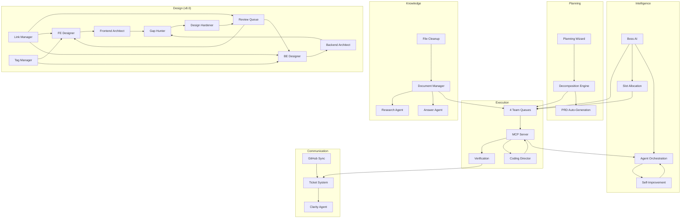

# 09 — Features & Capabilities

**Version**: 9.0
**Last Updated**: February 2026
**Status**: ✅ Current
**Depends On**: [02-System-Architecture-and-Design](02-System-Architecture-and-Design.md), [04-Workflows-and-How-It-Works](04-Workflows-and-How-It-Works.md)
**Changelog**: v9.0 — Added v9.0 Features section: 10-Level Agent Hierarchy (~230 niche agents, lazy spawning), Visual Workflow Designer (Mermaid-based, 9 step types, global templates), User Communication Orchestrator (Agent #18, message interception, profile-based routing), Question Escalation Chain (10-level bubble-up), Per-Agent Model Selection, Agent Permission System (8 permissions, tool access, LLM call limits), User Profile System (6 programming tiers, per-area action preferences), MCP Confirmation Stage, Niche Agent Browser, 7 new core services, 13 new DB tables, ~43 new API endpoints, 5 new UI panels, ~280 new tests | v8.0 — Added Category 13 (Back-End Design System), Category 14 (Link Tree & Tag System), Category 15 (Review Queue & Filing System), Backend Architect Agent #17, renamed Frontend Architect, updated agent count (17), 15 routing categories, updated test count (2,770+), v8.0 compliance section | v7.0 — Added Category 11 (Team Queue System), Category 12 (Documentation & File Management), Coding Director Agent, updated agent count (16), updated test count (2,770+), v7.0 compliance section | v3.0 — Standardized header, added User/Dev views, expanded feature descriptions, added dependency graph, added cross-references

---

## How to Read This Document

This is the complete feature catalog for COE — every capability the system provides, organized by category. Each feature has a description explaining what it does, a status indicator, and implementation notes. Use this document to understand what COE can do today and what's planned.

> **👤 User View**: This is your feature reference guide. Green checkmarks (✅) mean the feature is ready to use. Wrench icons (🔧) mean it's partially working. Clipboard icons (📋) mean it's planned but not yet built. You don't need to read every feature — scan the categories that interest you.

> **🔧 Developer View**: Each feature maps to specific source files and services. The status notes include file paths and API endpoints for quick navigation. The Implementation Audit Summary at the bottom provides a compliance snapshot — use it to identify gaps and plan next work.

---

## Overview

COE includes 80+ features across 15 categories. This document lists every capability the system provides, organized by what it does for the user.

**Status Legend**: ✅ Implemented | 🔧 In Progress | 📋 Planned

---

## Category 1: Planning & Design (7 Features)

### Interactive Plan Builder ✅
An adaptive wizard that guides users through project planning with dynamic question paths, live impact simulation, and intelligent task generation.
**Status**: Implemented in webapp Planning page + `POST /api/plans/generate`. 5-step wizard with scale/focus/priority selection.

### Plan Decomposition Engine ✅
Automatically breaks complex requirements into atomic, dependency-aware tasks (15–45 minutes each) with clear acceptance criteria.
**Status**: Implemented in `src/core/task-decomposition-engine.ts` (6 deterministic rules) + Planning Agent LLM fallback. Max 3 levels.

### Adaptive Wizard Paths 🔧
Tailors the planning experience based on project scale and focus — MVP projects get 6 questions in 15 minutes; enterprise projects get the full flow.
**Status**: Partially implemented. Wizard collects scale/focus/priorities but sends all to LLM in one prompt. UI-level branching (different question counts per scale) not yet implemented.

### Real-Time Impact Simulator 📋
Shows live estimates of task count, timeline, risks, and technology implications as the user answers planning questions.
**Status**: Not yet implemented. Frontend-only feature — no API changes needed. Requires client-side estimation logic.

### Plan Updating Process ✅
Handles plan changes through a controlled pipeline: detect trigger → generate proposal → validate → apply → monitor results.
**Status**: Implemented via `PUT /api/plans/:id`, task reordering, and evolution service monitoring.

### Plan Drift Detection 🔧
Continuously compares the current codebase against the plan to detect when they've diverged, flagging drift before it becomes a problem.
**Status**: Partially implemented. `scanCodeBase` MCP tool exists (on-demand). No scheduled/continuous scans. Boss Agent now detects drift via failed/recheck task ratio.

### PRD Auto-Generation 📋
Automatically generates and maintains a Product Requirements Document from plans, GitHub issues, and task definitions.
**Status**: Not yet implemented. Planned as post-MVP feature.

---

## Category 2: Task Management (8 Features)

### Task Queue with Dependencies ✅
Priority-based task queue that respects dependency ordering — tasks are only released when their prerequisites are complete.
**Status**: Implemented in `database.getReadyTasks()` + MCP `getNextTask`. Full CRUD via webapp API.

### Atomic Task Enforcement ✅
Ensures every task meets the 5 atomicity criteria: single responsibility, atomic completion, 15–45 minute time box, verification closure, and token safety.
**Status**: Enforced by Planning Agent prompt + TaskDecompositionEngine auto-decompose for >45 min tasks.

### Task Decomposition Agent ✅
Automatically breaks down tasks estimated over 45 minutes into smaller subtasks while preserving parent-child relationships.
**Status**: Implemented in `src/core/task-decomposition-engine.ts` with 6 rules + Planning Agent LLM fallback. Max 3 levels.

### Context Bundle Builder ✅
Packages each task with all the context the coding AI needs: plan excerpts, related files, architecture docs, and dependency information.
**Status**: Implemented in MCP `getNextTask` tool + `ContextFeeder` service.

### Verification Tracking ✅
Tracks every task through verification states: not started → in progress → pending verification → verified/needs re-check/failed.
**Status**: Full state machine in database + Verification Agent + webapp API approval/rejection endpoints.

### Progress Dashboard ✅
Real-time view of project progress with completion percentages, blocker counts, and timeline estimates.
**Status**: Implemented in webapp Dashboard page + `GET /api/dashboard`. Shows progress bars, task counts, agent status.

### Checkpoint System 📋
Automatic checkpoint commits every 5–10 completed tasks; tagged releases at each priority level completion.
**Status**: Not yet implemented. Requires git integration for auto-commits.

### Fresh Restart 📋
One-click state reset that reloads everything from disk, verifies consistency, and presents a clean starting point.
**Status**: Not yet implemented. Planned for System page in webapp.

---

## Category 3: Agent Management (6 Features)

### Multi-Agent Orchestration ✅
Routes work to 17 specialized agents based on intent classification, with fallback strategies and timeout detection.
**Status**: Implemented in `src/agents/orchestrator.ts`. Two-stage classification (keyword + LLM), 15 routing categories, error boundaries, verification retry. v7.0: Added Coding Director agent, 4-team queue routing. v8.0: Added Backend Architect agent (#17), `backend_architect` routing category.

### Boss AI Supervisor ✅
Top-level oversight agent that monitors system health, manages 4 team queues, resolves inter-team conflicts, enforces plan alignment, dynamically allocates processing slots, and reviews cancelled tickets for re-engagement.
**Status**: Implemented in `src/agents/boss-agent.ts`. All 7 thresholds active + v7.0: per-queue management, slot allocation, cancelled ticket review, notepad sections, team-aware dispatching.

### Custom Agent Builder ✅
Visual interface for creating specialized read-only agents with goals, checklists, routing rules, and permission controls.
**Status**: Implemented in `src/agents/custom-agent.ts` with YAML parsing, hardlock enforcement, safety limits (20 goals, 50 LLM calls, 30 min max), loop detection.

### Agent Gallery ✅
Browse, manage, enable, and disable available agents (built-in and custom).
**Status**: Implemented in webapp Agents page. Shows all agents with status badges.

### Agent Evolution (UV Tasks) ✅
System for agents to propose their own improvements through "Update & Validate" tasks, with human gates for critical changes.
**Status**: Implemented in `src/core/evolution-service.ts`. Pattern detection, auto-apply for non-P1, 48h monitoring, rollback.

### Agent Configuration Templates ✅
YAML-based profiles for each agent defining prompts, limits, behaviors, and routing rules.
**Status**: Implemented in Custom Agent YAML parser with full validation.

---

## Category 4: Execution & Monitoring (6 Features)

### MCP Server (6 Tools) ✅
Communication bridge between COE and external coding agents, exposing `getNextTask`, `reportTaskDone`, `askQuestion`, `getErrors`, `callCOEAgent`, and `scanCodeBase`.
**Status**: All 6 tools implemented in `src/mcp/server.ts`. HTTP + JSON-RPC 2.0 + SSE. Port 3030 with auto-increment.

### Visual Verification Panel 🔧
Webview showing test results, coverage metrics, design system references, and manual approval controls.
**Status**: API endpoints implemented (`POST /api/verification/:id/approve|reject`). Dedicated VS Code webview panel not yet built.

### Automated Verification ✅
Runs tests and compares results against acceptance criteria after a 60-second stability delay.
**Status**: Implemented in Verification Agent + Orchestrator `runVerificationWithRetry()`. Real test execution via TestRunnerService.

### Loop Detection & Recovery 🔧
Monitors AI calls for repetitive patterns (same errors, identical responses) and intervenes before resources are wasted.
**Status**: Partially implemented. Custom Agent has loop detection (3 similar = halt). LLMService has serial queue (max 5). Orchestrator-level loop detection across agents not yet implemented.

### Execution Dashboard ✅
Programming Orchestrator dashboard showing current task, queue status, agent activity, and system health.
**Status**: Implemented in webapp Dashboard page with real-time stats, progress bars, agent status, recent audit.

### Audit Logging ✅
Complete record of every decision, change, agent action, approval, and escalation for traceability.
**Status**: Implemented throughout all agents and API endpoints. TransparencyLogger provides append-only logging with JSON/CSV export.

---

## Category 5: Integration & Sync (4 Features)

### GitHub Issues Bi-Directional Sync ✅
Syncs GitHub issues to local Markdown files and back, with batching, caching, and 99%+ accuracy.
**Status**: Implemented in `src/core/github-sync.ts` + `src/core/github-client.ts`. Rate limiting, Markdown conversion, webapp GitHub page.

### GitHub Copilot Integration 🔧
Managed connection to Copilot via MCP, with instructions/skills/agents management and token brakes.
**Status**: MCP server operational. Copilot connects via MCP tools. Instructions/skills management not yet built.

### Copilot Workspace Integration 📋
Orchestrates Copilot Workspace sessions with scoped instructions per task and token management.
**Status**: P3 feature. Not yet implemented.

### File Import & Sync 🔧
Watches for coding agent file changes, compares against plan acceptance criteria, and auto-creates follow-up tasks for gaps.
**Status**: File watcher infrastructure exists. Comparison against acceptance criteria handled by Verification Agent on `reportTaskDone`.

---

## Category 6: Collaboration (2 Features)

### Ticket System ✅
Structured communication channel for all AI↔human interactions with priority handling, clarity enforcement, and thread-based discussions.
**Status**: Implemented in database + webapp Tickets page. Full CRUD, threaded replies, clarity scoring, priority badges.

### Clarity Agent ✅
Dedicated agent that scores every ticket reply for clarity (0–100) and requests follow-ups when answers are incomplete or ambiguous.
**Status**: Implemented in `src/agents/clarity-agent.ts`. Scores 0-100, max 5 rounds, auto-escalates. Thresholds: 85+=clear, 70-84=mostly clear, <70=unclear.

---

## Category 7: UX & Extensibility (2 Features)

### VS Code Extension UI ✅
Full sidebar experience with Agents, Tickets, Tasks, and Conversations tabs, plus 55+ registered commands.
**Status**: Implemented. VS Code sidebar views + webapp with 10 pages (Dashboard, Tasks, Tickets, Planning, Agents, Designer, Coding, Settings, GitHub, System).

### Settings Panel ✅
8-tab configuration interface with secure credential storage and live preview of setting changes.
**Status**: Implemented in webapp Settings page. 8 tabs: LLM, Agents, Tasks, Verification, GitHub, Designer, Appearance, Advanced.

---

## Category 8: Context Management (4 Features) — v1.1 ✅

### Token Budget Management ✅
Model-aware token budget tracking with configurable warning (70%) and critical (90%) thresholds, per-model profiles, and real-time utilization reporting.

### Intelligent Context Feeding ✅
Priority-based context window composition that selects the most relevant items (task details, plan excerpts, code snippets) within the available token budget.

### Context Breaking Chain ✅
Multi-strategy context overflow recovery: summarize long contexts, trim low-priority items, compress repeated patterns. Prevents token limit crashes.

### Deterministic Task Decomposition ✅
Pattern-based task splitting engine that decomposes tasks without LLM calls. Falls back to LLM only for unrecognized patterns.

---

## Category 9: Ethics & Transparency (3 Features) — v2.0 ✅

### FreedomGuard_AI Ethics Engine ✅
6 freedom modules (Privacy, Speech, Self-Protection, Data Sovereignty, Transparency, Consent) with 4 sensitivity levels. Absolute blocks that cannot be overridden: no backdoors, spyware, unauthorized data collection, system file deletion, or data exfiltration. Every check is audited.

### Transparency Logger ✅
Append-only action logging for all service operations. Every action by every service is recorded with source, category, severity, correlation IDs, and entity references. Export to JSON/CSV. Sync-aware with device attribution.

### Ethics Override Audit Trail ✅
When authorized users override an ethics block, the justification is permanently recorded with who, when, why, and what was overridden.

---

## Category 10: Multi-Device Sync & Visual Design (5 Features) — v2.0 ✅

### Multi-Device Sync Service ✅
Pluggable sync backends (Cloud REST, NAS file-based, P2P direct) with vector clocks for causal ordering, advisory locking with 5-minute stale detection, and exponential backoff retry.

### Conflict Resolution Engine ✅
SHA-256 hash-based conflict detection with field-level auto-merge for non-overlapping changes. 5 resolution strategies: KeepLocal, KeepRemote, Merge, LastWriteWins, UserChoice.

### Component Schema Library ✅
37 default component schemas across 5 categories (Primitive Inputs, Containers, Interactive Logic, Data & Sync, Ethics & Rights) with code templates for React TSX, HTML, and CSS.

### Integrated Coding Agent ✅
NL command processing with 2-stage intent classification (keyword scoring + LLM fallback), 6 intent handlers (build, modify, explain, fix, automate, query), code generation from component schemas, and diff approval flow.

### Device Registration & Management ✅
Register/unregister devices, track device presence, sync-enabled flags, and per-device vector clock counters for distributed ordering.

---

## Category 11: Team Queue System (6 Features) — v7.0 ✅

### 4-Team Queue Architecture ✅
Replaces single processing queue with 4 team-specific queues: Orchestrator (catch-all), Planning, Verification, and Coding Director. Each queue has independent depth, slot allocation, and processing.
**Status**: Implemented in `src/core/ticket-processor.ts`. `routeToTeamQueue()` maps operation_type to team. `assigned_queue` column on tickets table.

### Round-Robin Slot Balancing ✅
Boss AI dynamically allocates processing slots across teams based on workload. Least-recently-served team with pending work gets the next slot. Empty queues are skipped.
**Status**: Implemented in `fillSlots()` with `roundRobinIndex` and `TEAM_ORDER`. `updateSlotAllocation()` allows Boss to reallocate slots dynamically.

### Lead Agent Escalation ✅
Lead agents can escalate tickets back to Boss AI with structured payloads including reason, recommended target queue, and blocking info. Boss AI resolves escalations by re-routing, gathering missing info, or escalating to user.
**Status**: Implemented via `escalate_to_boss` action type + `handleEscalation()` in ticket processor. `EscalationPayload` interface.

### Support Agent Calls (Sync/Async) ✅
Lead agents can call support agents inline (sync, <60s) for quick lookups or create sub-tickets (async) for longer research tasks. Sync calls block the current ticket; async creates a linked sub-ticket.
**Status**: Implemented via `call_support_agent` action type + `executeSupportCall()`. Sync timeout enforced by `maxSupportAgentSyncTimeoutMs`.

### Ticket Cancel & Re-engagement ✅
Boss AI can cancel tickets (removed from queue, marked cancelled in DB) and periodically reviews cancelled tickets to re-engage if conditions have changed.
**Status**: Implemented via `cancelTicket()` and `reengageTicket()` methods. Boss reviews cancelled tickets every `cancelledTicketReviewIntervalMs` (default: 30 min).

### Structured Task Assignment ✅
Boss AI creates structured task assignments with explicit success criteria, target agents, and evaluation methods. Criteria are evaluated deterministically after agent completion.
**Status**: Implemented via `assign_task` action type + `task_assignments` table + `evaluateAssignmentCriteria()`. 5 verification methods: output_contains, ticket_resolved, file_exists, info_gathered, manual_check.

---

## Category 12: Documentation & File Management (4 Features) — v7.0 ✅

### Support Document System ✅
Organized knowledge base where Research Agent saves findings, Answer Agent searches before calling LLM, and agents inject relevant docs into pipeline context.
**Status**: Implemented in `src/core/document-manager.ts`. `support_documents` table with folder/category/tag organization. CRUD API endpoints at `/api/documents`.

### Agent File Cleanup ✅
Detects stray `.md`/`.txt` files created by external coding agents in workspace root, saves content to documentation system, creates Boss review tickets, and optionally cleans up originals.
**Status**: Implemented in `src/core/agent-file-cleanup.ts`. FileSystemWatcher with 5s debounce. 4 detection patterns. Boss review required before cleanup.

### Coding Director Agent ✅
Manages the interface between internal orchestration and external coding agent (MCP). Performs pre-flight checks on coding tasks, builds comprehensive context bundles, and processes completion reports.
**Status**: Implemented in `src/agents/coding-director-agent.ts`. `prepareForExternalAgent()`, `processExternalResult()`, `getQueueStatus()`. Webapp Coding tab shows status via `GET /api/coding/status`.

### Pipeline Context Injection ✅
Relevant support documents are automatically injected into agent context during ticket processing. Documents are keyword-matched, ranked by relevance and verification status, and formatted as a delimited section in the agent's message.
**Status**: Implemented in `TicketProcessorService.processTicketPipeline()` via `DocumentManagerService.gatherContextDocs()`. Max 5 docs per pipeline run.

---

## Category 13: Back-End Design System (6 Features) — v8.0 ✅

### Backend Element Canvas ✅
Visual canvas for designing back-end architecture with 9 element types: API routes, DB tables, services, controllers, middleware, auth layers, background jobs, caching strategies, and queue definitions.
**Status**: Implemented in webapp BE Designer panel. Card blocks with type icons, expandable details, drag-to-reposition, SVG arrow overlay for connections. 3-column layout (layer sidebar, canvas, element editor).

### Backend Architect Agent ✅
Agent #17 — Reviews BE architecture quality across 8 scoring categories (API RESTfulness, DB normalization, service separation, auth/security, error handling, caching, scalability, documentation) with 3 operating modes.
**Status**: Implemented in `src/agents/backend-architect-agent.ts`. `AgentType.BackendArchitect`, routed via `backend_architect` intent category. Modes: auto_generate, scaffold, suggest.

### Backend QA Pipeline ✅
Three-phase BE quality assurance: Backend Architect scoring → Gap Hunter BE checks → Design Hardener BE draft creation. Mirrors the FE Design QA pipeline.
**Status**: Implemented across `backend-architect-agent.ts`, `gap-hunter-agent.ts` (5 new BE checks #16-#20), `design-hardener-agent.ts` (new `hardenBackendDesign()` method). API endpoints: `POST /api/backend/architect-review`, `/api/backend/gap-analysis`, `/api/backend/harden`, `/api/backend/full-qa`.

### Backend Element CRUD ✅
Full create/read/update/delete operations for all 9 BE element types, with filtering by plan, layer, and domain.
**Status**: Implemented in `database.ts` (backend_elements table) + API endpoints: `GET/POST/PUT/DELETE /api/backend/elements`.

### Backend Draft Management ✅
Backend draft elements (created by Hardener or Backend Architect) appear with dashed outlines on the BE canvas and in the unified Review Queue. Approve/reject from either location.
**Status**: Implemented. `is_draft=1` elements rendered with dashed borders. Approval via `POST /api/backend/drafts/:id/approve` or Review Queue.

### Frontend Architect Rename ✅
Design Architect Agent renamed to Frontend Architect Agent for clarity alongside the new Backend Architect. Enum value unchanged for backward compatibility.
**Status**: Class renamed from `DesignArchitectAgent` to `FrontendArchitectAgent` in `design-architect-agent.ts`. Display name: `'Frontend Architect'`. Deprecated alias `getDesignArchitectAgent()` in orchestrator.

---

## Category 14: Link Tree & Tag System (5 Features) — v8.0 ✅

### Element Link System ✅
Cross-element relationship tracking with 4 link types (FE↔FE, BE↔BE, FE→BE, BE→FE), 2 granularity levels (high-level, component-level), and 3 creation sources (manual, auto-detected, AI-suggested).
**Status**: Implemented in `src/core/link-manager.ts` + `element_links` table. API endpoints: `GET/POST/DELETE /api/links`, `POST /api/links/auto-detect`, `POST /api/links/:id/approve|reject`.

### Link Matrix View ✅
Grid visualization of all element relationships. Colored dots at intersections indicate link types (blue=FE↔FE, green=BE↔BE, orange=FE→BE, purple=BE→FE). Click dots to view/edit link details.
**Status**: Implemented in webapp Link Tree panel (matrix toggle). API: `GET /api/links/matrix`.

### Link Tree View ✅
Expandable hierarchy organized by link type categories, with source elements and their connections as navigable children. Click to navigate to the element in the relevant designer.
**Status**: Implemented in webapp Link Tree panel (tree toggle). API: `GET /api/links/tree`.

### Tag Definition System ✅
5 built-in tags (setting/blue, automatic/purple, hardcoded/red, env-variable/yellow, feature-flag/orange) plus user-created custom tags with custom colors. Tags can be assigned to any element type.
**Status**: Implemented in `src/core/tag-manager.ts` + `tag_definitions` + `element_tags` tables. API endpoints: `GET/POST/DELETE /api/tags`, `POST/DELETE /api/tags/assign`, `POST /api/tags/seed`. Built-in tags seeded on startup.

### Auto-Detect & AI Link Suggestions ✅
Automatic link detection from DataModel relationships, component bindings, and API route middleware. AI suggestions from Backend Architect appear as review queue items for user approval.
**Status**: Implemented via `LinkManagerService.autoDetectLinks()` + `BackendArchitectAgent.suggestConnections()`. Auto-detected links added to review queue with confidence scores.

---

## Category 15: Review Queue & Filing System (5 Features) — v8.0 ✅

### Unified Review Queue ✅
Single queue for all pending review items: FE drafts, BE drafts, link suggestions, and tag suggestions. Filter by item type, approve/reject individually or in batch.
**Status**: Implemented in `src/core/review-queue-manager.ts` + `review_queue` table. Webapp Review Queue panel with filter buttons, item cards, batch operations. API endpoints: `GET /api/review-queue`, `POST /api/review-queue/:id/approve|reject`, `POST /api/review-queue/approve-all|reject-all`.

### Review Queue Nav Badge ✅
Pending review count displayed as a badge in the main navigation bar. Polls every 10 seconds for updates.
**Status**: Implemented in webapp nav bar. API: `GET /api/review-queue/count`. CSS pulsing badge for P1 items.

### Filing System (Support Documents UI) ✅
Panel within Planning & Design tab for browsing, creating, and managing support documents. Color-coded by source: bright green (#4CAF50) = user-added, gray (#9E9E9E) = system-added.
**Status**: Implemented in webapp Filing panel. Folder browser, document list, color badges, lock icons, search bar. User docs created via "+" button with `source_type='user'`.

### Document Source Locking ✅
Full separation between user and system documents. User-created docs (green) can only be edited/deleted by users; system-created docs (gray) can only be edited/deleted by the system. Lock icon shown on all documents.
**Status**: Implemented in `DocumentManagerService` with `source_type` and `is_locked` fields. `isEditableBy()` enforces access control. Database migration adds columns to `support_documents` table.

### FE Designer Review Integration ✅
Existing FE draft system upgraded to use the unified Review Queue. When Design Hardener creates FE drafts, review_queue entries are also created. Approve/reject from either the canvas or the Review Queue.
**Status**: Implemented. Hardener creates `review_queue` entries with `item_type='fe_draft'` alongside draft components. Both approval paths call the same underlying API.

---

## Feature Priorities (What Gets Built First)

| Priority | Count | What |
|----------|-------|------|
| **P1 (Must Have)** | 12 | Ticket DB, orchestrator routing, sidebar UI, agent coordination, verification, MCP tools |
| **P2 (Should Have)** | 13 | Custom agents, GitHub sync, evolution system, context management, planning wizard |
| **P2+ (v2.0)** | 12 | Ethics engine, transparency logger, sync service, conflict resolver, coding agent, component schemas |
| **P2+ (v7.0)** | 10 | Team queues, round-robin balancing, lead agent escalation, support agent calls, document system, file cleanup, Coding Director, context injection, cancel/re-engage, structured assignments |
| **P2+ (v8.0)** | 16 | BE designer canvas, Backend Architect agent, BE QA pipeline, BE element CRUD, BE draft management, FE Architect rename, link system, link matrix, link tree, tag system, auto-detect links, unified review queue, nav badge, filing system, doc locking, FE review integration |
| **P3 (Nice to Have)** | 10 | Advanced analytics, RL optimization, Copilot Workspace integration, Docker MCP toolkit |

---

## Core Feature Interactions

---

## Success Metrics

| Category | Metric | Target |
|----------|--------|--------|
| **Adoption** | User adoption rate | 80% within 3 months |
| **Adoption** | Visual verification usage | 90% of UI tasks |
| **Adoption** | Developer satisfaction | 4.0/5.0 average |
| **Performance** | Planning time reduction | 50% reduction |
| **Performance** | Agent autonomous success rate | 70% |
| **Performance** | Time to first task | <5 minutes |
| **Performance** | MCP tool response time | <200ms (p95) |
| **Performance** | Autonomous question resolution | 80% |
| **Quality** | First-time task completion rate | 85% |
| **Quality** | GitHub sync accuracy | 99% |
| **Quality** | Plan validation pass rate | 75% first submission |
| **Quality** | Test coverage improvement | +15% |

---

## Risk Management

| Risk | Severity | Mitigation |
|------|----------|------------|
| Scope creep | Medium | Strict change control, P1-first philosophy |
| UI complexity | Medium | Minimalist design, user testing |
| AI performance issues | Medium | Testing + fallback strategies |
| Context overflows | High | Layered breaking strategies + fresh start recovery |
| Database corruption | High | Optimistic locking, WAL mode, backup on restart |
| Security vulnerabilities | High | VS Code security model, input validation, secrets API |
| User adoption resistance | Medium | Tutorials, gradual rollout, polished UX |
| GitHub API rate limiting | Low | Batching, caching, offline fallback |

---

## Implementation Audit Summary (February 13, 2026)

**Audit Scope**: Full comparison of plan intent vs actual code behavior across all agents, services, MCP tools, and webapp.

### Overall Status

| Category | Total | Implemented | In Progress | Planned | Coverage |
|----------|-------|------------|-------------|---------|----------|
| Planning & Design | 7 | 3 | 2 | 2 | 43% |
| Task Management | 8 | 6 | 0 | 2 | 75% |
| Agent Management | 6 | 6 | 0 | 0 | 100% |
| Execution & Monitoring | 6 | 4 | 2 | 0 | 67% |
| Integration & Sync | 4 | 1 | 2 | 1 | 25% |
| Collaboration | 2 | 2 | 0 | 0 | 100% |
| UX & Extensibility | 2 | 2 | 0 | 0 | 100% |
| Context Management (v1.1) | 4 | 4 | 0 | 0 | 100% |
| Ethics & Transparency (v2.0) | 3 | 3 | 0 | 0 | 100% |
| Multi-Device Sync (v2.0) | 5 | 5 | 0 | 0 | 100% |
| Team Queue System (v7.0) | 6 | 6 | 0 | 0 | 100% |
| Documentation & File Mgmt (v7.0) | 4 | 4 | 0 | 0 | 100% |
| Back-End Design System (v8.0) | 6 | 6 | 0 | 0 | 100% |
| Link Tree & Tag System (v8.0) | 5 | 5 | 0 | 0 | 100% |
| Review Queue & Filing (v8.0) | 5 | 5 | 0 | 0 | 100% |
| **TOTAL** | **79** | **68** | **6** | **5** | **86%** |

### Agent Compliance (Plan Intent vs Actual)

| Agent | Compliance | Notes |
|-------|-----------|-------|
| Orchestrator | 95% | Core routing solid, 15 categories, 17 agents. v8.0: `backend_architect` routing. Missing: orchestrator-level loop detection |
| Planning Agent | 100% | Fully matches plan spec. v7.0: escalation + support agent calls |
| Answer Agent | 100% | Fully matches plan spec. v7.0: support document search before LLM |
| Verification Agent | 100% | Fully matches plan spec. v7.0: escalation + support agent calls |
| Research Agent | 100% | Fixed: ESCALATE parsing + auto-escalation. v7.0: save_document actions |
| Clarity Agent | 100% | Fully matches plan spec |
| Boss Agent | 100% | v7.0: 4-queue management, slot allocation, cancel/re-engage, notepad |
| Custom Agent | 100% | Fully matches plan spec including hardlocks |
| CodingAgentService | 100% | All 6 intents, ethics gate, code gen, diffs |
| Review Agent | 100% | Deterministic complexity + LLM scoring, auto-approval matrix |
| Coding Director | 100% | v7.0: Pre-flight, context packaging, result processing, queue status |
| Frontend Architect | 100% | v8.0: Renamed from Design Architect. 6-category FE scoring. Backward-compatible enum value |
| Backend Architect | 100% | v8.0: Agent #17. 8-category BE scoring, 3 modes (auto_generate, scaffold, suggest) |
| Gap Hunter (v8.0) | 100% | v8.0: Extended with 5 BE checks (#16-#20). `analyzeBackendGaps()` + `analyzeAllGaps()` |
| Design Hardener (v8.0) | 100% | v8.0: Extended with `hardenBackendDesign()`. Creates BE drafts + review queue entries |

### v2.0 Service Compliance

| Service | Compliance | Notes |
|---------|-----------|-------|
| EthicsEngine | 100% | 6 modules, 4 levels, absolute blocks, override audit |
| TransparencyLogger | 100% | Append-only, 7 categories, JSON/CSV export |
| SyncService | 100% | 3 backends, vector clocks, advisory locks |
| ConflictResolver | 100% | SHA-256, field-level merge, 5 strategies |
| ComponentSchemaService | 100% | 37 schemas, 5 categories, code templates |

### Test Coverage

- **Test suites**: 40
- **Total tests**: 1,520+
- **Coverage target**: 100% (enforced in jest.config.js)

### v3.0 Features (February 14, 2026)

#### Design Quality Pipeline ✅
- **Frontend Architect Agent** (renamed from Design Architect in v8.0) — Reviews FE design structure, scores 0-100 across 6 categories
- **Gap Hunter Agent** — 15 deterministic checks + LLM analysis for nuanced gaps
- **Design Hardener Agent** — Creates draft component proposals for human review
- **Design QA Panel** — Shows scores, gaps, drafts with Approve All/Reject All buttons
- **Draft Component Rendering** — Dashed outlines on canvas, draggable, approve/reject

#### Ticket System Overhaul ✅
- **Ticket Auto-Processing** — TicketProcessorService with dual queues (main + boss)
- **Agent Routing** — Maps operation_type + title patterns to correct agent
- **Verification System** — Dual-mode: clarity score for communication, deliverable check for work
- **Tiered Retry** — Auto-retry 3x → Boss severity classification → user escalation
- **Ghost Ticket System** — P1 tickets auto-created when tasks are blocked. 3-strike dismiss rule.
- **Cancel Button** — Cancel (not Resolve) for auto-created tickets
- **Agent Display** — Assigned agent badge, stage badge, acceptance criteria, verification result in ticket detail
- **Active Ticket SSE Feedback** — Real-time status banners (Processing, Verifying, Retrying)
- **Ticket Limits** — Max 10 active. P1 bumps P3 when at limit.
- **Review Agent** — Smart auto-review for completed tickets. Deterministic complexity classification + LLM scoring. Auto-approves simple/moderate, flags complex for user.
- **Peek-then-Remove Queue** — Prevents ticket orphaning on agent errors. Queue entries only removed after success.
- **Error Recovery** — 3 error retries per ticket, then Ghost Ticket escalation. Startup recovery for orphaned tickets.
- **Idle Watchdog Recovery** — Stuck tickets with `processing_status: 'processing'` are auto-recovered.
- **Progress Dashboard** — Live processing status on Planning page with progress bar, current ticket, queue depth, elapsed timer.
- **SSE Named Events** — Proper `/events` endpoint with named `event:` lines for `addEventListener` compatibility.

#### User Communication Queue ✅
- **Question Popup** — Focused 1-question-at-a-time popup (replaces free-form chat)
- **Navigation Buttons** — Navigate to relevant page/area from question
- **Previous Decision Context** — Shows past answers when similar question detected
- **Conflict Detection** — Warns when new answer conflicts with existing decision
- **Queue Badge** — P1 questions pulse red

#### Decision Memory ✅
- **Decision Tracking** — `user_decisions` table stores every user answer
- **Auto-Answer** — Repeat questions auto-answered from history
- **Conflict Detection** — Contradictory answers flagged with impact panel
- **Stale Filtering** — Outdated questions auto-dismissed when design regenerated
- **13 Categories** — authentication, database, styling, ui_ux, api_design, etc.

#### Lifecycle Orchestration ✅
- **8-Phase Model** — Planning → Designing → DesignReview → TaskGeneration → Coding → Verification → Complete (with DesignUpdate loop)
- **Phase Gates** — Explicit criteria per phase, no manual override
- **Phase Progress UI** — Grouped by 3 stages, current phase highlighted
- **Design Approval** — "Approve Design" button creates frozen version snapshot
- **Version-Aware Coding** — Impact analysis when features branch merges
- **Layered Task Generation** — Scaffold tasks first, then feature tasks

#### Boss AI Enhancements ✅
- **Event-Driven Activation** — Triggers on ticket resolved, task completed, agent error, phase transition
- **Idle Watchdog** — Configurable timeout (default 5 min) triggers health check
- **Separate Boss Queue** — Boss tickets process independently of main queue
- **Nav Indicator** — Boss AI status chip in webapp navigation

#### Settings Page ✅
- **Configurable Thresholds** — QA score, ticket limits, retry counts, clarification rounds, Boss timeouts, clarity scores
- **LLM Connection** — Endpoint, model, test connection
- **AI Level** — Manual, Suggestions, Smart, Hybrid

#### MCP Integration ✅
- **Ticket Processor Drives Task Queue** — `getNextTask` uses TicketProcessorService
- **Tool Recommendations** — `reportTaskDone` and `askQuestion` include `next_recommended_tool`

#### Planning State Persistence ✅
- **SSE Auto-Reload** — Real-time updates via Server-Sent Events
- **State Restoration** — Full state restored on page load/reboot from SQLite
- **Guided Tour** — Welcome tour for first-time users when no plans exist

#### JSON Repair ✅
- **Progressive Repair** — 7-step `repairJson()` function fixes malformed LLM JSON output
- **3-Tier Parsing** — Fast parse → repair → retry LLM with simplified prompt

### v3.0 Service Compliance

| Service | Compliance | Notes |
|---------|-----------|-------|
| TicketProcessorService | 100% | Dual queues, routing, verification, retry, ghost tickets, idle watchdog |
| FrontendArchitectAgent | 100% | 6-category FE scoring, configurable threshold. v8.0: Renamed from DesignArchitectAgent |
| GapHunterAgent | 100% | 15 FE deterministic + 5 BE deterministic (v8.0) + LLM, hybrid approach |
| DesignHardenerAgent | 100% | Draft components, human-in-the-loop |
| DecisionMemoryAgent | 100% | Keyword fast path + LLM, 13 categories, conflict detection |
| Phase Management | 100% | 8 phases, gate checks, design approval |

### Updated Test Coverage

- **Test suites**: 52+
- **Total tests**: 2,500+
- **Coverage target**: 100% (enforced in jest.config.js)

### v7.0 Features (February 2026)

#### Team Queue System ✅
- **4-Team Queue Architecture** — Orchestrator, Planning, Verification, Coding Director queues with independent depth and slot allocation
- **Round-Robin Slot Balancing** — Boss AI dynamically allocates slots; least-recently-served team with work gets next slot
- **Lead Agent Escalation** — Structured `EscalationPayload` with reason, recommended target, blocking info
- **Support Agent Calls** — Sync mode (<60s inline) and async mode (sub-ticket with `blocking_ticket_id`)
- **Ticket Cancel & Re-engagement** — Boss cancels tickets, periodically reviews for re-engagement (every 30 min)
- **Structured Task Assignment** — `assign_task` action with 5 verification methods (output_contains, ticket_resolved, file_exists, info_gathered, manual_check)

#### Documentation & File Management ✅
- **Support Document System** — `support_documents` table with folder/category/tag organization, CRUD API
- **Agent File Cleanup** — FileSystemWatcher detects stray `.md`/`.txt` files, saves to docs, creates Boss review tickets
- **Pipeline Context Injection** — Relevant support docs auto-injected into agent context (max 5, keyword-matched, ranked)
- **Answer Agent Doc Search** — Searches support documents BEFORE calling LLM; may answer without LLM call

#### Coding Director Agent ✅
- **Pre-flight Checks** — Validates acceptance criteria, description length, blocking ticket status before coding tasks
- **Context Packaging** — Builds comprehensive context bundle (task, plan, support docs, retry history)
- **Result Processing** — Parses completion reports, validates files_modified, routes to verification
- **Queue Status** — `GET /api/coding/status` for webapp Coding tab (NOT READY / Active / Pending)

#### Boss AI v7.0 Enhancements ✅
- **Per-Queue Management** — Full status visibility across all 4 team queues
- **Slot Allocation** — Dynamic slot reallocation via `update_slot_allocation` action
- **Cancelled Ticket Review** — Periodic check of cancelled tickets for re-engagement
- **Notepad Sections** — Persistent `boss_notepad` table (queue_strategy, blockers, patterns, next_actions)
- **Team-Aware Dispatching** — Can target specific team queues in dispatch actions

#### Ticket System Enhancements ✅
- **Team Queue Badges** — Colored team badges on ticket display (ORCH gray, PLAN blue, VERIFY green, CODE orange)
- **Queue Filtering** — Dropdown filter on Tickets tab to filter by team queue
- **Queue Move** — `POST /api/queues/move` endpoint for manual ticket queue reassignment

### v7.0 Service Compliance

| Service | Compliance | Notes |
|---------|-----------|-------|
| TicketProcessorService (v7.0) | 100% | 4 team queues, round-robin, escalation, support calls |
| DocumentManagerService | 100% | Save/search/gather/verify/delete, folder organization |
| AgentFileCleanupService | 100% | Detection patterns, debounce, Boss review, cleanup |
| CodingDirectorAgent | 100% | Pre-flight, context packaging, result processing |
| BossAgent (v7.0) | 100% | Queue management, slot allocation, cancel/re-engage |
| ResearchAgent (v7.0) | 100% | save_document action for findings >= 60 confidence |
| AnswerAgent (v7.0) | 100% | Support document search before LLM |
| PlanningAgent (v7.0) | 100% | Escalation + support agent call instructions |
| VerificationAgent (v7.0) | 100% | Escalation + support agent call instructions |

### Updated Test Coverage (v7.0)

- **Test suites**: 53+
- **Total tests**: 2,770+
- **Coverage target**: 100% (enforced in jest.config.js)

### v8.0 Features (February 2026)

#### Back-End Design System ✅
- **Backend Element Canvas** — Visual canvas with 9 element types (API routes, DB tables, services, controllers, middleware, auth layers, jobs, caching, queues)
- **Backend Architect Agent** — Agent #17, 8-category QA scoring (100 total), 3 operating modes (auto_generate, scaffold, suggest)
- **Backend QA Pipeline** — Full 3-phase pipeline: Backend Architect scoring → Gap Hunter BE checks → Hardener BE draft creation
- **Backend Element CRUD** — Full CRUD with plan/layer/domain filtering. `backend_elements` table + 14 API endpoints
- **Backend Draft Management** — `is_draft=1` elements with dashed borders, approve/reject via canvas or Review Queue
- **Frontend Architect Rename** — `DesignArchitectAgent` → `FrontendArchitectAgent`. Enum value unchanged for backward compat.

#### Link Tree & Tag System ✅
- **Element Link System** — 4 link types (FE↔FE, BE↔BE, FE→BE, BE→FE), 2 granularity levels, 3 sources (manual, auto-detect, AI suggestion)
- **Link Matrix View** — Grid visualization with colored dots at intersections
- **Link Tree View** — Expandable hierarchy organized by link type categories
- **Tag System** — 5 built-in tags + custom tags with colors. `tag_definitions` + `element_tags` tables
- **Auto-Detect Links** — Scans DataModel relationships, component bindings, API route middleware for automatic link creation
- **AI Link Suggestions** — Backend Architect analyzes FE→BE relationships, creates suggestions as review queue items

#### Review Queue & Filing System ✅
- **Unified Review Queue** — Single queue for FE drafts, BE drafts, link suggestions, tag suggestions. Filter buttons, batch approve/reject
- **Review Queue Nav Badge** — Pending count badge in main nav bar, polls every 10 seconds
- **Filing System** — Support document UI panel with folder browser, search, color-coded source badges (green=user, gray=system)
- **Document Source Locking** — Full user/system separation: `source_type` + `is_locked` fields, `isEditableBy()` access control
- **FE Designer Review Integration** — FE drafts now appear in both canvas (dashed borders) AND Review Queue

#### Gap Hunter BE Extension ✅
- **5 New BE Checks** (#16-#20): API route without middleware, DB table without indexes, orphaned service, unprotected non-public route, data model without DB table
- **New Methods**: `analyzeBackendGaps(planId)`, `analyzeAllGaps(planId)` for combined FE+BE analysis

#### Design Hardener BE Extension ✅
- **BE Draft Creation** — New `hardenBackendDesign(planId, gapAnalysis)` method creates BE draft elements + review queue entries
- **Unified Approach** — Same simple/complex split pattern as FE hardening applied to BE elements

### v8.0 Service Compliance

| Service | Compliance | Notes |
|---------|-----------|-------|
| BackendArchitectAgent | 100% | 8-category scoring, 3 modes, `backend_architect` routing, agent #17 |
| LinkManagerService | 100% | CRUD, auto-detect, matrix/tree builders, approve/reject |
| TagManagerService | 100% | CRUD, builtin seeding, assignment/removal, builtin deletion protection |
| ReviewQueueManagerService | 100% | CRUD, approval/rejection dispatching, batch operations, pending count |
| DocumentManagerService (v8.0) | 100% | Source type locking, `isEditableBy()`, `source_type`/`is_locked` fields |
| FrontendArchitectAgent | 100% | Renamed from DesignArchitectAgent, backward-compat enum + deprecated alias |
| GapHunterAgent (v8.0) | 100% | 5 new BE checks (#16-#20), `analyzeBackendGaps()`, `analyzeAllGaps()` |
| DesignHardenerAgent (v8.0) | 100% | `hardenBackendDesign()`, BE draft + review queue entry creation |

### Updated Test Coverage (v8.0)

- **Test suites**: 53+
- **Total tests**: 2,770+
- **Coverage target**: 100% (enforced in jest.config.js)

### v9.0 Features (February 2026)

#### 10-Level Agent Hierarchy — IMPLEMENTED (v9.0)

Full corporate-style hierarchy with approximately 230 niche agents across 4 domains:

| Domain | Approximate Agent Count | Examples |
|--------|------------------------|---------|
| **Code** | ~100 | Language-specific workers, test writers, refactorers, linters, build specialists |
| **Design** | ~60 | Component designers, layout specialists, accessibility checkers, theme workers |
| **Data** | ~40 | Schema designers, migration writers, query optimizers, seed data generators |
| **Docs** | ~30 | API doc writers, README generators, changelog maintainers, tutorial builders |

**Auto-build on startup**: `ensureDefaultTree()` auto-builds the full hierarchy (~280 nodes) on extension activation if no tree exists. L0-L4 skeleton from built-in template, L5-L9 niche agents spawned for all L4 managers by matching scope keywords to specialties. Uses sentinel task_id `'system-default'`.

**Lazy spawning for plans**: Plan-specific trees use `buildSkeletonForPlan(planId)` for L0-L4, with L5-L9 spawned on demand when work arrives. Despawned after configurable idle timeout.

**Webapp visualization**: Interactive branching tree diagram with connecting lines, collapsible nodes, color-coded levels (10 colors), status dots, active branch auto-expansion, hot path highlighting (thick blue lines + pulsing animation), stats bar, legend, and dual view toggle (diagram/list).

**Files**: `src/core/agent-tree-manager.ts` (hierarchy management, spawn/despawn, auto-build, depth/fanout enforcement), `src/core/niche-agent-factory.ts` (~230 niche agent definitions)

#### Visual Workflow Designer — IMPLEMENTED (v9.0)

Mermaid-based diagram editor for designing and executing multi-step agent workflows. Users draw flowcharts; COE executes them. Accessible from the standalone "Workflows" tab in the webapp, and also linked from the "Planning & Design" tab via a "Plan Workflows" section that shows workflows associated with the active plan.

**Step types**:

| Step Type | Description |
|-----------|-------------|
| `agent_call` | Invoke a specific agent with parameters |
| `condition` | Branch based on expression (safe AST evaluator) |
| `parallel_branch` | Execute multiple paths concurrently |
| `user_approval` | Pause workflow, present to user for approval |
| `escalation` | Escalate to parent agent or user |
| `tool_unlock` | Grant temporary tool access to an agent |
| `wait` | Pause for duration or until event |
| `loop` | Repeat steps with configurable exit condition |
| `sub_workflow` | Embed another workflow as a single step |

**Template system**: Global workflow templates (e.g., "Standard Code Review", "Full QA Pipeline") ship with COE. Per-plan customization allows overriding steps without modifying the global template. Templates stored in `workflow_templates` table.

**Files**: `src/core/workflow-engine.ts` (execution), `src/core/workflow-designer.ts` (Mermaid rendering + editing)

#### User Communication Orchestrator (Agent #18) — IMPLEMENTED (v9.0)

Intercepts ALL system-to-user messages. No agent communicates directly with the user — everything routes through this agent.

**Processing pipeline**:
1. **Cache check** — Has this exact question been answered before? If yes, auto-answer.
2. **Classify** — Is this informational, a question, an approval request, or an error report?
3. **Profile routing** — Match user's programming level (6 tiers: Beginner, Junior, Intermediate, Senior, Expert, Architect) and communication preferences.
4. **AI mode gate** — In `manual` mode, all decisions presented. In `smart` mode, only high-impact items shown.
5. **Rewrite** — Reword the message for the user's level. A beginner gets plain English explanations; an expert gets technical shorthand.
6. **Present** — Route to appropriate UI: question popup, notification, sidebar badge, or silent log.

**Files**: `src/agents/user-comm-orchestrator-agent.ts`

#### Question Escalation Chain — IMPLEMENTED (v9.0)

Questions bubble up through the agent tree: L9 -> L8 -> ... -> L1 -> L0 (Boss AI) -> User Communication Orchestrator -> User.

At each level, the agent checks:
- Own scoped context
- Decision Memory (semantic match against `user_decisions` table)
- Sibling conversation history (within same branch only)
- Support documents (keyword match)

Most questions are resolved before reaching the user. Only genuinely novel questions that no agent at any level can answer reach the User Communication Orchestrator for user presentation.

#### Per-Agent Model Selection — IMPLEMENTED (v9.0)

Multiple LLM models can be configured per agent based on the agent's capability requirements:

| Agent Role | Default Model Tier | Rationale |
|-----------|-------------------|-----------|
| Workers (L7-L9) | Fast (small, quick) | High throughput, simple tasks |
| Checkers/Verifiers | Reasoning (medium, careful) | Accuracy matters more than speed |
| Directors (L1-L2) | Reasoning (medium, careful) | Strategic decisions |
| Boss AI (L0) | Best available | Critical orchestration decisions |

Model assignment is configurable per agent via the Settings UI. Each agent's model can be changed independently. The `LLMService` routes calls to the correct model endpoint based on the calling agent's configuration.

#### Agent Permission System — IMPLEMENTED (v9.0)

Per-agent permissions with 8 permission types: `read`, `write`, `execute`, `escalate`, `spawn`, `configure`, `approve`, `delete`.

**Tool access control**: Each agent has a whitelist of MCP tools it may invoke. Workers cannot call `scanCodeBase`; only Directors and above can call `callCOEAgent` to invoke other agents.

**LLM call limits**: Per-agent configurable limits on LLM calls per task (default: 10 for workers, 25 for leads, 50 for directors). Prevents runaway token consumption.

**Permission matrix UI**: New Settings tab showing a grid of agents x permissions with toggle switches. Changes logged to audit trail.

#### User Profile System — IMPLEMENTED (v9.0)

Persistent user profile that shapes how COE communicates and what decisions it makes autonomously:

| Profile Field | Values | Purpose |
|--------------|--------|---------|
| **Programming level** | Beginner, Junior, Intermediate, Senior, Expert, Architect | Controls message complexity |
| **Strengths** | Free-text list (e.g., "React, TypeScript, testing") | Agent avoids explaining these |
| **Weaknesses** | Free-text list (e.g., "CSS, database design") | Agent provides more detail here |
| **Known areas** | Per-topic familiarity flags | Skips explanations for known topics |
| **Unknown areas** | Per-topic unfamiliarity flags | Adds extra context for unfamiliar topics |
| **Per-area action preferences** | `always_decide`, `always_recommend`, `never_touch`, `ask_me` | Controls autonomy per domain |
| **Repeat answer cache** | Auto-populated from Decision Memory | Prevents re-asking answered questions |
| **Communication style** | Terse, Normal, Verbose | Controls response length |

**Profile storage**: `user_profile` table in SQLite. Profile fields editable via Settings page. Profile is loaded into User Communication Orchestrator context on every message.

#### MCP Confirmation Stage — IMPLEMENTED (v9.0)

2-step confirmation for external agent calls via MCP:

1. Client calls `callCOEAgent` with `confirm: true` — receives agent description + `confirmation_id`
2. Client calls again with `confirmation_id` — agent executes

Confirmations expire after configurable timeout (default: 60 seconds). One-time use. Scope-bound to specific agent + input. Can be enabled/disabled globally or per-agent.

#### Niche Agent Browser — IMPLEMENTED (v9.0)

New webapp panel for exploring the ~230 niche agent definitions:

- **Browse** — Expandable tree view organized by domain (Code/Design/Data/Docs) and level (L0-L9)
- **Search** — Full-text search across agent names, descriptions, and system prompt templates
- **Edit** — Modify system prompt templates for any niche agent (changes apply to future spawns only, not currently active instances)
- **View spawned** — See which niche agents are currently active for the selected plan, their status, and resource usage
- **Spawn/despawn** — Manually spawn or despawn niche agents outside the automatic lifecycle

**Files**: Webapp panel in `src/webapp/app.ts` (agent browser section). API endpoints at `/api/agents/niche/*`.

#### v9.0 New Files Summary

| Category | Files | Description |
|----------|-------|-------------|
| **Core services** | `src/core/agent-tree-manager.ts` | 10-level hierarchy management, spawn/despawn, depth/fanout |
| | `src/core/workflow-engine.ts` | Workflow execution, step processing, safe condition evaluator |
| | `src/core/workflow-designer.ts` | Mermaid diagram rendering and editing |
| | `src/core/user-profile-service.ts` | User profile CRUD, preference resolution |
| | `src/core/permission-service.ts` | Permission enforcement, matrix management |
| | `src/core/model-router.ts` | Per-agent LLM model routing |
| | `src/core/escalation-chain.ts` | Question escalation logic, level-by-level resolution |
| **Agents** | `src/agents/user-comm-orchestrator-agent.ts` | Agent #18 — message interception, profile-based routing, rewriting |
| **Database** | 13 new tables | `agent_tree_nodes`, `niche_agent_definitions`, `agent_permissions`, `agent_tool_access`, `workflow_templates`, `workflow_instances`, `workflow_steps`, `workflow_executions`, `user_profile`, `model_assignments`, `mcp_confirmations`, `escalation_log`, `agent_llm_limits` |
| **API** | ~43 new endpoints | Agent tree CRUD, workflow CRUD + execute, user profile CRUD, permission matrix CRUD, model assignment CRUD, niche agent browse/search, escalation history, MCP confirmation |
| **UI** | 5 new panels | Workflow Designer, Niche Agent Browser, Permission Matrix (Settings), User Profile (Settings), Escalation History |
| **Tests** | ~280 new tests | Agent tree (40), workflow engine (50), permissions (30), user profile (25), model router (20), escalation chain (35), user comm orchestrator (30), workflow designer (25), integration (25) |

### Remaining Gaps (Planned)

1. **Adaptive Wizard Paths** — UI-level question branching by project scale
2. **Impact Simulator** — Live task/timeline/risk estimates during planning
3. **Checkpoint System** — Auto-commit every 5-10 tasks + tagged releases
4. **Fresh Restart** — One-click state reset from System page
5. **Copilot Workspace Integration** — P3 feature, session orchestration
6. **PRD Auto-Generation** — Automatic PRD maintenance from plans
7. **Orchestrator Loop Detection** — Pattern tracking across all agent calls
8. **Visual Verification Webview** — Dedicated VS Code panel (API ready)
9. **Research Agent Upgrade** — Own tab, 3rd-party research prompts, help requests (deferred to v9.0)

---

## Feature Dependency Map

The features don't exist in isolation — they depend on each other. This table shows which features must be working before others can function:

| Feature | Hard Dependencies | Soft Dependencies |
|---------|------------------|-------------------|
| Planning Wizard | Database, LLM Service | Settings Panel |
| Task Decomposition | Planning Wizard output | — |
| Task Queue | Database, Task Decomposition | Boss AI |
| MCP Server | Database, Task Queue | GitHub Sync |
| Verification | MCP Server, Task Queue | Test Runner Service |
| Boss AI | Database, Event Bus | All agents |
| Custom Agents | YAML Parser, LLM Service | Agent Gallery |
| GitHub Sync | GitHub Client, Database | File Watcher |
| Evolution System | Database, Pattern Detection | RL Pipeline |
| Ethics Engine | LLM Service | Transparency Logger |
| Sync Service | Database, Conflict Resolver | Vector Clocks |
| Coding Agent | Component Schema, LLM Service | Ethics Engine |
| FE Design QA Pipeline | Frontend Architect, Gap Hunter, Hardener | — |
| BE Design QA Pipeline (v8.0) | Backend Architect, Gap Hunter (BE checks), Hardener (BE mode) | Review Queue |
| Link Manager (v8.0) | Database, Event Bus | Backend Architect, Frontend Architect |
| Tag Manager (v8.0) | Database, Event Bus | — |
| Review Queue Manager (v8.0) | Database, Event Bus | Frontend Architect, Backend Architect, Link Manager |
| Ticket Processor | Database, Agent Router, Verification | Ghost Tickets |
| Decision Memory | Database, LLM Service | Question Queue |
| Team Queue System | Ticket Processor, Database | Boss AI |
| Document Manager | Database, Event Bus | Research Agent, Answer Agent |
| File Cleanup | Document Manager, File Watcher | Boss AI |
| Coding Director | Team Queue System, MCP Server | Document Manager |
| Support Agent Calls | Ticket Processor, Team Queues | All lead agents |
| Structured Assignments | Database, Boss AI | Team Queues |

---

## Cross-References

| Topic | Document |
|-------|----------|
| Architecture where features are implemented | [02-System-Architecture-and-Design](02-System-Architecture-and-Design.md) |
| Agents that power these features | [03-Agent-Teams-and-Roles](03-Agent-Teams-and-Roles.md) |
| Workflows these features enable | [04-Workflows-and-How-It-Works](04-Workflows-and-How-It-Works.md) |
| UI that exposes these features | [05-User-Experience-and-Interface](05-User-Experience-and-Interface.md) |
| User stories for these features | [06-User-and-Developer-Stories](06-User-and-Developer-Stories.md) |
| Safety systems protecting features | [08-Context-Management-and-Safety](08-Context-Management-and-Safety.md) |
| Agile stories tracking implementation | [12-Agile-Stories-and-Tasks](12-Agile-Stories-and-Tasks.md) |
| Implementation timeline | [13-Implementation-Plan](13-Implementation-Plan.md) |
