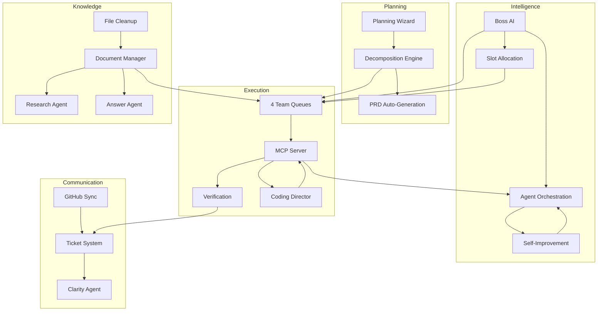

# 09 — Features & Capabilities

**Version**: 7.0
**Last Updated**: February 2026
**Status**: ✅ Current
**Depends On**: [02-System-Architecture-and-Design](02-System-Architecture-and-Design.md), [04-Workflows-and-How-It-Works](04-Workflows-and-How-It-Works.md)
**Changelog**: v7.0 — Added Category 11 (Team Queue System), Category 12 (Documentation & File Management), Coding Director Agent, updated agent count (16), updated test count (2,770+), v7.0 compliance section | v3.0 — Standardized header, added User/Dev views, expanded feature descriptions, added dependency graph, added cross-references

---

## How to Read This Document

This is the complete feature catalog for COE — every capability the system provides, organized by category. Each feature has a description explaining what it does, a status indicator, and implementation notes. Use this document to understand what COE can do today and what's planned.

> **👤 User View**: This is your feature reference guide. Green checkmarks (✅) mean the feature is ready to use. Wrench icons (🔧) mean it's partially working. Clipboard icons (📋) mean it's planned but not yet built. You don't need to read every feature — scan the categories that interest you.

> **🔧 Developer View**: Each feature maps to specific source files and services. The status notes include file paths and API endpoints for quick navigation. The Implementation Audit Summary at the bottom provides a compliance snapshot — use it to identify gaps and plan next work.

---

## Overview

COE includes 65+ features across 12 categories. This document lists every capability the system provides, organized by what it does for the user.

**Status Legend**: ✅ Implemented | 🔧 In Progress | 📋 Planned

---

## Category 1: Planning & Design (7 Features)

### Interactive Plan Builder ✅
An adaptive wizard that guides users through project planning with dynamic question paths, live impact simulation, and intelligent task generation.
**Status**: Implemented in webapp Planning page + `POST /api/plans/generate`. 5-step wizard with scale/focus/priority selection.

### Plan Decomposition Engine ✅
Automatically breaks complex requirements into atomic, dependency-aware tasks (15–45 minutes each) with clear acceptance criteria.
**Status**: Implemented in `src/core/task-decomposition-engine.ts` (6 deterministic rules) + Planning Agent LLM fallback. Max 3 levels.

### Adaptive Wizard Paths 🔧
Tailors the planning experience based on project scale and focus — MVP projects get 6 questions in 15 minutes; enterprise projects get the full flow.
**Status**: Partially implemented. Wizard collects scale/focus/priorities but sends all to LLM in one prompt. UI-level branching (different question counts per scale) not yet implemented.

### Real-Time Impact Simulator 📋
Shows live estimates of task count, timeline, risks, and technology implications as the user answers planning questions.
**Status**: Not yet implemented. Frontend-only feature — no API changes needed. Requires client-side estimation logic.

### Plan Updating Process ✅
Handles plan changes through a controlled pipeline: detect trigger → generate proposal → validate → apply → monitor results.
**Status**: Implemented via `PUT /api/plans/:id`, task reordering, and evolution service monitoring.

### Plan Drift Detection 🔧
Continuously compares the current codebase against the plan to detect when they've diverged, flagging drift before it becomes a problem.
**Status**: Partially implemented. `scanCodeBase` MCP tool exists (on-demand). No scheduled/continuous scans. Boss Agent now detects drift via failed/recheck task ratio.

### PRD Auto-Generation 📋
Automatically generates and maintains a Product Requirements Document from plans, GitHub issues, and task definitions.
**Status**: Not yet implemented. Planned as post-MVP feature.

---

## Category 2: Task Management (8 Features)

### Task Queue with Dependencies ✅
Priority-based task queue that respects dependency ordering — tasks are only released when their prerequisites are complete.
**Status**: Implemented in `database.getReadyTasks()` + MCP `getNextTask`. Full CRUD via webapp API.

### Atomic Task Enforcement ✅
Ensures every task meets the 5 atomicity criteria: single responsibility, atomic completion, 15–45 minute time box, verification closure, and token safety.
**Status**: Enforced by Planning Agent prompt + TaskDecompositionEngine auto-decompose for >45 min tasks.

### Task Decomposition Agent ✅
Automatically breaks down tasks estimated over 45 minutes into smaller subtasks while preserving parent-child relationships.
**Status**: Implemented in `src/core/task-decomposition-engine.ts` with 6 rules + Planning Agent LLM fallback. Max 3 levels.

### Context Bundle Builder ✅
Packages each task with all the context the coding AI needs: plan excerpts, related files, architecture docs, and dependency information.
**Status**: Implemented in MCP `getNextTask` tool + `ContextFeeder` service.

### Verification Tracking ✅
Tracks every task through verification states: not started → in progress → pending verification → verified/needs re-check/failed.
**Status**: Full state machine in database + Verification Agent + webapp API approval/rejection endpoints.

### Progress Dashboard ✅
Real-time view of project progress with completion percentages, blocker counts, and timeline estimates.
**Status**: Implemented in webapp Dashboard page + `GET /api/dashboard`. Shows progress bars, task counts, agent status.

### Checkpoint System 📋
Automatic checkpoint commits every 5–10 completed tasks; tagged releases at each priority level completion.
**Status**: Not yet implemented. Requires git integration for auto-commits.

### Fresh Restart 📋
One-click state reset that reloads everything from disk, verifies consistency, and presents a clean starting point.
**Status**: Not yet implemented. Planned for System page in webapp.

---

## Category 3: Agent Management (6 Features)

### Multi-Agent Orchestration ✅
Routes work to 16 specialized agents based on intent classification, with fallback strategies and timeout detection.
**Status**: Implemented in `src/agents/orchestrator.ts`. Two-stage classification (keyword + LLM), 14 routing categories, error boundaries, verification retry. v7.0: Added Coding Director agent, 4-team queue routing.

### Boss AI Supervisor ✅
Top-level oversight agent that monitors system health, manages 4 team queues, resolves inter-team conflicts, enforces plan alignment, dynamically allocates processing slots, and reviews cancelled tickets for re-engagement.
**Status**: Implemented in `src/agents/boss-agent.ts`. All 7 thresholds active + v7.0: per-queue management, slot allocation, cancelled ticket review, notepad sections, team-aware dispatching.

### Custom Agent Builder ✅
Visual interface for creating specialized read-only agents with goals, checklists, routing rules, and permission controls.
**Status**: Implemented in `src/agents/custom-agent.ts` with YAML parsing, hardlock enforcement, safety limits (20 goals, 50 LLM calls, 30 min max), loop detection.

### Agent Gallery ✅
Browse, manage, enable, and disable available agents (built-in and custom).
**Status**: Implemented in webapp Agents page. Shows all agents with status badges.

### Agent Evolution (UV Tasks) ✅
System for agents to propose their own improvements through "Update & Validate" tasks, with human gates for critical changes.
**Status**: Implemented in `src/core/evolution-service.ts`. Pattern detection, auto-apply for non-P1, 48h monitoring, rollback.

### Agent Configuration Templates ✅
YAML-based profiles for each agent defining prompts, limits, behaviors, and routing rules.
**Status**: Implemented in Custom Agent YAML parser with full validation.

---

## Category 4: Execution & Monitoring (6 Features)

### MCP Server (6 Tools) ✅
Communication bridge between COE and external coding agents, exposing `getNextTask`, `reportTaskDone`, `askQuestion`, `getErrors`, `callCOEAgent`, and `scanCodeBase`.
**Status**: All 6 tools implemented in `src/mcp/server.ts`. HTTP + JSON-RPC 2.0 + SSE. Port 3030 with auto-increment.

### Visual Verification Panel 🔧
Webview showing test results, coverage metrics, design system references, and manual approval controls.
**Status**: API endpoints implemented (`POST /api/verification/:id/approve|reject`). Dedicated VS Code webview panel not yet built.

### Automated Verification ✅
Runs tests and compares results against acceptance criteria after a 60-second stability delay.
**Status**: Implemented in Verification Agent + Orchestrator `runVerificationWithRetry()`. Real test execution via TestRunnerService.

### Loop Detection & Recovery 🔧
Monitors AI calls for repetitive patterns (same errors, identical responses) and intervenes before resources are wasted.
**Status**: Partially implemented. Custom Agent has loop detection (3 similar = halt). LLMService has serial queue (max 5). Orchestrator-level loop detection across agents not yet implemented.

### Execution Dashboard ✅
Programming Orchestrator dashboard showing current task, queue status, agent activity, and system health.
**Status**: Implemented in webapp Dashboard page with real-time stats, progress bars, agent status, recent audit.

### Audit Logging ✅
Complete record of every decision, change, agent action, approval, and escalation for traceability.
**Status**: Implemented throughout all agents and API endpoints. TransparencyLogger provides append-only logging with JSON/CSV export.

---

## Category 5: Integration & Sync (4 Features)

### GitHub Issues Bi-Directional Sync ✅
Syncs GitHub issues to local Markdown files and back, with batching, caching, and 99%+ accuracy.
**Status**: Implemented in `src/core/github-sync.ts` + `src/core/github-client.ts`. Rate limiting, Markdown conversion, webapp GitHub page.

### GitHub Copilot Integration 🔧
Managed connection to Copilot via MCP, with instructions/skills/agents management and token brakes.
**Status**: MCP server operational. Copilot connects via MCP tools. Instructions/skills management not yet built.

### Copilot Workspace Integration 📋
Orchestrates Copilot Workspace sessions with scoped instructions per task and token management.
**Status**: P3 feature. Not yet implemented.

### File Import & Sync 🔧
Watches for coding agent file changes, compares against plan acceptance criteria, and auto-creates follow-up tasks for gaps.
**Status**: File watcher infrastructure exists. Comparison against acceptance criteria handled by Verification Agent on `reportTaskDone`.

---

## Category 6: Collaboration (2 Features)

### Ticket System ✅
Structured communication channel for all AI↔human interactions with priority handling, clarity enforcement, and thread-based discussions.
**Status**: Implemented in database + webapp Tickets page. Full CRUD, threaded replies, clarity scoring, priority badges.

### Clarity Agent ✅
Dedicated agent that scores every ticket reply for clarity (0–100) and requests follow-ups when answers are incomplete or ambiguous.
**Status**: Implemented in `src/agents/clarity-agent.ts`. Scores 0-100, max 5 rounds, auto-escalates. Thresholds: 85+=clear, 70-84=mostly clear, <70=unclear.

---

## Category 7: UX & Extensibility (2 Features)

### VS Code Extension UI ✅
Full sidebar experience with Agents, Tickets, Tasks, and Conversations tabs, plus 55+ registered commands.
**Status**: Implemented. VS Code sidebar views + webapp with 10 pages (Dashboard, Tasks, Tickets, Planning, Agents, Designer, Coding, Settings, GitHub, System).

### Settings Panel ✅
8-tab configuration interface with secure credential storage and live preview of setting changes.
**Status**: Implemented in webapp Settings page. 8 tabs: LLM, Agents, Tasks, Verification, GitHub, Designer, Appearance, Advanced.

---

## Category 8: Context Management (4 Features) — v1.1 ✅

### Token Budget Management ✅
Model-aware token budget tracking with configurable warning (70%) and critical (90%) thresholds, per-model profiles, and real-time utilization reporting.

### Intelligent Context Feeding ✅
Priority-based context window composition that selects the most relevant items (task details, plan excerpts, code snippets) within the available token budget.

### Context Breaking Chain ✅
Multi-strategy context overflow recovery: summarize long contexts, trim low-priority items, compress repeated patterns. Prevents token limit crashes.

### Deterministic Task Decomposition ✅
Pattern-based task splitting engine that decomposes tasks without LLM calls. Falls back to LLM only for unrecognized patterns.

---

## Category 9: Ethics & Transparency (3 Features) — v2.0 ✅

### FreedomGuard_AI Ethics Engine ✅
6 freedom modules (Privacy, Speech, Self-Protection, Data Sovereignty, Transparency, Consent) with 4 sensitivity levels. Absolute blocks that cannot be overridden: no backdoors, spyware, unauthorized data collection, system file deletion, or data exfiltration. Every check is audited.

### Transparency Logger ✅
Append-only action logging for all service operations. Every action by every service is recorded with source, category, severity, correlation IDs, and entity references. Export to JSON/CSV. Sync-aware with device attribution.

### Ethics Override Audit Trail ✅
When authorized users override an ethics block, the justification is permanently recorded with who, when, why, and what was overridden.

---

## Category 10: Multi-Device Sync & Visual Design (5 Features) — v2.0 ✅

### Multi-Device Sync Service ✅
Pluggable sync backends (Cloud REST, NAS file-based, P2P direct) with vector clocks for causal ordering, advisory locking with 5-minute stale detection, and exponential backoff retry.

### Conflict Resolution Engine ✅
SHA-256 hash-based conflict detection with field-level auto-merge for non-overlapping changes. 5 resolution strategies: KeepLocal, KeepRemote, Merge, LastWriteWins, UserChoice.

### Component Schema Library ✅
37 default component schemas across 5 categories (Primitive Inputs, Containers, Interactive Logic, Data & Sync, Ethics & Rights) with code templates for React TSX, HTML, and CSS.

### Integrated Coding Agent ✅
NL command processing with 2-stage intent classification (keyword scoring + LLM fallback), 6 intent handlers (build, modify, explain, fix, automate, query), code generation from component schemas, and diff approval flow.

### Device Registration & Management ✅
Register/unregister devices, track device presence, sync-enabled flags, and per-device vector clock counters for distributed ordering.

---

## Category 11: Team Queue System (6 Features) — v7.0 ✅

### 4-Team Queue Architecture ✅
Replaces single processing queue with 4 team-specific queues: Orchestrator (catch-all), Planning, Verification, and Coding Director. Each queue has independent depth, slot allocation, and processing.
**Status**: Implemented in `src/core/ticket-processor.ts`. `routeToTeamQueue()` maps operation_type to team. `assigned_queue` column on tickets table.

### Round-Robin Slot Balancing ✅
Boss AI dynamically allocates processing slots across teams based on workload. Least-recently-served team with pending work gets the next slot. Empty queues are skipped.
**Status**: Implemented in `fillSlots()` with `roundRobinIndex` and `TEAM_ORDER`. `updateSlotAllocation()` allows Boss to reallocate slots dynamically.

### Lead Agent Escalation ✅
Lead agents can escalate tickets back to Boss AI with structured payloads including reason, recommended target queue, and blocking info. Boss AI resolves escalations by re-routing, gathering missing info, or escalating to user.
**Status**: Implemented via `escalate_to_boss` action type + `handleEscalation()` in ticket processor. `EscalationPayload` interface.

### Support Agent Calls (Sync/Async) ✅
Lead agents can call support agents inline (sync, <60s) for quick lookups or create sub-tickets (async) for longer research tasks. Sync calls block the current ticket; async creates a linked sub-ticket.
**Status**: Implemented via `call_support_agent` action type + `executeSupportCall()`. Sync timeout enforced by `maxSupportAgentSyncTimeoutMs`.

### Ticket Cancel & Re-engagement ✅
Boss AI can cancel tickets (removed from queue, marked cancelled in DB) and periodically reviews cancelled tickets to re-engage if conditions have changed.
**Status**: Implemented via `cancelTicket()` and `reengageTicket()` methods. Boss reviews cancelled tickets every `cancelledTicketReviewIntervalMs` (default: 30 min).

### Structured Task Assignment ✅
Boss AI creates structured task assignments with explicit success criteria, target agents, and evaluation methods. Criteria are evaluated deterministically after agent completion.
**Status**: Implemented via `assign_task` action type + `task_assignments` table + `evaluateAssignmentCriteria()`. 5 verification methods: output_contains, ticket_resolved, file_exists, info_gathered, manual_check.

---

## Category 12: Documentation & File Management (4 Features) — v7.0 ✅

### Support Document System ✅
Organized knowledge base where Research Agent saves findings, Answer Agent searches before calling LLM, and agents inject relevant docs into pipeline context.
**Status**: Implemented in `src/core/document-manager.ts`. `support_documents` table with folder/category/tag organization. CRUD API endpoints at `/api/documents`.

### Agent File Cleanup ✅
Detects stray `.md`/`.txt` files created by external coding agents in workspace root, saves content to documentation system, creates Boss review tickets, and optionally cleans up originals.
**Status**: Implemented in `src/core/agent-file-cleanup.ts`. FileSystemWatcher with 5s debounce. 4 detection patterns. Boss review required before cleanup.

### Coding Director Agent ✅
Manages the interface between internal orchestration and external coding agent (MCP). Performs pre-flight checks on coding tasks, builds comprehensive context bundles, and processes completion reports.
**Status**: Implemented in `src/agents/coding-director-agent.ts`. `prepareForExternalAgent()`, `processExternalResult()`, `getQueueStatus()`. Webapp Coding tab shows status via `GET /api/coding/status`.

### Pipeline Context Injection ✅
Relevant support documents are automatically injected into agent context during ticket processing. Documents are keyword-matched, ranked by relevance and verification status, and formatted as a delimited section in the agent's message.
**Status**: Implemented in `TicketProcessorService.processTicketPipeline()` via `DocumentManagerService.gatherContextDocs()`. Max 5 docs per pipeline run.

---

## Feature Priorities (What Gets Built First)

| Priority | Count | What |
|----------|-------|------|
| **P1 (Must Have)** | 12 | Ticket DB, orchestrator routing, sidebar UI, agent coordination, verification, MCP tools |
| **P2 (Should Have)** | 13 | Custom agents, GitHub sync, evolution system, context management, planning wizard |
| **P2+ (v2.0)** | 12 | Ethics engine, transparency logger, sync service, conflict resolver, coding agent, component schemas |
| **P2+ (v7.0)** | 10 | Team queues, round-robin balancing, lead agent escalation, support agent calls, document system, file cleanup, Coding Director, context injection, cancel/re-engage, structured assignments |
| **P3 (Nice to Have)** | 10 | Advanced analytics, RL optimization, Copilot Workspace integration, Docker MCP toolkit |

---

## Core Feature Interactions

---

## Success Metrics

| Category | Metric | Target |
|----------|--------|--------|
| **Adoption** | User adoption rate | 80% within 3 months |
| **Adoption** | Visual verification usage | 90% of UI tasks |
| **Adoption** | Developer satisfaction | 4.0/5.0 average |
| **Performance** | Planning time reduction | 50% reduction |
| **Performance** | Agent autonomous success rate | 70% |
| **Performance** | Time to first task | <5 minutes |
| **Performance** | MCP tool response time | <200ms (p95) |
| **Performance** | Autonomous question resolution | 80% |
| **Quality** | First-time task completion rate | 85% |
| **Quality** | GitHub sync accuracy | 99% |
| **Quality** | Plan validation pass rate | 75% first submission |
| **Quality** | Test coverage improvement | +15% |

---

## Risk Management

| Risk | Severity | Mitigation |
|------|----------|------------|
| Scope creep | Medium | Strict change control, P1-first philosophy |
| UI complexity | Medium | Minimalist design, user testing |
| AI performance issues | Medium | Testing + fallback strategies |
| Context overflows | High | Layered breaking strategies + fresh start recovery |
| Database corruption | High | Optimistic locking, WAL mode, backup on restart |
| Security vulnerabilities | High | VS Code security model, input validation, secrets API |
| User adoption resistance | Medium | Tutorials, gradual rollout, polished UX |
| GitHub API rate limiting | Low | Batching, caching, offline fallback |

---

## Implementation Audit Summary (February 13, 2026)

**Audit Scope**: Full comparison of plan intent vs actual code behavior across all agents, services, MCP tools, and webapp.

### Overall Status

| Category | Total | Implemented | In Progress | Planned | Coverage |
|----------|-------|------------|-------------|---------|----------|
| Planning & Design | 7 | 3 | 2 | 2 | 43% |
| Task Management | 8 | 6 | 0 | 2 | 75% |
| Agent Management | 6 | 6 | 0 | 0 | 100% |
| Execution & Monitoring | 6 | 4 | 2 | 0 | 67% |
| Integration & Sync | 4 | 1 | 2 | 1 | 25% |
| Collaboration | 2 | 2 | 0 | 0 | 100% |
| UX & Extensibility | 2 | 2 | 0 | 0 | 100% |
| Context Management (v1.1) | 4 | 4 | 0 | 0 | 100% |
| Ethics & Transparency (v2.0) | 3 | 3 | 0 | 0 | 100% |
| Multi-Device Sync (v2.0) | 5 | 5 | 0 | 0 | 100% |
| Team Queue System (v7.0) | 6 | 6 | 0 | 0 | 100% |
| Documentation & File Mgmt (v7.0) | 4 | 4 | 0 | 0 | 100% |
| **TOTAL** | **63** | **52** | **6** | **5** | **83%** |

### Agent Compliance (Plan Intent vs Actual)

| Agent | Compliance | Notes |
|-------|-----------|-------|
| Orchestrator | 90% | Core routing solid, 14 categories, 16 agents. Missing: orchestrator-level loop detection |
| Planning Agent | 100% | Fully matches plan spec. v7.0: escalation + support agent calls |
| Answer Agent | 100% | Fully matches plan spec. v7.0: support document search before LLM |
| Verification Agent | 100% | Fully matches plan spec. v7.0: escalation + support agent calls |
| Research Agent | 100% | Fixed: ESCALATE parsing + auto-escalation. v7.0: save_document actions |
| Clarity Agent | 100% | Fully matches plan spec |
| Boss Agent | 100% | v7.0: 4-queue management, slot allocation, cancel/re-engage, notepad |
| Custom Agent | 100% | Fully matches plan spec including hardlocks |
| CodingAgentService | 100% | All 6 intents, ethics gate, code gen, diffs |
| Review Agent | 100% | Deterministic complexity + LLM scoring, auto-approval matrix |
| Coding Director | 100% | v7.0: Pre-flight, context packaging, result processing, queue status |

### v2.0 Service Compliance

| Service | Compliance | Notes |
|---------|-----------|-------|
| EthicsEngine | 100% | 6 modules, 4 levels, absolute blocks, override audit |
| TransparencyLogger | 100% | Append-only, 7 categories, JSON/CSV export |
| SyncService | 100% | 3 backends, vector clocks, advisory locks |
| ConflictResolver | 100% | SHA-256, field-level merge, 5 strategies |
| ComponentSchemaService | 100% | 37 schemas, 5 categories, code templates |

### Test Coverage

- **Test suites**: 40
- **Total tests**: 1,520+
- **Coverage target**: 100% (enforced in jest.config.js)

### v3.0 Features (February 14, 2026)

#### Design Quality Pipeline ✅
- **Design Architect Agent** — Reviews design structure, scores 0-100 across 6 categories
- **Gap Hunter Agent** — 15 deterministic checks + LLM analysis for nuanced gaps
- **Design Hardener Agent** — Creates draft component proposals for human review
- **Design QA Panel** — Shows scores, gaps, drafts with Approve All/Reject All buttons
- **Draft Component Rendering** — Dashed outlines on canvas, draggable, approve/reject

#### Ticket System Overhaul ✅
- **Ticket Auto-Processing** — TicketProcessorService with dual queues (main + boss)
- **Agent Routing** — Maps operation_type + title patterns to correct agent
- **Verification System** — Dual-mode: clarity score for communication, deliverable check for work
- **Tiered Retry** — Auto-retry 3x → Boss severity classification → user escalation
- **Ghost Ticket System** — P1 tickets auto-created when tasks are blocked. 3-strike dismiss rule.
- **Cancel Button** — Cancel (not Resolve) for auto-created tickets
- **Agent Display** — Assigned agent badge, stage badge, acceptance criteria, verification result in ticket detail
- **Active Ticket SSE Feedback** — Real-time status banners (Processing, Verifying, Retrying)
- **Ticket Limits** — Max 10 active. P1 bumps P3 when at limit.
- **Review Agent** — Smart auto-review for completed tickets. Deterministic complexity classification + LLM scoring. Auto-approves simple/moderate, flags complex for user.
- **Peek-then-Remove Queue** — Prevents ticket orphaning on agent errors. Queue entries only removed after success.
- **Error Recovery** — 3 error retries per ticket, then Ghost Ticket escalation. Startup recovery for orphaned tickets.
- **Idle Watchdog Recovery** — Stuck tickets with `processing_status: 'processing'` are auto-recovered.
- **Progress Dashboard** — Live processing status on Planning page with progress bar, current ticket, queue depth, elapsed timer.
- **SSE Named Events** — Proper `/events` endpoint with named `event:` lines for `addEventListener` compatibility.

#### User Communication Queue ✅
- **Question Popup** — Focused 1-question-at-a-time popup (replaces free-form chat)
- **Navigation Buttons** — Navigate to relevant page/area from question
- **Previous Decision Context** — Shows past answers when similar question detected
- **Conflict Detection** — Warns when new answer conflicts with existing decision
- **Queue Badge** — P1 questions pulse red

#### Decision Memory ✅
- **Decision Tracking** — `user_decisions` table stores every user answer
- **Auto-Answer** — Repeat questions auto-answered from history
- **Conflict Detection** — Contradictory answers flagged with impact panel
- **Stale Filtering** — Outdated questions auto-dismissed when design regenerated
- **13 Categories** — authentication, database, styling, ui_ux, api_design, etc.

#### Lifecycle Orchestration ✅
- **8-Phase Model** — Planning → Designing → DesignReview → TaskGeneration → Coding → Verification → Complete (with DesignUpdate loop)
- **Phase Gates** — Explicit criteria per phase, no manual override
- **Phase Progress UI** — Grouped by 3 stages, current phase highlighted
- **Design Approval** — "Approve Design" button creates frozen version snapshot
- **Version-Aware Coding** — Impact analysis when features branch merges
- **Layered Task Generation** — Scaffold tasks first, then feature tasks

#### Boss AI Enhancements ✅
- **Event-Driven Activation** — Triggers on ticket resolved, task completed, agent error, phase transition
- **Idle Watchdog** — Configurable timeout (default 5 min) triggers health check
- **Separate Boss Queue** — Boss tickets process independently of main queue
- **Nav Indicator** — Boss AI status chip in webapp navigation

#### Settings Page ✅
- **Configurable Thresholds** — QA score, ticket limits, retry counts, clarification rounds, Boss timeouts, clarity scores
- **LLM Connection** — Endpoint, model, test connection
- **AI Level** — Manual, Suggestions, Smart, Hybrid

#### MCP Integration ✅
- **Ticket Processor Drives Task Queue** — `getNextTask` uses TicketProcessorService
- **Tool Recommendations** — `reportTaskDone` and `askQuestion` include `next_recommended_tool`

#### Planning State Persistence ✅
- **SSE Auto-Reload** — Real-time updates via Server-Sent Events
- **State Restoration** — Full state restored on page load/reboot from SQLite
- **Guided Tour** — Welcome tour for first-time users when no plans exist

#### JSON Repair ✅
- **Progressive Repair** — 7-step `repairJson()` function fixes malformed LLM JSON output
- **3-Tier Parsing** — Fast parse → repair → retry LLM with simplified prompt

### v3.0 Service Compliance

| Service | Compliance | Notes |
|---------|-----------|-------|
| TicketProcessorService | 100% | Dual queues, routing, verification, retry, ghost tickets, idle watchdog |
| DesignArchitectAgent | 100% | 6-category scoring, configurable threshold |
| GapHunterAgent | 100% | 15 deterministic + LLM, hybrid approach |
| DesignHardenerAgent | 100% | Draft components, human-in-the-loop |
| DecisionMemoryAgent | 100% | Keyword fast path + LLM, 13 categories, conflict detection |
| Phase Management | 100% | 8 phases, gate checks, design approval |

### Updated Test Coverage

- **Test suites**: 52+
- **Total tests**: 2,500+
- **Coverage target**: 100% (enforced in jest.config.js)

### v7.0 Features (February 2026)

#### Team Queue System ✅
- **4-Team Queue Architecture** — Orchestrator, Planning, Verification, Coding Director queues with independent depth and slot allocation
- **Round-Robin Slot Balancing** — Boss AI dynamically allocates slots; least-recently-served team with work gets next slot
- **Lead Agent Escalation** — Structured `EscalationPayload` with reason, recommended target, blocking info
- **Support Agent Calls** — Sync mode (<60s inline) and async mode (sub-ticket with `blocking_ticket_id`)
- **Ticket Cancel & Re-engagement** — Boss cancels tickets, periodically reviews for re-engagement (every 30 min)
- **Structured Task Assignment** — `assign_task` action with 5 verification methods (output_contains, ticket_resolved, file_exists, info_gathered, manual_check)

#### Documentation & File Management ✅
- **Support Document System** — `support_documents` table with folder/category/tag organization, CRUD API
- **Agent File Cleanup** — FileSystemWatcher detects stray `.md`/`.txt` files, saves to docs, creates Boss review tickets
- **Pipeline Context Injection** — Relevant support docs auto-injected into agent context (max 5, keyword-matched, ranked)
- **Answer Agent Doc Search** — Searches support documents BEFORE calling LLM; may answer without LLM call

#### Coding Director Agent ✅
- **Pre-flight Checks** — Validates acceptance criteria, description length, blocking ticket status before coding tasks
- **Context Packaging** — Builds comprehensive context bundle (task, plan, support docs, retry history)
- **Result Processing** — Parses completion reports, validates files_modified, routes to verification
- **Queue Status** — `GET /api/coding/status` for webapp Coding tab (NOT READY / Active / Pending)

#### Boss AI v7.0 Enhancements ✅
- **Per-Queue Management** — Full status visibility across all 4 team queues
- **Slot Allocation** — Dynamic slot reallocation via `update_slot_allocation` action
- **Cancelled Ticket Review** — Periodic check of cancelled tickets for re-engagement
- **Notepad Sections** — Persistent `boss_notepad` table (queue_strategy, blockers, patterns, next_actions)
- **Team-Aware Dispatching** — Can target specific team queues in dispatch actions

#### Ticket System Enhancements ✅
- **Team Queue Badges** — Colored team badges on ticket display (ORCH gray, PLAN blue, VERIFY green, CODE orange)
- **Queue Filtering** — Dropdown filter on Tickets tab to filter by team queue
- **Queue Move** — `POST /api/queues/move` endpoint for manual ticket queue reassignment

### v7.0 Service Compliance

| Service | Compliance | Notes |
|---------|-----------|-------|
| TicketProcessorService (v7.0) | 100% | 4 team queues, round-robin, escalation, support calls |
| DocumentManagerService | 100% | Save/search/gather/verify/delete, folder organization |
| AgentFileCleanupService | 100% | Detection patterns, debounce, Boss review, cleanup |
| CodingDirectorAgent | 100% | Pre-flight, context packaging, result processing |
| BossAgent (v7.0) | 100% | Queue management, slot allocation, cancel/re-engage |
| ResearchAgent (v7.0) | 100% | save_document action for findings >= 60 confidence |
| AnswerAgent (v7.0) | 100% | Support document search before LLM |
| PlanningAgent (v7.0) | 100% | Escalation + support agent call instructions |
| VerificationAgent (v7.0) | 100% | Escalation + support agent call instructions |

### Updated Test Coverage (v7.0)

- **Test suites**: 53+
- **Total tests**: 2,770+
- **Coverage target**: 100% (enforced in jest.config.js)

### Remaining Gaps (Planned)

1. **Adaptive Wizard Paths** — UI-level question branching by project scale
2. **Impact Simulator** — Live task/timeline/risk estimates during planning
3. **Checkpoint System** — Auto-commit every 5-10 tasks + tagged releases
4. **Fresh Restart** — One-click state reset from System page
5. **Copilot Workspace Integration** — P3 feature, session orchestration
6. **PRD Auto-Generation** — Automatic PRD maintenance from plans
7. **Orchestrator Loop Detection** — Pattern tracking across all agent calls
8. **Visual Verification Webview** — Dedicated VS Code panel (API ready)
9. **Back-End Designer Agent** — Planned for next project (deferred from v7.0)

---

## Feature Dependency Map

The features don't exist in isolation — they depend on each other. This table shows which features must be working before others can function:

| Feature | Hard Dependencies | Soft Dependencies |
|---------|------------------|-------------------|
| Planning Wizard | Database, LLM Service | Settings Panel |
| Task Decomposition | Planning Wizard output | — |
| Task Queue | Database, Task Decomposition | Boss AI |
| MCP Server | Database, Task Queue | GitHub Sync |
| Verification | MCP Server, Task Queue | Test Runner Service |
| Boss AI | Database, Event Bus | All agents |
| Custom Agents | YAML Parser, LLM Service | Agent Gallery |
| GitHub Sync | GitHub Client, Database | File Watcher |
| Evolution System | Database, Pattern Detection | RL Pipeline |
| Ethics Engine | LLM Service | Transparency Logger |
| Sync Service | Database, Conflict Resolver | Vector Clocks |
| Coding Agent | Component Schema, LLM Service | Ethics Engine |
| Design QA Pipeline | Design Architect, Gap Hunter, Hardener | — |
| Ticket Processor | Database, Agent Router, Verification | Ghost Tickets |
| Decision Memory | Database, LLM Service | Question Queue |
| Team Queue System | Ticket Processor, Database | Boss AI |
| Document Manager | Database, Event Bus | Research Agent, Answer Agent |
| File Cleanup | Document Manager, File Watcher | Boss AI |
| Coding Director | Team Queue System, MCP Server | Document Manager |
| Support Agent Calls | Ticket Processor, Team Queues | All lead agents |
| Structured Assignments | Database, Boss AI | Team Queues |

---

## Cross-References

| Topic | Document |
|-------|----------|
| Architecture where features are implemented | [02-System-Architecture-and-Design](02-System-Architecture-and-Design.md) |
| Agents that power these features | [03-Agent-Teams-and-Roles](03-Agent-Teams-and-Roles.md) |
| Workflows these features enable | [04-Workflows-and-How-It-Works](04-Workflows-and-How-It-Works.md) |
| UI that exposes these features | [05-User-Experience-and-Interface](05-User-Experience-and-Interface.md) |
| User stories for these features | [06-User-and-Developer-Stories](06-User-and-Developer-Stories.md) |
| Safety systems protecting features | [08-Context-Management-and-Safety](08-Context-Management-and-Safety.md) |
| Agile stories tracking implementation | [12-Agile-Stories-and-Tasks](12-Agile-Stories-and-Tasks.md) |
| Implementation timeline | [13-Implementation-Plan](13-Implementation-Plan.md) |
