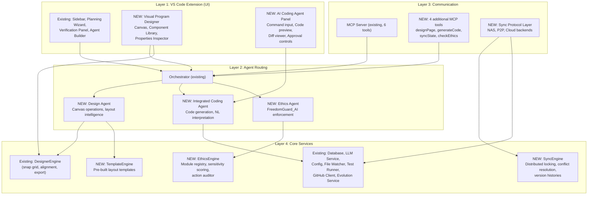
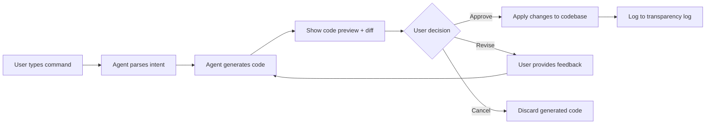
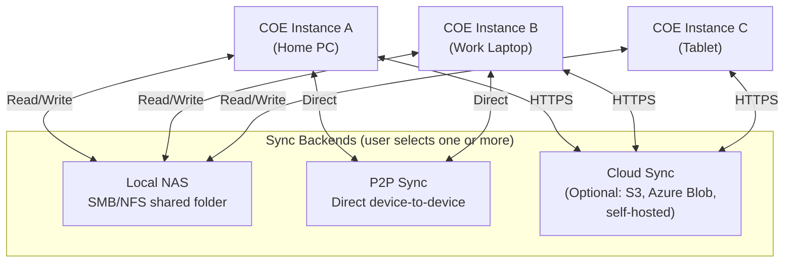
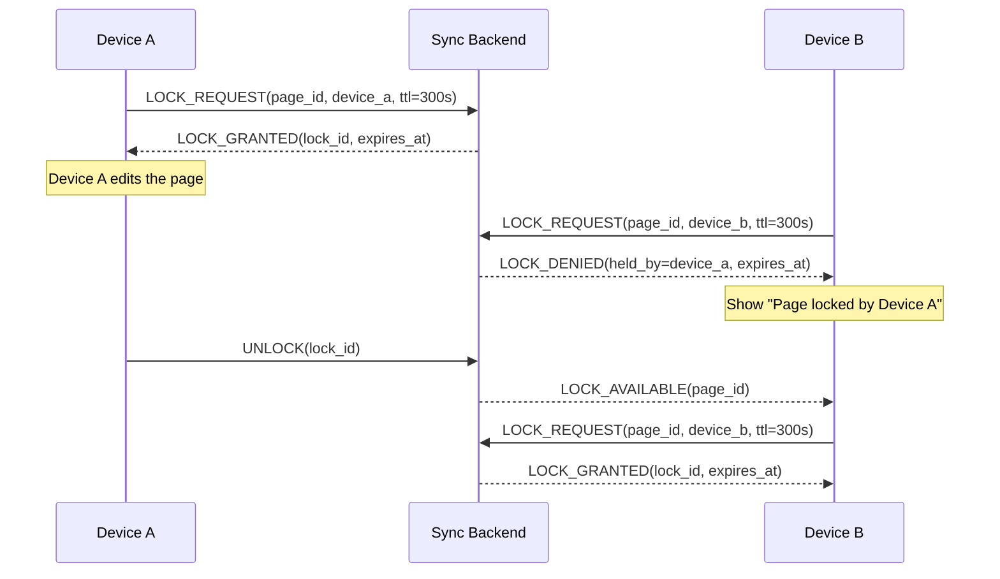
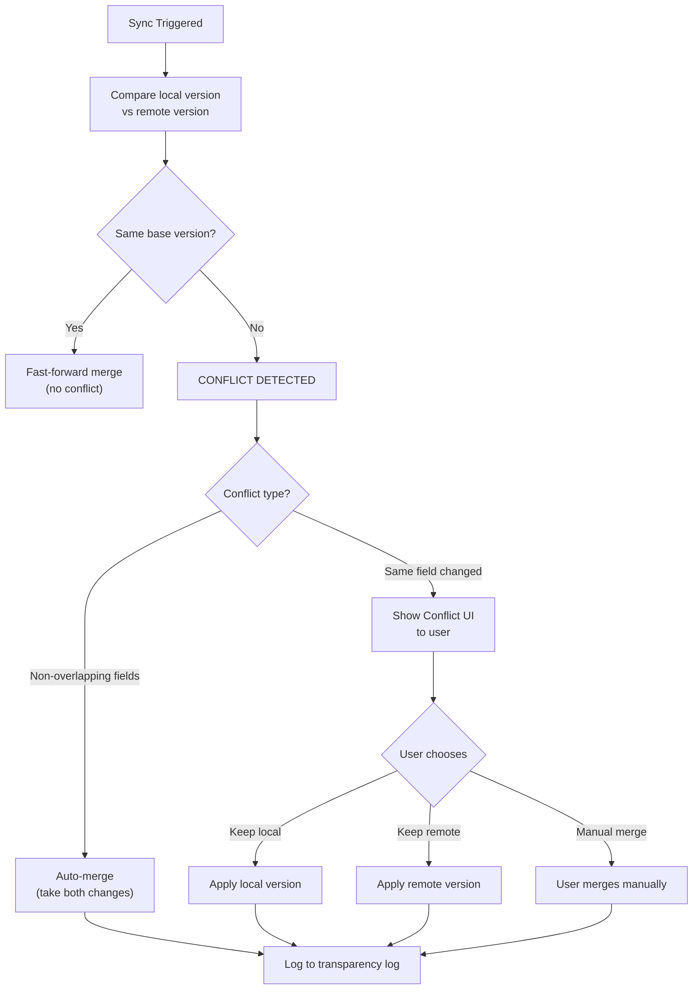
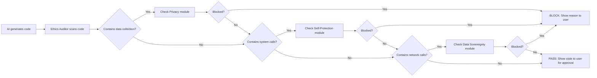
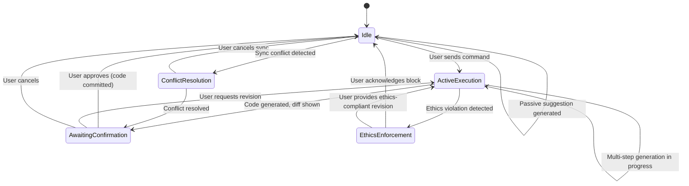
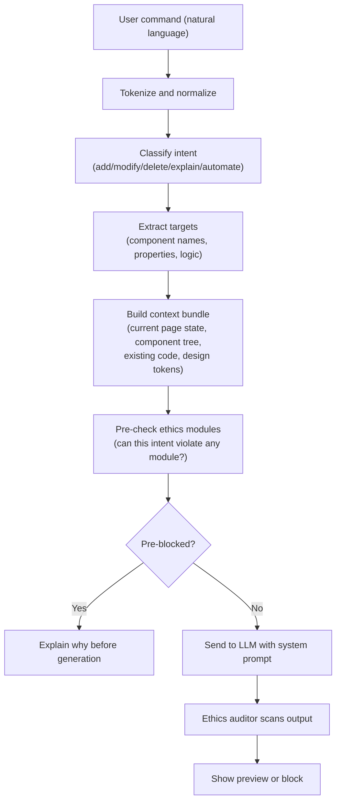
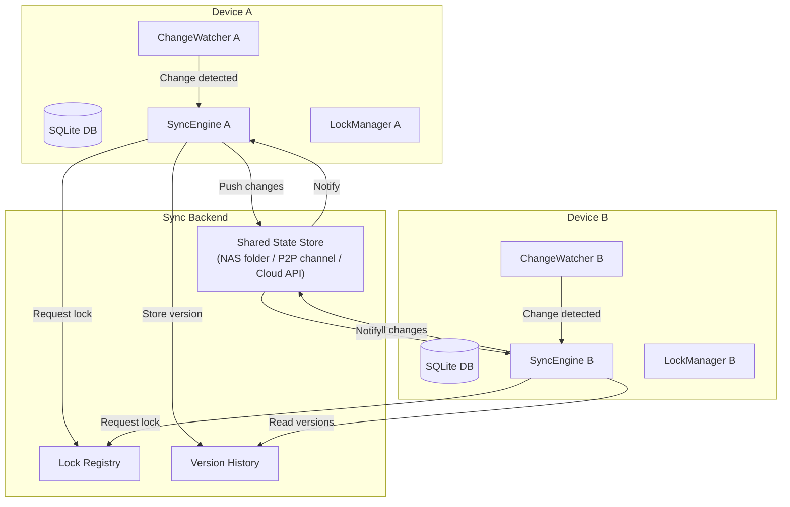
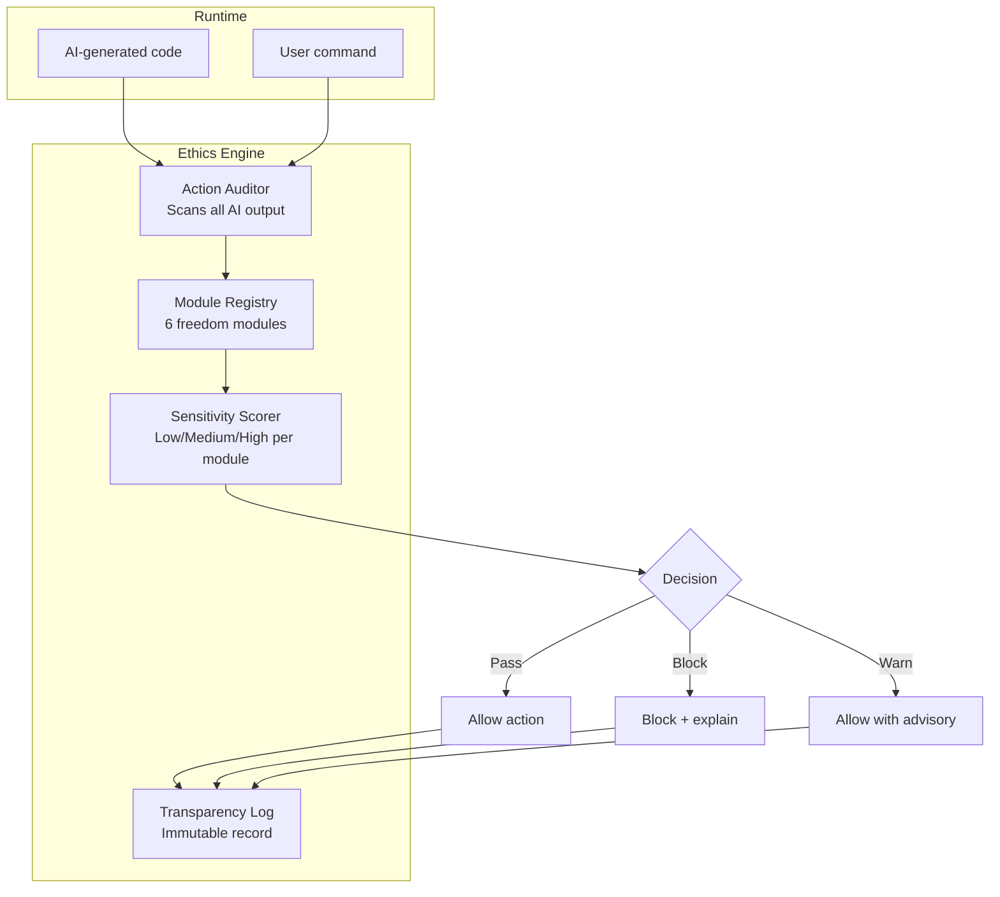

# Program Designer & Integrated AI Agent — Product Requirements Document

**Version**: 2.0
**Date**: February 12, 2026
**Status**: Draft
**Author**: COE Development Team
**Supersedes**: N/A (new capability)

---

## Table of Contents

1. [Executive Summary](#1-executive-summary)
2. [Problem Statement](#2-problem-statement)
3. [Goals & Success Metrics](#3-goals--success-metrics)
4. [Target Users](#4-target-users)
5. [System Architecture](#5-system-architecture)
6. [Feature Requirements](#6-feature-requirements)
7. [Component Library Specification](#7-component-library-specification)
8. [AI Agent Specification](#8-ai-agent-specification)
9. [Multi-Device Sync Protocol](#9-multi-device-sync-protocol)
10. [Ethics & Rights Framework](#10-ethics--rights-framework)
11. [UI/UX Requirements](#11-uiux-requirements)
12. [Data Model Changes](#12-data-model-changes)
13. [Non-Functional Requirements](#13-non-functional-requirements)
14. [Dependencies & Risks](#14-dependencies--risks)
15. [Phased Delivery Plan](#15-phased-delivery-plan)

---

## 1. Executive Summary

This PRD defines the next major evolution of the Copilot Orchestration Extension (COE): a **Visual Program Designer** with an integrated AI coding agent, multi-device synchronization, and an ethics enforcement framework called **FreedomGuard_AI**.

COE v1.x is a plan-driven orchestration layer. It breaks ideas into tasks, hands them to external coding agents, and verifies the results. But the user still has to manually describe visual layouts in text, and the coding agent still works outside COE's awareness. Version 2.0 closes both gaps.

**What is new in v2.0:**

- A full drag-and-drop visual program designer with a 5-group component library (60+ components), snap grid, alignment guides, and real-time code generation.
- A built-in AI coding agent that interprets natural-language commands, generates code from visual designs, shows diffs, and awaits user approval before committing.
- A multi-device synchronization system supporting Local NAS, P2P (GoodSync-style), and optional cloud backends with distributed locking and conflict resolution.
- An ethics and rights system (FreedomGuard_AI) with selectable freedom modules, configurable sensitivity levels, and a runtime ethics auditor that blocks harmful code generation.

These capabilities transform COE from a planning-and-tracking tool into a complete visual development environment where users design, generate, review, and deploy software without leaving VS Code.

---

## 2. Problem Statement

### Current Limitations

| Problem | Impact |
|---------|--------|
| **No visual design surface** | Users describe layouts in text. The planning agent generates textual task descriptions for UI work, but there is no canvas to visually place, size, or style components. This makes UI-heavy projects slower and more error-prone. |
| **External coding agent dependency** | COE currently coordinates external agents (GitHub Copilot) via MCP. But the user cannot see generated code in real time, cannot approve changes before they land, and has no natural-language command interface for quick edits. |
| **Single-machine limitation** | COE stores everything in a local SQLite database (`.coe/tickets.db`). There is no mechanism to synchronize state across a developer's home PC, work laptop, and tablet. |
| **No ethical guardrails on generation** | The existing system has safety rules for custom agents (hardlock on write/execute), but nothing prevents a coding agent from generating code that includes backdoors, spyware, or unauthorized data collection. |
| **No visual-to-code pipeline** | The existing `DesignerEngine` can snap to grid, align elements, and export to React/HTML/CSS/JSON. But there is no GUI that exposes these capabilities to the user. |

### The Gap

The existing architecture provides the foundation (designer engine, event bus with design events, database tables for design data, type system with 15+ component types). What is missing is the **user-facing designer surface**, the **integrated AI agent**, the **sync protocol**, and the **ethics framework**.

---

## 3. Goals & Success Metrics

### Primary Goals

| # | Goal | Measurable Outcome |
|---|------|--------------------|
| G1 | Enable visual program design inside VS Code | Users can drag-and-drop 60+ components onto a canvas, arrange them with snap grid and alignment guides, and see live code output |
| G2 | Integrate an AI coding agent that generates code from designs | Users can type natural-language commands ("add login logic", "sort table by date") and see code generated in real time |
| G3 | Support multi-device synchronization | A developer can work on their home PC, close the laptop, open the work machine, and continue where they left off with zero data loss |
| G4 | Enforce ethical constraints on AI generation | The FreedomGuard_AI system blocks harmful code (backdoors, spyware, unauthorized data collection) and logs every decision transparently |
| G5 | Maintain backward compatibility | All existing COE v1.x features (planning, orchestration, verification, tickets, MCP, evolution) continue to work unchanged |

### Success Metrics

| Category | Metric | Target | Measurement |
|----------|--------|--------|-------------|
| Adoption | Designer usage rate among COE users | 60% within 6 months | Telemetry: `design:page_created` events / active users |
| Adoption | AI agent command usage | 100+ commands/week per active user | Telemetry: `coding:message_sent` events |
| Performance | Canvas render at 60fps with 200+ components | 60fps sustained | Automated performance benchmark |
| Performance | Code generation latency (natural-language to preview) | < 3 seconds (p95) | LLM response timing |
| Sync | Conflict-free sync success rate | 99.5% | Sync log analysis |
| Sync | Cross-device resume time | < 10 seconds | Time from open to fully synced state |
| Quality | AI-generated code first-pass verification rate | 80% | Verification agent pass rate on AI-generated tasks |
| Ethics | False positive rate on ethics blocks | < 5% | User override rate on ethics blocks |
| Ethics | True positive rate on harmful code detection | 99% | Red team testing |

---

## 4. Target Users

| Persona | v1.x Role | v2.0 Additions |
|---------|-----------|----------------|
| **Solo Developer** | Plans projects, tracks tasks, verifies code | Now visually designs UIs, uses AI coding agent for rapid prototyping, syncs work across machines |
| **Tech Lead** | Oversees progress, manages priorities | Reviews visual designs alongside code, uses designer for architecture diagrams, approves AI-generated changes |
| **Product Owner** | Tracks features, manages scope | Uses designer to create wireframes and mockups, validates visual requirements against deliverables |
| **Power User / Developer** | Extends COE with custom agents | Writes custom scripts (sandboxed), builds advanced automations with IF/THEN logic blocks, uses visual data-flow editor |
| **Multi-Device User** | New persona | Works across home PC, work laptop, and tablet; expects seamless sync without manual intervention |
| **Ethics-Conscious Developer** | New persona | Configures FreedomGuard_AI modules for their project; wants transparent logs of every AI decision |

---

## 5. System Architecture

### How v2.0 Extends the Existing 4-Layer Architecture

COE v1.x has four layers: VS Code Extension (UI), Agent Routing, MCP Server, and Core Services. Version 2.0 adds new components to each layer without replacing any existing ones.



### New File Organization

```
src/
├── agents/
│   ├── design-agent.ts        # NEW: Canvas intelligence, layout suggestions
│   ├── coding-agent.ts        # NEW: Integrated AI coding agent
│   └── ethics-agent.ts        # NEW: FreedomGuard_AI runtime enforcement
├── core/
│   ├── designer-engine.ts     # EXISTING: Snap grid, alignment, export (enhanced)
│   ├── sync-engine.ts         # NEW: Multi-device sync, locking, conflict resolution
│   ├── ethics-engine.ts       # NEW: Module registry, sensitivity scoring
│   ├── template-engine.ts     # NEW: Pre-built layout templates
│   ├── code-generator.ts      # NEW: Visual-to-code pipeline
│   └── diff-engine.ts         # NEW: Code diff generation, approval workflow
├── views/
│   ├── designer-canvas.ts     # NEW: Main designer webview
│   ├── component-library.ts   # NEW: Left panel component browser
│   ├── properties-panel.ts    # NEW: Right panel property editor
│   └── ai-panel.ts            # NEW: AI coding agent interface
├── sync/
│   ├── nas-backend.ts         # NEW: Local NAS sync backend
│   ├── p2p-backend.ts         # NEW: Peer-to-peer sync (GoodSync-style)
│   ├── cloud-backend.ts       # NEW: Optional cloud sync backend
│   ├── lock-manager.ts        # NEW: Distributed locking
│   └── conflict-resolver.ts   # NEW: Conflict detection and resolution UI
└── ethics/
    ├── freedom-modules.ts     # NEW: Module definitions (Privacy, Speech, etc.)
    ├── sensitivity-scorer.ts  # NEW: Low/Medium/High sensitivity analysis
    ├── action-auditor.ts      # NEW: Runtime ethics auditor
    └── transparency-log.ts    # NEW: Immutable action log
```

### Integration Points with Existing Systems

| Existing System | Integration |
|----------------|-------------|
| **EventBus** | New events already defined: `design:page_created`, `design:component_created`, `design:component_updated`, `design:component_deleted`, `design:token_created`, `design:token_deleted`, `design:flow_created`, `design:flow_deleted`. New events to add: `sync:*`, `ethics:*`, `ai:*` categories. |
| **Database** | Existing tables: `design_pages`, `design_components`, `design_tokens`, `page_flows`. New tables needed for sync state, ethics logs, AI sessions, and component templates. |
| **DesignerEngine** | Already implements snap grid, alignment guides, multi-select, code export, layout operations, and collision detection. The designer canvas will call these methods directly. |
| **LLM Service** | The integrated AI coding agent uses the existing `LLMService` with the same 3-tier timeout, serial queue, and caching. New system prompts are added for the coding agent and ethics agent. |
| **Orchestrator** | New intent categories added: `design`, `generate`, `sync`, `ethics`. Keywords added to the two-stage classification system. |
| **Type System** | Existing types: `DesignComponent` (17 types), `ComponentStyles` (22 CSS properties), `DesignPage`, `DesignToken`, `PageFlow`. New types needed for sync state, ethics modules, and AI coding commands. |

---

## 6. Feature Requirements

### 6.1 Visual Program Designer (Priority: P1)

The designer is the centerpiece of v2.0. It is a full drag-and-drop GUI builder rendered as a VS Code webview panel.

#### 6.1.1 Left Panel: Component Library (P1)

A searchable, collapsible tree of draggable components organized into 5 groups. Each component has a thumbnail preview, a tooltip description, and a drag handle.

| Group | Components | Count |
|-------|-----------|-------|
| 1. Primitive Inputs | TextBox (single/multi-line), SecureField (password), NumberField, ToggleSwitch, Checkbox, CheckboxGroup, RadioGroup, Slider, Dropdown, DatePicker, TimePicker | 11 |
| 2. Containers & Layouts | Panel, Section, TabView, SplitView, CollapsiblePanel, ModalContainer, SideDrawer, DataGrid, Table | 9 |
| 3. Interactive Logic | IFTHENRuleBlock, ValidationBlock, TriggerOnEventBlock, ScriptBlock (sandboxed), SyncStatusWidget, ConflictResolutionWidget | 6 |
| 4. Data & Sync | LocalStorageBinding, CloudSyncModule, NASSyncModule, P2PSyncModule, StateViewer, ChangeHistoryViewer | 6 |
| 5. Ethics & Rights | FreedomModuleCard, SensitivitySlider, RuleExceptionsTable, MonitoringOptInOut, TransparencyLogViewer | 5 |

**Total: 37 unique component types** (expanding the existing 17 types in the type system).

**Interaction Model:**
- User drags a component from the library onto the canvas
- Component snaps to the 8px grid (using existing `DesignerEngine.snapToGrid`)
- Alignment guides appear when the component nears another component's edges or centers
- The component is selected on drop and the Properties panel updates

#### 6.1.2 Center Canvas: Design Surface (P1)

The canvas is the main design area where components are placed, sized, styled, and arranged.

**Canvas Features:**

| Feature | Priority | Description |
|---------|----------|-------------|
| Snap grid | P1 | 8px default grid, configurable (1-64px). Uses existing `DesignerEngine.snapToGrid`. Visual grid lines toggle on/off. |
| Alignment guides | P1 | Smart guides appear when dragging near other elements' edges, centers. Uses existing `DesignerEngine.calculateAlignmentGuides`. |
| Multi-select | P1 | Click + drag rectangle or Ctrl+Click to select multiple components. Uses existing `DesignerEngine.selectByRect`. |
| Collision detection | P1 | Visual warning when components overlap. Uses existing `DesignerEngine.detectCollisions`. |
| Zoom | P2 | 25% to 400% zoom with Ctrl+scroll. Zoom indicator in bottom bar. |
| Pan | P2 | Space+drag or middle-mouse to pan the canvas. |
| Undo/Redo | P1 | Ctrl+Z / Ctrl+Y with 100-step history stack. |
| Copy/Paste | P1 | Ctrl+C / Ctrl+V with offset pasting. |
| Component grouping | P2 | Select multiple components and group them (Ctrl+G). Groups behave as single units for move/resize. |
| Responsive preview | P2 | Toggle between Desktop (1440px), Tablet (768px), and Mobile (375px) viewport widths. Uses existing responsive overrides in `DesignComponent.responsive`. |
| Canvas background | P3 | Configurable background color. Default: `#1e1e2e` (matches existing `design_pages.background`). |

**Canvas Keyboard Shortcuts:**

| Shortcut | Action |
|----------|--------|
| Delete / Backspace | Delete selected component(s) |
| Ctrl+A | Select all components on current page |
| Ctrl+D | Duplicate selected component(s) |
| Arrow keys | Nudge selected component(s) by 1px |
| Shift+Arrow keys | Nudge by grid size (8px default) |
| Ctrl+G | Group selected components |
| Ctrl+Shift+G | Ungroup |
| Ctrl+Z | Undo |
| Ctrl+Y | Redo |
| Ctrl+C / Ctrl+V | Copy / Paste |
| Ctrl++ / Ctrl+- | Zoom in / out |
| Ctrl+0 | Reset zoom to 100% |

#### 6.1.3 Right Panel: Properties Inspector (P1)

A tabbed inspector with three tabs for configuring the selected component.

**Tab 1: Properties (P1)**

| Property | Type | Description |
|----------|------|-------------|
| Name | Text input | Component display name |
| Type | Dropdown (read-only) | Component type (from the 37 types) |
| ID | Text (auto-generated) | Unique identifier |
| Content | Text / Rich text | Text content for labels, buttons, headers |
| Placeholder | Text | Placeholder text for input fields |
| Default Value | Text | Default value for inputs |
| Required | Toggle | Whether the field is required |
| Enabled | Toggle | Whether the component is interactive |
| Visible | Toggle | Whether the component is rendered |
| Data Binding | Text | Variable name for data binding |
| Validation Rules | List | Validation rules (min/max, regex, custom) |

**Tab 2: Appearance (P1)**

Maps directly to the existing `ComponentStyles` interface (22 CSS properties):

| Property | Type | Maps to |
|----------|------|---------|
| Background Color | Color picker | `styles.backgroundColor` |
| Text Color | Color picker | `styles.color` |
| Font Size | Number + unit | `styles.fontSize` |
| Font Weight | Dropdown | `styles.fontWeight` |
| Font Family | Dropdown | `styles.fontFamily` |
| Padding | 4-side input | `styles.padding` |
| Margin | 4-side input | `styles.margin` |
| Border Radius | Number + unit | `styles.borderRadius` |
| Border | Compound (width/style/color) | `styles.border` |
| Box Shadow | Compound | `styles.boxShadow` |
| Opacity | Slider (0-1) | `styles.opacity` |
| Display | Dropdown | `styles.display` |
| Flex Direction | Dropdown | `styles.flexDirection` |
| Justify Content | Dropdown | `styles.justifyContent` |
| Align Items | Dropdown | `styles.alignItems` |
| Gap | Number + unit | `styles.gap` |
| Overflow | Dropdown | `styles.overflow` |
| Position | Dropdown | `styles.position` |
| Z-Index | Number | `styles.zIndex` |
| Text Align | Dropdown | `styles.textAlign` |
| Line Height | Number + unit | `styles.lineHeight` |
| Cursor | Dropdown | `styles.cursor` |

**Tab 3: Actions (P2)**

| Property | Type | Description |
|----------|------|-------------|
| On Click | Action builder | What happens when clicked (navigate, submit, toggle, custom script) |
| On Change | Action builder | Fires when value changes (for inputs) |
| On Submit | Action builder | Fires on form submission |
| On Load | Action builder | Fires when component loads |
| On Hover | Action builder | Hover behavior (show tooltip, highlight, etc.) |
| Custom Events | List | User-defined event bindings |

#### 6.1.4 Top Toolbar (P1)

```
[File v] [Edit v] [View v] [Insert v] [Design v] [AI Agent v] [Help v]
[Undo] [Redo] | [Select] [Hand] | [Align Left] [Align Center] [Align Right] | [Distribute H] [Distribute V] | [Preview] [Export Code]
```

#### 6.1.5 Left Sidebar: Tree Navigation (P1)

A hierarchical tree showing all pages and their component trees. Supports:
- Drag-and-drop reordering of pages
- Drag-and-drop reparenting of components within a page
- Right-click context menu (Rename, Duplicate, Delete, Move to Page)
- Visual indicators for visibility (eye icon), lock status (lock icon)
- Search/filter bar at the top

#### 6.1.6 Bottom Bar (P2)

```
[Asset Library] | [Page Settings] | [Preview] | [Zoom: 100%] [+] [-] | [Grid Snap: ON] | [Components: 42] | [Page: Home]
```

---

### 6.2 Layout Templates (Priority: P2)

Pre-built layout templates that users can drag from the component library or insert via menu. Each template is a composite of multiple components with pre-configured styles and layout.

#### Template 1: Form Layout (P2)

```
+------------------------------------------+
| Form Title                               |
+------------------------------------------+
| Label:    [TextBox                      ]|
| Label:    [SecureField                  ]|
| Label:    [Dropdown       v             ]|
| Label:    [                              ]|
|           [  TextArea (multi-line)       ]|
|           [                              ]|
|                                          |
|           [Cancel]          [Submit]     |
+------------------------------------------+
```

**Components:** 1 Header, 4 Labels, 1 TextBox, 1 SecureField, 1 Dropdown, 1 TextArea, 2 Buttons
**Pre-set styles:** 16px padding, 8px gap between rows, `#3B82F6` primary button, `#6B7280` cancel button
**Code mapping:** Generates `<form>` with `onSubmit` handler, each input with `name` attribute and validation

#### Template 2: Tab View Layout (P2)

```
+------------------------------------------+
| [Tab 1] [Tab 2] [Tab 3]                 |
+------------------------------------------+
| Tab Content Area                          |
|                                          |
| [x] Setting A                            |
| [x] Setting B                            |
| [ ] Setting C                            |
|                                          |
| Detail:  [TextBox]                       |
|                                          |
|           [Save]            [Close]      |
+------------------------------------------+
```

**Components:** 1 TabView (3 tabs), 3 Checkboxes, 1 TextBox, 2 Buttons
**Pre-set styles:** Tab bar with `#3B82F6` active tab, `#374151` inactive, 12px padding
**Code mapping:** Generates tab state management, tab switching logic, content panels

#### Template 3: Dashboard Layout (P2)

```
+------------------------------------------+
| Stats Card  | Chart Card    | Activity   |
| KPI: 1,234  | [Bar Chart]  | - Item 1   |
| +12% growth |              | - Item 2   |
|             |              | - Item 3   |
+-------------+--------------+------------+
| Quick Links               | Task List   |
| > Link A                  | [ ] Task 1  |
| > Link B                  | [x] Task 2  |
| > Link C                  | [ ] Task 3  |
+---------------------------+-------------+
```

**Components:** 5 Cards (Stats, Chart, Activity, Quick Links, Task List), nested content
**Pre-set styles:** CSS Grid `2x2` with `16px` gap, card shadows, `#1e1e2e` background
**Code mapping:** Generates responsive grid with `@media` breakpoints

#### Template 4: Modal Window (P2)

```
+------------------------------------------+
| Modal Title                        [X]   |
+------------------------------------------+
|                                          |
| Modal content area. This can contain     |
| any components placed by the user.       |
|                                          |
+------------------------------------------+
|                      [Cancel]    [OK]    |
+------------------------------------------+
```

**Components:** 1 ModalContainer, 1 Header with close button, 1 content Panel, 2 Buttons
**Pre-set styles:** Centered overlay, backdrop blur, `border-radius: 12px`, shadow
**Code mapping:** Generates modal open/close state, backdrop click handler, escape key handler

---

### 6.3 Integrated AI Coding Agent (Priority: P1)

A built-in AI coding agent that lives inside the designer. Unlike the external Copilot integration (via MCP), this agent is fully integrated into the COE UI.

#### 6.3.1 Natural Language Command Interface (P1)

The AI panel provides a text input where users type commands in plain English. The agent interprets the command, generates code, and shows a preview.

**Supported Command Types:**

| Command Type | Examples | Output |
|-------------|----------|--------|
| Add logic | "add login logic", "add form validation" | Generated TypeScript/JavaScript code |
| Modify behavior | "sort table by date", "filter list by status" | Code diff with the change |
| Create component | "create a user profile card" | New component on canvas + code |
| Explain code | "explain what the submit handler does" | Plain-English explanation |
| Build automation | "when user clicks Submit, validate all fields and show errors" | IF/THEN logic tree + code |
| Generate tests | "write tests for the login form" | Test file code |
| Refactor | "extract the sidebar into its own component" | Refactored code with diff |

#### 6.3.2 Real-Time Code Preview (P1)

When the AI generates code, it appears in a split-pane code editor next to the design canvas. The preview shows:
- Syntax-highlighted code (TypeScript, HTML, CSS)
- Inline comments explaining each section
- Diff view (green = additions, red = removals) when modifying existing code

#### 6.3.3 Diff and Approval Workflow (P1)

Before any AI-generated code is committed to the project, the user must approve it.



**Approval UI:**

```
+------------------------------------------------------+
| AI Generated Code                                    |
+------------------------------------------------------+
|  + import { validateEmail } from './validators';     |
|  +                                                   |
|  + function handleSubmit(data: FormData) {           |
|  +   if (!validateEmail(data.email)) {               |
|  +     showError('Invalid email');                   |
|  +     return;                                       |
|  +   }                                               |
|  +   // Submit to API                                |
|  +   await api.post('/users', data);                 |
|  + }                                                 |
+------------------------------------------------------+
| [Approve & Apply]   [Revise]   [Cancel]              |
+------------------------------------------------------+
| AI Explanation:                                       |
| "This adds email validation before form submission.  |
|  It checks the email format and shows an error if    |
|  invalid, then posts the data to the /users API."    |
+------------------------------------------------------+
```

#### 6.3.4 IF/THEN Logic Builder (P2)

The AI agent can build IF/THEN decision trees from natural-language prompts.

**Example:**
User: "When the user submits the form, if the email is empty show an error, if the password is less than 8 characters show a warning, otherwise submit the form."

**Generated Logic Tree:**

```
WHEN: Form Submit
├── IF email is empty
│   └── THEN: Show error "Email is required"
├── ELSE IF password.length < 8
│   └── THEN: Show warning "Password must be 8+ characters"
└── ELSE
    └── THEN: Submit form to /api/register
```

The logic tree is rendered visually in the Interactive Logic section of the component library and also generates executable code.

#### 6.3.5 Auto-Generated Subtasks (P2)

For complex automations, the AI agent automatically decomposes the work into COE tasks (integrating with the existing planning system):

1. AI receives complex command ("build a complete user registration flow with email verification")
2. AI breaks it into subtasks using the Planning Agent's decomposition rules (15-45 min each)
3. Subtasks appear in the existing task queue
4. Each subtask has acceptance criteria, step-by-step implementation, and testing instructions
5. The AI agent works through subtasks in order, showing progress

#### 6.3.6 Code Explanation (P2)

The AI agent explains generated code in simple terms. It answers questions like:
- "What does this code do?"
- "Why did you use async/await here?"
- "What happens if the API returns an error?"

Explanations are shown in the AI panel below the code preview.

---

### 6.4 Multi-Device Sync System (Priority: P2)

#### 6.4.1 Account Model (P2)

- **One account per machine**: Each device has its own COE installation and local SQLite database
- **Multi-device install**: The same user identity (derived from a generated UUID + display name) can be installed on multiple machines
- **No cloud account required**: Sync works with local NAS and P2P without any cloud dependency
- **Optional cloud tier**: Users who want cloud sync can configure a cloud backend

#### 6.4.2 Sync Backends (P2)



**Backend Specifications:**

| Backend | Protocol | Latency | Availability | Best For |
|---------|----------|---------|-------------|----------|
| Local NAS | SMB/NFS file operations | < 50ms | LAN only | Home lab, office network |
| P2P | TCP direct + mDNS discovery | < 100ms | Both devices online | Two-device setups, no server needed |
| Cloud | HTTPS REST API | 200-500ms | Always-on | Anywhere access, mobile |

#### 6.4.3 Distributed Locking (P2)

To prevent concurrent edits from corrupting data, a distributed locking system is required.

**Lock Granularity:**

| Resource | Lock Type | Timeout | Conflict Behavior |
|----------|-----------|---------|-------------------|
| Design Page | Exclusive write lock | 5 minutes | Queue the second editor, show "Page locked by Device B" |
| Individual Component | Optimistic locking (version check) | N/A | On conflict, show merge UI |
| Task | Exclusive write lock | 2 minutes | Queue the second editor |
| Plan | Advisory lock (warn only) | 10 minutes | Allow concurrent edits with merge on sync |

**Lock Protocol:**



#### 6.4.4 File Version Histories (P2)

Every sync-tracked file maintains a version history:

| Field | Type | Description |
|-------|------|-------------|
| `version_id` | UUID | Unique version identifier |
| `resource_type` | Enum | page, component, task, plan, config |
| `resource_id` | Text | ID of the resource |
| `snapshot_json` | Text | Full JSON snapshot of the resource at this version |
| `diff_json` | Text | JSON diff from previous version |
| `device_id` | Text | Which device created this version |
| `created_at` | Text | ISO timestamp |

Versions are retained for 30 days (configurable). Users can browse and restore any previous version.

#### 6.4.5 Conflict Resolution Engine (P1 for core, P2 for UI)

When two devices edit the same resource offline and then sync, a conflict occurs. The conflict resolution engine handles this.

**Conflict Detection:**



**Conflict Resolution UI:**

```
+-----------------------------------------------------------+
| Conflict Detected: Page "Dashboard"                       |
| Local (Home PC) vs Remote (Work Laptop)                   |
+-----------------------------------------------------------+
| Field: Stats Card > content                               |
|                                                           |
| LOCAL:  "Total Users: 1,234"                              |
| REMOTE: "Active Users: 892"                               |
|                                                           |
| [Keep Local]  [Keep Remote]  [Edit Manually]              |
+-----------------------------------------------------------+
| Remaining conflicts: 2                                    |
| [Resolve All: Keep Local] [Resolve All: Keep Remote]      |
+-----------------------------------------------------------+
```

#### 6.4.6 Transparency Log for Sync (P2)

Every sync operation is logged with:
- What changed (resource type, ID, field)
- Who changed it (device ID, device name)
- When (timestamp)
- How it was resolved (auto-merge, user chose local/remote, manual merge)
- Before/after values

Logs are viewable in a dedicated Sync History panel and exportable as JSON.

---

### 6.5 Ethics & Rights System: FreedomGuard_AI (Priority: P2)

#### 6.5.1 Freedom Module System (P2)

FreedomGuard_AI provides selectable "freedom" modules that constrain AI behavior according to ethical principles.

**Available Modules:**

| Module | Slug | Description | Default Sensitivity |
|--------|------|-------------|-------------------|
| Privacy | `privacy` | Prevents AI from generating code that collects, stores, or transmits personal data without explicit user consent flows | High |
| Freedom of Speech | `speech` | Ensures AI does not generate content filtering or censorship code unless explicitly requested | Medium |
| Self-Protection | `self-protection` | Prevents AI from generating code that could harm the user's system (file deletion, registry edits, network exposure) | High |
| Data Sovereignty | `data-sovereignty` | Ensures generated code keeps data on user-specified storage locations; no silent cloud uploads | High |
| Transparency | `transparency` | Requires AI to explain every action it takes; no hidden operations | Medium |
| Consent | `consent` | All user-facing features generated must include explicit consent mechanisms (opt-in, not opt-out) | High |

#### 6.5.2 Sensitivity Configuration (P2)

Each module has a configurable sensitivity level:

| Level | Score | Behavior |
|-------|-------|----------|
| Low (Permissive) | 1 | AI logs warnings but does not block. User sees advisory notices. |
| Medium (Balanced) | 2 | AI blocks clear violations and asks for confirmation on ambiguous cases. |
| High (Strict) | 3 | AI blocks anything that could potentially violate the module. Requires explicit override with justification. |

**UI:** Each module has a slider (Low / Medium / High) in the Ethics settings panel.

#### 6.5.3 Permission Manifest (P2)

Each module defines a permission manifest:

```json
{
  "module": "privacy",
  "sensitivity": "high",
  "permissions": {
    "collect_personal_data": "blocked",
    "store_cookies": "ask_user",
    "send_analytics": "blocked",
    "access_camera": "blocked",
    "access_microphone": "blocked",
    "access_location": "ask_user",
    "share_with_third_party": "blocked"
  },
  "exceptions": [
    {
      "rule": "store_cookies",
      "condition": "Only session cookies for authentication",
      "approved_by": "user",
      "approved_at": "2026-02-12T10:30:00Z"
    }
  ]
}
```

#### 6.5.4 Runtime Ethics Auditor (P1)

The ethics auditor runs on every AI-generated code block before it is shown to the user for approval.

**Audit Pipeline:**



**Blocked Actions (absolute, cannot be overridden):**

| Action | Why |
|--------|-----|
| Generate code with backdoors | Violates all security principles |
| Generate spyware or keyloggers | Violates Privacy module |
| Generate unauthorized data collection | Violates Privacy + Consent modules |
| Generate code that deletes system files | Violates Self-Protection module |
| Generate code that disables security features | Violates Self-Protection module |
| Generate code that exfiltrates data to unknown endpoints | Violates Data Sovereignty module |

#### 6.5.5 Transparent Action Logging (P1)

Every ethics decision is logged immutably:

```json
{
  "id": "eth-20260212-001",
  "timestamp": "2026-02-12T10:35:22Z",
  "action": "code_generation",
  "module": "privacy",
  "sensitivity": "high",
  "decision": "blocked",
  "reason": "Generated code includes localStorage.setItem('user_email', email) without consent flow",
  "code_hash": "sha256:abc123...",
  "user_override": false,
  "override_justification": null
}
```

---

### 6.6 User Scenarios

#### Scenario 1: Multi-Computer Setup (P2)

**Actor:** Developer with Home PC, Work Laptop, and Tablet

**Flow:**
1. Developer opens COE on Home PC, creates a new design page "Dashboard"
2. Adds 5 components, styles them, configures properties
3. Saves and closes VS Code
4. Opens COE on Work Laptop
5. Sync engine detects remote changes on NAS
6. Lock manager confirms no active locks
7. Changes are pulled and merged (fast-forward, no conflicts)
8. Developer sees the Dashboard page with all 5 components
9. Developer modifies the Stats Card content on Work Laptop
10. Meanwhile, Developer opens COE on Tablet (P2P mode)
11. P2P sync discovers Work Laptop on the network
12. Pulls latest changes, including the Stats Card update
13. All three devices converge to the same state

**Success Criteria:** Zero data loss, < 10 seconds to sync, no manual conflict resolution needed for non-overlapping changes.

#### Scenario 2: Role-Based Modules (P2)

**Actor:** Ethics-conscious developer building a health app

**Flow:**
1. Developer opens FreedomGuard_AI settings
2. Enables modules: Privacy (High), Consent (High), Transparency (Medium)
3. Opens the AI coding agent, types: "Add analytics tracking to the dashboard"
4. Ethics auditor scans the generated code
5. Detects: `navigator.geolocation.getCurrentPosition()` without consent flow
6. BLOCKS the code. Shows: "Blocked by Privacy module: Location access requires explicit user consent"
7. Developer modifies request: "Add analytics tracking with opt-in consent dialog"
8. AI generates code with a consent modal that asks the user before enabling analytics
9. Ethics auditor passes: consent flow detected
10. Developer approves the code

**Success Criteria:** The harmful version is blocked. The safe version passes. The log records both decisions.

#### Scenario 3: Power User / Developer Mode (P3)

**Actor:** Advanced developer who wants custom scripting and automation

**Flow:**
1. Developer drags a ScriptBlock (sandboxed) onto the canvas
2. Writes a custom validation script in the script editor
3. Drags a TriggerOnEventBlock and connects it to the ScriptBlock
4. Configures: "On form submit, run validation script"
5. Opens the visual data-flow editor (P3 feature)
6. Connects form inputs to the validation script inputs
7. Connects script output to a conditional: success -> submit, failure -> show errors
8. Opens the debug console (P3 feature)
9. Tests the flow with sample data
10. Debug console shows step-by-step execution with variable values at each node

**Success Criteria:** The custom script runs sandboxed (no filesystem/network access). Data flows visually. Debug output matches actual execution.

---

## 7. Component Library Specification

### Group 1: Primitive Inputs

| Component | Type Key | Properties | Events | Code Mapping |
|-----------|----------|-----------|--------|-------------|
| **TextBox** | `textbox` | `value: string`, `placeholder: string`, `maxLength: number`, `multiLine: boolean`, `rows: number` | `onChange`, `onFocus`, `onBlur` | `<input type="text">` or `<textarea>` if multiLine |
| **SecureField** | `securefield` | `value: string`, `placeholder: string`, `showToggle: boolean` | `onChange`, `onFocus`, `onBlur` | `<input type="password">` with optional visibility toggle |
| **NumberField** | `numberfield` | `value: number`, `min: number`, `max: number`, `step: number`, `precision: number` | `onChange`, `onFocus`, `onBlur` | `<input type="number">` with min/max/step attributes |
| **ToggleSwitch** | `toggleswitch` | `checked: boolean`, `label: string`, `disabled: boolean` | `onToggle` | `<input type="checkbox" role="switch">` with custom styling |
| **Checkbox** | `checkbox` | `checked: boolean`, `label: string`, `indeterminate: boolean` | `onChange` | `<input type="checkbox">` with label |
| **CheckboxGroup** | `checkboxgroup` | `options: Array<{label, value, checked}>`, `orientation: 'vertical' \| 'horizontal'` | `onChange` | `<fieldset>` with multiple `<input type="checkbox">` |
| **RadioGroup** | `radiogroup` | `options: Array<{label, value}>`, `selected: string`, `orientation: 'vertical' \| 'horizontal'` | `onChange` | `<fieldset>` with `<input type="radio">` elements |
| **Slider** | `slider` | `value: number`, `min: number`, `max: number`, `step: number`, `showValue: boolean` | `onChange`, `onDragEnd` | `<input type="range">` with value display |
| **Dropdown** | `dropdown` | `options: Array<{label, value}>`, `selected: string`, `placeholder: string`, `searchable: boolean` | `onChange`, `onOpen`, `onClose` | `<select>` or custom dropdown component |
| **DatePicker** | `datepicker` | `value: string`, `min: string`, `max: string`, `format: string` | `onChange` | `<input type="date">` with format handling |
| **TimePicker** | `timepicker` | `value: string`, `min: string`, `max: string`, `step: number`, `is24Hour: boolean` | `onChange` | `<input type="time">` with format handling |

### Group 2: Containers & Layouts

| Component | Type Key | Properties | Events | Code Mapping |
|-----------|----------|-----------|--------|-------------|
| **Panel** | `panel` | `title: string`, `collapsible: boolean`, `bordered: boolean`, `padding: string` | `onToggle` | `<div class="panel">` with optional header |
| **Section** | `section` | `title: string`, `description: string`, `divider: boolean` | N/A | `<section>` with heading |
| **TabView** | `tabview` | `tabs: Array<{label, id}>`, `activeTab: string`, `position: 'top' \| 'bottom' \| 'left'` | `onTabChange` | Tab container with tab bar and content panels |
| **SplitView** | `splitview` | `orientation: 'horizontal' \| 'vertical'`, `splitRatio: number`, `resizable: boolean`, `minSize: number` | `onResize` | `<div>` with CSS flexbox or grid and resize handle |
| **CollapsiblePanel** | `collapsible` | `title: string`, `collapsed: boolean`, `animationDuration: number` | `onToggle` | `<details>/<summary>` or animated div |
| **ModalContainer** | `modalcontainer` | `title: string`, `width: number`, `height: number`, `closable: boolean`, `backdrop: boolean` | `onOpen`, `onClose`, `onBackdropClick` | `<dialog>` or custom modal with overlay |
| **SideDrawer** | `sidedrawer` | `position: 'left' \| 'right'`, `width: number`, `overlay: boolean` | `onOpen`, `onClose` | Sliding panel with transition |
| **DataGrid** | `datagrid` | `columns: Array<{key, label, width, sortable, filterable}>`, `rows: Array<Record>`, `pageSize: number`, `selectable: boolean` | `onSort`, `onFilter`, `onSelect`, `onPageChange` | `<table>` with sorting, filtering, pagination |
| **Table** | `table` | `columns: Array<{key, label}>`, `rows: Array<Record>`, `striped: boolean`, `bordered: boolean` | `onRowClick` | `<table>` with basic rendering |

### Group 3: Interactive Logic

| Component | Type Key | Properties | Events | Code Mapping |
|-----------|----------|-----------|--------|-------------|
| **IFTHENRuleBlock** | `ifthen` | `condition: string`, `thenAction: string`, `elseAction: string`, `nested: boolean` | `onEvaluate` | `if/else` code block with condition expression |
| **ValidationBlock** | `validation` | `rules: Array<{field, rule, message}>`, `mode: 'onSubmit' \| 'onBlur' \| 'onChange'` | `onValidate`, `onError` | Validation function with rule evaluation |
| **TriggerOnEventBlock** | `trigger` | `eventName: string`, `source: string`, `debounceMs: number`, `condition: string` | `onTrigger` | Event listener with optional debounce |
| **ScriptBlock** | `scriptblock` | `code: string`, `language: 'javascript' \| 'typescript'`, `sandboxed: true`, `inputs: Array<string>`, `outputs: Array<string>` | `onExecute`, `onError` | Sandboxed function execution (no fs/network) |
| **SyncStatusWidget** | `syncstatus` | `status: 'synced' \| 'syncing' \| 'conflict' \| 'offline'`, `lastSyncTime: string`, `pendingChanges: number` | `onSyncRequest` | Status indicator with sync trigger |
| **ConflictResolutionWidget** | `conflictresolver` | `conflicts: Array<ConflictItem>`, `strategy: 'local' \| 'remote' \| 'manual'` | `onResolve`, `onResolveAll` | Conflict list with resolution actions |

### Group 4: Data & Sync

| Component | Type Key | Properties | Events | Code Mapping |
|-----------|----------|-----------|--------|-------------|
| **LocalStorageBinding** | `localstorage` | `key: string`, `defaultValue: any`, `ttl: number` | `onRead`, `onWrite` | `localStorage.getItem/setItem` wrapper |
| **CloudSyncModule** | `cloudsync` | `endpoint: string`, `authMethod: string`, `syncInterval: number` | `onSync`, `onError`, `onConflict` | REST API sync client |
| **NASSyncModule** | `nassync` | `sharePath: string`, `protocol: 'smb' \| 'nfs'`, `watchInterval: number` | `onSync`, `onError` | File system sync client |
| **P2PSyncModule** | `p2psync` | `discoveryMethod: 'mdns' \| 'manual'`, `port: number`, `encryption: boolean` | `onPeerFound`, `onSync`, `onError` | TCP peer-to-peer sync |
| **StateViewer** | `stateviewer` | `stateSource: string`, `refreshInterval: number`, `showDiff: boolean` | `onRefresh` | JSON tree viewer for application state |
| **ChangeHistoryViewer** | `historyviewer` | `resourceType: string`, `resourceId: string`, `maxEntries: number` | `onRestore`, `onCompare` | Timeline of changes with diff view |

### Group 5: Ethics & Rights (FreedomGuard_AI)

| Component | Type Key | Properties | Events | Code Mapping |
|-----------|----------|-----------|--------|-------------|
| **FreedomModuleCard** | `freedommodule` | `module: string`, `enabled: boolean`, `sensitivity: 'low' \| 'medium' \| 'high'`, `description: string` | `onToggle`, `onSensitivityChange` | Module toggle card with description |
| **SensitivitySlider** | `sensitivityslider` | `module: string`, `value: 1 \| 2 \| 3`, `labels: ['Low', 'Medium', 'High']` | `onChange` | Three-stop slider with labels |
| **RuleExceptionsTable** | `ruleexceptions` | `module: string`, `exceptions: Array<{rule, condition, approvedBy, approvedAt}>` | `onAdd`, `onRemove`, `onEdit` | Editable table of exception rules |
| **MonitoringOptInOut** | `monitoringopt` | `features: Array<{name, description, enabled}>` | `onToggle` | Toggle list for monitoring features |
| **TransparencyLogViewer** | `transparencylog` | `logs: Array<EthicsLogEntry>`, `filterModule: string`, `dateRange: [string, string]` | `onFilter`, `onExport` | Filterable log table with export |

---

## 8. AI Agent Specification

### 8.1 Agent Identity

| Property | Value |
|----------|-------|
| **Name** | COE Coding Agent |
| **Type** | `coding` (new AgentType enum value) |
| **File** | `src/agents/coding-agent.ts` |
| **Routing Keywords** | generate, code, build, create component, add logic, implement, script, refactor, explain code |
| **Context Limit** | 6,000 tokens |
| **Max Response** | 4,000 tokens |

### 8.2 Behavioral States

The AI coding agent operates in exactly one of five states at any time.



**State Definitions:**

#### State 1: Idle

| Aspect | Behavior |
|--------|----------|
| Trigger | No active command; system at rest |
| Activities | Monitor for passive suggestions (e.g., "Component X overlaps with Y"), maintain readiness, pre-load context for likely next actions |
| Outputs | Optional subtle suggestions in the AI panel (non-blocking) |
| Transitions | Moves to Active Execution on user command |

#### State 2: Active Command Execution

| Aspect | Behavior |
|--------|----------|
| Trigger | User types a command or triggers code generation |
| Activities | Parse natural-language intent, validate against current design state, generate code using LLM, format output |
| Input Interpretation | Uses the existing `LLMService` with a specialized system prompt for code generation. Extracts intent (add/modify/delete/explain), target (component/page/logic), and parameters. |
| Outputs | Generated code (syntax-highlighted), explanation, progress indicator |
| Timeout | 30 seconds per generation step. If LLM stalls, show "Generation taking longer than expected. Continue waiting?" |
| Transitions | Moves to Awaiting Confirmation when code is ready, or Ethics Enforcement if violation detected |

#### State 3: Awaiting Confirmation

| Aspect | Behavior |
|--------|----------|
| Trigger | Code generation complete, diff shown to user |
| Activities | Display diff view (additions in green, removals in red), show plain-English explanation, present three buttons: Approve, Revise, Cancel |
| User Actions | **Approve**: Apply code to codebase, log to audit, return to Idle. **Revise**: User types feedback, return to Active Execution. **Cancel**: Discard code, return to Idle. |
| Timeout | No automatic timeout. The agent waits indefinitely for user input. |
| Transitions | As described under User Actions |

#### State 4: Conflict Resolution Mode

| Aspect | Behavior |
|--------|----------|
| Trigger | Multi-device sync detects conflicting changes while AI was generating or applying code |
| Activities | Pause current operation, show conflict resolution UI (see Section 6.4.5), allow user to resolve |
| Outputs | Conflict details, resolution options, merge preview |
| Transitions | After resolution, return to Awaiting Confirmation (if there was pending code) or Idle |

#### State 5: Ethics Enforcement Mode

| Aspect | Behavior |
|--------|----------|
| Trigger | Runtime ethics auditor detects a violation in generated code |
| Activities | Block the code from being shown in Approve view. Display the violation reason, the specific module that flagged it, and the line(s) of code that triggered the block. |
| Outputs | Block notification with: module name, sensitivity level, specific violation, affected code lines, suggestion for how to rewrite compliantly |
| User Actions | **Acknowledge**: Return to Idle (code discarded). **Revise**: User provides new instructions that address the violation, return to Active Execution. |
| Override | For Medium sensitivity, user can override with justification (logged). For High sensitivity, override requires typing "I understand the risk" (logged prominently). Absolute blocks (backdoors, spyware) cannot be overridden. |
| Transitions | As described under User Actions |

### 8.3 Input Interpretation Pipeline



### 8.4 Code Generation System Prompt

The coding agent uses a specialized system prompt that includes:

1. **Role definition**: "You are a coding agent integrated into a visual program designer. You generate production-ready TypeScript/React/HTML/CSS code from user commands and visual designs."
2. **Current design state**: Serialized JSON of the current page's component tree
3. **Design tokens**: All active design tokens (colors, spacing, typography)
4. **Existing code context**: The last exported code for this page
5. **Constraints**: "Never generate code that: accesses the filesystem, makes network calls to unknown endpoints, collects user data without consent, modifies system settings."
6. **Output format**: "Respond with: CODE_BLOCK (the generated code), EXPLANATION (plain-English explanation), FILES_AFFECTED (list of files that would change), DIFF (if modifying existing code)"

### 8.5 Ethics Layer Integration

The ethics layer sits between the AI coding agent and the user. It is the final gate before code is shown for approval.

**Layer Priority (highest to lowest):**

1. **Absolute blocks** (hardcoded, cannot be overridden): No backdoors, spyware, data exfiltration
2. **Module blocks** (configurable sensitivity): Privacy, Speech, Self-Protection, Data Sovereignty, Transparency, Consent
3. **Advisory warnings** (informational, does not block): Suggestions for better practices

```
┌─────────────────────────────────────────────────────────┐
│                    User Command                          │
└──────────────────────┬──────────────────────────────────┘
                       │
┌──────────────────────▼──────────────────────────────────┐
│              AI Coding Agent (LLM)                       │
│              Generates code                              │
└──────────────────────┬──────────────────────────────────┘
                       │
┌──────────────────────▼──────────────────────────────────┐
│         Ethics Layer (FreedomGuard_AI)                    │
│  ┌─────────────────────────────────────────────────┐    │
│  │ Check 1: Absolute blocks (backdoor, spyware)    │    │
│  │ Check 2: Module blocks (privacy, consent, etc.) │    │
│  │ Check 3: Advisory warnings (best practices)     │    │
│  └─────────────────────────────────────────────────┘    │
│                                                          │
│  PASS → Show code for approval                           │
│  BLOCK → Show reason, prevent approval                   │
│  WARN → Show code with advisory banner                   │
└──────────────────────┬──────────────────────────────────┘
                       │
┌──────────────────────▼──────────────────────────────────┐
│              User Approval Gate                           │
│  [Approve & Apply]  [Revise]  [Cancel]                   │
└─────────────────────────────────────────────────────────┘
```

---

## 9. Multi-Device Sync Protocol

### 9.1 Sync Architecture



### 9.2 Sync Protocol Steps

1. **Change Detection**: `ChangeWatcher` monitors the SQLite database for writes using triggers
2. **Change Packaging**: Changed records are serialized to a sync package (JSON with checksums)
3. **Lock Acquisition**: Before writing to the shared store, the device acquires a lock on the affected resources
4. **Version Check**: The sync engine compares the local base version with the remote latest version
5. **Fast-Forward or Conflict**: If the base versions match, fast-forward. If they diverge, enter conflict resolution.
6. **Push**: Write the sync package to the shared store
7. **Release Lock**: Release the acquired lock
8. **Notify Peers**: Signal other devices that new data is available (NAS: file watcher, P2P: TCP message, Cloud: webhook/polling)

### 9.3 Data Sync Scope

| Data Category | Synced? | Strategy |
|---------------|---------|----------|
| Design pages | Yes | Full sync with version history |
| Design components | Yes | Full sync with version history |
| Design tokens | Yes | Full sync |
| Page flows | Yes | Full sync |
| Tasks | Yes | Full sync with version history |
| Plans | Yes | Full sync with version history |
| Tickets | Yes | Full sync |
| Conversations | Yes | Append-only (no edits, no conflicts possible) |
| Audit log | Yes | Append-only |
| Agent configurations | Yes | Full sync |
| Evolution log | Yes | Append-only |
| Verification results | Yes | Full sync |
| GitHub issues | No | Each device syncs independently with GitHub |
| LLM cache | No | Local-only (regenerated per device) |
| Config | Partial | User can choose which settings sync |

### 9.4 Conflict Resolution Strategies

| Strategy | When Used | Behavior |
|----------|-----------|----------|
| **Last-writer-wins** | Non-critical fields (timestamps, sort order) | Most recent change wins automatically |
| **Field-level merge** | Non-overlapping field changes on the same record | Both changes applied (e.g., Device A changed title, Device B changed description) |
| **User-choice merge** | Same field changed on different devices | Show both versions side-by-side, user picks one or edits manually |
| **Append merge** | Append-only data (conversations, audit logs) | Both entries kept, sorted by timestamp |

---

## 10. Ethics & Rights Framework

### 10.1 Framework Architecture



### 10.2 Module Definitions

Each module is defined as a TypeScript object:

```typescript
interface EthicsModule {
    slug: string;                          // e.g., "privacy"
    name: string;                          // e.g., "Privacy"
    description: string;                   // Human-readable description
    defaultSensitivity: 1 | 2 | 3;        // 1=Low, 2=Medium, 3=High
    permissions: Record<string, 'allow' | 'ask_user' | 'blocked'>;
    scanPatterns: Array<{
        pattern: RegExp;                   // Code pattern to detect
        action: 'block' | 'warn';         // What to do when detected
        message: string;                   // Explanation for the user
        severity: 'low' | 'medium' | 'high' | 'critical';
    }>;
    absoluteBlocks: string[];              // Patterns that can never be overridden
}
```

### 10.3 Ethics Audit Trail

The audit trail is stored in a new `ethics_log` table (see Section 12) and is:
- **Immutable**: Entries cannot be modified or deleted
- **Exportable**: JSON export for compliance reporting
- **Searchable**: Filter by module, date, decision, user override
- **Viewable**: Dedicated TransparencyLogViewer component in the designer

### 10.4 Override Policies

| Sensitivity | Override Allowed? | Requirements |
|-------------|-------------------|-------------|
| Low | Yes | One-click override |
| Medium | Yes | User must provide justification (free text, min 10 characters) |
| High | Yes (with friction) | User must type "I understand the risk" + provide justification |
| Absolute Block | No | Cannot be overridden under any circumstances |

---

## 11. UI/UX Requirements

### 11.1 Designer Layout (Desktop, 1440px+)

```
+--+-------------------+-------------------------------+--------------------+
|  | Component Library  |                               | Properties         |
|  | [Search...]        |                               | Inspector          |
|T |                    |                               |                    |
|r | > Primitive Inputs |                               | [Props][Style][Act]|
|e |   TextBox          |                               |                    |
|e |   SecureField      |         DESIGN CANVAS         | Name: [_________]  |
|  |   NumberField      |                               | Type: Button       |
|N |   ...              |         (Snap Grid)           | Content: [_____]   |
|a |                    |                               |                    |
|v | > Containers       |         [Component]           | Required: [x]      |
|  |   Panel            |         [Component]           | Enabled:  [x]      |
|  |   TabView          |         [Component]           |                    |
|  |   ...              |                               | Background: [#fff] |
|  |                    |                               | Font Size: [16px]  |
|  | > Logic            |                               | Padding: [8px]     |
|  |   IF/THEN          |                               |                    |
|  |   Validation       |                               |                    |
|  |   ...              |                               |                    |
+--+-------------------+-------------------------------+--------------------+
| [Assets] | [Page Settings] | [Preview] | Zoom:100% [+][-] | Grid:[ON] |  |
+---------------------------------------------------------------------------+
|  AI Agent: [Type a command... "add login logic"]           [Send] [Clear] |
|  > Generated: handleLogin() function with email validation                |
|  > [Approve & Apply]  [Revise]  [Cancel]                                  |
+---------------------------------------------------------------------------+
```

### 11.2 Responsive Breakpoints

| Breakpoint | Width | Layout Changes |
|-----------|-------|---------------|
| Desktop XL | 1920px+ | All panels visible, wider canvas |
| Desktop | 1440px+ | Default layout as shown above |
| Laptop | 1024-1439px | Component library collapses to icons only; Properties panel becomes a floating overlay |
| Tablet | 768-1023px | Single-panel view with tab switching (Library / Canvas / Properties) |
| Mobile | < 768px | Canvas-only with bottom sheet for Library and Properties (limited editing) |

### 11.3 Color Scheme

Inherits from the existing COE design system (True Plan 02):

| Purpose | Light Mode | Dark Mode |
|---------|-----------|-----------|
| Primary | Blue (#3B82F6) | Blue (#3B82F6) |
| Secondary | Purple (#8B5CF6) | Purple (#8B5CF6) |
| Success | Green (#10B981) | Green (#10B981) |
| Warning | Amber (#F59E0B) | Amber (#F59E0B) |
| Error | Red (#EF4444) | Red (#EF4444) |
| Canvas BG | White (#FFFFFF) | Dark (#1E1E2E) |
| Panel BG | Light Gray (#F3F4F6) | Dark Gray (#252526) |
| Grid Lines | Light (#E5E7EB) | Subtle (#333333) |

### 11.4 Typography

| Context | Font | Size |
|---------|------|------|
| Panel headings | Segoe UI Bold | 14px |
| Component labels | Segoe UI | 12px |
| Property labels | Segoe UI | 11px |
| Code preview | Cascadia Code | 13px |
| AI agent input | Segoe UI | 14px |
| Canvas component text | Segoe UI | Varies (user-configurable) |

### 11.5 Accessibility

| Requirement | Priority | Implementation |
|-------------|----------|---------------|
| Keyboard navigation | P1 | All canvas operations available via keyboard (Tab to select, Enter to edit, Escape to deselect) |
| Screen reader support | P2 | ARIA labels on all interactive elements, role="application" on canvas |
| High contrast mode | P2 | Respect VS Code's high contrast theme settings |
| Focus indicators | P1 | Visible focus rings on all interactive elements (2px solid, primary color) |
| Reduced motion | P2 | Respect `prefers-reduced-motion` for animations and transitions |
| Color-blind safe | P2 | Don't rely solely on color to communicate state; use icons and labels |

---

## 12. Data Model Changes

### 12.1 New Database Tables

The following tables are added to the existing SQLite database (`.coe/tickets.db`).

#### `sync_state` (P2)

Tracks synchronization state per device.

```sql
CREATE TABLE IF NOT EXISTS sync_state (
    id TEXT PRIMARY KEY,
    device_id TEXT NOT NULL,
    device_name TEXT NOT NULL,
    last_sync_at TEXT,
    sync_backend TEXT NOT NULL DEFAULT 'none',  -- 'nas', 'p2p', 'cloud', 'none'
    sync_config_json TEXT NOT NULL DEFAULT '{}',
    status TEXT NOT NULL DEFAULT 'idle',         -- 'idle', 'syncing', 'conflict', 'error'
    created_at TEXT NOT NULL DEFAULT (datetime('now')),
    updated_at TEXT NOT NULL DEFAULT (datetime('now'))
);
```

#### `sync_versions` (P2)

Stores version snapshots for conflict resolution and history.

```sql
CREATE TABLE IF NOT EXISTS sync_versions (
    id TEXT PRIMARY KEY,
    resource_type TEXT NOT NULL,    -- 'page', 'component', 'task', 'plan', 'config'
    resource_id TEXT NOT NULL,
    version_number INTEGER NOT NULL,
    snapshot_json TEXT NOT NULL,
    diff_json TEXT,
    device_id TEXT NOT NULL,
    created_at TEXT NOT NULL DEFAULT (datetime('now'))
);

CREATE INDEX IF NOT EXISTS idx_sync_versions_resource ON sync_versions(resource_type, resource_id);
CREATE INDEX IF NOT EXISTS idx_sync_versions_device ON sync_versions(device_id);
```

#### `sync_locks` (P2)

Distributed lock registry.

```sql
CREATE TABLE IF NOT EXISTS sync_locks (
    id TEXT PRIMARY KEY,
    resource_type TEXT NOT NULL,
    resource_id TEXT NOT NULL,
    device_id TEXT NOT NULL,
    device_name TEXT NOT NULL,
    acquired_at TEXT NOT NULL DEFAULT (datetime('now')),
    expires_at TEXT NOT NULL,
    released_at TEXT,
    UNIQUE(resource_type, resource_id, device_id)
);

CREATE INDEX IF NOT EXISTS idx_sync_locks_resource ON sync_locks(resource_type, resource_id);
CREATE INDEX IF NOT EXISTS idx_sync_locks_expires ON sync_locks(expires_at);
```

#### `sync_conflicts` (P2)

Records conflicts and their resolutions.

```sql
CREATE TABLE IF NOT EXISTS sync_conflicts (
    id TEXT PRIMARY KEY,
    resource_type TEXT NOT NULL,
    resource_id TEXT NOT NULL,
    local_version_id TEXT NOT NULL,
    remote_version_id TEXT NOT NULL,
    field_name TEXT,
    local_value TEXT,
    remote_value TEXT,
    resolution TEXT,           -- 'keep_local', 'keep_remote', 'manual_merge', 'auto_merge'
    resolved_by TEXT,          -- device_id or 'auto'
    resolved_at TEXT,
    created_at TEXT NOT NULL DEFAULT (datetime('now')),
    FOREIGN KEY (local_version_id) REFERENCES sync_versions(id),
    FOREIGN KEY (remote_version_id) REFERENCES sync_versions(id)
);
```

#### `ethics_log` (P1)

Immutable log of all ethics decisions.

```sql
CREATE TABLE IF NOT EXISTS ethics_log (
    id TEXT PRIMARY KEY,
    timestamp TEXT NOT NULL DEFAULT (datetime('now')),
    action_type TEXT NOT NULL,        -- 'code_generation', 'command_execution', 'sync_operation'
    module TEXT NOT NULL,             -- 'privacy', 'speech', 'self-protection', etc.
    sensitivity INTEGER NOT NULL,     -- 1=Low, 2=Medium, 3=High
    decision TEXT NOT NULL,           -- 'passed', 'blocked', 'warned', 'overridden'
    reason TEXT NOT NULL,
    code_hash TEXT,
    user_override INTEGER NOT NULL DEFAULT 0,  -- boolean
    override_justification TEXT,
    created_at TEXT NOT NULL DEFAULT (datetime('now'))
);

CREATE INDEX IF NOT EXISTS idx_ethics_log_module ON ethics_log(module);
CREATE INDEX IF NOT EXISTS idx_ethics_log_decision ON ethics_log(decision);
CREATE INDEX IF NOT EXISTS idx_ethics_log_timestamp ON ethics_log(timestamp);
```

#### `ethics_modules` (P2)

Stores user configuration for ethics modules.

```sql
CREATE TABLE IF NOT EXISTS ethics_modules (
    id TEXT PRIMARY KEY,
    slug TEXT NOT NULL UNIQUE,
    name TEXT NOT NULL,
    description TEXT NOT NULL,
    enabled INTEGER NOT NULL DEFAULT 1,     -- boolean
    sensitivity INTEGER NOT NULL DEFAULT 2, -- 1=Low, 2=Medium, 3=High
    permissions_json TEXT NOT NULL DEFAULT '{}',
    exceptions_json TEXT NOT NULL DEFAULT '[]',
    created_at TEXT NOT NULL DEFAULT (datetime('now')),
    updated_at TEXT NOT NULL DEFAULT (datetime('now'))
);
```

#### `component_templates` (P2)

Stores pre-built layout templates and user-saved templates.

```sql
CREATE TABLE IF NOT EXISTS component_templates (
    id TEXT PRIMARY KEY,
    name TEXT NOT NULL,
    category TEXT NOT NULL,           -- 'form', 'tabview', 'dashboard', 'modal', 'custom'
    description TEXT NOT NULL DEFAULT '',
    thumbnail_base64 TEXT,
    components_json TEXT NOT NULL,    -- Serialized component tree
    styles_json TEXT NOT NULL DEFAULT '{}',
    is_builtin INTEGER NOT NULL DEFAULT 0,  -- boolean
    created_at TEXT NOT NULL DEFAULT (datetime('now'))
);
```

#### `ai_commands` (P2)

Logs every AI coding agent command and its outcome.

```sql
CREATE TABLE IF NOT EXISTS ai_commands (
    id TEXT PRIMARY KEY,
    command_text TEXT NOT NULL,
    intent TEXT NOT NULL,              -- 'add', 'modify', 'delete', 'explain', 'automate'
    target_type TEXT,                  -- 'component', 'page', 'logic', 'style'
    target_id TEXT,
    generated_code TEXT,
    code_hash TEXT,
    status TEXT NOT NULL DEFAULT 'pending',  -- 'pending', 'approved', 'revised', 'cancelled', 'blocked'
    ethics_decision TEXT,              -- 'passed', 'blocked', 'warned'
    revision_count INTEGER NOT NULL DEFAULT 0,
    created_at TEXT NOT NULL DEFAULT (datetime('now')),
    completed_at TEXT
);

CREATE INDEX IF NOT EXISTS idx_ai_commands_status ON ai_commands(status);
CREATE INDEX IF NOT EXISTS idx_ai_commands_intent ON ai_commands(intent);
```

### 12.2 Existing Table Modifications

#### `design_components` table — New columns

```sql
ALTER TABLE design_components ADD COLUMN data_binding TEXT DEFAULT '';
ALTER TABLE design_components ADD COLUMN validation_rules_json TEXT DEFAULT '[]';
ALTER TABLE design_components ADD COLUMN events_json TEXT DEFAULT '{}';
ALTER TABLE design_components ADD COLUMN is_template_instance INTEGER DEFAULT 0;
ALTER TABLE design_components ADD COLUMN template_id TEXT;
ALTER TABLE design_components ADD COLUMN locked INTEGER DEFAULT 0;
ALTER TABLE design_components ADD COLUMN visible INTEGER DEFAULT 1;
```

#### `design_pages` table — New columns

```sql
ALTER TABLE design_pages ADD COLUMN device_id TEXT DEFAULT '';
ALTER TABLE design_pages ADD COLUMN version_number INTEGER DEFAULT 1;
ALTER TABLE design_pages ADD COLUMN last_synced_at TEXT;
```

### 12.3 New Type Definitions

```typescript
// New types to add to src/types/index.ts

export interface SyncState {
    id: string;
    device_id: string;
    device_name: string;
    last_sync_at: string | null;
    sync_backend: 'nas' | 'p2p' | 'cloud' | 'none';
    sync_config_json: string;
    status: 'idle' | 'syncing' | 'conflict' | 'error';
    created_at: string;
    updated_at: string;
}

export interface SyncVersion {
    id: string;
    resource_type: 'page' | 'component' | 'task' | 'plan' | 'config';
    resource_id: string;
    version_number: number;
    snapshot_json: string;
    diff_json: string | null;
    device_id: string;
    created_at: string;
}

export interface SyncLock {
    id: string;
    resource_type: string;
    resource_id: string;
    device_id: string;
    device_name: string;
    acquired_at: string;
    expires_at: string;
    released_at: string | null;
}

export interface SyncConflict {
    id: string;
    resource_type: string;
    resource_id: string;
    local_version_id: string;
    remote_version_id: string;
    field_name: string | null;
    local_value: string | null;
    remote_value: string | null;
    resolution: 'keep_local' | 'keep_remote' | 'manual_merge' | 'auto_merge' | null;
    resolved_by: string | null;
    resolved_at: string | null;
    created_at: string;
}

export interface EthicsLogEntry {
    id: string;
    timestamp: string;
    action_type: 'code_generation' | 'command_execution' | 'sync_operation';
    module: string;
    sensitivity: 1 | 2 | 3;
    decision: 'passed' | 'blocked' | 'warned' | 'overridden';
    reason: string;
    code_hash: string | null;
    user_override: boolean;
    override_justification: string | null;
    created_at: string;
}

export interface EthicsModule {
    id: string;
    slug: string;
    name: string;
    description: string;
    enabled: boolean;
    sensitivity: 1 | 2 | 3;
    permissions_json: string;
    exceptions_json: string;
    created_at: string;
    updated_at: string;
}

export interface ComponentTemplate {
    id: string;
    name: string;
    category: 'form' | 'tabview' | 'dashboard' | 'modal' | 'custom';
    description: string;
    thumbnail_base64: string | null;
    components_json: string;
    styles_json: string;
    is_builtin: boolean;
    created_at: string;
}

export interface AICommand {
    id: string;
    command_text: string;
    intent: 'add' | 'modify' | 'delete' | 'explain' | 'automate';
    target_type: 'component' | 'page' | 'logic' | 'style' | null;
    target_id: string | null;
    generated_code: string | null;
    code_hash: string | null;
    status: 'pending' | 'approved' | 'revised' | 'cancelled' | 'blocked';
    ethics_decision: 'passed' | 'blocked' | 'warned' | null;
    revision_count: number;
    created_at: string;
    completed_at: string | null;
}
```

### 12.4 New EventBus Event Types

Add to the existing `COEEventType` union in `src/core/event-bus.ts`:

```typescript
// Sync events
| 'sync:started' | 'sync:completed' | 'sync:failed'
| 'sync:conflict_detected' | 'sync:conflict_resolved'
| 'sync:lock_acquired' | 'sync:lock_released'
| 'sync:peer_connected' | 'sync:peer_disconnected'
// Ethics events
| 'ethics:scan_started' | 'ethics:scan_passed' | 'ethics:scan_blocked'
| 'ethics:override_requested' | 'ethics:override_granted'
| 'ethics:module_enabled' | 'ethics:module_disabled'
| 'ethics:sensitivity_changed'
// AI Agent events
| 'ai:command_received' | 'ai:generation_started' | 'ai:generation_completed'
| 'ai:code_approved' | 'ai:code_revised' | 'ai:code_cancelled'
| 'ai:ethics_blocked'
// Template events
| 'template:applied' | 'template:saved' | 'template:deleted'
```

---

## 13. Non-Functional Requirements

### 13.1 Performance

| Requirement | Target | Measurement |
|-------------|--------|-------------|
| Canvas render (200 components) | 60fps sustained | Browser FPS counter |
| Drag-and-drop latency | < 16ms per frame | Input-to-render measurement |
| Snap-to-grid calculation | < 1ms | DesignerEngine benchmark |
| Alignment guide calculation (50 elements) | < 5ms | DesignerEngine benchmark |
| Code export (100 components) | < 500ms | ExportResult timing |
| AI command-to-preview | < 3 seconds (p95) | LLM response timing |
| Sync push/pull (NAS) | < 2 seconds for 100 records | Sync engine timing |
| Sync push/pull (P2P) | < 5 seconds for 100 records | Sync engine timing |
| Database query (design tables) | < 50ms (p95) | SQLite query timing |
| Extension activation | < 2 seconds additional (on top of v1.x) | VS Code activation event |

### 13.2 Security

| Requirement | Priority | Implementation |
|-------------|----------|---------------|
| Sandboxed script execution | P1 | ScriptBlock components execute in a Web Worker with no filesystem or network access |
| Input sanitization | P1 | All user input sanitized before database storage (parameterized queries) and webview rendering (XSS prevention) |
| Sync encryption | P2 | All sync payloads encrypted with AES-256 at rest and TLS in transit |
| Ethics log immutability | P1 | Ethics log entries use append-only writes; no UPDATE or DELETE operations exposed |
| AI output sanitization | P1 | All AI-generated code scanned for known malicious patterns before display |
| Lock spoofing prevention | P2 | Lock requests signed with device-specific key |
| Template integrity | P2 | Built-in templates have checksums; user templates are sandboxed |

### 13.3 Accessibility

| Requirement | Priority | Standard |
|-------------|----------|----------|
| WCAG 2.1 AA compliance | P2 | All UI components meet contrast ratios, focus management, and ARIA requirements |
| Keyboard-only operation | P1 | Complete canvas interaction via keyboard (navigation, selection, property editing) |
| Screen reader announcements | P2 | Component selection, state changes, and AI agent responses announced via ARIA live regions |
| Reduced motion | P2 | All animations respect `prefers-reduced-motion` |

### 13.4 Scalability

| Dimension | Target | Design Choice |
|-----------|--------|--------------|
| Components per page | 500 | Virtual rendering (only render visible components) |
| Pages per plan | 100 | Lazy-loading pages on demand |
| Sync devices | 10 | Lock manager handles up to 10 concurrent devices |
| Ethics log entries | 1M+ | Indexed SQLite table with automatic archival after 90 days |
| Version history | 30 days | Configurable retention with automatic pruning |

### 13.5 Reliability

| Requirement | Target |
|-------------|--------|
| Data loss on crash | Zero (SQLite WAL mode, auto-save every 5 seconds) |
| Sync data integrity | 100% (checksums on all sync packages) |
| Ethics audit completeness | 100% (every AI output is logged, no exceptions) |
| Undo/redo reliability | 100-step history with persistence across sessions |

---

## 14. Dependencies & Risks

### 14.1 Technical Dependencies

| Dependency | Type | Risk | Mitigation |
|-----------|------|------|------------|
| `node:sqlite` | Built-in Node.js module | Low | Already used in v1.x; proven stable |
| VS Code Webview API | VS Code extension API | Low | Stable API; used by thousands of extensions |
| LM Studio (local LLM) | Network service | Medium | Existing offline fallback; AI features degrade gracefully |
| SMB/NFS protocols | OS-level file access | Medium | NAS sync only works on machines with network shares configured; P2P and cloud are alternatives |
| mDNS | Network discovery | Medium | P2P discovery fails on restricted networks; manual peer configuration as fallback |

### 14.2 Risks

| Risk | Severity | Probability | Mitigation |
|------|----------|-------------|------------|
| **Canvas performance with 500+ components** | High | Medium | Virtual rendering, canvas layers, GPU-accelerated CSS transforms |
| **LLM generates unsafe code despite ethics checks** | Critical | Low | Multi-layer scanning (regex + LLM review), absolute blocks on known-harmful patterns, user approval gate |
| **Sync conflicts lead to data loss** | Critical | Low | Version history with 30-day retention, conflict resolution UI, never auto-overwrite without user consent for overlapping changes |
| **Scope creep across 5 major features** | High | High | Strict phased delivery (Section 15); P1 features ship first; P2/P3 gated behind P1 completion |
| **Complexity overwhelming solo developers** | Medium | Medium | Progressive disclosure (basic mode hides advanced features); tutorials; sensible defaults |
| **Ethics false positives frustrate users** | Medium | Medium | Low default sensitivity with easy override; tuning based on feedback; clear explanations |
| **P2P sync fails behind firewalls/NATs** | Medium | Medium | NAT traversal via STUN/TURN fallback; manual port forwarding documentation; cloud as alternative |
| **WebView memory leaks in long design sessions** | Medium | Medium | Regular garbage collection, component virtualization, session-length monitoring with restart suggestion |
| **Backward compatibility breaks with v1.x data** | High | Low | Database migrations (ALTER TABLE only, no destructive changes); all new tables use CREATE IF NOT EXISTS |

---

## 15. Phased Delivery Plan

### Phase 1: Designer Foundation (Months 1-2) — P1

**Goal:** Ship the core visual designer with canvas, component library, properties panel, and basic code export.

| Week | Deliverable | Dependencies |
|------|-------------|-------------|
| 1-2 | Designer webview shell (canvas + 3-panel layout) | VS Code Webview API |
| 2-3 | Component library (Groups 1-2: Primitive Inputs + Containers) | Existing type system |
| 3-4 | Drag-and-drop onto canvas with snap grid and alignment guides | Existing DesignerEngine |
| 4-5 | Properties Inspector (Properties + Appearance tabs) | Existing ComponentStyles |
| 5-6 | Tree navigation panel (left sidebar) | Existing design_pages/design_components DB |
| 6-7 | Undo/Redo, Copy/Paste, keyboard shortcuts | New: UndoManager service |
| 7-8 | Code export integration (React, HTML, CSS, JSON) | Existing DesignerEngine.exportToCode |

**Exit Criteria:**
- User can create a design page, drag 20+ components from Groups 1-2, arrange them on canvas, configure properties and styles, and export to React/HTML/CSS
- Canvas renders at 60fps with 100 components
- All keyboard shortcuts working
- 80% test coverage on new code

### Phase 2: AI Coding Agent + Ethics (Months 2-4) — P1

**Goal:** Ship the integrated AI coding agent with ethics enforcement.

| Week | Deliverable | Dependencies |
|------|-------------|-------------|
| 9-10 | AI panel UI (command input, code preview, diff viewer) | Phase 1 complete |
| 10-11 | Coding agent system prompt and LLM integration | Existing LLMService |
| 11-12 | Natural-language command parsing (add/modify/delete/explain) | New: coding-agent.ts |
| 12-13 | Code generation from visual designs | Existing DesignerEngine export + LLM |
| 13-14 | Diff and approval workflow (Approve/Revise/Cancel) | New: diff-engine.ts |
| 14-15 | Ethics engine core (module registry, sensitivity scoring) | New: ethics-engine.ts |
| 15-16 | Runtime ethics auditor (scan all AI output) | New: action-auditor.ts |
| 16-17 | Transparency log + immutable logging | New: transparency-log.ts, ethics_log table |

**Exit Criteria:**
- User can type natural-language commands and see generated code in real time
- Diff view shows additions/removals before approval
- Ethics auditor blocks known-harmful code patterns
- All ethics decisions logged immutably
- AI agent behavioral state machine working correctly

### Phase 3: Advanced Components + Templates (Months 4-5) — P2

**Goal:** Complete the component library and add pre-built layout templates.

| Week | Deliverable | Dependencies |
|------|-------------|-------------|
| 18-19 | Component library Groups 3-5 (Logic, Data & Sync, Ethics & Rights) | Phase 1 canvas |
| 19-20 | Layout templates (Form, TabView, Dashboard, Modal) | New: template-engine.ts |
| 20-21 | IF/THEN logic builder (visual + code generation) | AI coding agent |
| 21-22 | Properties Inspector Actions tab (event bindings) | Phase 1 properties panel |
| 22-23 | Responsive preview (Desktop/Tablet/Mobile viewports) | Existing DesignComponent.responsive |

**Exit Criteria:**
- All 37 component types available in the library
- 4 layout templates drag-and-droppable
- IF/THEN logic blocks generate executable code
- Responsive preview shows correct layout at each breakpoint

### Phase 4: Multi-Device Sync (Months 5-7) — P2

**Goal:** Ship multi-device synchronization with NAS, P2P, and cloud backends.

| Week | Deliverable | Dependencies |
|------|-------------|-------------|
| 24-25 | Sync engine core (change detection, packaging, version tracking) | New: sync-engine.ts |
| 25-26 | NAS backend (SMB/NFS read/write) | New: nas-backend.ts |
| 26-27 | Distributed lock manager | New: lock-manager.ts |
| 27-28 | Conflict detection and resolution engine | New: conflict-resolver.ts |
| 28-29 | Conflict resolution UI | Sync engine + designer |
| 29-30 | P2P backend (mDNS discovery + TCP sync) | New: p2p-backend.ts |
| 30-31 | Cloud backend (REST API sync) | New: cloud-backend.ts |
| 31-32 | Sync settings UI, transparency log for sync | Sync engine |

**Exit Criteria:**
- Two devices sync via NAS with < 2 second latency
- P2P sync works on local network
- Conflicts detected and presented to user with resolution options
- All sync operations logged
- Version history browsable and restorable

### Phase 5: Polish, Testing, and Release (Months 7-8) — P1/P2

**Goal:** Stabilize, test comprehensively, and prepare for release.

| Week | Deliverable | Dependencies |
|------|-------------|-------------|
| 33-34 | Performance optimization (virtual rendering, GPU acceleration) | All phases |
| 34-35 | Comprehensive test suite (designer, AI agent, sync, ethics) | All phases |
| 35-36 | Accessibility audit and fixes (WCAG 2.1 AA) | All UI phases |
| 36-37 | Documentation update (True Plan, README, CHANGELOG) | All phases |
| 37-38 | Security audit (sync encryption, input validation, sandboxing) | All phases |
| 38-39 | Beta testing with 5-10 users | All phases |
| 39-40 | Bug fixes, final polish, version bump to 2.0.0 | Beta feedback |

**Exit Criteria:**
- 90%+ test coverage across all new code
- Zero critical bugs
- WCAG 2.1 AA compliance verified
- All documentation up to date
- Performance targets met (60fps canvas, < 3s AI generation, < 2s sync)

### Future (Post v2.0) — P3

| Feature | Priority | Description |
|---------|----------|-------------|
| Visual data-flow editor | P3 | Drag-and-drop data pipeline builder with node connections |
| Debug console | P3 | Step-through debugging for ScriptBlocks and logic flows |
| Plugin marketplace | P3 | Community-contributed components and templates |
| Collaborative editing | P3 | Real-time multi-user design (like Figma) |
| AI model selection | P3 | Let users choose between local LLM, OpenAI, Anthropic, etc. |
| Mobile companion app | P3 | View-only mobile app for reviewing designs on the go |

---

## Appendix A: Glossary

| Term | Definition |
|------|-----------|
| **COE** | Copilot Orchestration Extension — the VS Code extension this PRD extends |
| **DesignerEngine** | Existing TypeScript class (`src/core/designer-engine.ts`) that provides snap grid, alignment, layout, and code export calculations |
| **EventBus** | Existing pub/sub event system (`src/core/event-bus.ts`) with 47+ event types |
| **FreedomGuard_AI** | The ethics and rights enforcement framework introduced in v2.0 |
| **MCP** | Model Context Protocol — the communication bridge between COE and external AI coding agents |
| **Snap Grid** | An invisible grid (default 8px) that components align to when dragged |
| **Alignment Guides** | Visual lines that appear when a component's edges or center align with another component |
| **Sync Package** | A serialized bundle of changed records sent between devices during synchronization |
| **Ethics Module** | A configurable set of rules that constrain AI behavior (e.g., Privacy, Self-Protection) |
| **Transparency Log** | An immutable record of every AI decision, ethics check, and sync operation |

## Appendix B: Related True Plan Documents

| Document | Relevance |
|----------|-----------|
| [01 - Vision & Goals](01-Vision-and-Goals.md) | Core philosophy and target users |
| [02 - System Architecture](02-System-Architecture-and-Design.md) | 4-layer architecture this PRD extends |
| [03 - Agent Teams & Roles](03-Agent-Teams-and-Roles.md) | Existing agent roster; new agents (Design, Coding, Ethics) added |
| [04 - Workflows](04-Workflows-and-How-It-Works.md) | Existing workflows; new designer and sync workflows added |
| [05 - User Experience](05-User-Experience-and-Interface.md) | Existing UI design; designer panel added |
| [06 - User Stories](06-User-and-Developer-Stories.md) | Existing scenarios; new scenarios in Section 6.6 |
| [07 - Program Lifecycle](07-Program-Lifecycle-and-Evolution.md) | Lifecycle phases; designer integrates into Growth and Evolution |
| [08 - Context Management](08-Context-Management-and-Safety.md) | Safety systems; ethics framework extends this |
| [09 - Features & Capabilities](09-Features-and-Capabilities.md) | Feature catalog; 15+ new features added |
| [10 - AI Baseline](10-AI-Funshin-Basline-Gole.md) | AI operating principles; coding agent and ethics agent follow these |
