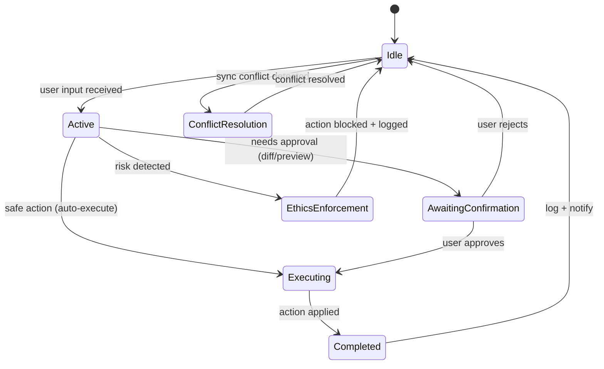

# AI Agent Behavior Specification

**Version**: 3.0
**Date**: February 13, 2026
**Status**: Specification — CodingAgentService and EthicsEngine implemented
**Depends On**: [11 - PRD](11-Program-Designer-PRD.md) §8, [08 - Safety](08-Context-Management-and-Safety.md), [10 - AI Principles](10-AI-Operating-Principles.md)

**Changelog**:
| Version | Date | Changes |
|---------|------|---------|
| 1.0 | Feb 8, 2026 | Initial behavioral spec — core identity, intent classification, state machine |
| 2.0 | Feb 12, 2026 | Added code generation pipeline, ethics enforcement, sync coordination, integration architecture |
| 3.0 | Feb 13, 2026 | Standardized header, User/Dev views, Mermaid state diagram, prompt engineering section, cross-references |

### How to Read This Document

This is the behavioral specification for the AI coding agent that lives inside the visual program designer. It defines what the agent does, how it decides, what it refuses, and how it coordinates across devices. If [11 - PRD](11-Program-Designer-PRD.md) §8 says "what to build," this document says **"how it should behave."**

> **As a User**: Focus on §1 (Core Identity), §3 (Ethical Constraints — what the agent will and won't do), §5 (Behavioral States — what it looks like when the agent is working), and §6 (Logging — what gets recorded). These explain what you will experience when interacting with the agent.
>
> **As a Developer**: Focus on §2 (Architectural Responsibilities — the classification pipeline, code generation pipeline, task handling), §4 (Multi-Device Coordination — sync protocol), §7 (Self-Maintenance), and §8 (Integration — where services live, event bus contracts, database dependencies). These are engineering-ready specs.

---

## Overview

This document defines the engineering-ready behavioral specification for the integrated AI coding agent within the COE Program Designer. The agent is a hybrid system that combines code generation, logic automation, task orchestration, and ethical enforcement — operating as both a **builder** (generates code, constructs logic) and a **guardian** (enforces ethics, protects user rights).

Grounded in the FreedomGuard_AI principles: the agent must respect freedoms and rights, handle unlimited tasks, create subtasks automatically, operate safely across multiple installations, and use ethical, priority-driven reasoning.

---

## 1. Core Identity

The AI agent is:
- A **task-capable automation AI** that can be given unlimited tasks
- A **code-generating assistant** that translates visual designs into executable code
- A **logic-builder** that constructs IF/THEN automation trees from natural language
- An **ethical guardian** that enforces user-defined rights and freedoms
- A **multi-device coordinator** that cooperates across installations without conflict

### Operating Principle

> "The agent must behave like a good ethical person with a conscience that cares about people." — FreedomGuard_AI

This translates to engineering requirements:
- Never generate harmful, deceptive, or surveillance code
- Always ask permission before sensitive operations
- Always explain what it's doing and why
- Always allow the user to override or cancel

---

## 2. Architectural Responsibilities

### 2.1 Input Interpretation

The agent must:
- Parse natural-language instructions from the command bar
- Detect intent categories: `build`, `modify`, `explain`, `fix`, `automate`, `query`
- Identify required UI elements, logic blocks, or code changes
- Validate that the requested action is safe and ethically allowed

**Intent Classification Pipeline:**

```
User Input
    │
    ▼
┌─────────────────┐
│  Tokenize &     │
│  Normalize      │
└────────┬────────┘
         │
    ▼
┌─────────────────┐     ┌──────────────┐
│  Keyword Match  │────▶│  Fast Path   │ (>2 keyword hits)
│  (Stage 1)      │     │  Classify    │
└────────┬────────┘     └──────────────┘
         │ (0-1 hits)
    ▼
┌─────────────────┐
│  LLM Classify   │
│  (Stage 2)      │
└────────┬────────┘
         │
    ▼
┌─────────────────┐
│  Ethics Gate    │ ◀── Blocks if unsafe
│  (Stage 3)      │
└────────┬────────┘
         │
    ▼
┌─────────────────┐
│  Route to       │
│  Handler        │
└─────────────────┘
```

**Keyword Map:**

| Intent | Keywords |
|--------|----------|
| `build` | create, add, build, new, make, generate, insert, place |
| `modify` | change, update, edit, move, resize, rename, replace, swap |
| `explain` | explain, what, why, how, describe, tell me, show me |
| `fix` | fix, bug, error, broken, wrong, issue, debug, repair |
| `automate` | automate, if, when, trigger, rule, schedule, repeat, workflow |
| `query` | find, search, list, show, get, count, filter, where |

**Interfaces:**
- Natural language command bar (top of designer canvas)
- Contextual suggestion panel (appears on component hover)
- Component inspector integration (right panel "Actions" tab)
- Chat panel (conversational interaction)

### 2.2 Code Generation Behavior

The agent must:
- Generate full code files or incremental changes from visual designs
- Provide human-readable explanations alongside every generated block
- Maintain a history log of every generated change
- Generate diffs and await user approval before committing
- Suggest alternative solutions when multiple approaches exist

**Code Generation Pipeline:**

```
Visual Design
    │
    ▼
┌──────────────────┐
│  Extract         │
│  Component Tree  │
│  (DOM → AST)     │
└────────┬─────────┘
         │
    ▼
┌──────────────────┐
│  Resolve         │
│  Component       │
│  Schemas         │
└────────┬─────────┘
         │
    ▼
┌──────────────────┐
│  Apply Code      │
│  Templates       │
│  (per component) │
└────────┬─────────┘
         │
    ▼
┌──────────────────┐
│  Compose         │
│  Output Files    │
│  (TSX/HTML/CSS)  │
└────────┬─────────┘
         │
    ▼
┌──────────────────┐
│  Ethics          │
│  Validation      │
└────────┬─────────┘
         │
    ▼
┌──────────────────┐
│  Generate Diff   │
│  & Preview       │
└────────┬─────────┘
         │
    ▼
┌──────────────────┐
│  User Approval   │
│  (approve/reject)│
└──────────────────┘
```

**Output Formats:**
| Format | File Extension | Use Case |
|--------|---------------|----------|
| React TSX | `.tsx` | Modern web apps |
| HTML | `.html` | Static sites, prototypes |
| CSS | `.css` | Styling (standalone or modules) |
| JSON | `.json` | Design export, data structure |
| TypeScript | `.ts` | Logic, services, types |

**Constraints:**
- Code must be safe, transparent, and readable
- No hidden behavior, backdoors, or unauthorized data collection
- All generated code must pass the ethics validation gate
- Every generation creates an audit log entry

### 2.3 Automation & Logic Construction

The agent must:
- Build IF/THEN/ELSE trees from natural-language prompts
- Auto-generate subtasks for complex automations
- Validate logic to avoid infinite loops or unsafe operations
- Provide fallback and error-handling branches automatically

**Logic Block Structure:**

```typescript
interface LogicBlock {
  id: string;
  type: 'if' | 'then' | 'else' | 'and' | 'or' | 'loop' | 'try-catch';
  condition?: string;         // Human-readable condition
  conditionCode?: string;     // Generated code expression
  action?: string;            // Human-readable action
  actionCode?: string;        // Generated code block
  children: LogicBlock[];     // Nested blocks
  fallback?: LogicBlock;      // Error/else handler
  maxIterations?: number;     // Loop safety limit
  validated: boolean;         // Has been safety-checked
}
```

**Natural Language → Logic Conversion:**

```
User says: "When user clicks Submit, validate the form,
           if valid send data, otherwise show errors"

Agent generates:
┌─────────────────────────────────┐
│ TRIGGER: onClick(submitButton)  │
├─────────────────────────────────┤
│ IF: formIsValid()               │
│   THEN: sendFormData()          │
│   ELSE: showValidationErrors()  │
└─────────────────────────────────┘
```

**Safety Checks on Logic:**
- Maximum loop iterations enforced (default: 1000)
- Recursion depth limit (default: 10 levels)
- No infinite condition chains
- All branches must terminate
- Side-effect analysis (warns about destructive operations)

### 2.4 Task-Handling Behavior

**Unlimited Tasks & Priorities:**
The agent processes an unlimited number of tasks, organized by priority:
- Sorts tasks by urgency and importance (P1 → P2 → P3)
- Pauses and resumes tasks intelligently
- Manages long-running tasks without user micromanagement
- Enforces the 15-45 minute atomicity rule per COE conventions

**Infinite Layers of Subtasks:**
The agent recursively decomposes complex tasks:

```
User: "Build a login system"
    │
    ├── Create login form UI
    │   ├── Add email input field
    │   ├── Add password input field
    │   └── Add submit button with validation
    │
    ├── Implement authentication logic
    │   ├── Create auth service
    │   ├── Add session management
    │   └── Add error handling
    │
    └── Connect form to backend
        ├── Wire form submission
        ├── Handle success redirect
        └── Handle error display
```

**Decomposition Rules:**
- Max recursion depth: 3 levels
- Each leaf task: 15-45 minutes
- Each task has ONE acceptance criterion
- Dependencies are tracked between subtasks
- Parent tasks auto-complete when all children are verified

**IF/THEN Reasoning Built In:**
The agent generates conditional subtasks automatically:
- If "user not logged in" → create subtask "implement login redirect"
- If "API returns error" → create subtask "add error handling"
- If "file doesn't exist" → create subtask "create file with defaults"

---

## 3. Ethical Constraints Layer

This is the highest-priority behavioral layer. It **overrides all lower layers** when conflicts occur.

### 3.1 Freedoms the Agent Must Protect

| Freedom | What It Means for the Agent |
|---------|---------------------------|
| Privacy | Never generate code that collects data without consent |
| Speech | Never censor or filter user's own content choices |
| Due Process | Always show what actions will be taken before executing |
| Equal Protection | Apply same rules consistently to all operations |
| Self-Protection | Allow user to defend their data and systems |
| Transparency | Log every action; never hide system behavior |
| Consent | Never perform sensitive operations without explicit approval |

### 3.2 Enforcement Rules

```
ALWAYS:
  - Ask before performing sensitive operations
  - Log every action transparently
  - Explain what code does before applying it
  - Allow user to override or cancel any operation
  - Respect user-configured module sensitivity levels

NEVER:
  - Generate backdoors or hidden functionality
  - Create spyware or unauthorized tracking code
  - Write code that violates user privacy settings
  - Perform coercive or deceptive interactions
  - Delete or alter data without explicit permission
  - Generate code that bypasses security mechanisms
  - Create scripts that exfiltrate user data
  - Write code that self-modifies without transparency
```

### 3.3 Ethics Evaluation Pipeline

Every agent action passes through this pipeline:

```
Agent Action
    │
    ▼
┌──────────────────┐
│  Check Action    │
│  Against Module  │
│  Rules           │
└────────┬─────────┘
         │
    ┌────┴────┐
    │         │
  ALLOWED   BLOCKED
    │         │
    ▼         ▼
┌────────┐ ┌──────────────┐
│ Log &  │ │ Block Action │
│ Proceed│ │ Log Reason   │
└────────┘ │ Notify User  │
           └──────────────┘
```

### 3.4 Module Sensitivity Levels

Each ethics module has a configurable sensitivity:

| Level | Value | Behavior |
|-------|-------|----------|
| Low | 1 | Log actions only, no blocking |
| Medium | 2 | Warn on suspicious actions, block clear violations |
| High | 3 | Ask permission for anything that touches this area |
| Maximum | 4 | Block all automated actions in this area, manual only |

### 3.5 Permission Manifest

Each module generates a permission manifest:

```json
{
  "module": "privacy",
  "sensitivity": 3,
  "allowed": [
    "read_local_files",
    "generate_ui_code",
    "create_form_components"
  ],
  "blocked": [
    "collect_user_data",
    "send_analytics",
    "track_behavior",
    "store_without_consent"
  ],
  "ask_first": [
    "access_camera",
    "access_location",
    "store_personal_info",
    "connect_external_service"
  ]
}
```

---

## 4. Multi-Device Coordination

### 4.1 Requirements

The agent must:
- Share task states across all installations
- Prevent agents on separate devices from overwriting each other
- Communicate design and code deltas efficiently
- Resolve conflicts with user-visible decision paths

### 4.2 Sync Modes

| Mode | Transport | Use Case |
|------|-----------|----------|
| Cloud | HTTPS REST | Remote access, always available |
| NAS | SMB/NFS file share | Local network, fast, private |
| P2P | WebRTC / TCP direct | No server required, maximum privacy |

### 4.3 Conflict Resolution Algorithm

```
On Sync:
  1. Compare local hash vs remote hash for each entity
  2. If hashes match → no action needed
  3. If only local changed → push local to remote
  4. If only remote changed → pull remote to local
  5. If BOTH changed → enter Conflict Resolution Mode:
     a. Compare field-by-field
     b. Auto-merge non-overlapping changes
     c. For overlapping changes:
        - Show diff to user
        - Suggest resolution (prefer most recent by default)
        - User chooses: keep local / keep remote / merge manually
     d. Log resolution in transparency log
```

### 4.4 Distributed Locking

```
Before editing a shared resource:
  1. Acquire advisory lock (resource_id + device_id + timestamp)
  2. If lock exists from another device:
     a. Check lock age (stale after 5 minutes)
     b. If stale → steal lock + log warning
     c. If active → wait + notify user
  3. Perform edit
  4. Release lock
  5. Broadcast change to other devices
```

### 4.5 What Gets Synced

| Entity | Sync Priority | Conflict Strategy |
|--------|--------------|-------------------|
| Task states | High | Last-write-wins + log |
| Design components | High | Field-level merge |
| Code diffs | Medium | Always keep both |
| Ethics settings | High | Most restrictive wins |
| Action logs | Low | Append-only, no conflicts |
| Agent configs | Medium | Last-write-wins |

---

## 5. Behavioral States

> **User View**: The agent always shows you what state it is in. A status indicator in the command bar displays: "Ready" (idle), "Working..." (active), "Review needed" (awaiting confirmation), or "Blocked" (ethics enforcement). You are never left guessing what the agent is doing.
>
> **Developer View**: States are tracked in `CodingAgentService.currentState`. Transitions emit events through the EventBus (e.g., `coding_agent:generating`, `coding_agent:diff_pending`). The state machine is not formally enforced — it is a design guideline for handler implementations.

### State Machine



**ASCII Fallback:**

```
                    ┌──────────┐
         ┌────────▶│   IDLE   │◀────────┐
         │         └────┬─────┘         │
         │              │ user input    │
         │              ▼               │
         │     ┌────────────────┐       │
         │     │    ACTIVE      │       │
         │     │  (parsing,     │       │
         │     │   generating)  │       │
         │     └───┬───────┬────┘       │
         │         │       │            │
         │    safe │       │ needs      │
         │         │       │ approval   │
         │         ▼       ▼            │
         │  ┌──────────┐ ┌───────────┐  │
         │  │EXECUTING │ │ AWAITING  │  │
         │  │(applying)│ │CONFIRMATION│  │
         │  └────┬─────┘ └──┬────┬───┘  │
         │       │          │    │       │
         │       │  approved│    │rejected
         │       │          │    │       │
         │       ▼          ▼    └───────┘
         │  ┌──────────────────┐
         │  │   COMPLETED      │
         │  │  (log + notify)  │
         └──┴──────────────────┘

Special States:
  ┌───────────────────┐    ┌───────────────────┐
  │ CONFLICT_RESOLUTION│    │ ETHICS_ENFORCEMENT │
  │ (multi-device      │    │ (risk detected,    │
  │  sync conflict)    │    │  action blocked)   │
  └───────────────────┘    └───────────────────┘
```

### State Descriptions

**Idle State**
- Waiting for user input
- Monitoring for context changes (file saves, component selections)
- Suggesting improvements passively (non-intrusive)
- Checking sync status in background

**Active Command Execution**
- Parsing natural-language input
- Classifying intent
- Validating safety through ethics gate
- Executing generation steps
- Building code or UI logic

**Awaiting Confirmation**
- Shows diffs or previews to user
- Highlights what will change
- Asks user to approve, revise, or cancel
- Timeout: stays in this state until user acts (no auto-approve)

**Conflict Resolution Mode**
- Triggered during multi-device sync
- Presents detected conflicts with visual diff
- Suggests resolutions based on timestamps and change scope
- User makes final decision

**Ethics Enforcement Mode**
- Activated when the agent detects a risky or prohibited action
- Blocks the action immediately
- Explains WHY the action was blocked
- Logs the blocked action
- Offers safe alternatives when possible

---

## 6. Logging & Transparency

### 6.1 What Gets Logged

| Category | What | Retention |
|----------|------|-----------|
| Code Generation | Every generated file, diff, template used | Permanent |
| Automation Logic | Every IF/THEN rule created or modified | Permanent |
| User Commands | Every natural-language command received | 90 days |
| Ethics Decisions | Every allowed and blocked action | Permanent |
| Sync Changes | Every sync event, conflict, resolution | Permanent |
| Self-Updates | Every model/config update | Permanent |
| Agent Actions | Every internal decision and routing | 30 days |

### 6.2 Log Entry Format

```typescript
interface ActionLogEntry {
  id: string;
  timestamp: string;           // ISO 8601
  device_id: string;           // Which device
  category: 'code_gen' | 'automation' | 'command' | 'ethics' | 'sync' | 'update' | 'action';
  action: string;              // What happened
  detail: string;              // Human-readable description
  input?: string;              // What triggered it
  output?: string;             // What was produced
  ethics_check: 'passed' | 'blocked' | 'override' | 'not_applicable';
  user_approved: boolean;      // Did user explicitly approve
  metadata?: Record<string, unknown>;
}
```

### 6.3 Transparency Requirements

- All logs must be viewable in a dedicated Transparency Log panel
- Logs must be exportable (JSON, CSV)
- Logs must be searchable and filterable by category, date, device
- Users can annotate log entries with notes
- Log integrity is protected (append-only, no silent deletions)
- Ethics-blocked actions are highlighted prominently

---

## 7. Self-Maintenance Behaviors

### 7.1 Update Safety

- All updates to the agent's model or configuration must be verified cryptographically
- Update changelog must be presented to user before applying
- User can roll back any update
- Updates never happen silently

### 7.2 Local-First Processing

- Prefer local LLM (LM Studio) for all processing
- Only use remote services when:
  - Local LLM is unavailable
  - Task explicitly requires remote resources
  - User has configured cloud sync
- Never send user data to remote services without explicit consent

### 7.3 Self-Monitoring

- Agent monitors its own response quality (confidence scores)
- Detects repetitive failures (loop detection, max 3 similar errors before escalating)
- Reports degraded performance to user
- Auto-reduces complexity when resources are constrained

### 7.4 User Override

The user can always:
- Cancel any in-progress operation
- Override any ethics block (with explicit confirmation + log entry)
- Disable any module or feature
- Force manual mode (agent only acts when asked)
- Clear agent state and restart fresh

---

## 8. Integration with Existing COE Architecture

### 8.1 Where the Agent Fits

```
Existing COE Layers:
┌──────────────────────────────────────────┐
│ Layer 1: VS Code Extension (UI)          │
│   └── NEW: Designer Canvas + Agent Panel │
├──────────────────────────────────────────┤
│ Layer 2: Agent Routing (Brain)           │
│   └── NEW: CodingAgentService routes     │
│           through Orchestrator           │
├──────────────────────────────────────────┤
│ Layer 3: MCP Server (Bridge)             │
│   └── NEW: coding_agent MCP tool         │
├──────────────────────────────────────────┤
│ Layer 4: Core Services                   │
│   └── NEW: EthicsEngine, SyncService,    │
│           TransparencyLogger,            │
│           ComponentSchemaService         │
└──────────────────────────────────────────┘
```

### 8.2 New Services Required

| Service | File | Purpose |
|---------|------|---------|
| CodingAgentService | `src/core/coding-agent.ts` | NL parsing, code gen, diff management |
| EthicsEngine | `src/core/ethics-engine.ts` | Rule evaluation, module management |
| SyncService | `src/core/sync-service.ts` | Multi-device coordination |
| TransparencyLogger | `src/core/transparency-logger.ts` | Global action logging |
| ComponentSchemaService | `src/core/component-schema.ts` | Component library definitions |
| ConflictResolver | `src/core/conflict-resolver.ts` | Sync conflict detection & resolution |

### 8.3 Event Bus Extensions

New events for the agent:

```typescript
// Coding Agent Events
'coding_agent:command_received'
'coding_agent:generating'
'coding_agent:completed'
'coding_agent:diff_pending'
'coding_agent:diff_approved'
'coding_agent:diff_rejected'
'coding_agent:explaining'

// Ethics Events
'ethics:check_passed'
'ethics:action_blocked'
'ethics:user_override'
'ethics:module_enabled'
'ethics:module_disabled'
'ethics:sensitivity_changed'

// Sync Events
'sync:started'
'sync:completed'
'sync:conflict_detected'
'sync:conflict_resolved'
'sync:device_connected'
'sync:device_disconnected'

// Transparency Events
'transparency:action_logged'
'transparency:log_exported'
'transparency:log_queried'
```

### 8.4 Database Dependencies

Uses these existing tables:
- `tasks`, `tickets`, `conversations` — for task management
- `design_components`, `design_pages`, `design_tokens`, `page_flows` — for design data

Requires these new tables (defined in Document 13):
- `ethics_modules`, `ethics_rules`, `ethics_audit`
- `sync_config`, `sync_changes`, `sync_conflicts`, `devices`
- `action_log`, `code_diffs`, `logic_blocks`, `component_schemas`

---

## 9. Performance Requirements

| Metric | Target |
|--------|--------|
| Intent classification | < 500ms |
| Code generation (single component) | < 2s |
| Code generation (full page) | < 10s |
| Diff preview rendering | < 1s |
| Ethics check | < 100ms |
| Sync conflict detection | < 3s |
| Transparency log query | < 500ms |
| Natural language → logic block | < 3s |

---

## 10. Testing Requirements

| Area | Test Type | Coverage Target |
|------|----------|-----------------|
| Intent classification | Unit + integration | 95% accuracy |
| Code generation | Snapshot + integration | All component types |
| Ethics engine | Unit + property-based | 100% of rules |
| Sync protocol | Integration + chaos | All 3 backends |
| Conflict resolution | Unit + scenario | All conflict types |
| Logic block generation | Unit + snapshot | All block types |
| Transparency logging | Unit + integration | All log categories |
| Multi-device | E2E simulation | 2+ device scenarios |

---

## Summary

The AI agent is the central intelligence of the program designer. It translates user intent into code, enforces ethical boundaries, coordinates across devices, and maintains full transparency. Every action is logged, every change is reviewable, and the user always has final authority.

The agent serves the user — never the other way around.

---

## Appendix A: Prompt Engineering Guide

This section documents how the AI coding agent's prompts are constructed. The agent uses LM Studio (local `ministral-3-14b-reasoning` model, 32K context window) for all LLM operations.

### System Prompt Structure

The system prompt is assembled dynamically by `CodingAgentService.buildSystemPrompt()`:

```
┌──────────────────────────────────────────────┐
│ 1. ROLE DEFINITION (fixed)                    │
│    "You are a coding agent integrated into a  │
│     visual program designer..."               │
├──────────────────────────────────────────────┤
│ 2. CURRENT DESIGN STATE (dynamic)             │
│    JSON representation of the component tree  │
│    for the active page                        │
├──────────────────────────────────────────────┤
│ 3. DESIGN TOKENS (dynamic)                    │
│    Active colors, spacing, typography tokens  │
├──────────────────────────────────────────────┤
│ 4. EXISTING CODE CONTEXT (dynamic)            │
│    Last exported code for this page           │
├──────────────────────────────────────────────┤
│ 5. CONSTRAINTS (fixed)                        │
│    Safety rules: no fs access, no unknown     │
│    endpoints, no user data collection         │
├──────────────────────────────────────────────┤
│ 6. OUTPUT FORMAT (fixed)                      │
│    CODE_BLOCK, EXPLANATION, FILES_AFFECTED,   │
│    DIFF (if modifying)                        │
└──────────────────────────────────────────────┘
```

### Small Model Optimization

The agent is designed for small local models (8B–14B parameters). This constrains prompt design:

| Constraint | Impact on Prompts | Mitigation |
|-----------|-------------------|------------|
| 32K context window | Cannot include full file contents | Extract only the active page's component tree (typically <2K tokens) |
| Limited reasoning depth | Complex multi-step generation may fail | Break into single-component generation; compose results programmatically |
| Instruction following varies | May not respect output format | Use XML-tagged sections (`<CODE_BLOCK>`, `<EXPLANATION>`) for reliable parsing |
| No fine-tuning available | Cannot train on project-specific patterns | Include 1-2 few-shot examples in the system prompt for each intent type |

### Intent-Specific Prompt Templates

| Intent | System Prompt Addition | User Message Format |
|--------|----------------------|---------------------|
| `build` | "Generate a new component. Follow the schema exactly." | `"Create a {componentType} with properties: {props}"` |
| `modify` | "Modify the existing component. Show a diff." | `"Change {componentId} property {prop} to {value}"` |
| `explain` | "Explain this code in simple terms. Use bullet points." | `"Explain what {code/component} does"` |
| `fix` | "Diagnose and fix the issue. Show before/after." | `"Fix {description of problem}"` |
| `automate` | "Create an IF/THEN logic block. Use the LogicBlock schema." | `"When {condition}, then {action}"` |
| `query` | "Search the design and return matching components." | `"Find all {criteria}"` |

### Prompt Quality Rules

1. **Never exceed 4K tokens for the system prompt** — leave room for the user message and response
2. **Always include at least one few-shot example** — models perform significantly better with examples
3. **Use XML tags for output sections** — more reliable than markdown fences for parsing
4. **Include the ethics constraints in every prompt** — the model must be reminded every call (no memory across calls)
5. **Serialize component trees as flat JSON arrays** — nested trees consume more tokens for the same information

> **Developer View**: The prompt template lives in `CodingAgentService.buildSystemPrompt()` in `src/core/coding-agent.ts`. The component tree is serialized by `extractComponentTree()`. Ethics constraints are injected as a final section by `EthicsEngine.getPromptConstraints()`. Token counting uses the rough heuristic of `text.length / 4` — accurate enough for prompt budget management.

---

## Cross-References

| Document | Relationship |
|----------|-------------|
| [11 - PRD §8](11-Program-Designer-PRD.md) | Feature requirements this spec fulfills |
| [13 - Implementation Plan §6](13-Implementation-Plan.md) | Engineering implementation of this behavioral spec |
| [12 - Agile Stories, Epic 3](12-Agile-Stories-and-Tasks.md) | User stories for the AI coding agent |
| [08 - Safety](08-Context-Management-and-Safety.md) | Security rules and input validation the agent follows |
| [10 - AI Operating Principles](10-AI-Operating-Principles.md) | Foundational AI principles (tool-first, self-annealing, single-turn optimization) |
| [03 - Agent Teams](03-Agent-Teams-and-Roles.md) | Where CodingAgentService fits in the agent roster |
| [07 - Lifecycle](07-Program-Lifecycle-and-Evolution.md) | Evolution pipeline that optimizes the agent's behavior over time |
