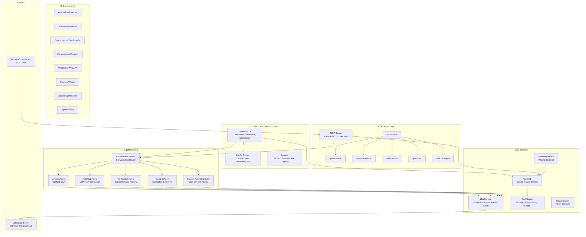
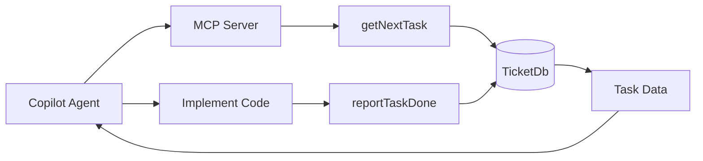
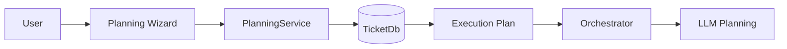

# COE Architecture Document

**Version**: 2.0  
**Date**: February 9, 2026  
**Status**: Current  
**Cross-References**: [Agent Role Definitions](02-Agent-Role-Definitions.md), [Workflow Orchestration](03-Workflow-Orchestration.md), [MCP API Reference](05-MCP-API-Reference.md)

---

## Overview

The **Copilot Orchestration Extension (COE)** is a VS Code extension that coordinates multiple AI agents to execute plan-driven development workflows. The system integrates an MCP (Model Context Protocol) server, specialized agent routing, and a local LLM backend (LM Studio) to automate software development tasks.

### Goals
- Enable autonomous task execution via GitHub Copilot agent workflow through MCP server
- Maintain plan-code synchronization through ticket-based task management
- Route conversations to specialized agents (Answer, Planning, Verification, Research, Custom)
- Provide visual tools for planning, conversation, verification, and custom agent creation
- Support local LLM inference with configurable models and streaming responses

---

## System Architecture Diagram



---

## Core Components

### 1. VS Code Extension Layer

#### Extension Entry Point
**File**: `src/extension.ts`

**Responsibilities**:
- Register 43 commands with VS Code API
- Initialize all services in dependency order
- Set up tree view providers and webview panels
- Configure MCP server for Copilot integration
- Handle extension deactivation and cleanup

#### Initialization Order
Services initialize in this specific order due to dependencies:
1. `initializeLogger(context)` — output channel + file logger
2. `initializeConfig(context)` — load/validate `.coe/config.json`
3. `initializeTicketDb(context)` — SQLite database
4. `initializeOrchestrator(context)` — conversation router
5. `initializePlanningService(context)` — wizard backend
6. `registerPlanningCommands(context)` — plan-related commands
7. `initializePeriodicCleanup(1, 7)` — old data cleanup
8. `initializeAnswerAgent()` — Q&A agent
9. `initializeLLMService(context)` — LLM API client
10. `initializeMCPServer()` — JSON-RPC server
11. `setupAutoPlanning()` — automatic plan generation
12. Tree view providers — UI last

#### Config System
**Files**: `src/config/schema.ts`, `src/config/loader.ts`, `src/config/service.ts`, `src/config/watcher.ts`

**Features**:
- Zod schema validation with typed defaults
- File watcher on `.coe/config.json` for live reloading
- First-run onboarding via `src/config/onboarding.ts`
- All config fields have `.default()` values for zero-config startup

**Key Config**:
```json
{
  "llm": {
    "endpoint": "http://127.0.0.1:1234/v1",
    "model": "ministral-3-14b-reasoning",
    "timeoutSeconds": 60,
    "maxTokens": 2048
  }
}
```

---

### 2. Agent Routing

#### OrchestratorService
**File**: `src/services/orchestrator.ts` (~1293 lines)

The single orchestrator handles all conversation routing. It analyzes user input and routes to the appropriate agent:

- `routeConversation(query)` — main entry point, classifies intent
- `routeToPlanningAgent(ticketId)` — generates task plans via LLM
- `routeToVerificationAgent(ticketId)` — semantic code review via LLM
- `reportTaskDone(ticketId, summary)` — task completion with plan persistence

#### Agent Types
| Agent | File(s) | Purpose |
|-------|---------|---------|
| **AnswerAgent** | `src/agents/answerAgent.ts`, `src/agents/answer/` | Conversational Q&A with history pruning |
| **Planning** | `routeToPlanningAgent()` in orchestrator.ts | Single LLM call for plan generation |
| **Verification** | `routeToVerificationAgent()` in orchestrator.ts | Semantic review of code changes |
| **ResearchAgent** | `src/agents/researchAgent.ts` | Information gathering and analysis |
| **ClarityAgent** | `src/agents/clarity/` (4 files) | Follow-up question scoring and triggers |
| **Custom Agents** | `src/agents/custom/` (4 files) | User-defined agents with hardlock enforcement |

#### Custom Agent System
**Files**: `src/agents/custom/executor.ts`, `hardlock.ts`, `schema.ts`, `storage.ts`

- Users create agents via Custom Agent Builder webview
- Agents stored as JSON in `.coe/agents/custom/{name}/config.json`
- Executor supports streaming, history, timeouts, hardlock policy
- Executed via `coe.executeCustomAgent` command or gallery Run button

---

### 3. MCP Server Layer

**Files**: `src/mcpServer/mcpServer.ts`, `src/mcpServer/integration.ts`, `src/mcpServer/tools/`

**Protocol**: JSON-RPC 2.0 over stdio transport

**Registered Tools** (5):
| Tool | Purpose |
|------|---------|
| `getNextTask` | Returns next available task for Copilot agent |
| `reportTaskDone` | Reports task completion with summary |
| `askQuestion` | Routes questions through orchestrator |
| `getErrors` | Retrieves current build/lint errors |
| `callCOEAgent` | Invokes a specific COE agent by name |

See [MCP API Reference](05-MCP-API-Reference.md) for complete tool specifications.

---

### 4. Data Persistence

#### TicketDb
**Files**: `src/services/ticketDb.ts`, `src/services/ticketDb/` (18 modular files)

**Storage**: SQLite (via `sqlite3` async driver) with in-memory fallback

**Features**:
- Full CRUD for tickets with 10 status states
- EventEmitter for change notifications (drives UI updates)
- Parameterized queries (SQL injection safe)
- Transaction support for atomic operations
- Migration system for schema evolution

#### TaskQueue
**Files**: `src/services/taskQueue/` (5 files)

- Priority-based task ordering
- Dependency graph tracking between tasks
- In-memory only (populated from ticket data)

---

### 5. LLM Integration

#### LLMService
**File**: `src/services/llmService.ts`

**Features**:
- OpenAI-compatible API client (targets LM Studio)
- Streaming responses via `completeLLMStreaming()`
- Non-streaming via `completeLLM()`
- AbortController timeouts (config-driven)
- Graceful offline degradation (try/catch with fallback messages)

#### LLM Subsystem
**Files**: `src/llm/` (16 files)

- Agent loop with tool calling support
- Model selector for routing to appropriate models
- Streaming buffer management
- Tool bridge for function calling

---

### 6. UI Components

#### Tree View Providers
| Provider | View ID | Purpose |
|----------|---------|---------|
| `AgentsTreeDataProvider` | `coe-agents` | Shows available agent list |
| `TicketsTreeDataProvider` | `coe-tickets` | Lists all tickets with status |
| `ConversationsTreeDataProvider` | `coe-conversations` | Shows conversation threads |

#### Webview Panels
| Panel | File | Purpose |
|-------|------|---------|
| `ConversationWebviewPanel` | `src/ui/conversationWebview.ts` | Chat interface with agents |
| `VerificationWebviewPanel` | `src/ui/verificationWebview.ts` | Checklist-based verification UI |
| `PlanningWizardPanel` | `src/ui/planningWizard.ts` | 7-page interactive plan builder |
| `CustomAgentBuilder` | `src/ui/customAgentBuilder.ts` | Agent creation/editing form |
| `AgentGallery` | `src/ui/agentGallery.ts` | Browse built-in + custom agents |

#### Additional UI
- `src/ui/statusBarProvider.ts` — Status bar integration
- `src/ui/dependencyGraph.ts` — Block-based dependency visualization
- `src/ui/blockCanvas.ts` — Visual block editor

**Technology**: TypeScript with raw HTML webview strings. No frontend frameworks (no Vue, React, or Tailwind). Uses VS Code CSS variables for theming.

---

## Data Flow Patterns

### Pattern 1: User Query → Agent Response


### Pattern 2: MCP Task Execution (Copilot Agent)



### Pattern 3: Planning Wizard → Execution



---

## Performance Targets

| Metric | Target | Notes |
|--------|--------|-------|
| Extension activation | < 2s | Measured in production mode |
| UI responsiveness | < 200ms | Command palette and tree views |
| MCP tool call latency | < 500ms | Excluding LLM inference time |
| Test suite runtime | < 60s | 7,481 tests across 180 suites |
| Webview first paint | < 500ms | All 5 webview panels |
| DB query time | < 100ms | With 1000+ tickets |

---

## Testing Architecture

### Test Framework
- **Framework**: Jest (ts-jest preset)
- **Runner**: `npx jest` with `forceExit: true`
- **Coverage**: Istanbul via Jest (`--coverage`)

### Test Stats
- **Total Tests**: 7,481 passing, 0 failures
- **Test Suites**: 180
- **Coverage**: 93.61% lines, 94.34% functions, 82.20% branches
- **Test Files**: ~169 TypeScript test files

### Build System
```
Source:  src/**/*.ts
Build:   tsc -p ./tsconfig.json
Output:  out/extension.js (CommonJS)
Entry:   out/extension.js (declared in package.json "main")
```

No webpack or bundler — plain TypeScript compilation via `tsc`.

---

## Project Structure

```
src/
├── extension.ts         Entry point, command registration
├── logger.ts            Logging service
├── agents/
│   ├── answerAgent.ts   Conversational Q&A
│   ├── researchAgent.ts Information gathering
│   ├── answer/          Answer agent subsystem
│   ├── clarity/         Follow-up question scoring
│   ├── custom/          User-defined agent system
│   │   ├── executor.ts  Agent execution engine
│   │   ├── hardlock.ts  Safety constraints
│   │   ├── schema.ts    Zod validation
│   │   └── storage.ts   File persistence
│   └── verification/
│       ├── checklist.ts Verification checklists
│       └── devServer.ts Dev server management
├── config/              Zod schema, loader, watcher
├── errors/              Error code enums
├── generators/          Code/project generators
├── llm/                 LLM subsystem (16 files)
├── mcpServer/           JSON-RPC 2.0 server + tools
├── planning/            Planning commands and schemas
├── services/
│   ├── orchestrator.ts  Main conversation router
│   ├── ticketDb.ts      SQLite database
│   ├── llmService.ts    LLM API client
│   ├── planningService.ts Wizard backend
│   ├── taskQueue/       Priority task management
│   ├── ticketDb/        Modular DB subsystem
│   ├── cache/           Response caching
│   └── context/         Context building
└── ui/
    ├── agentGallery.ts       Agent marketplace
    ├── customAgentBuilder.ts Agent creation form
    ├── conversationWebview.ts Chat interface
    ├── verificationWebview.ts Verification UI
    ├── planningWizard.ts     7-page wizard
    └── ...                   Tree providers, status bar
```

---

## References

- [Agent Role Definitions](02-Agent-Role-Definitions.md)
- [Workflow Orchestration](03-Workflow-Orchestration.md)
- [Data Flow & State Management](04-Data-Flow-State-Management.md)
- [MCP API Reference](05-MCP-API-Reference.md)

**Document Status**: Current (v2.0 — rewritten to match actual codebase)  
**Last Updated**: February 9, 2026  
**Previous Version**: v1.0 (January 17, 2026) — aspirational draft, mostly obsolete
