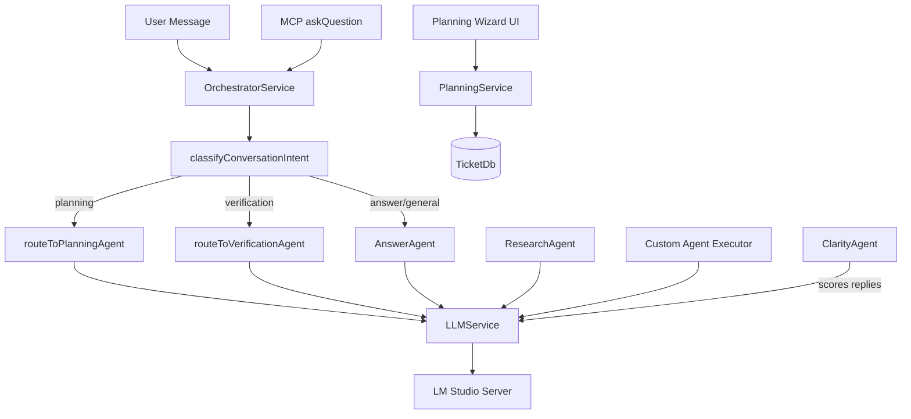

# COE Agent Role Definitions

**Version**: 3.0
**Date**: February 9, 2026
**Status**: Current — rewritten to match actual codebase
**Cross-References**: [Architecture Document](01-Architecture-Document.md), [MCP API Reference](05-MCP-API-Reference.md)

> **Note**: v2.1 (February 1, 2026) described aspirational agent architecture with PHP references,
> YAML config files, and formal handoff protocols. Much of that was never implemented.
> Three agent subsystems were deleted as dead code (PR-049, PR-050, PR-051).
> This v3.0 documents only what actually exists in the codebase.

---

## Overview

COE coordinates multiple AI agents through a central **OrchestratorService** that classifies user messages and routes them to the appropriate agent. All agents ultimately call the **LLMService** which connects to a local LLM server (LM Studio) via an OpenAI-compatible API.

### Agent Inventory

| # | Agent | Status | Location | Purpose |
|---|-------|--------|----------|---------|
| 1 | **OrchestratorService** | ✅ Active | `src/services/orchestrator.ts` | Conversation router and task manager |
| 2 | **AnswerAgent** | ✅ Active | `src/agents/answerAgent.ts` | Conversational Q&A with history |
| 3 | **Planning Route** | ✅ Active | `routeToPlanningAgent()` in orchestrator.ts | LLM-based plan generation |
| 4 | **Verification Route** | ✅ Active | `routeToVerificationAgent()` in orchestrator.ts | Semantic code review (PASS/FAIL) |
| 5 | **ResearchAgent** | ✅ Active | `src/agents/researchAgent.ts` | Information gathering reports |
| 6 | **ClarityAgent** | ✅ Active | `src/agents/clarity/` (4 files) | Follow-up question scoring |
| 7 | **Custom Agent Executor** | ✅ Active | `src/agents/custom/` (4 files) | User-defined agent execution |
| 8 | **AnswerTeam** | 🔌 Built, Disconnected | `src/agents/answer/` (12+ files) | Rich Q&A with confidence scoring |
| 9 | **Planning Wizard** | ✅ Active | `src/planning/` + `src/services/planningService.ts` | UI-driven planning (separate from route) |

### Architecture Diagram



---

## Agent 1: OrchestratorService (Conversation Router)

### Role
Central routing hub that classifies incoming messages and dispatches them to specialized agent handlers. Also manages the task queue and auto-planning.

### File
`src/services/orchestrator.ts` (~1293 lines)

### Singleton Pattern
```typescript
let instance: OrchestratorService | null = null;
export async function initializeOrchestrator(context): Promise<void> { ... }
export function getOrchestratorInstance(): OrchestratorService { ... }
export function resetForTests(): void { instance = null; }
```

### Key Methods

| Method | Purpose |
|--------|---------|
| `routeConversation(query, ticketId?)` | Main entry — classifies and routes |
| `classifyConversationIntent(message)` | LLM call to determine planning/verification/answer |
| `routeToPlanningAgent(ticketId)` | Generate task plan via LLM |
| `routeToVerificationAgent(ticketId)` | Semantic code review via LLM |
| `routeToAnswerAgent(query, ticketId)` | Route to AnswerAgent |
| `answerQuestion(question)` | Direct Q&A (from MCP `askQuestion`) |
| `reportTaskDone(ticketId, summary)` | Complete task, persist plan, optionally verify |
| `setupAutoPlanning()` | Watch for new tickets, auto-generate plans |

### System Prompts
The orchestrator uses three built-in system prompts:

- **PLANNING_SYSTEM_PROMPT**: "Break coding tasks into small atomic steps (15-25 min each)..."
- **VERIFICATION_SYSTEM_PROMPT**: "Review code changes for quality, correctness, security..."
- **ANSWER_SYSTEM_PROMPT**: "Answer development questions with context and examples..."

### Routing Flow
1. User sends message (via command, webview, or MCP)
2. `classifyConversationIntent()` sends the message to LLM with classification prompt
3. LLM returns intent: `planning`, `verification`, or `answer`
4. Message routed to appropriate handler
5. Response returned to caller (displayed in webview or sent via MCP)

### Constraints
- Single instance (singleton pattern)
- Graceful LLM offline handling (try/catch with fallback messages)
- Task timeout detection via `taskTimeoutSeconds` for stuck tasks

---

## Agent 2: AnswerAgent (Conversational Q&A)

### Role
Handles conversational Q&A with multi-turn history management. The primary agent for answering user questions about code, tasks, and development.

### File
`src/agents/answerAgent.ts` (~430 lines)

### Singleton Pattern
```typescript
export function initializeAnswerAgent(): void { ... }
export function getAnswerAgentInstance(): AnswerAgent { ... }
```

### Capabilities
- **Multi-turn conversation**: Maintains conversation history per ticket
- **History pruning**: Automatically trims old messages to stay within LLM context window
- **System prompt**: Uses `ANSWER_SYSTEM_PROMPT` from orchestrator
- **Graceful degradation**: Returns fallback message if LLM is offline

### How It Works
1. Receives query + optional ticket context from orchestrator
2. Builds conversation history from previous interactions
3. Calls `completeLLM(query, { systemPrompt, messages })` with history
4. Returns plain text response
5. Stores response in conversation history for future turns

### Limitations
- No confidence scoring (the disconnected `AnswerTeam` has this)
- No structured evidence/citations in responses
- No codebase search — relies on LLM's training data + context provided

---

## Agent 2a: AnswerTeam (Rich Q&A — Built but Disconnected)

### Status
⚠️ **Built but not connected to production routing.** The `AnswerTeam` in `src/agents/answer/` is a richer version of `AnswerAgent` with confidence scoring, timeouts, plan context, and caching. However, the orchestrator imports and uses the simpler `AnswerAgent` instead.

### Files
`src/agents/answer/` — 12+ files including:
- `answerTeam.ts` — Main team class
- `confidence.ts` — Confidence scoring (threshold: 95)
- `timeout.ts` — Response timeout (default: 45s)
- `planContext.ts` — Plan context extraction
- `prdContext.ts` — PRD context extraction
- `citations.ts` — Citation support
- `validation.ts` — Input validation
- `cache.ts` — Response caching
- `codingAIWorkflow.ts` — Coding AI workflow
- `designSystem.ts` — Design system context

### Notable Features (not active in production)
- Confidence scoring with 95% threshold
- Response caching for repeated questions
- `invokeFrom: 'coding_ai_only'` config option
- Plan and PRD context injection
- Citation attachment

### Why Disconnected
The simpler `AnswerAgent` was sufficient for MVP. The `AnswerTeam` adds complexity (multiple context extractors, scoring, caching) that isn't needed yet. It could be wired in if richer Q&A capabilities are needed.

---

## Agent 3: Planning Route (LLM Plan Generation)

### Role
Generates task breakdowns for tickets using a single LLM call. This is NOT a separate class — it's a method on OrchestratorService.

### Implementation
`routeToPlanningAgent(ticketId)` in `src/services/orchestrator.ts`

### How It Works
1. Loads ticket data from `ticketDb`
2. Builds prompt with ticket title + description
3. Calls `completeLLM(prompt, { systemPrompt: PLANNING_SYSTEM_PROMPT })`
4. Returns raw LLM response (plain text task breakdown)
5. Stores plan in ticket's execution plan field

### System Prompt
```
Break coding tasks into small atomic steps (15-25 min each).
Each step should be independently testable and verifiable.
Include file paths, function names, and test descriptions.
```

### Limitations
- Returns plain text, not structured data
- Single LLM call (no iterative refinement)
- No DAG validation or dependency checking
- No epic → story → subtask hierarchy

### See Also
The **Planning Wizard** (`src/planning/` + `src/ui/planningWizard.ts`) provides a richer, UI-driven planning experience with structured schemas, drift detection, and orchestrator integration. These are complementary approaches — the route handles quick LLM-based plans, the wizard handles detailed interactive planning.

---

## Agent 4: Verification Route (Semantic Code Review)

### Role
Reviews code changes for quality, correctness, and security via LLM-based semantic analysis. Returns PASS or FAIL determination.

### Implementation
`routeToVerificationAgent(ticketId)` in `src/services/orchestrator.ts`

### How It Works
1. Loads ticket data from `ticketDb`
2. Builds prompt with task description + code diff (if available)
3. Calls `completeLLM(prompt, { systemPrompt: VERIFICATION_SYSTEM_PROMPT })`
4. Parses response for PASS/FAIL determination
5. On FAIL: creates a blocked ticket describing the issue
6. On PASS: marks verification complete

### System Prompt
```
Review code changes for quality, correctness, and security.
Evaluate against the original task requirements.
Return PASS if changes meet all criteria, or FAIL with specific issues.
```

### Limitations
- LLM-based only — does not run actual tests or linters
- No file stability watching (the deleted VerificationTeam had this)
- No automated test execution
- Binary PASS/FAIL (no partial scores)

### History
The original `VerificationTeam` class (`src/agents/verification/`) had rich features including file stability monitoring, auto-test running, and visual verification UI. It was deleted in PR-049 because `verifyTask()` was never called from any production code. The remaining files (`checklist.ts`, `devServer.ts`) support the verification webview UI.

---

## Agent 5: ResearchAgent (Information Gathering)

### Role
Generates structured markdown research reports on user-specified topics. Feature-flagged and invoked via VS Code command.

### File
`src/agents/researchAgent.ts`

### Invocation
- Command: `coe.researchWithAgent`
- Feature flag: `enableResearchAgent` setting in package.json

### How It Works
1. User triggers research command with a topic query
2. Builds research prompt with topic and context
3. Calls LLM to generate a comprehensive research report
4. Returns formatted markdown document

### Output
Structured markdown report with sections, key findings, and recommendations.

---

## Agent 6: ClarityAgent (Follow-Up Question Scoring)

### Role
Scores the quality of ticket replies and triggers follow-up questions when responses are insufficiently detailed. Designed to ensure tickets receive thorough answers.

### Files
`src/agents/clarity/` (4 files):
- `index.ts` — Barrel exports + `initializeClarityAgent()`, `getClarityAgentInstance()`
- `followUp.ts` — Follow-up question manager (generates additional questions)
- `scoring.ts` — Reply quality scorer (0-100 scale)
- `trigger.ts` — Clarity trigger (decides when to activate)

### How It Works
1. After a ticket reply, `scoring.ts` evaluates reply quality (0-100)
2. If score < threshold, `trigger.ts` activates the clarity flow
3. `followUp.ts` generates follow-up questions via LLM
4. After max iterations, escalates to human review

### Scoring
- **Score range**: 0-100
- **Below threshold**: Trigger follow-up questions
- **Above threshold**: Accept reply

### Integration
The clarity agent is initialized in `extension.ts` but its trigger activation is passive — it responds to ticket events rather than being explicitly routed by the orchestrator.

---

## Agent 7: Custom Agent Executor (User-Defined Agents)

### Role
Executes user-created custom agents with configurable system prompts, goals, temperature, timeouts, and hardlock safety constraints.

### Files
`src/agents/custom/` (4 files):
- `executor.ts` — Main execution engine (~935 lines)
- `hardlock.ts` — Safety policy enforcement (read-only constraints)
- `schema.ts` — Zod validation for agent configurations (~548 lines)
- `storage.ts` — File persistence in `.coe/agents/custom/` (~847 lines)

### Agent Configuration (Zod-Validated Schema)
```typescript
{
  name: string,           // lowercase, hyphenated, unique
  description: string,    // what the agent does (max 200 chars)
  systemPrompt: string,   // agent instructions (max 4000 chars)
  goals: string[],        // 1-20 goals
  checklist: string[],    // 0-50 checklist items
  customLists: [],        // up to 7 custom lists
  priority: 'P0'|'P1'|'P2'|'P3',
  temperature: number,    // 0-2 (default 0.7)
  timeoutSeconds: number, // 10-300 (default 60)
  maxTokens: number,      // 256-4096 (default 2048)
  isActive: boolean,
  metadata: { author, version, tags, createdAt, updatedAt },
  routing: { keywords, patterns, tags, ticketTypes, priorityBoost }
}
```

### Hardlock Policy
The hardlock system (`hardlock.ts`) enforces safety constraints on custom agents:
- Prevents agents from executing code or modifying files
- Agents can only research, answer questions, and generate text
- Hardlock can be skipped for test previews (`skipHardlockPolicy: true`)

### Storage
```
.coe/agents/custom/
  my-agent/
    config.json       ← Agent configuration (Zod-validated)
    config.json.bak   ← Backup (created on overwrite)
```

### Execution
1. Load agent config from storage (by name)
2. Build system prompt via `buildSystemPrompt(agent, variables, options)`
3. Apply hardlock policy (unless `skipHardlockPolicy`)
4. Call `completeLLM(query, { systemPrompt, temperature })` with agent settings
5. Return response with token usage stats

### UI Integration
- **Command**: `coe.executeCustomAgent` — prompts for agent name and query
- **Custom Agent Builder**: `src/ui/customAgentBuilder.ts` — form-based agent creation/editing
- **Agent Gallery**: `src/ui/agentGallery.ts` — browse and run agents from "My Agents" section
- **Test Agent Button**: In builder, tests agent with real LLM call before saving

### Reserved Names
Cannot use these names for custom agents:
`planning`, `orchestrator`, `answer`, `verification`, `clarity`, `research`, `boss`, `coding`, `system`, `admin`

---

## Agent Communication Patterns

### Pattern 1: User Query → Agent Response
```
User → VS Code Command → OrchestratorService
  → classifyConversationIntent(message)
  → routeToXAgent(query)
  → completeLLM(prompt, { systemPrompt })
  → Response displayed in webview/output
```

### Pattern 2: MCP Task Execution (Copilot Agent)
```
Copilot → MCP getNextTask → TicketDb → Task data
Copilot → [implements code]
Copilot → MCP reportTaskDone → OrchestratorService
  → routeToVerificationAgent (optional)
  → Task marked complete
```

### Pattern 3: MCP Question (Copilot Agent)
```
Copilot → MCP askQuestion → OrchestratorService
  → answerQuestion(question)
  → completeLLM(question, { systemPrompt })
  → Response returned via MCP
```

### Pattern 4: Auto-Planning (Event-Driven)
```
New ticket created → TicketDb EventEmitter
  → OrchestratorService.setupAutoPlanning()
  → routeToPlanningAgent(ticketId)
  → Plan stored in ticket
```

---

## Error Handling

All agents use typed catch blocks following COE convention:
```typescript
catch (error: unknown) {
    const msg = error instanceof Error ? error.message : String(error);
    logError(`Agent failed: ${msg}`);
    // Return fallback/graceful degradation message
}
```

### LLM Offline Behavior
- **AnswerAgent**: Returns "LLM service unavailable" fallback message
- **Planning Route**: Returns "Unable to generate plan" with error details
- **Verification Route**: Returns "Unable to verify" — does NOT auto-fail the task
- **Custom Agent**: Throws error caught by command handler, shown to user
- **ClarityAgent**: Uses fallback scores (neutral) when LLM unavailable

---

## Configuration

All agent behavior is configured through `.coe/config.json`:
```json
{
  "llm": {
    "endpoint": "http://127.0.0.1:1234/v1",
    "model": "ministral-3-14b-reasoning",
    "timeoutSeconds": 60,
    "maxTokens": 2048
  }
}
```

Custom agents have their own per-agent config stored in `.coe/agents/custom/{name}/config.json`.

There are NO YAML config files, NO per-agent YAML profiles, and NO `config/agents/` directory. All configuration uses JSON with Zod validation.

---

## Testing Agents

Each agent has corresponding test suites:
| Agent | Test File(s) |
|-------|-------------|
| OrchestratorService | `tests/orchestrator.test.ts` |
| AnswerAgent | `tests/agents/answerAgent.test.ts` |
| AnswerTeam | `tests/agents/answer/*.test.ts` |
| ClarityAgent | `tests/agents/clarity/*.test.ts` |
| Custom Agent System | `tests/agents/custom/*.test.ts` |
| MCP Tools | `tests/mcpServer/*.test.ts` |

All agent tests follow the `Test N:` naming convention and use Jest with ts-jest.

---

## History of Changes

| Version | Date | Changes |
|---------|------|---------|
| v1.0 | Jan 17, 2026 | Original aspirational draft |
| v2.1 | Feb 1, 2026 | Enhanced team separations (still largely aspirational) |
| v3.0 | Feb 9, 2026 | **Complete rewrite** to match actual codebase after PR-049 (VerificationTeam removal), PR-050 (PlanningAgent removal), PR-051 (agents/orchestrator removal), PR-052 (custom agent wiring) |

### What Changed from v2.1 to v3.0
- **Removed**: Task Decomposition Agent (never existed)
- **Removed**: PlanningTeam as separate agent class (deleted PR-050)
- **Removed**: VerificationTeam as separate agent class (deleted PR-049)
- **Removed**: All PHP references, YAML configs, `plan.json` file format
- **Removed**: GitHub Integration references (not implemented)
- **Removed**: Implementation milestones with dates (stale)
- **Added**: ResearchAgent documentation
- **Added**: ClarityAgent documentation
- **Added**: Custom Agent system documentation
- **Added**: Planning Wizard reference
- **Added**: AnswerTeam as "built but disconnected" (honest status)
- **Updated**: All agent descriptions to match actual code behavior
- **Updated**: Communication patterns to show real TypeScript method calls (not JSON dispatch protocols)

---

## References

- [Architecture Document](01-Architecture-Document.md)
- [Workflow Orchestration](03-Workflow-Orchestration.md)
- [MCP API Reference](05-MCP-API-Reference.md)

**Document Status**: Current (v3.0)
**Last Updated**: February 9, 2026
